Aprenda estruturas de desenvolvimento e lógicas de programação, utilizando *Blueprints* e *C++*.  O curso está associado a construção **Mecânica** do jogo pois nele definimos elementos como mecanismos de controle e elementos do conteúdo do jogo.  

**Habilidades que serão aprendidas**

- Configuração e organização de projetos;
- Analisar e aplicar lógica de programação utilizando *Blueprint* e *C++*;
- Implementar regras de tempo e espaço;
- Implementar interface do usuário;
- Estruturar e configurar materiais, terrenos e iluminação;
- Implementar ambientes Multijogador;
- Implementar inteligência artificial;
- Construir a animação de personagens;
- Implementar Efeitos especiais.

| M         |  D          | A         |
|:-         |:-           |:-         |
| **Mecânicas** | **Dinâmicas**   | Estéticas |

***

- [Desenvolvendo jogos digitais](desenvolvendo_jogos_digitais/index.html)

- [Trabalhando como Unreal Engine e Visual Studio](trabalhando_com_o_unreal_engine_e_visual_studio/index.html)

- [Controle de versão com GitHub e Unreal Engine](controle_de_versão_com_github_e_unreal_engine/index.html)

***

<a name="capitulo4"></a>
[**CAPÍTULO 4 -  O Unreal Engine e sua lógica de programação**](#4)

***

&nbsp;&nbsp;[4.1 Interface e Editores](unreal_engine_interface_e_editores.html)  

&nbsp;&nbsp;[4.2 O que são Blueprints e Visual Scripting?](#4.2)  

&nbsp;&nbsp;[4.3 Trabalhando com Level ou níveis](#4.3)      

&nbsp;&nbsp;[4.4 O que é Level Blueprint? ](#4.4)

&nbsp;&nbsp;[4.5 Atores e Classes utilizando Blueprints](#4.5)

&nbsp;&nbsp;[4.6 Componentes - Components](#4.6)

&nbsp;&nbsp;[4.7 Estrutura da classe Actor no Unreal Engine](#4.7)  

&nbsp;&nbsp;[4.8 Comentários](#4.8)

***

<a name="capitulo5"></a>
[**CAPÍTULO 5 -  Programação C++ no Unreal Engine**](#5)

***

&nbsp;&nbsp;[5.1 Mas quanto usar a linguagem  C++?](#5.1)  

&nbsp;&nbsp;[5.2 O fluxo de desenvolvimento e Herança](#5.2)  

&nbsp;&nbsp;[5.3 Tipos de variáveis](#5.3)  

&nbsp;&nbsp;[5.4 Construindo classes C++ no Unreal Engine](#5.4)  

&nbsp;&nbsp;[5.5 Sintaxe da linguagem e C++ e macros do Unreal Engine](#5.5)

&nbsp;&nbsp;[5.6 Funções Virtuais](#5.6)

***

<a name="capitulo6"></a>
[**CAPÍTULO 6 -  Estruturas de programação no Unreal Engine**](#6)

***

&nbsp;&nbsp;[6.1 que são variáveis?](#6.1)  

&nbsp;&nbsp;[6.2 Variáveis no Unreal Engine](#6.2)  

&nbsp;&nbsp;[6.3 Métodos Get e Set](#6.3)  

&nbsp;&nbsp;[6.4 Tratamento e armazenamento de texto no Unreal Engine](#6.4)  

&nbsp;&nbsp;[6.5 Variáveis do tipo numéricas Integer e Float](#6.5)  

&nbsp;&nbsp;[6.6 Armazenando valores lógicos com Boolean](#6.6)

&nbsp;&nbsp;[6.7 Controle de acesso a variáveis](#6.7)

&nbsp;&nbsp;[6.8 O que são estruturas de controle ou fluxo?](#6.8)

&nbsp;&nbsp;[6.9 Estruturas de fluxo condicional](#6.9)

&nbsp;&nbsp;[6.10 Estruturas de repetição](#6.10)

&nbsp;&nbsp;[6.12 O que são variáveis do tipo array?](#6.12)

&nbsp;&nbsp;[6.13 Declarando arrays e acessando os seus elementos](#6.13)

&nbsp;&nbsp;[6.14 Percorrendo arrays](#6.14)

&nbsp;&nbsp;[6.15 Removendo elementos do array](#6.15)    

&nbsp;&nbsp;[6.16 O que são Enums?](#6.16)


***

<a name="capitulo7"></a>
[**CAPÍTULO 7 - Atores e movimentação**](#7)

***

&nbsp;&nbsp;[7.1 Implementando Atores](unreal_engine_actor_atores.html)

&nbsp;&nbsp;[7.2 Utilizando Eventos, funções e macros](unreal_engine_estruturando_logica_utilizando_eventos_funcoes_macros.html)  

&nbsp;&nbsp;[7.3 Implementando a movimentação do personagem](unreal_engine_trabalhando_com_logica_movimentacao_de_personagem.html)    

&nbsp;&nbsp;[7.4 Comunicação entre Blueprints](unreal_engine_comunicacao_entre_blueprint.html)    

&nbsp;&nbsp;[7.5 Delta time e sistema de coordenadas](unreal_engine_deltatime_sistema_coordenadas.html)

***

<a name="capitulo8"></a>
[**CAPÍTULO 8 - Estruturas de dados e Interface com usuário**](#8)

***

&nbsp;&nbsp;[8.1 Variáveis estruturadas ou Structure](unreal_engine_structure_variaveis_estruturadas.html)  

&nbsp;&nbsp;[8.2 Tabelas de dados ou Data tables ](unreal_engine_data_tables.html)

&nbsp;&nbsp;[8.3 Game Instance, Game State e Game Mode](unreal_engine_gameinstance_state_mode.html)

&nbsp;&nbsp;[8.4 Implementando a Interface com o jogador](unreal_engine_hud_interface.html)

&nbsp;&nbsp;[8.5 Lógica de programação dos objetos da interface](unreal_engine_hud_logica.html)


&nbsp;&nbsp;&nbsp;&nbsp;&nbsp;[Materiais e Landscape](materiais_e_landscape/index.html)

[**CAPÍTULO 10 - Animação de personagens**](#materiais_e_landscape/index.html)


&nbsp;&nbsp;[10.1 Introdução a animação de personagens](unreal_engine_animacao_introducao.html)

&nbsp;&nbsp;[10.2 Preparando o projeto](unreal_engine_animacao_preparando_o_projeto.html)

&nbsp;&nbsp;[10.3 Utilizando Blend Space](unreal_engine_animacao_blend_space.html)        

&nbsp;&nbsp;[10.4 Implementando a Lógica da animação](unreal_engine_animacao_animation_blueprint.html)        

&nbsp;&nbsp;[10.5 Implementando a mira](unreal_engine_animacao_aim_offset.html)

&nbsp;&nbsp;[10.6 Trabalhando com Animação 2D](unreal_engine_animacao2d.html)

***

<a name="capitulo11"></a>
[**CAPÍTULO 11 - Inteligência Artificial**](#11)

***

&nbsp;&nbsp;[11.1 Inteligência Artificial](unreal_engine_inteligencia_artificial.html)

***

<a name="capitulo2"></a>
[**Capítulo 12 - Multiplayer em C++**](#12)            

***

&nbsp;&nbsp;[12.1 Multiplayer](unreal_engine_multiplayer.html)

***

<a name="capitulo13"></a>
[**CAPÍTULO 13 - Efeitos especiais**](#13)

***

&nbsp;&nbsp;[14.1. Sequencer](#)

&nbsp;&nbsp;[15.1 Utilizando Niagara](#)

***

<a name="atividades"></a>
[**Atividades e Referências**](unreal_engine_atividades_referencias.html)


***

<a name="3"></a>
## CAPÍTULO 3 - Controle de versão com GitHub e Unreal Engine

Neste capítulo vamos instalar o **Git Client** com o **GitHub Desktop** para versionamento de arquivos no **Unreal Engine** e apresentar comandos básicos.


***

<a name="4"></a>
## CAPÍTULO 4 - O Unreal Engine e sua lógica de programação

Neste capítulo será apresentado o modelo da lógica de programação utilizando **Blueprint** e os seus elementos.


> Figura: Unreal Engine com Blueprint.

<a name="4.2"></a>
## 4.2 O que são *Blueprints* e *Visual Scripting?*
O sistema *Blueprints Visual Scripting* no *Unreal Engine* é um sistema completo de script de jogo baseado no conceito de usar uma interface baseada em nó para criar elementos de jogo a partir do *Unreal Editor*. Como acontece com muitas linguagens de script comuns, ele é usado para definir classes orientadas a objetos (OO) ou objetos na *engine* .

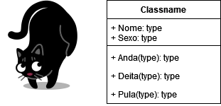

> Figura: Exemplo do conceito de objetos na programação.

**Blueprints**s focam em ser acessíveis, versáteis para qualquer membro do projeto e isso simplifica tarefas para programadores e engenheiros de projeto, o que facilita entender, interagir e construir.  

Para que o **Unreal Engine** possa construir os nós gráficos que representam a instruções de programação **C++** é importante entender como é a hierarquia de elementos que compõem o projeto, segue abaixo a representação baseado no arquivo de referência no seguinte em [unreal_schematics](https://github.com/drstreit/unreal_schematics "https://github.com/drstreit/unreal_schematics").

```bash
|-- C++  
|   |-- Herança - Classes derivam e herdam de suas classes pai  
|   |   |-- Framework - Classes Padrão  
|   |   |   |-- Actor  
|   |   |   |   |-- GameMode
|   |   |   |   |   |-- Pawn
|   |   |   |   |   |-- Controller
|   |   |   |   |   |-- GameState
|   |   |   |   |   |-- PlayerState
|   |   |   |   |-- GameInstance
|   |   |-- Events/Functions/Var - Eventos, funções e variáveis.
|   |-- Blueprint
|   |   |-- Components
|   |   |   |-- Static Mesh
|   |   |   |-- Emiter
|   |   |-- Editores
|   |   |   |-- Timeline
|   |   |   |-- Componentes
|   |   |   |-- Editor de script
|   |   |-- Communication BP to BP - Comunicação entre Blueprints
|   |   |   |-- Casting
|   |   |   |-- Interface
|   |   |   |-- Event Dispacher
|   |-- Compilação - Compilação do Bytecode.
|   |   |-- Navitization - Durante o processo de preparação, o Blueprint pode ser cruzado para c ++ e nativizado*
|   |-- VM - Executado em uma máquina virtual
```

**Nativização.**

"A nativização é uma funcionalidade relativamente nova no **Unreal Engine**, que permite aos desenvolvedores converter suas classes criadas em **Blueprint** para código nativo **C++** no momento em que é construído o pacote final do jogo. Isso faz com que seja possível aliar a facilidade de prototipação dos **Blueprints** ao desempenho do **C++**, acelerando o processo de desenvolvimento e também reduzindo a possibilidade de erros na programação, levando em consideração que ao desenvolver em **Blueprint** todas as entradas e saídas de dados, assim como o fluxo das operações são verificados pela máquina virtual enquanto os testes estão sendo realizados, isso permite garantir que tudo funcione conforme o esperado, ou na pior das hipóteses, alerte ao desenvolvedor caso algo não saia como o esperado, por meio de mensagens intuitivas e claras."

**[⬆ Volta para o CAPÍTULO 4](#capitulo4)**

<a name="4.3"></a>
## 4.3 Trabalhando com Level ou níveis
Todo os objetos que estão visiveis em um jogo estão armazenados em um *Level* ou mapa de jogo, o *Level* no **Unreal Engine** é composto por iluminação, objetos poligonais e personagens controlados pelos jogadores.


> Figura: Tutorial List: UE4  https://www.worldofleveldesign.com.

### Criando um Level

Para criar um *level* utilizamos o menu principal `File` > `New Level`.


> Figura: File > New Level.

A janela para cria um novo *Level* aparece apresentando vários modelos prontos para servir como base.


> Figura: New Level.

- `Default`: Selecione para criar um novo `Level` com uma configuração básica que inclui um início de jogador, uma luz, uma cúpula do céu e outros vários atores que você precisa para um *Level* funcionar corretamente;
- `TimeofDay`: selecione para criar um novo `Level` com uma configuração que permite que você visualize as configurações da atmosfera da hora do dia em tempo real;
- `VR-Basic`: selecione para criar um novo `Level` com atores para interagir, projetado para guiá-lo no aprendizado dos controles do Editor de VR;
- `Empty Level`: selecione para criar um novo `Level` completamente vazio.

### Salvando um Level

Para salvar o *level* carregado utilizamos o menu `File` > `Save Current`.


> Figura: Save Current.

### Carregando um Level

É possível abrir um  *Level* utilizando `File` > `Open Level`.


> Figura: Open Level.

<a name="4.4"></a>
## 4.4 O que é Level Blueprint?  
Um `Level Blueprint` é um tipo especializado de **Blueprint** que atua como um gráfico de evento global em todo o nível ou *Level*. Cada *Level* em seu projeto tem seu próprio `Level Blueprint` criado por padrão, que pode ser editado no *Unreal Editor*.

Para editar utilizamos a opção `Blueprints` > `Open Level Blueprint`.

        

> Figura:  Open Level Blueprint.

Para escrever uma mensagem no `ViewPort` utilizando o `Level Bueprint` quando o *level* iniciar utilizaremos o evento `BeginPlay` e conectaremos o nó `Print String` para escrever uma mensagem na tela.

      

> Figura: Iniciando o level e escrevendo uma mensagem na tela.

Os nós utilizados são os seguintes:
- `BeginPlay`: Este evento é executado quando o *level* é carregado.
- `Print String`: É uma função que recebe como parâmetro um texto (*String*) e a escreve na tela.

**[⬆ Volta para o CAPÍTULO 4](#capitulo4)**

<a name="4.5"></a>
## 4.5 Atores e Classes utilizando Blueprint

Atores são objetos de uma determinada classe que suportam vários componentes, métodos e variáveis. Por exemplo:

- Personagem Herói - tem atributos, como vida e velocidade, tem componentes, como esqueleto e malha, e métodos, como direção e movimentação.

A lógica de programação dos atores é expressada em **Blueprint** e nos próximos capítulos vamos abordar este temo com mais detalhes.

### Atores predefinidos ou Place Actors

No nível mais fundamental, um ator é qualquer objeto que você pode colocar em um *Level*.

Para adicionar o ator predefinido na cena utilizamos a opção `Create` e escolhemos o tipo de ator.

       

> Figura: Create > Shapes para criar um objeto poligonal.

Ou podemos acessar o menu principal `Menu` > `Place Actors` para ter acesso a mais atores.

        

> Figura: Windows >Place Actors.


### Classes Blueprint ou Blueprint Class

Uma classe **Blueprint**, muitas vezes abreviada como Blueprint, é um ativo que permite que os criadores de conteúdo adicionem funcionalidades facilmente às classes de jogo existentes. Os projetos são criados dentro do **Unreal Editor** visualmente, em vez de digitar o código, e salvos como ativos em um pacote de conteúdo. Essencialmente, eles definem uma nova classe ou tipo de ator que pode então ser colocado em mapas como instâncias que se comportam como qualquer outro tipo de ator.  

Para adicionar um ator na cena utilizamos o menu de acesso rápido `Context Menu` e acionando com o botão direito do mouse na aba `Content`.  

       

> Figura: Context Menu.s

Escolha de Classe de atores  `Blueprint Class`.

     

> Figura: Pick Parent Classe e All Classes.

**[⬆ Volta para o CAPÍTULO 4](#capitulo4)**

<a name="4.6"></a>
## 4.6 Componentes - Components
Os *Components* ou componentes são um tipo especial de objeto que os atores podem anexar a si próprios como subobjetos.

Os componentes são úteis para compartilhar comportamentos comuns, como a capacidade de exibir uma representação visual e reproduzir sons. Eles também podem representar conceitos específicos do projeto, como a maneira como um veículo interpreta a entrada e muda sua própria velocidade e orientação.

Por exemplo, um projeto com carros, aeronaves e barcos controláveis pelo usuário pode implementar as diferenças no controle e movimento do veículo, alterando qual componente um ator do veículo usa.

       

> Figura: Add Components.

### Components e a aba My Blueprint

Para ter acesso aos componentes que estão associados a um determinado objeto utilizamos a aba `My Blueprint`, que é uma representação visual do agrupamento de componentes, funções, variáveis e macros, abaixo um exemplo.

       

> Figura: Aba MyBlueprint.

**[⬆ Volta para o CAPÍTULO 4](#capitulo4)**

<a name="4.7"></a>
## 4.7 Estrutura da classe Actor no Unreal Engine
A classe `Actor` é composta por vários elementos, entre eles estão as variáveis, métodos e funções, abaixo uma representação dessa estrutura.

```bash
|-- Objeto
|   |-- Events
|   |   |-- BeginPlay
|   |   |-- ActorBeginOverlap
|   |   |-- Tick
|   |-- Functions
|   |   |-- ConstructionScript
|   |-- Variables      
|   |   |-- VariavelLocal
```
 A representação visual da lógica de programação da classe `Actor` é divida em:

 - `Construction Script`;

 - `Event Graph`.

A seguir vamos aprender mais sobre esses elementos.


### Construction Script
Lógica de que é executada na construção do objeto, similares ao eventos *Construtor* em C++.  

**Exemplo:**

Apresentando uma mensagem ao construir o objeto.      

        

> Figura: Construction Script.s

### Event Graph
Contém um gráfico de nós e suas ligações representando a lógica de um **Blueprint**.  

"Exibe a representação visual de um gráfico específico de nós, pois mostra todos os nós contidos no gráfico, bem como as conexões entre eles. Ele fornece recursos de edição para adicionar e remover nós, organizar nós e criar links entre nós. Os pontos de interrupção também podem ser definidos na guia Gráfico para auxiliar na depuração de Blueprints."


       

> Figura: Event Graph.s

### BeginPlay
Este evento é acionado para todos os Atores quando o jogo é iniciado, quaisquer Atores gerados após o jogo ser iniciado terão isso chamado imediatamente.


### ActorBeginOverlap
Este evento será executado quando uma série de condições forem atendidas ao mesmo tempo:
-  A resposta à colisão entre os atores deve permitir sobreposições.
- Ambos os Atores que devem executar o evento têm que gerar Eventos de Sobreposição definido como verdadeiro.
- E, finalmente, a colisão de ambos os Atores começa a se sobrepor; movendo-se juntos ou um é criado sobrepondo-se ao outro.

### Tick
Este é um evento simples que é chamado em todos os quadros do jogo. Tem como parâmetro a variável **Delta Seconds**.

"Vários motores gráficos ou *Game Engines*, como por exemplo *Unity* e *Pico-8*  tem os mesmos eventos com as mesmas Características."s

**[⬆ Volta para CAPÍTULO 4](#capitulo4)**

<a name="4.8"></a>
## 4.8 Comentários   
Os comentários podem ser incluídos diretamente em nós **Blueprint** únicos ou podem ser incluídos como caixas de comentários para agrupar nós relacionados e fornecer descrições sobre sua funcionalidade.

Eles podem ser usados apenas para fins organizacionais para tornar os gráficos mais legíveis, mas também podem ser usados para fins informativos, pois permitem que descrições textuais sejam adicionadas da mesma forma que adicionar comentários ao código.

Selecione os nós e digite "C" no teclado para adicionar um comentário.  

**Exemplo:**

       

> Figura: Comment Example.

Podemos adicionar Características aos comentários que detalham melhor a lógica dos nós envolvidos, como por exemplo adicionando cores.    

- **Vermelho** - Lógica principal ou crítica.  

- **Azul** - Lógica de atores.  

- **Verde** - Lógica de estruturas de controle.  

Detalhes do comentário.   

       

> Figura: Comment Details.


**[⬆ Volta para o CAPÍTULO 4](#capitulo4)**

***

<a name="5"></a>
## CAPÍTULO 5 - Programação C++ no Unreal Engine


Neste capítulo será apresentado o modelo da lógica de programação utilizando **C++** com **Unreal Engine**.

O **C++** por ter como base de desenvolvimento o C tem o benefício da rapidez e da portabilidade para diversas plataformas e ainda permite a implementação de classes, tornando a linguagem em uma boa candidata para o desenvolvimento de projetos com necessidade de velocidade acessando recursos de baixo nível e construção de classes.

O **Unreal Egine** utiliza a linguagem **C++** aproveitando todas as funcionalidades que a linguagem fornece, como por exemplo o gerenciamento otimizado de memória, quanto a implementação a Engine fornece muitos elementos para auxiliar a codificação tornando-a mais fácil, entre eles a utilização de macros e objetos primitivos próprios da Engine.

<a name="5.1"></a>
## 5.1 Mas quanto usar a linguagem  C++?
Não há uma resposta definitiva dessa questão mas podemos considerar algumas diferenças entre **Blueprint** e o **C++**, segue abaixo algumas considerações.

**Blueprints vs C++.**

- **Blueprints** são mais fáceis de ser lidos e entendidos pelos membros da equipe;

- **C++** evita sobrecarga de chamadas de função economizando ciclos de CPU;

- **C++** Conseguem acesso a `Library Math`;

- É possível utilizar um sistema de versionamento como por exemplo o Git ou SVN com **C++**;

- **Blueprints** necessitam de ferramenta específica para versionamento;

- Para projetos em plataformas mobile o recomendado é **C++**.

**O que é ideal?**
A resposta é depende do problema mas considere o seguinte:

- Analise a complexidade do projeto e a infraestrutura local e remota;

- Para equipes pequenas e projetos pequenos é recomendado **Blueprints**;

- Para equipes pequenas com cultura de desenvolvimento e necessidade de processamento é recomendado **C++**.

**[⬆ Volta para o CAPÍTULO 5](#capitulo5)**

<a name="5.2"></a>
## 5.2 O fluxo de desenvolvimento e Herança
Um modelo de desenvolvimento utilizando **C++** pode ser visto abaixo onde primeiro criamos a classe do objeto A em **C++** e depois uma classe **Blueprint** B filha da classe A. Fazendo isso pode-se aproveitar as características de ambas linguagens, como por exemplo: lógica em **C++** e parametrização de componentes visuais usando o Editor **Blueprint**.  

Exemplo:

1. Vamos Criar uma **Blueprint** *BP_Plataforma* do tipo `static_mesh_actor`;
1. Depois Criar a classe **C++** `Plataforma` do tipo `AStaticMeshActor`;
1. Alterar classe pai do *BP_Plataforma* para *Plataforma*.

Onde :

| Origem      | Destino       |       |
|:-           |:-             |:-     |
|Classe C++   |Blueprints     |Certo  |
|Blueprints   |Classe C++     | Errado|

*Tabela: Representação do desenvolvimento descrito anteriormente.*

Sobre a herança de classes permitem usar classes já definidas para derivar classes novas onde a nova classe herda as propriedades da classe base.

Exemplo:

**C++.**

```cpp
// Classe Pessoa
class Pessoa {
  int32 iVida;
  FString sNome;
}

class Heroi: public Pessoa {
  float fForca = 100;
}

void main() {
   // instânciando o objeto Nostromo do tipo Heroi
    Heroi nostromo;
}
```

**Blueprint.**

```cpp
class Hugo: Pessoa
      // iVida -- Herdada
      // movimentacao() - Herdada  

      AddActiveTrigger()  
      float SpeedPlataforma  
      int32 Vida #Error  
```

**[⬆ Volta para o CAPÍTULO 5](#capitulo5)**

<a name="5.3"></a>
## 5.3Tipos de variáveis
A seguir vamos apresentar os tipos de variáveis em ambas as linguagens mas no próximo capítulo descrevermos melhor as variáveis.

| Blueprint | C++     |
|:-:        |:-       |
|integer    |int32    |
|Vector     |FVector  |
|String     |FString  |
|Float      |float  |

**[⬆ Volta para o CAPÍTULO 5](#capitulo5)**

<a name="5.4"></a>
## 5.4 Construindo classes C++ no Unreal Engine
A seguir vamos implementar uma classe **C++** no **Unreal Engine** para tal utilizamos o `Menu Tools` > `New C++ Class`


> Figura: Create Class C++.


> Figura: Add C++ Class.

O **Unreal Engine** vai criar dois arquivos, o arquivo header (.h) e o de implementação (.cpp), sugerindo separar ambos nas pastas `private` e `header`.

### Pasta privada com os arquivos header das classes
```bash
<Projeto>/Private/ControlLight.h
```

```cpp
// Diretiva de compilação que serve para fazer com que o arquivo seja
// incluído somente uma vez durante o processo de compilação.
#pragma once

#include "CoreMinimal.h"
#include "GameFramework/Actor.h"
// Arquivo criado durante a compilação
#include "ControlLight.generated.h"

// Macro utilizada para indicar que uma C++ fará parte do Unreal
// Reflection system. Isto é necessário para
//que a classe seja reconhecida pelo editor do Unreal Engine.

UCLASS()
class CPP5_API AControlLight : public AActor
{
	GENERATED_BODY()

public:
	// Construtor da classe
	AControlLight();

protected:
	// Método chamado quando o jogo inicia ou quando a classe
  // é adicionada na cena.
  virtual void BeginPlay() override;
public:
	// Método chamado a cada quadro.
	virtual void Tick(float DeltaTime) override;
};
```

Pasta publica com a implementação das classes :
```bash
<Projeto>/Public/ControlLight.cpp
```

```cpp
#include "ControlLight.h"

// Método construtor da classe
AControlLight::AControlLight()
{
  // Configura este ator para chamar o evento Tick() a cada frame.
	PrimaryActorTick.bCanEverTick = true;
}

void AControlLight::BeginPlay()
{
	Super::BeginPlay();
}

void AControlLight::Tick(float DeltaTime)
{
	Super::Tick(DeltaTime);
}
```

### Exemplo de um arquivo header com variáveis
Abaixo vamos construir uma classe em **C++** chamado plataforma para exemplificar um arquivo `header` a declaração de variáveis.

```cpp

#include "CoreMinimal.h"
#include "Engine/StaticMeshActor.h"
#include "Plataforma.generated.h"

UCLASS(ClassGroup=(Custom),meta=(BlueprintSpawnableComponent) )
class PROJETOPLATAFORMA_API APlataforma : public AStaticMeshActor
{
	GENERATED_BODY()

public:
  // Construtor da classe
	APlataforma();

	virtual void Tick(float DeltaTime) override;

	virtual void BeginPlay() override;

	UPROPERTY(EditAnywhere, Meta = (MakeEditWidget = true))
		FVector TargetLocation;

	UPROPERTY(EditAnywhere, BlueprintReadWrite, Category = "Plataforma")
		float SpeedPlataform = 20;

	UFUNCTION(BlueprintCallable, Category = "Plataforma")
	void AddActiveTrigger();

	UFUNCTION(BlueprintCallable, Category = "Plataforma")
	void RemoveActiveTrigger();


protected:
	FVector GlobalStartLocation;
	FVector GlobalTargetLocation;

	UPROPERTY(EditAnywhere)
		int ActiveTriggers = 1;
};
```

**[⬆ Volta para o CAPÍTULO 5](#capitulo5)**

<a name="5.5"></a>
## 5.5 Sintaxe da linguagem e C++ e macros do Unreal Engine
A seguir vamos apresentar algumas características de linguagem e as macros que facilitam a implementação em **C++**.

### O arquivo Include
É uma forma de incluir um arquivo padrão ou definido pelo usuário no programa e é principalmente escrito no início de qualquer programa **C / C ++**.  
Esta diretiva é lida pelo pré-processador e ordena que ele insira o conteúdo de um arquivo de cabeçalho do sistema ou definido pelo usuário no programa a seguir. Esses arquivos são importados principalmente de uma fonte externa para o programa atual. O processo de importação de tais arquivos que podem ser definidos pelo sistema ou pelo usuário é conhecido como Inclusão de Arquivo. Este tipo de diretiva de pré-processador diz ao compilador para incluir um arquivo no programa de código-fonte.

Exemplo:

```cpp
#include "CoreMinimal.h"
#include "Engine/StaticMeshActor.h"
#include "Plataforma.generated.h"
```

**O arquivo <Classe>.generated.h**

O **Unreal Engine** faz uso extensivo de macros de pré-processador, e algumas dessas macros são definidas (#defined) no arquivo `genrated.h` que acompanha cada `UCLASS`. Se você criar uma `UCLASS` *MyClass*, o arquivo MyClass.h irá incluir (#include) MyClass.generated.h. O cabeçalho gerado, MyClass.generated.h, é feito na parte inicial do processo de construção do **Unreal Engine**.

### Encapsulamento
`Public` – Quando precede uma lista de membros de classe, o  *Public*  palavra-chave especifica que esses membros são acessíveis a partir de qualquer função. Isso se aplica a todos os membros declarados até o próximo especificador de acesso ou o fim da classe. Ou seja visível a todos.

`Private` – Quando precede uma lista de membros de classe, o *Private* palavra-chave especifica que esses membros são acessíveis somente dentro de funções de membro e amigos da classe.  Isso se aplica a todos os membros declarados até o próximo especificador de acesso ou o fim da classe. Ou seja visível somente para membros dentro da classe.

`Protected` – O *Protected* palavra-chave especifica o acesso a membros de classe no lista de membros até o próximo especificador de acesso (pública ou private) ou no final da definição de classe.  O *Protected* é mistura entre *Public* e *Private* ou seja é visível somente para membros da classe e visível para subclasses.

### UCLASS
Você também pode declarar classes **C ++** personalizadas, que se comportam como classes UE4, declarando seus objetos **C++** personalizados como UCLASS. UCLASS usa [Smart Pointers](https://docs.microsoft.com/pt-br/cpp/cpp/smart-pointers-modern-cpp?view=msvc-170 "Ponteiros inteligentes (C++ moderno)") do UE4 e rotinas de gerenciamento de memória para alocação e desalocação de acordo com as regras do Smart Pointer, podem ser carregados e lidos pelo *UE4 Editor* e opcionalmente acessados a partir de Blueprints.

Exemplo:

```cpp
UCLASS(ClassGroup=(Custom),meta=(BlueprintSpawnableComponent) )
```
Os parâmetros descritos no exemplo são os [especificadores](https://docs.unrealengine.com/4.27/en-US/ProgrammingAndScripting/GameplayArchitecture/Classes/Specifiers/ "Class Specifiers") da classe que irão determinar o seu comportamento.

- `BlueprintSpawnableComponent` - Se estiver presente, o componente Class pode ser gerado por um Blueprint.
- `ClassGroup=GroupName` - Indica que o Navegador de ator do Unreal Editor deve incluir esta classe e qualquer subclasse dessa classe dentro do GroupName especificado quando a Visualização de grupo estiver ativada no Navegador de ator.

### UFUNCTION

Um **UFunction** é uma função **C ++** que é reconhecida pelo sistema de reflexão **Unreal Engine 4** (UE4). Qualquer **UObject** ou biblioteca de função **Blueprint** pode declarar uma função de membro como um **UFunction**, colocando a macro UFUNCTION na linha acima da declaração da função no arquivo de cabeçalho. A macro oferecerá suporte a Especificadores de Função para alterar como o UE4 interpreta e usa uma função.

Ao declarar funções, os especificadores de função podem ser adicionados à declaração para controlar como a função se comporta com vários aspectos do mecanismo e do editor.

Exemplo:

```cpp
UFUNCTION(BlueprintCallable, Category = "Plataforma")
void AddActiveTrigger();
```
- `BlueprintAuthorityOnly` - Esta função só será executada a partir do código **Blueprint** se for executada em uma máquina com autoridade de rede (um servidor, servidor dedicado ou jogo para um único jogador).
- `BlueprintCallable` - A função pode ser executada em um gráfico **Blueprint** ou Level Blueprint.

### UPROPERTY
As propriedades são declaradas usando a sintaxe de variável **C++** padrão, precedida pela macro UPROPERTY que define metadados de propriedade e especificadores de variável.

Ao declarar propriedades, os Especificadores de Propriedade podem ser adicionados à declaração para controlar como a propriedade se comporta com vários aspectos do Motor e do Editor.

```cpp
UPROPERTY(EditAnywhere, Meta = (MakeEditWidget = true))
  FVector TargetLocation;
```
- `BlueprintReadOnly` - Esta propriedade pode ser lida pelo Blueprints, mas não modificada. Este especificador é incompatível com o especificador BlueprintReadWrite.
- `BlueprintReadWrite` - Esta propriedade pode ser lida ou escrita a partir de um Blueprint. Este especificador é incompatível com o especificador BlueprintReadOnly.
- `EditAnywhere` - Indica que esta propriedade pode ser editada por janelas de propriedades, em arquétipos e instâncias. Este especificador é incompatível com qualquer um dos especificadores "visíveis".
- `MakeEditWidget` - Usado para propriedades *Transform* ou *Rotator*, ou Matrizes de *Transforms* ou *Rotators*. Indica que a propriedade deve ser exposta na janela de visualização como um *widget* móvel.

**[⬆ Volta para o CAPÍTULO 5](#capitulo5)**

<a name="5.6"></a>
## 5.6 Funções Virtuais

"Uma função virtual é uma função de membro que é declarada dentro de uma classe base e é redefinida (Substituída) por uma classe derivada. Quando você se refere a um objeto de classe derivada usando um ponteiro ou uma referência à classe base, pode chamar uma função virtual para esse objeto e executar a versão da função da classe derivada."[Funções Virtuais](https://pt.wikipedia.org/wiki/Fun%C3%A7%C3%A3o_virtual "Funções Virtuais")

- As funções virtuais garantem que a função correta seja chamada para um objeto, independentemente do tipo de referência (ou ponteiro) usado para a chamada da função;

- Eles são usados principalmente para obter polimorfismo de tempo de execução;

- As funções são declaradas com uma palavra-chave virtual na classe base;

- A resolução da chamada de função é feita em tempo de execução.

Exemplo:
```cpp
class WeaponBase {
  public: virtual void OnFire() {}
};
class WeaponRifle : public WeaponBase {
  public: void OnFire() override {}
};

...
WeaponRifle
void anotherFunction(WeaponBase *someWeapon) {
  someWeapon->OnFire();
}
```

Na função anotherFunction o método chamado em OnFire é WeaponRifle::OnFire().
O método WeaponBase::OnFire não é chamado pois foi sobreposto.

**[⬆ Volta para o CAPÍTULO 5](#capitulo5)**

***

<a name="6"></a>
## CAPÍTULO 6 -  Estruturas de programação no Unreal Engine


Neste capítulo serão descritas as estruturas de armazenamento, manipulação e fluxo da lógica de programação.


> Figura: Blueprint Variáveis.

<a name="6.1"></a>
## 6.1 O que são variáveis?
Variáveis são estruturas que são utilizadas para armazenar um valor de um determinado tipo na memória do computador.

Estrutura de memória.

|Variável       |Tipo     | Valor       |
|:-             |:-:      |:-:          |
|iSoma          |Integer  |0            |
|fValor         |Float    |6.5          |
|tName          |String   |"Gandalf"    |
|bRunnig        |Boolean  |false        |


Abaixo um exemplo em C++:
```cpp
// Variável do tipo inteiro
int iSoma = 0;

// Variável do tipo ponto flutuante
float fValor = 6.5;
```

**[⬆ Volta para o CAPÍTULO 6](#capitulo6)**

<a name="6.2"></a>
## 6.2 Variáveis no Unreal Engine
Variáveis no **Unreal Engine** são propriedades que contêm um valor ou fazem referência a um objeto ou ator no mundo. Essas propriedades podem ser acessíveis internamente ao **Blueprint** que as contém, ou podem ser tornadas acessíveis externamente para que seus valores possam ser modificados por designers que trabalham com instâncias do **Blueprint** colocadas em um nível.

### Tipos de Variáveis
Para armazenar qualquer informação na memória devemos definir um tipo de dados primitivo ou mesmo uma estrutura de dados, a seguir alguns tipos de dados:

- `Boolean` - Armazena valores falso ou verdadeiro (true e false).

    ```cpp
bool VariavelBoolean;
VariavelBoolean = true;
  ```

 - `Integer` - Valores inteiros entre −2.147.483.648 e 2.147.483.647

    ```cpp
int32 VariavelInt;
VariavelInt = 1;
  ```
    Utilize int32, uint8, uint32 para representar números inteiros.

-  `Float` - Valores com casas decimais tal como 0,0553, 101,2887 e -78,322 .

    ```cpp
float VariavelFloat;
VariavelFloat = 2.4;
    ```

- `String`- Grupo de caracteres alfanuméricos.

    ```cpp
FString VariavelString ;
VariavelString = TEXT("Alo mundo!!");
    ```

### Declarando variáveis   
Declarando variáveis informamos ao computador que estamos reservando um espaço de memória temporário.  

**Blueprint.**

- Variáveis no Editor de Blueprint.

    

    > Figura: Blueprint Variables.

- As variáveis tem tipos e propriedades que determinam o sua utilização.  

    

    > Figura: Details ou properiedades das variáveis.

    Observe que a propriedade `Category` agrupa as variáveis por uma categoria.

**C++.**

```cpp
UPROPERTY(EditAnywhere, BlueprintReadWrite, Category = "Parâmetros")
    int32 iLife = 10;
```

**[⬆ Volta para o CAPÍTULO 6](#capitulo6)**

<a name="6.3"></a>
## 6.3 Métodos Get e Set
Para acessar o conteúdo das variáveis utilizamos os métodos `Get` e `Set`, onde:

- `Get`: Obtém o valor de uma variável.
- `Set`: Atualiza o valor da variável.

**Blueprint.**


> Figura: Métodos Get e Set.

- `BeginPlay` - Ao iniciar o jogo a lista de comandos conectados a estes nó deve ser acionado.
- `Print String` - Escreve um texto na cena do jogo.
- `Add +` - Variáveis numéricas podem ser manipuladas com operadores matemáticos.
- `Converts` - Converte tipos de variáveis, neste caso converte um valor do tipo `integer` em um do tipo `String`.

**C++.**

Arquivo Header.

```cpp
// MyHero.h
UPROPERTY()
virtual void BeginPlay() override;
```

Arquivo de implementação.

```cpp
// Myhero.cpp
void AMyHeroClass::BeginPlay()
 {
    Super::BeginPlay();
    int32 iLifeLocal = 5;
    float fSpeed = 3.7f;
    FString fsName = TEXT("O nome do personagem é Nostromo");
    iLifeLocal = iLifeLocal + iLife;
    // iLife é uma variável global
    UE_LOG(LogTemp, Warning, TEXT("O resultado é =, %d %f %s"), iLife, fSpeed, *fsName );
 }
 ```

**[⬆ Volta para o CAPÍTULO 6](#capitulo6)**

<a name="6.4"></a>
## 6.4 Tratamento e armazenamento de texto no Unreal Engine
No **Unreal Engine** são definidos alguns tipos de dados para manipulação e armazenamento de caracteres alfanuméricos, entre elas estão os tipos de variáveis a seguir.

| Variável          |Tamanho    | Considerações               |
|:-:                |-          |-                            |
| `Text`            | 40 Bytes  | Podemos adicionar opções avançadas como exemplo `String Table`, ideal para textos longos que podem variar conforme a lingua definida pelo jogador.  |
| `String`          | 16 Bytes  | Armazenamento e consumo de memória mediano |
| `Name`            | 8 Bytes   |  Cadeias de caracteres  curtas que ocupam pouca memória.|

Podemos realizar as seguintes operações em `strings`:

- Atribuir o valor de uma `string` para outra;

- Acessar caracteres individualmente;

- Adicionar uma `string` no final de outra;

- Concatenar `strings`;

- Procurar uma determinada letra ou Substring dentro da `string`.

**Blueprint.**


> Figura: String functions.

**C++.**

Arquivo header.

```cpp
// myHero.h
UPROPERTY()
virtual void BeginPlay() override;

UPROPERTY()
FString NomeCharacter;

UPROPERTY()
FString ClassCharacter;


```

Arquivo de implementação.
```cpp
// myHero.cpp
void AMyHeroClass::BeginPlay()
 {
    Super::BeginPlay();

    FString fsMessage = TEXT("Procurando a classe do personagem");
    FString fsResultado;

    fsResultado.append("O nome é ",*NomeCharacter)

    // ou
    fsResultado =TEXT("O nome é ");
    fsResultado += *NomeCharacter;

    UE_LOG(LogTemp, Warning, TEXT("O resultado é =,  %s"), *fsResultado );

    // Procurando uma Substring
    if (fsMessage.Contains("class"))
    {
      UE_LOG(LogTemp, Warning, TEXT("Encontrei!!"));
    }
    else
        UE_LOG(LogTemp, Warning, TEXT("Não encontrei"));
 }

```

### Concatenando textos usando a função Append
A função `Append` concatena duas ou mais `strings`, passamos como parâmetros os textos que gostaríamos de concatenar e tendo como resultado um novo texto contendo os dois textos.

**C++**

```cpp

FString sTexto = TEXT("Alo mundo...");
sTexto.append("Cruel");

// Resultado: Alo mundo...Cruel
```

### Procurando texto dentro de uma string
A função `Contains` procura uma sequencia de caracteres dentro de uma `string`, passamos os seguintes parâmetros para a função.

**Blueprint.**

- `Search In` - Texto passado como parâmetro.
- `Substring` - Texto que deve ser localizado.
- `Use Case` - Diferencia maiúsculas e minúsculas.
 `Search from end` - Inicia a busca pelo fim do texto.

**C++.**

```cpp

FString sTexto = TEXT("Procurando o texto escondido.");

if (sTexto.Contains(TEXT("texto")))
{
  return true;
}
else
  return false;

// Resultado: Alo mundo...Cruel
```

**[⬆ Volta para o CAPÍTULO 6](#capitulo6)**

<a name="6.5"></a>
## 6.5 Variáveis do tipo numéricas Integer e Float
Valores numéricos utilizam operadores matemáticos para a sua manutenção, como veremos a seguir.  

**Blueprint.**


> Figura: Utilizando Divisão.

**C++.**

```cpp
void AMyCharacterClass::BeginPlay()
{
    Super::BeginPlay();
    Float fStrength = 10;
    int32 iLife = 0;

    iLife = int(fStrength / 2);
}
```


> Figura: Multiplicação valores.

- (+) - soma;
- (*) - Multiplicação;
- (/) - Divisão.

**[⬆ Volta para o CAPÍTULO 6](#capitulo6)**

<a name="6.6"></a>
## 6.6 Armazenando valores lógicos com Boolean
Armazena dois valores : falso `false` ou verdadeiro `true`.


> Figura: Variável Boolean.

No exemplo acima se o valor de `life` for maior que 50 então o valor é atualizado para `true`.

**[⬆ Volta para o CAPÍTULO 6](#capitulo6)**

<a name="6.7"></a>
## 6.7 Controle de acesso a variáveis
Como especificar quais variáveis de um objeto um usuário pode acessar e quais estão fora dos limites? - usando os especificadores de controle de acesso público e privado.

### Variáveis Privadas
Com a opção Privada marcada em uma variável, isso evita que a variável seja modificada por módulos externos.  

**Blueprint.**


> Figura: Private details.

**C++.**

```cpp
private:
   bool Running = false;
```

### Variáveis Públicas
Para permitir que uma variável seja modificada de fora de seu módulos, torne-a pública.  

**Blueprint.**


> Figura: Public.


> Figura: Public details.

**C++.**

```cpp
public:
  UFUNCTION(BlueprintCallable, Category="Player")
  bool IsRunning();

```

**[⬆ Volta para o CAPÍTULO 6](#capitulo6)**

<a name="6.8"></a>
## 6.8 O que são estruturas de controle ou fluxo?
Em linguagens de programação existem métodos de tomada de decisão para tarefas corriqueiras que os programas podem executar, por exemplo a escolha de qual caminho ou instrução executar. Em **Bluprints** utilizamos nós específicos para controle de fluxo como por exemplo o `Branch`.

Exemplo de fluxo de execução, considere a sequencia de comandos abaixo:

**C++.**

```cpp
int32 i, x, resultado=0;
i = 2;
x = 10;
resultado = i + x;
UE_LOG(LogTemp, Warning, TEXT("O resultado é %d"), resultado);

```
O resultado desse código é o valor 12 sendo apresentado na tela.

Agora vamos alterar o fluxo de execução:
```cpp
int i, x, resultado=0;
i = 2;
x = 10;
if ( i > x )
  resultado = i + x;

UE_LOG(LogTemp, Warning, TEXT("O resultado é %d"), resultado);
```

O resultado será 0 pois a condição de controle de fluxo **if** provocou um desvio do fluxo de instruções.

**Exemplo de fluxo condicional.**

|           |t1 |t2 |t3 |t4 |t5 |t6 |t7 |t8 |t9 |
|:-         |:- |:- |:- |:- |:- |:- |:- |:- |:- |
|Principal  |<span style="color:blue">--></span> |<span style="color:blue">--></span> |<span style="color:blue">--></span> |<span style="color:blue">-D-</span>|   |   |<span style="color:blue">-O-</span>|<span style="color:blue">--></span> |<span style="color:blue">--></span> |
|Desvio     |   |   |   |<span style="color:red">--></span> |<span style="color:red">--></span> |<span style="color:red">--></span> |<span style="color:red">--></span> |   |   |

**Exemplo de fluxo de repetição.**

|           |t1 |t2 |t3 |t4 |t5 |t6 |t7 |t8 |t9 |
|:-         |:- |:- |:- |:- |:- |:- |:- |:- |:- |
|Principal  |<span style="color:blue">--></span> |<span style="color:blue">--></span> |<span style="color:blue">--></span> |<span style="color:blue">-D-</span>|<span style="color:red"><--</span>|<span style="color:red"><--</span> |<span style="color:blue">-O-</span>|<span style="color:blue">--></span> |<span style="color:blue">--></span> |
|Desvio     |   |   |   |<span style="color:blue">--></span> |<span style="color:red">--></span> |<span style="color:red">--></span> |<span style="color:red">--></span> |   |   |

**[⬆ Volta para o CAPÍTULO 6](#capitulo6)**

<a name="6.9"></a>
## 6.9 Estruturas de fluxo condicional
A seguir vamos entender como é fluxo condicional é descrito com programação visual usando **Blueprint**.

### Controle de fluxo com Branch (if)
`Branch` é uma estrutura condicional que testa uma variável utilizando uma expressão lógica e redireciona o fluxo da lógica.

**Blueprint.**

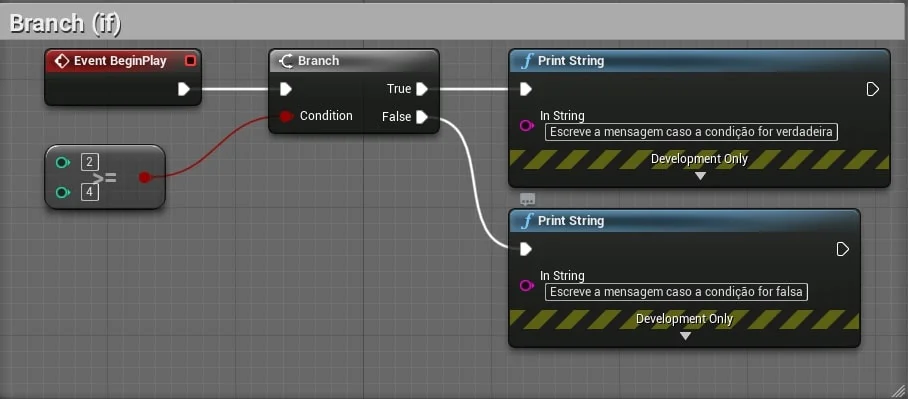

> Figura: Blueprint e branch ou if.

**C++.**

```cpp
if ( 2 >= 4)
{
  UE_LOG(LogTemp, Warning, TEXT("Escreve a mensagem caso a condição for verdadeira."));
}
else
{
  UE_LOG(LogTemp, Warning, TEXT("Escreve a mensagem caso a condição for falso."));
}
```

### Switch Nodes
O nó `Switch` lê uma entrada de dados e, com base no valor dessa entrada, envia o fluxo de execução para fora da saída de execução correspondente (ou padrão opcional). Existem vários tipos de opções disponíveis: `Int`, `String`, `Name` e `Enum`.

**Blueprint.**

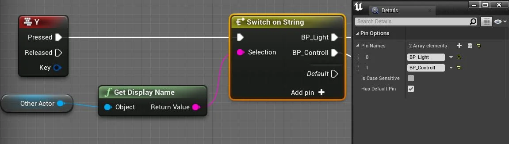

> Figura: Blueprint e Switch ou Case

**C++.**

```cpp

switch (VariavelInt)
{
  case 0:
  {
    UE_LOG(LogTemp, Warning, TEXT("O valor é zero."));
    break;
  }  
  case 1:
  {
    UE_LOG(LogTemp, Warning, TEXT("O valor é um."));
  }    
  default:
  {
    UE_LOG(LogTemp, Warning, TEXT("O valor padrão."));
  }      
}

```

Em geral, os `switches` têm uma entrada de execução e uma entrada de dados para o tipo de dados que avaliam. As saídas são todas as saídas de execução. Os switches `Enum` geram automaticamente os pinos de execução de saída das propriedades do `Enum`, enquanto os `switches` `Int`, `String` e `Name` possuem pinos de execução de saída personalizáveis.

**Referências:**

- Unreal Engine, 2022. Flow Control - Nodes that allow for controlling the flow of execution based on conditions.  [https://docs.unrealengine.com/4.27/en-US/ProgrammingAndScripting/Blueprints/UserGuide/FlowControl/](https://docs.unrealengine.com/4.27/en-US/ProgrammingAndScripting/Blueprints/UserGuide/FlowControl/ "Unreal Engine, 2022. Flow Control - Nodes that allow for controlling the flow of execution based on conditions")
- Couch Learn. (2019,Dezenbro 27). Switch Statements in Unreal Engine 4. [https://couchlearn.com/switch-statements-in-unreal-engine-4/](https://couchlearn.com/switch-statements-in-unreal-engine-4/ "https://couchlearn.com/switch-statements-in-unreal-engine-4/")


### Sequenciamento de fluxo com Sequence
O nó `Sequence` permite que um único pulso de execução acione uma série de eventos em ordem. O nó pode ter qualquer número de saídas, todas chamadas assim que o nó Sequência receber uma entrada. Eles sempre serão chamados em ordem, mas sem qualquer demora. Para um usuário típico, as saídas provavelmente parecerão ter sido disparadas simultaneamente.

**Blueprint.**

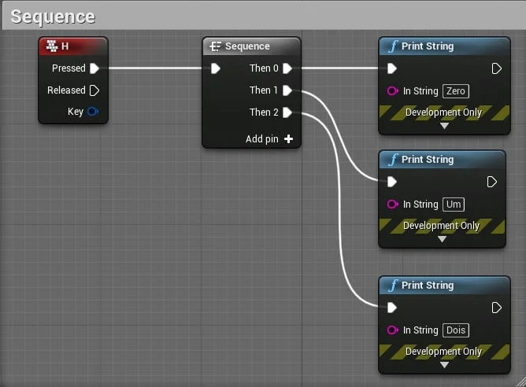

> Figura: Blueptint Sequence.

**C++.**
```cpp
// Não tem similar em C++, deve ser implementado
```

### Flip Flop
O nó `Flip Flop` obtém uma saída de execução e alterna entre duas saídas de execução. Na primeira vez que é chamado, a saída A é executada. Na segunda vez, B. Depois A, B e assim por diante. O nó também possui uma saída booleana que permite rastrear quando a Saída A foi chamada.

**Blueprint.**

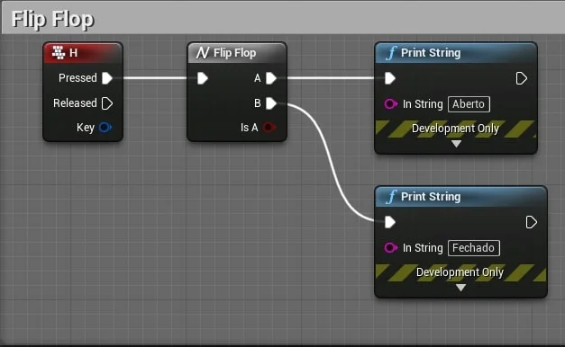

> Figura: Bluprint Flip FLop.

**C++.**

```cpp
// Não tem similar em C++, deve ser implementado
```

### Gate e Multi Gate
O nó `MultiGate` recebe um único pulso de dados e o encaminha para qualquer número de saídas potenciais. Isso pode ocorrer sequencialmente, aleatoriamente e pode ou não ser executado em loop.

**Blueprint.**

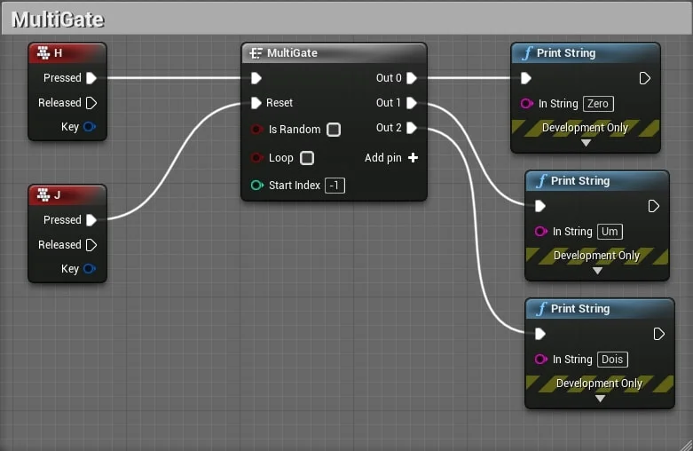

> Figura: Blueprint MultiGate.

**C++.**

```cpp
// Não tem similar em C++, deve ser implementado
```

**[⬆ Volta para o CAPÍTULO 6](#capitulo6)**

<a name="6.10"></a>
## 6.10. Estruturas de repetição
Podemos utilizar estruturas de repetição para repetir instruções ou nós, a seguir vamos entender algumas dessas estruturas.

### For Loop
O nó `For Loop` funciona como um loop de código padrão, disparando um pulso de execução para cada índice entre o início e o fim.

**Blueprint.**

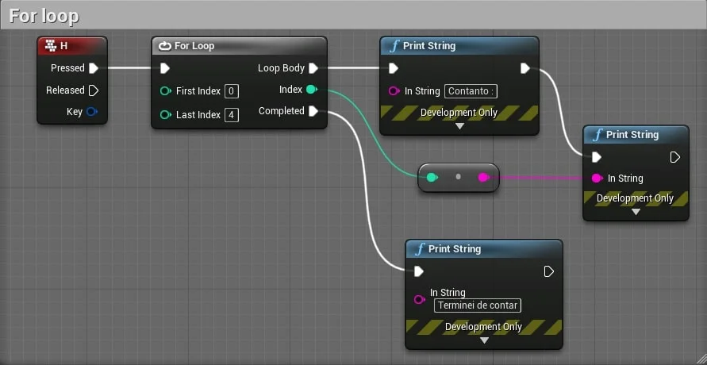

> Figura: Blueprint for loop.

**C++.**

```cpp
for (int i = 0; i < 4; i++ ){
      cout << "Contanto: ";
      cout << i;
    }

UE_LOG(LogTemp, Warning, TEXT("Terminei de contar"));

```

### While Loop
Uma condição de teste e um corpo são tudo o que constitui um *loop While*. Antes de executar a (s) instrução (ões) em seu corpo, o **Blueprint** avalia a condição de teste `While Loops` para determinar se ela é verdadeira.

**Blueprint.**

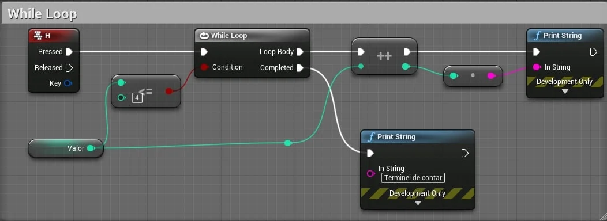

> Figura: Bluprint While loop.

**C++.**

```cpp
int32 valor = 0;
while ( valor <= 4) {
    i++;
    cout << i;
    }
UE_LOG(LogTemp, Warning, TEXT("Terminei de contar"));
```

### Do N
O nó `Do N` disparará um pulso de execução N vezes. Depois que o limite for atingido, ele interromperá todas as execuções de saída até que um pulso seja enviado para sua entrada Reset.

**Blueprint.**

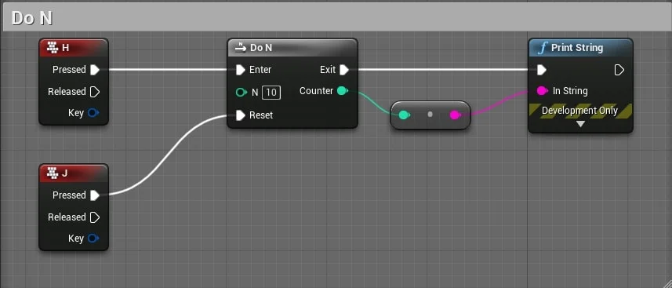

> Figura: Blueprint Do N.

No exemplo acima toda vez que a tecla H for pressionada um valor vai ser apresentado. Quanto o valor 10 for atingido a instrução `Print String` não será executada.

Pressionando a tecla J a contagem será reiniciada.

**C++.**
```cpp
// Não tem similar em C++, deve ser implementado
```

### Do once
O nó `Do Once` - como o nome sugere - disparará um pulso de execução apenas uma vez. Desse ponto em diante, ele interromperá toda a execução de saída até que um pulso seja enviado para sua entrada Reset. Este nó é equivalente a um nó `Do N` onde N = 1.

**Blueprint.**

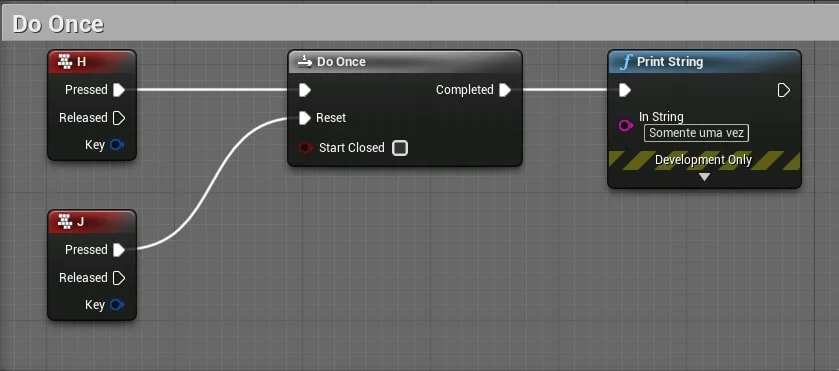

> Figura: Blueprint Do Once.

**C++.**
```cpp
// Não tem similar em C++, deve ser implementado.
```


**[⬆ Volta para o CAPÍTULO 6](#capitulo6)**

<a name="6.12"></a>
## 6.12 O que são variáveis do tipo array?
É um conjunto de variáveis do mesmo tipo agrupadas dentro de uma estrutura e acessíveis por um índice. Podemos representar os *arrays* como uma tabela onde os dados são acessados por um índice que indica a posição do elemento, a seguir um exemplo.

| s         |s[0] |s[1] |s[2] | s[3]  |
|---        |---  |---  |---  |---    |
|**Valor**  |Ana  |José |Hugo |Hulda  |
|**Índice** |  0  | 1   | 2   | 3     |

- s[0] - O valor entre colchetes indica a posição (índice) do elemento no *array*;
- O índice em C++ inicia com o valor 0.

A seguir alguns exemplos utilizando **C++**.

Exemplo de números inteiros.  

```cpp
TArray<int32> IntArray;
IntArray.Init(10, 5);
// IntArray == [10,10,10,10,10]  
```

Exemplo de números float.  

```cpp
TArray<float> floatArray[5];
floatArray.Init(10.0f, 5);
```

Exemplo com String.  

```cpp
TArray<FString> StrArr;
StrArr.Add    (TEXT("Hello"));
StrArr.Emplace(TEXT("World"));
// StrArr == ["Hello","World"]
```


**[⬆ Volta para o CAPÍTULO 6](#capitulo6)**

<a name="6.13"></a>
## 6.13 Declarando arrays e acessando os seus elementos
Para declarar variáveis do tipo *array* devemos primeiro escolher um tipo de variável primitivo, como por exemplo um tipo `String`, e logo em seguida determinar que será um *array*, vamos aos exemplos.

**Blueprint.**    


> Figura: Blueprint array details.

- `Nomes` - É uma variável *array*, como o ícone de mini grid informa,do tipo `String`;

- `Default Value` - Contem a lista de valores contidos inicialmente no `array`.

Em **Blueprint** a variável é representada por um ícone 3x3.


> Figura: Blueprint Arrays.


### Método Get para arrays
Para acessar qualquer elemento dentro *array* é necessários utilizar o índice, como no exemplo abaixo.  

**Blueprint.**  

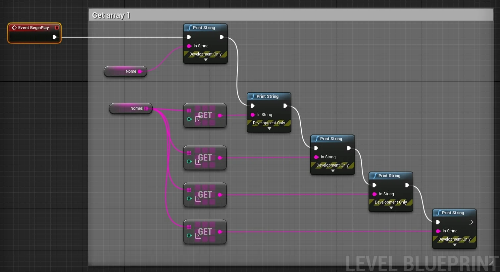

> Figura: Blueprint Get para Array.

**C++.**  

```cpp
FString s = pessoa[0];
UE_LOG(LogTemp,Warning,TEXT("O nome é %s",*s));
```

### Get utilizando uma variável como índice
Podemos utilizar uma variável para substituir o índice e acessar elementos do *array*.

**Blueprint.**

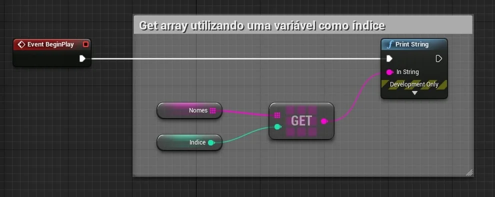

> Figura: Blueprint Get utilizando uma variável como índice.

No exemplo acima definimos o valor de Índice igual a 1 para acessar o elemento de mesma posição.

**C++.**  

```cpp
int32 indice = 4;
FString s = pessoa[indice];
UE_LOG(LogTemp,Warning,TEXT("O nome é %s",*s));
```

### Último índice e a quantidade de elementos do array
Podemos determinar a quantidade de elementos ou valor do último índice do *array* utilizando os nós abaixo.    

**Blueprint.**

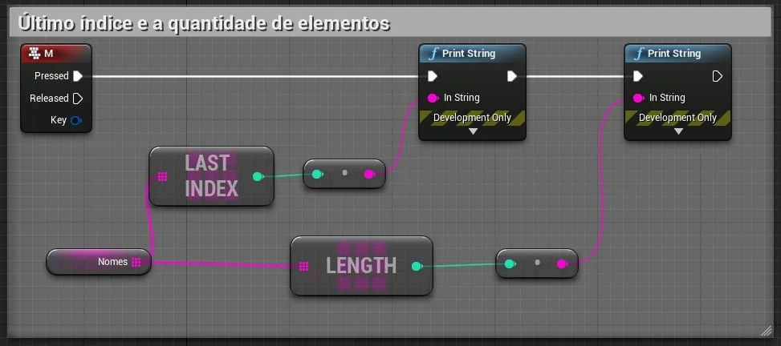

> Figura: Blueprint Last Index.

- `Last Index` - Retorna o valor do último índice e o comando;

- `Length` - Retorna a quantidade de elementos do *array*.

**C++.**

```cpp
FString Nome  = StrArr.Last();
UE_LOG(LogTemp,Warning,TEXT("O último nome é %s",nome));

int32 Tamanho = StrArr.Num();
UE_LOG(LogTemp,Warning,TEXT("O tamanho do array é %d",Tamanho));

```


**[⬆ Volta para o CAPÍTULO 6](#capitulo6)**

<a name="6.14"></a>
## 6.14 Percorrendo arrays
Percorrer **array** implica em ler todos ou alguns elementos da estrutura, para tal usamos vários nós ou funções que permitem dependendo da necessidade facilitar a lógica.

### Listando todos os elementos utilizando For
Na lógica abaixo percorremos todo *array* e listamos cada elemento.   

**Bluprint.**

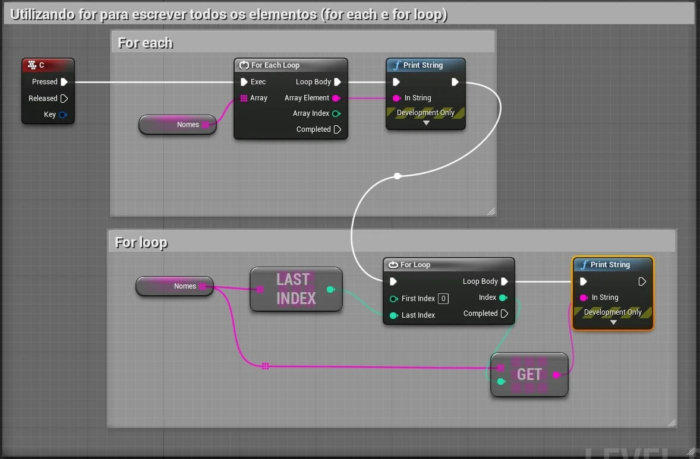

> Figura: Blueprint  Array com loop.

**C++.**

Podemos iterar utilizando a sintaxe padrão do C++.

```cpp
FString StrResultado;
for (auto& StrItem : Nomes)
{
    StrResultado += StrItem;
    StrResultado += TEXT(" ");
}
// StrResultado == "Nome1 Nome2"
```

Ou utilizar uma variável como índice.

```cpp
for (int32 Index = 0; Index != Nomes.Num(); ++Index)
{
    StrResultado += Nomes[Index];
    StrResultado += TEXT(" ");
}
```

Finalmente, array tem seu próprio tipo de elemento para iterar. Existem duas funções chamadas `CreateIterator` e `CreateConstIterator`, que podem ser usados para acesso de leitura e gravação ou somente leitura aos elementos, respectivamente:

```cpp
for (auto It = StrArr.CreateConstIterator(); It; ++It)
{
    StrResultado += *It;
    StrResultado += TEXT(" ");
}
```

- `For Each Loop` - Para cada elemento do *array* é processada uma interação.
- `For Loop` - Para cada elemento do *array*, dentro dos parâmetros `First Index` e `Last Index` é processada uma interação.

### Usando o comando Find
`Find` procura um elemento dentro do *array* e se encontra retorna o valor do índice do elemento, caso não encontre retorna -1.   

**Blueprint.**      

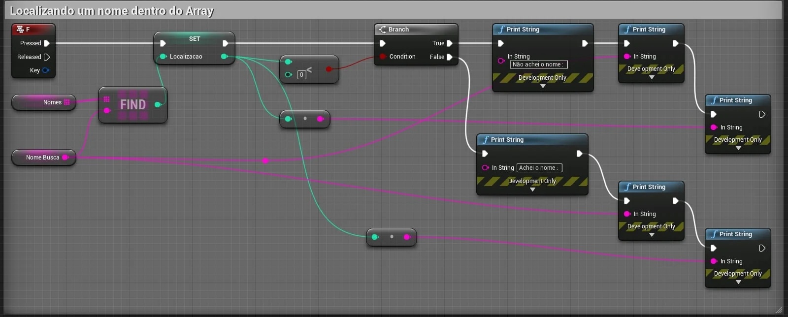

> Figura: Blueprint Find e Array.    

**C++.**

```cpp
int32 Index;
if (StrArr.Find(TEXT("Hello"), Index))
{
    // Index == 3
}
```

### Contando elementos dentro de um array
O exemplo abaixo conta todos os elementos do *array* `Nomes` que são iguais a variável `NomeBusca`.

**Bluprint.**

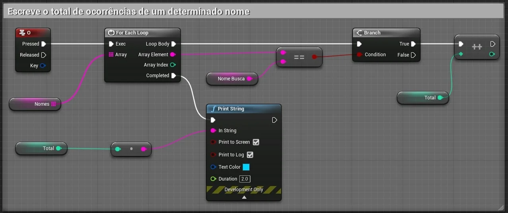

> Figura: Blueprint for para escrever o total de ocorrências.

**C++.**

```cpp
FString NomeBusca = TEXT("Nome 3");
int32 iTotal = 0;

for (int32 Index = 0; Index != Nomes.Num(); ++Index)
{
    StrResultado += Nomes[Index];
    if StrResultado.Equals(NomeBusca)
      iTotal++;
}
UE_LOG(LogTemp, Warning, TEXT("O Total é %d"),iTotal);
```

### Percorrendo e atualizando dados
O exemplo abaixo vamos percorrer o *array* utilizando uma instrução `for` e atualizar outro *array*.

**Blueprint.**

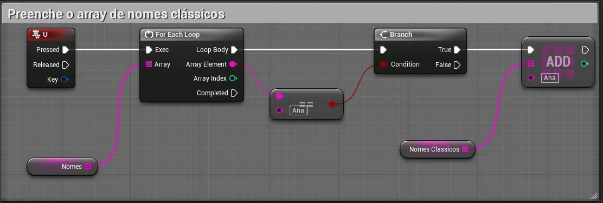

> Figura: Blueprint preenchendo o array com strings.

**C++.**

```cpp
TArray<FString> StrArrayResultado;

FString StrResultado;


for (int32 Index = 0; Index != Nomes.Num(); ++Index)
{
    StrResultado += Nomes[Index];
    if StrResultado.Equals(TEXT("Ana"))
      StrArrayResultado.Add(StrResultado);
}
UE_LOG(LogTemp, Warning, TEXT("O Total é %d"),iTotal);

```

<a name="6.15"></a>
## 6.15 Removendo elementos do array
É possível remover elementos de dentro de um *array*, após a remoção a quantidade e índice final da estrutura vai ser atualizada, a seguir vamos apresentar algumas funções.    

### Removendo utilizando Remove
A função `Remove` exclui um elemento do *array*, o valor a ser removido tem que ser informado como parâmetro.    

**Blueprint.**

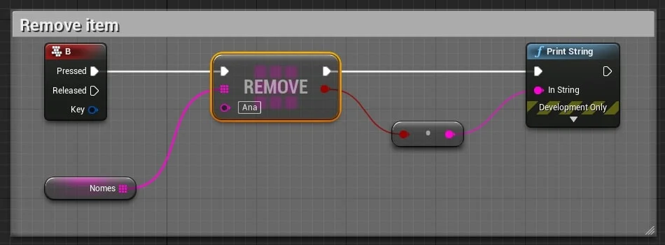

> Figura: Blueprint Remove Array.

**C++.**
```cpp

TArray<FString> Nomes;
...
Nomes.Remove(TEXT("Ana"));
```

### Removendo passando uma variável como parâmetro
O comando `Remove`executa uma busca utilizando um parâmetro, **NomeBusca** no exemplo abaixo, e o remove do *array*.    

**Bluprint.**

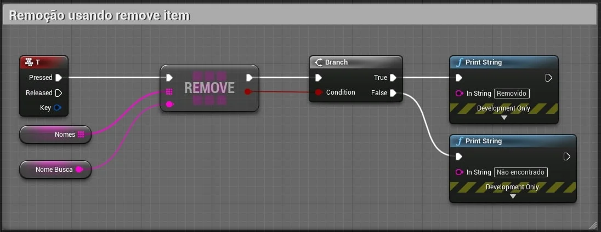

> Figura: Blueprint Remove array com index.

**C++.**
```cpp
FString StrNomeBusca = TEXT("Ana");

TArray<FString> Nomes;
...
Nomes.Remove(StrNomeBusca);
```

### Removendo utilizando nó Remove Index
`Remove Index` exclui um elemento do *array* utilizando o índice do *array*.      

**Blueprint.**

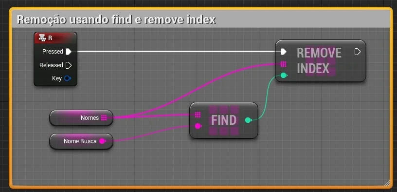

> Figura: Blueprint Find e remove.

**C++.**

```cpp
int32 Index;
if (Nomes.Find(TEXT("Hello"), Index))
{
    Nomes.RemoveAt(Index);
}

```

### Limpando o array com Clear
`Clear` remove todos os elementos do *array*.

**Blueprint.**

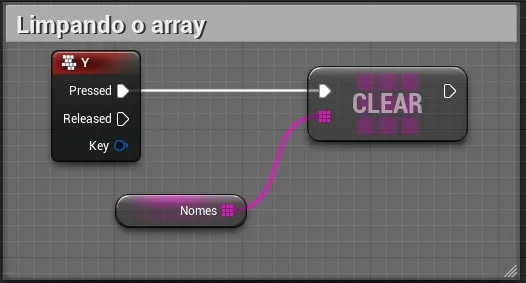

> Figura: Blueprint Clear Array.

**C++.**

```cpp

Nomes.Empty();

```

**[⬆ Volta para o CAPÍTULO 6](#capitulo6)**

<a name="6.16"></a>
## 6.16 O que são Enums?
Uma enumeração é um tipo definido pelo usuário que consiste em um conjunto de constantes integrais nomeadas que são conhecidas como enumeradores.

Exemplo:

```cpp
enum cores = { vermelho,amarelo, azul, verde = 20, preto}
```

### Criando Enums no Unreal Engine

**Blueprint.**

Execute o comando no menu de contexto `Blueprints` > `Enumeration` e logo depois preencha os valores conforme a tela abaixo.  

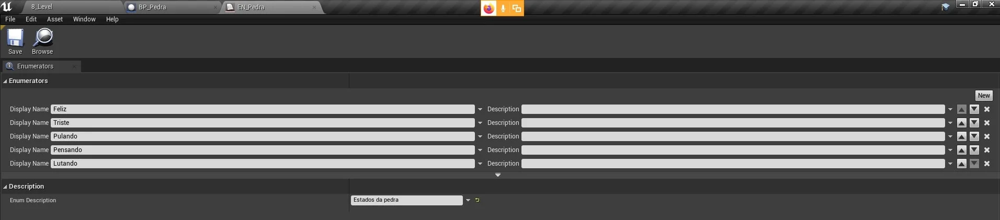

> Figura: Blueprint e Enum.

Objeto criado `EN_Estado` e `EN_Pedra`.  

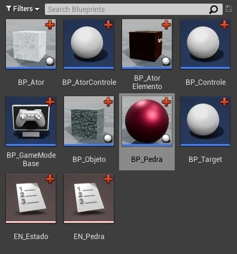

> Figura: Blueprint Enum no Context Browser.

**C++.**

Arquivo header.

`Visual Studio` > `Arquivo` > `Novo` > `Arquivo` > Escolha Visual C++, Arquivo de Cabeçalho (.h)

```cpp
// EnumName.h
UENUM(BlueprintType)
namespace EStatusEnum {
// Definimos namespace para que não existam conflitos no acesso aos elementos.
	enum Status
	{
		Ligada     UMETA(DisplayName = "Ligada"),
		Desligada      UMETA(DisplayName = "Desligada"),
	};

}
```

Arquivo de implementação.

```cpp
// Hero.cpp
UPROPERTY(EditAnywhere, BlueprintReadWrite, Category = Status)
  TEnumAsByte < EStatusEnum::Status > status;
```


### Exemplos de uso - A lâmpada
Vamos verificar e alterar o estado de uma lâmpada utilizando uma variável do tipo `boolean`.  

**Blueprint.**

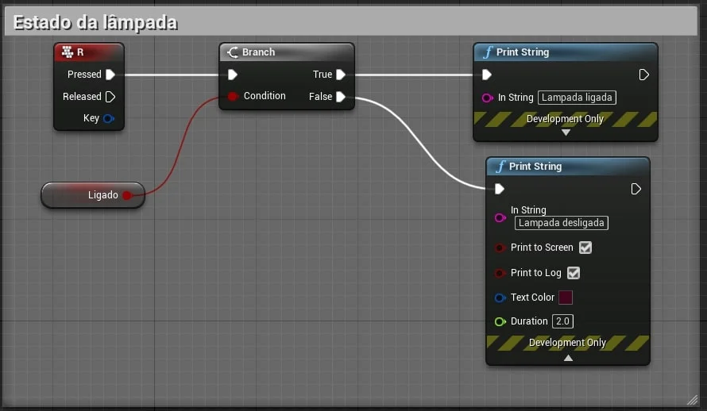

> Figura: Blueprint Verificando o estado de uma lâmpada.

**C++.**

```cpp
void AFirstPersonBaseCodeCharacter::SetupPlayerInputComponent(class UInputComponent* InputComponent)
  {
          // set up gameplay key bindings
          check(InputComponent);
          ...
          InputComponent->BindAxis("AnyKey", this, &AFirstPersonBaseCodeCharacter::AnyKey);
          ...
  }   
void AFirstPersonBaseCodeCharacter::AnyKey(float Value)
  {
    if bLigado
    {
      UE_LOG(LogTemp, Warning, TEXT("Lâmpada ligada."));  
    }    
    else
      UE_LOG(LogTemp, Warning, TEXT("Lâmpada desligada."));
  }    
```

Alterando o componente `PointLight` para ligar e desligar a iluminação.    

**Blueprint.**

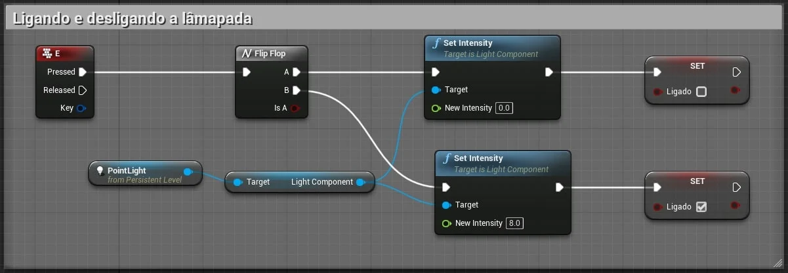

> Figura: Blueprint Ligando e desligando o PointLight.   

**C++.**

Arquivo Header.

```cpp
#pragma once

#include "CoreMinimal.h"
#include "GameFramework/Actor.h"
#include "ControlLight.generated.h"

UCLASS()
class CPP5_API AControlLight : public AActor
{
	GENERATED_BODY()

public:
	UPROPERTY()
		USceneComponent* Root;

	UPROPERTY(EditAnywhere, BlueprintReadWrite, Category = "Parameters")
		bool bLigado;

	UPROPERTY(EditAnywhere, BlueprintReadWrite, Category = "Parameters")
		float fIntensidade;

	UPROPERTY(EditAnywhere, BlueprintReadWrite, Category = "Parameters")
		class UPointLightComponent* PointLight;

	UPROPERTY(EditAnywhere, Meta = (MakeEditWidget = true))
		FVector TargetLocation;

	AControlLight();

protected:

	virtual void BeginPlay() override;

	void AnyKey();

public:
	virtual void Tick(float DeltaTime) override;
	void InitControl();

	class APlayerController* PlayerControllControlLight;

};
```

Arquivo de implementação.

```cpp
#include "ControlLight.h"
#include "Components/PointLightComponent.h"
#include "Kismet/GameplayStatics.h"
#include "Components/InputComponent.h"

// Sets default values
AControlLight::AControlLight()
{
	PrimaryActorTick.bCanEverTick = true;
	Root = CreateDefaultSubobject<USceneComponent>("Root");
	RootComponent = Root;
	PointLight = CreateDefaultSubobject<UPointLightComponent>(TEXT("Ponto de Luz"));
	PointLight->SetRelativeTransform(FTransform(FRotator(0, 0, 0), FVector(250, 0, 0),FVector(0.1f)));
	fIntensidade = 10000;
	bLigado = true;
}

void AControlLight::InitControl()
{
	FVector GlobalLocation = GetTransform().TransformPosition(TargetLocation);
	PointLight->SetWorldLocation(GlobalLocation);
	PointLight->SetIntensity(fIntensidade);
}

// Called when the game starts or when spawned
void AControlLight::BeginPlay()
{
	Super::BeginPlay();
	PlayerControllControlLight = UGameplayStatics::GetPlayerController(this, 0);
	EnableInput(PlayerControllControlLight);
	AControlLight::InitControl();
}

// Called every frame
void AControlLight::Tick(float DeltaTime)
{
	Super::Tick(DeltaTime);
	if (PlayerControllControlLight != NULL)
	{
		if (PlayerControllControlLight->WasInputKeyJustPressed(EKeys::T))
		{
			AnyKey();
		}
	}
}

void AControlLight::AnyKey()
{
	if (bLigado)
	{
		fIntensidade = 0;
		bLigado = false;

	}
	else
	{
		fIntensidade = 10000;
		bLigado = true;
	}
	PointLight->SetIntensity(fIntensidade);
}

```

Verificando o estado utilizando o `Enum`.   

**Blueprint.**


> Figura: Blueprint Lendo Enum.  

**C++.**
```cpp
// Definindo um status no enum.
status = EStatusEnum::Ligada;

UE_LOG(LogTemp, Warning,TEXT("O enum é = %s"), *UEnum::GetValueAsString(status));
```

Ligando e desligando utilizando o `Enum`.   

**Blueprint.**

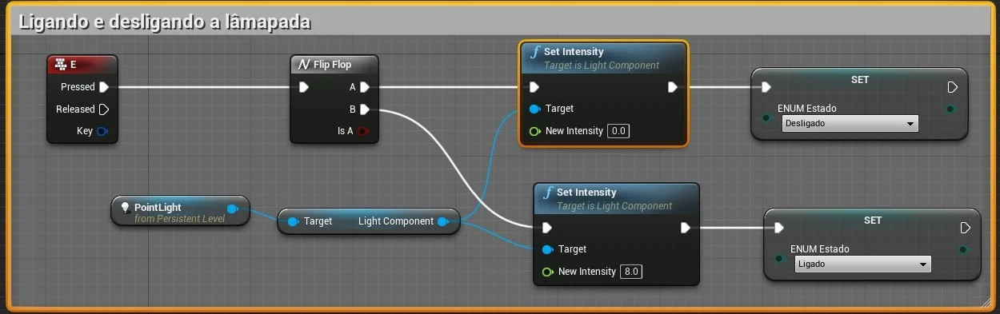

> Figura: Blueprint Ligando e desligando usando Enum.

**C++.**
```cpp
...
if (status = EStatusEnum::Ligada) {
  fIntensidade = 0;
  bLigado = false;
  status = EStatusEnum::Desligada;
}
else {
  fIntensidade = 10000;
  bLigado = true;
  status = EStatusEnum::Ligada;
}
```


### Exemplos de uso - A pedra das emoções
Vamos verificar e alterar o estado de emocional de uma pedra.

1. Alterando o estado emocional da pedra.    
  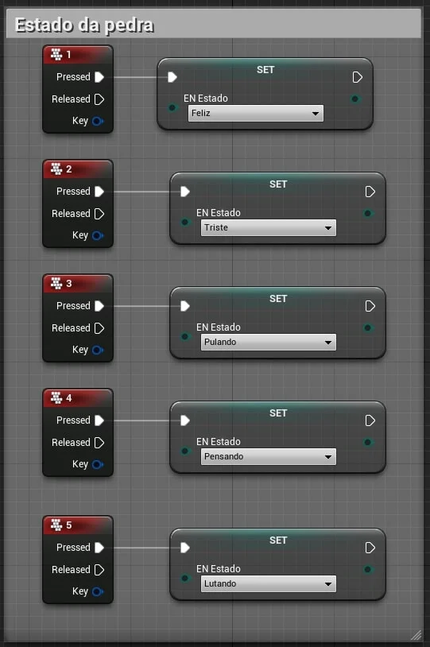

  > Figura: Blueprint alterando Enum.

2. Apresentando o estado emocional da pedra.   
  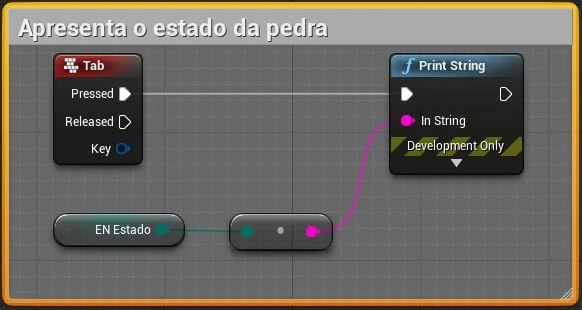

  >Figura: Blueprint escrevendo o conteúdo do Enum.

3. Alterando as cores da pedra conforme a emoção.  
  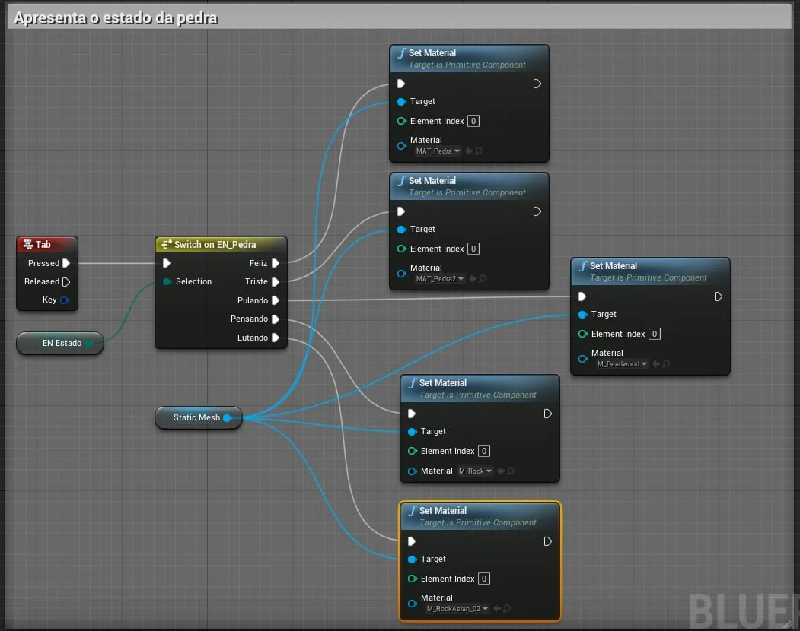

  > Figura: Blueprint alterando o material de uma malha utilizando um Enum como parâmetro.
