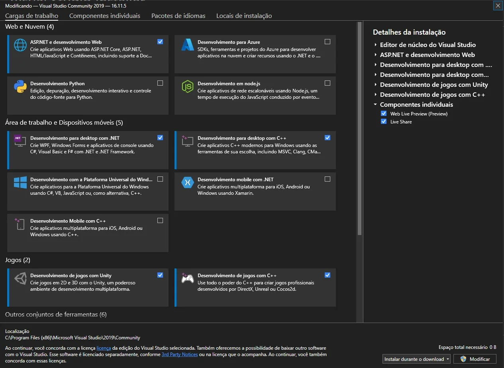
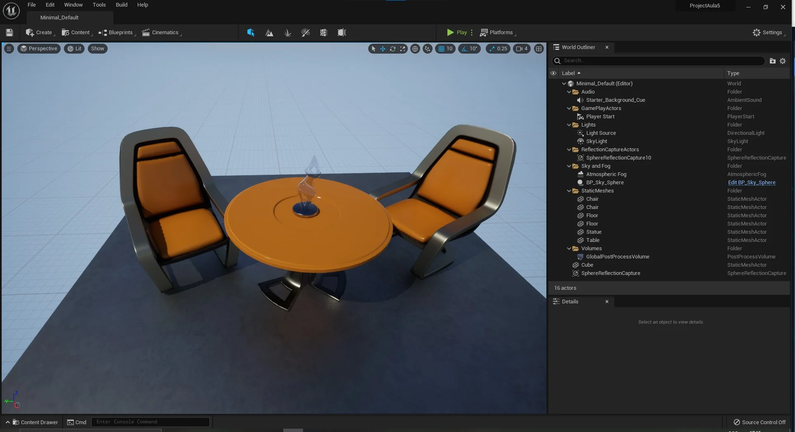

Aprenda estruturas de desenvolvimento e lógicas de programação, utilizando *Blueprints* e *C++*.  

**Habilidades que serão aprendidas**

- Configuração e organização de projetos;
- Analisar e aplicar lógica de programação utilizando *Blueprint* e *C++*;
- Implementar regras de tempo e espaço;
- Implementar interface do usuário;
- Estruturar e configurar materiais, terrenos e iluminação;
- Implementar ambientes Multijogador;
- Implementar inteligência artificial;
- Construir a animação de personagens;
- Implementar Efeitos especiais.


<a name="capitulo1"></a>
[**Capítulo 1 - Desenvolvendo jogos digitais**](#1)

- [1. O que é uma Engine e Framework?](#1.1)
- [2. Ciclo da lógica do desenvolvimento de um jogo](#1.2)
- [3. O que é Unreal Engine?](#1.3)

***

<a name="capitulo2"></a>
[**Capítulo 2 - Trabalhando com o Unreal Engine e Visual Studio**](#2)

- [1. Como instalar o Unreal Engine?](#2.1)
- [**2. Criando um projeto para jogos no Unreal Engine**](#2.2)    
    - [2.1 Selecionando o tipo de projeto](#2.2.1)
    - [2.2 Escolhendo o Template](#2.2.2)
    - [2.3 Configurando o projeto inicialmente](#2.2.2)
    - [2.4 Tela inicial do Unreal Engine](#2.2.4)
    - [2.5 Iniciando um projeto no Unreal Engine 5](#2.2.5)
    - [2.6 Configurando o editor de código](#2.2.6)
- [**3. Entendo as pastas criadas**](#2.3)
    - [3.1 Pasta de código C++ - Source](#2.3.1)
    - [3.2 Pasta principal do projeto - Content](#2.3.2)
    - [3.3 Pastas temporárias que podem ser removidas](#2.3.3)
    - [3.4 Nomenclatura de pastas](#2.3.4)
    - [3.5 Compilando o projeto usando o Windows Explorer](#2.3.5)
- [**4. Atividade - Instale o Unreal Engine com Visual Studio**](#2.4)
- [**5. Organizando pastas e logo do projeto**](#2.5)
    - [5.1 Como criar pastas de trabalho?](#2.5.1)
    - [5.2 Defina e utilize uma Nomenclatura e organização de pastas](#2.5.1)
    - [5.3 Os benefícios da organização de pastas](#2.5.1)    
    - [5.4 Configurando o projeto](#2.5.4)    
    - [5.5 Adicionando um Level na inicialização do projeto](#2.5.5)
    - [5.6 Configurando as imagens do projeto](#2.5.6)
- [**6. Atividade - Configure as pastas de seu projeto**](#2.6)

***

<a name="capitulo3"></a>
[**Capítulo 3 - Controle de versão com GitHub e Unreal Engine**](#3)

- [1. Ferramentas para controle de versão](#3.1)
- [2. Estrutura do GIT](#3.2)
- [3. Entendo o fluxo de trabalho](#3.3)
- [**4. Começando a trabalhar com o Git e o Unreal Engine**](#3.4)    
    - [4.1 Criando uma conta e o projeto no Github](#3.4.1)
    - [4.2 Instalando Git Client e GitHub Desktop](#3.4.2)
    - [4.3 Configurando Unreal Engine para utilizar o Git](#3.4.3)
    - [4.4 Configurando o Github Desktop e adicionando o projeto](#3.4.4)
    - [4.5 Criando o projeto remoto e atualizando os arquivos](#3.4.5)
    - [4.6 Testando a configuração do Git com o Unreal Engine](#3.4.6)  
- [5. Utilizando comandos do PowerShell para utilizar o Git Client](#3.5)  
- [6. Ignorando pastas e arquivos](#3.6)
- [7. Atividade - Crie um projeto no Unreal Engine e o configure para utilizar o Git](#3.7)

***

<a name="capitulo4"></a>
[**Capítulo 4 -  O Unreal Engine e sua lógica de programação**](#4)

- [1. Interface e Editores](interface_e_editores.html)  
- [2. Programação visual com Blueprint](unreal_engine_entendo_blueprint.html)
- [3. Programação C++ no Unreal Engine](unreal_engine_entendo_cpp.html)
- [4. Trabalhando com variáveis](unreal_engine_trabalhando_com_variaveis.html)  
- [5. Estruturas de controle de fluxo](unreal_engine_estruturas_de_controle_de_fluxo.html)
- [6. Manipulando Arrays](unreal_engine_manipulando_array.html)  
- [7. Utilizando Enums](unreal_engine_enum.html)    

***
**Capítulo 5 - Atores e movimentação**

1. [Implementando Atores](actor_atores.html)
1. [Utilizando Eventos, funções e macros](estruturando_logica_utilizando_eventos_funcoes_macros.html)  
1. [Implementando a movimentação do personagem](trabalhando_com_logica_movimentacao_de_personagem.html)    
1. [Comunicação entre Blueprints](comunicacao_entre_blueprint.html)    
1. [Delta time e sistema de coordenadas](deltatime_sistema_coordenadas.html)

***

**Capítulo 6 - Estruturas de dados e Interface com usuário**

1. [Variáveis estruturadas ou Structure](structure_variaveis_estruturadas.html)  
1. [Tabelas de dados ou Data tables - ](data_tables.html)
1. [Game Instance, Game State e Game Mode](unreal_engine_gameinstance_state_mode.html)
1. [Implementando a Interface com o jogador](unreal_engine_hud_interface.html)
1. [Lógica de programação dos objetos da interface](unreal_engine_hud_logica.html)

***
**Capítulo 7 - Materiais e Landscape**

1. [Introdução aos Materiais](unreal_engine_material_introducao_aos_materiais.html)
1. [Construindo Materiais e entendo a lógica](unreal_engine_material_construindo_materiais_entendendo_a_logica.html)
1. [Material Instance](unreal_engine_material_instance.html)
1. [Materiais e Blueprint](unreal_engine_material_blueprint.html)
1. [Trabalhando com Iluminação](iluminacao.html)
1. [Criando terrenos - Landscape](landscape.html)  

***
**Capítulo 8 - Animação de personagens**

1. [Introdução a animação de personagens](unreal_engine_animacao_introducao.html)
1. [Preparando o projeto](unreal_engine_animacao_preparando_o_projeto.html)
1. [Utilizando Blend Space](unreal_engine_animacao_blend_space.html)        
1. [Implementando a Lógica da animação](unreal_engine_animacao_animation_blueprint.html)        
1. [Implementando a mira](unreal_engine_animacao_aim_offset.html)
1. [Trabalhando com Animação 2D](unreal_engine_animacao2d.html)

***
**Capítulo 9 - Inteligência Artificial**
1. [Inteligência Artificial](inteligenciaartificial.html)

***
**Capítulo 10 - Multiplayer em C++**            
1. [Multiplayer](multiplayer.html)

***
**Capítulo 11 - Efeitos especiais**
1. [Sequencer](#)
1. [Utilizando Niagara](#)

<a name="1"></a>
## Capítulo 1 - Desenvolvendo jogos digitais


> *Figura: So, You Want to Be a Game Developer? - https://medium.com/swlh/so-you-want-to-be-a-game-developer-e3b7f9f4ac70 .*

O desenvolvimento de jogos digitais envolve diversas áreas de conhecimento como por exemplo:
- Programação de computadores;
- Arte 3D e 2D;
- Computação gráfica;
- Elementos de construção de Narrativas;
- Efeitos sonoros;

Na construção da mecânica de um jogo é necessário utilizar uma linguagem de programação para implementar movimento, interação de personagens, inteligência artificial e outros elementos dinâmicos.
As linguagens de programação vem evoluindo para simplificar as rotinas e comandos assim agilizando o desenvolvimento e permitindo o programador focar no que deve ser feito escondendo alguns detalhes de como é feito.

> Conhecer e entender como é feito é importante para determinar as técnicas utilizadas e ser capaz e aproveitar ou mesmo melhorar os jogos.

Existem aplicações que auxiliam na produção de programas de computador ou jogos digitais, estas ferramentas abstraem a lógica complexa que faz com os objetos sejam apresentados de forma adequada na cena, no caso de jogos digitais. Tais ferramentas são chamadas de *Frameworks* [[1](#r1)]

<a name="1.1"></a>
## 1. O que é uma Engine e Framework?


> *Figura: Game Engine VS Game Framework - https://developerhouse.com/game-engine-vs-game-framework/ .*

No desenvolvimento de jogos um *Framework* pode ser definido como um conjunto de bibliotecas que auxiliam a programação, sendo que uma *engine* ou motor gráfico é mais completo pois abrange outros aspectos na produção de jogos.[[2](#r2)]

Algumas *Engine*.

1. Unreal engine;
1. Unity;
1. GameMaker;

<a name="1.2"></a>
## 2. Ciclo da lógica do desenvolvimento de um jogo
A maioria das *engines* seguem um ciclo de execução da lógica de programação baseado em :

- **Inicialização** - Executado ao iniciar o jogo carregando bibliotecas básicas;
- **Carga** - Responsável por carregar os objetos ou módulos;
- **Atualização** - Estado de atualização constante responsável por apresentar todos os estados do jogo;
- **Finalização** - Executa as rotinas para descarregar o jogo;

<a name="1.3"></a>
## 3. O que é Unreal Engine?


> *Figura: Unreal Engine - https://www.unrealengine.com/en-US/ .*

É uma *Engine* (motor gráfico) para desenvolvimento de jogos que engloba vários aspectos na sua produção, a segui listamos algumas funcionalidades:

1. Edição e compilação da lógica de programação;
1. Apresentação de elementos visuais da cena do jogo;
1. Editor da lógica de animações e manipulação de esqueletos e malhas;
1. Editor de interfaces para comunicação com os jogadores (HUD);
1. Editor de sequencias de animação;
1. Editor de sons;
1. Editor para construção de materiais;
1. Editor de efeitos especiais utilizando partículas;

**[⬆ Volta para o Capítulo I](#capitulo1)**
---

<a name="2"></a>
## Capítulo 2 - Trabalhando com o Unreal Engine e Visual Studio**

O **Unreal Engine** é um [Framework](https://pt.wikipedia.org/wiki/Framework) de desenvolvimento que incorpora vários editores e componentes para agilizar a construção de jogos e também um ambiente visual de programação abstraindo a lógica de programação.

Para que possamos programar em linguagem **C++** com **Unreal Engine** é necessário instalar o **Visual Studio** ou **Visual Code** e baixar os pacotes de desenvolvimento em **C++**.

A **Epic Games** utiliza um sistema para gerenciamento dos seus produtos, o **Inicializador da Epic Games** responsável por:
- Instalação e atualização de jogos;
- Navegação da loja de produtos;
- Instalação e atualização das versões do **Unreal Engine**;

   

> *Figura: Gerenciamento de versões.*


<a name="2.1"></a>
## 1.  Como instalar o Unreal Engine?
Para instalar o **Unreal Engine** siga os seguintes passos:

1. Baixe e instale o [Inicializador da Epic Games](https://www.epicgames.com/store/pt-BR/download);
2. Inscreva-se para uma conta da Epic Games, se ainda não tiver uma;
3. Faça login no **Inicializador da Epic Games**;
4. Instale o **Unreal Engine** utilizando o menu `Unreal Engine` > `Biblioteca`.
5. Para instalar  os pacotes de desenvolvimento e o Visual Studio para programação com C++ baixe o Visual Studio em : [Download Visual Studio](https://visualstudio.microsoft.com/pt-br/?rr=https%3A%2F%2Fwww.google.com%2F);
6. Selecione os pacotes de programação:
  - Desenvolvimento de jogos com C++;
  - Desenvolvimento para Desktop com C++.      

<!--    
-->



  > *Figura: Visual Studio Update para desenvolvimento de jogos.*   

**Por que instalar o pacote Desktop com C++ ?**

Porque muitas vezes é necessário testar uma funcionalidade ou mesmo testar um conceito da linguagem e ter o compilador disponível é uma mão na roda.


**[⬆ Volta para o Capítulo 2](#capitulo2)**

<a name="2.2"></a>
## 2. Criando um projeto para jogos no Unreal Engine
Nesta seção vamos criar um projeto para jogos utilizando **C++** pois irá ajudar na compreensão da estrutura de pastas e arquivos do **Unreal Engine**. O nome do projeto será ProjetoAula e o usaremos em vários capítulos.

<a name="2.2.1"></a>
### 2.1 Selecionando o tipo de projeto    
Para construção do projeto vamos selecionar a categoria *Games* para que a Engine configure alguns parâmetros iniciais.

  

> *Figura: Unreal 4 - Select or create New Project, Games.*        

<a name="2.2.2"></a>
### 2.2 Escolhendo o Template
Para este projeto vamos escolher o `template blank` para que possamos entender os elementos do projeto e adicionar posteriormente outros pacotes.

     

> *Figura: Select Template blank.*

**Templates** são modelos com elementos disponíveis para cada tipo de jogo escolhido.

<a name="2.2.3"></a>
### 2.3 Configurando o projeto inicialmente
Em configuração de projeto escolha **C++** e `No Starter Content`, esta opção não vai instalar o pacote padrão de *assets* da **Epic Games** pois agora não é necessário, em seguida escolha uma pasta onde o projeto deverá ser instalado em `Select a Location for project to be stored`.


> *Figura: Unreal engine project Settings.*

<a name="2.2.4"></a>
### 2.4 Tela inicial do Unreal Engine
Quando todos os passos anteriores forem concluídos corretamente a tela inicial deve aparecer.  

<!--  -->


> *Figura: Unreal Engine tela inicial.*

<a name="2.2.5"></a>
### 2.5 Iniciando um projeto no Unreal Engine 5
A versão 5 tem uma apresentação um pouco diferente mas o conceito ainda é o mesmo dos passos anteriores.


> *Figura: Unreal 5 - Select or create New Project, Games.*

<!--  -->



> *Figura: Unreal 5 - Tela inicial.*        

<a name="2.2.6"></a>
### 2.6 Configurando o editor de código
Para programar utilizando **C++** no Unreal devemos configurar um editor de código para ser responsável pela compilação, organização e edição da linguagem. A configuração esta em :

 `Menu` > `Editor Preferences` > `General` e `Source Code`, então escolha `Visualstudio`.   

   

> *Figura: General - Source Code, Definindo o editor de código.*

**Qual editor eu escolho, Visual Code ou Visual Studio?**

Os dois são ótimos editores de código mas o Visual Code tem uma apresentação mais enxuta e quando se trata de utilizar ele para outras lingagens, como por exemplo Pyhton, ou mesmo editar um arquivo de formato Markdown é uma boa escolha.


**[⬆ Volta para o Capítulo 2](#capitulo2)**

<a name="2.3"></a>
## 3. Entendo as pastas criadas
Após criar o projeto vamos verificar como estão as pastas criadas pela *engine*, utilizando o `explorer` do Windows, navegue até a pasta do projeto para verificar os arquivos criados, devem aparecer as seguintes pastas e arquivos:

```bash
|-- .vs
|-- Binaries
|-- Config
|-- Content
|-- Intermediate
|-- Saved
|-- Source
|-- ProjetoAula.sln
|-- ProjetoAula.uproject
```
A seguir vamos entender as pastas do projeto.

<a name="2.3.1"></a>
### 3.1 Pasta de código C++ - Source
A pasta `Source` contém arquivos com código fonte em **C++** e o arquivo com extensão *uproject* é o principal arquivo do projeto, segue abaixo a configuração inicial.

```bash
|-- Source
		|-- ProjetoAula
		|		|-- ProjetoAula.cpp
		|		|-- ProjetoAula.h
		|		|-- ProjetoAula.Build.cpp    
		|-- ProjetoAulaEditor.Target.cs    
		|-- ProjetoAula.Target.cs
```

<a name="2.3.2"></a>
### 3.2 Pasta principal do projeto - Content
`Content` é a principal pasta, pois nela vão ficar contidos todos os arquivos do jogo, em outras palavras esta pasta é o ponto de montagem do projeto como veremos nos próximos capítulos.


<a name="2.3.3"></a>
### 3.3 Pastas temporárias que podem ser removidas
As pastas abaixo podem ser removidas pois podemos construir a qualquer momento quando compilar o projeto.

```bash
|-- Binaries
|-- Build
|-- Intermediate
|-- Saved
```

<a name="2.3.4"></a>
### 3.4 Nomenclatura de pastas
É recomendado que os arquivos e pastas devam ter um padrão de nomenclatura para melhor organização do projeto, abaixo duas boas recomendações de organização, discutiremos mais nos próximos capítulos.    
- [Directory Structure](https://docs.unrealengine.com/en-US/Engine/Basics/DirectoryStructure/index.html "Directory Structure Overview of the directories that make up the engine and game projects.");
- [UE5 Style Guide](https://github.com/Allar/ue4-style-guide/blob/master/README.md#unreal-engine-4-linter-plugin "Gamemakin UE4 Style Guide() { A mostly reasonable approach to Unreal Engine 4").

**[⬆Volta para o Capítulo 2](#capitulo2)**

<a name="2.3.5"></a>
### 3.5 Compilando o projeto usando o Windows Explorer
Para recompilar o projeto e recriar os arquivos podemos utilizar o `explorer` do Windows seguindo os passos abaixo:
1. Apague as pastas `Binaries`, `Build`, `Intermediate` e `Saved`;
1. Click com botão direito do mouse no arquivo **ProjetoAula.uproject**;
1. Escolha a opção `Generate Visual Studio project files`;

       

    > *Figura: Recriando os arquivos do projeto, Generate Visual Studio Project files.*

1. Aguarde o termino da operação e abra o projeto.

**[⬆ Volta para o Capítulo 2](#capitulo2)**

<a name="2.4"></a>
## 4. Atividade - Instale o Unreal Engine com Visual Studio.
**Regras.**

1. Instale todo o ambiente e crie um projeto de nome MeuPrimeiroProjeto.

**Desafio.**

1. Configure o Visual Studio para ser o editor padrão.

**[⬆ Volta para o Capítulo I](#capitulo1)**

<a name="2.5"></a>
## 5. Organizando pastas e logo do projeto
A seguir vamos organizar as pastas do projeto *ProjetoAula*, construído no **Unreal Engine**, e vamos configurá-lo.


<a name="2.5.1"></a>
### 5.1 Como criar pastas de trabalho?
No **Unreal Egnine** em `Content Drawer` utilizando botão direito do mouse clique em `New Folder` para criar pastas.

			

> *Figura: Content Drawer.*

<a name="2.5.2"></a>
### 5.2 Defina e utilize uma Nomenclatura e organização de pastas
A organização de arquivos e pastas dentro dos projetos de desenvolvimento de softwares é bastante relevante para reduzir o tempo de programação e custo.

Em projetos de desenvolvimento de jogos, no **Unreal Engine**, temos diversos tipos de arquivos com caraterísticas distintas que influenciam na sua forma de armazenamento, como por exemplo:
- Código **C++**;
- Lógica de desenvolvimento utilizando Blueprints;
- Arquivos de imagens, como texturas e outros;
- Arquivos de som;
- Arquivos binários em geral.  

Temos também equipes heterogêneas trabalhando no mesmo projeto e até na mesma estrutura de pastas, como por exemplo:
- Programadores;
- Level Design;
- Artistas gráficos;
- Artistas de efeitos de som e músicos.

Por conseguinte para um maior gerenciamento pelas equipes do projeto  podemos definir pastas com nomenclaturas e organização adequadas ao projeto, abaixo vamos relacionar algumas sugestões.

1. Sugestão 1.
```bash
|-- Content
		|-- Blueprints
		|		|-- Core
		|		|-- Characters
		|		|-- Elements
		|-- Assets
		|		|-- Images
		|		|-- StructureMesh
		|		|-- Materials
		|-- Maps
		|		|-- Level1
		|-- UI
		|-- Animations
```

1. Sugestão 2.
```bash
|-- Content
		|-- ProjetoAula
			|-- Art
			|	|-- Industrial
			|	|	|-- Ambient
			|	|	|-- Machinery
			|	|	|-- Pipes
			|	|-- Nature
			|	|	|-- Ambient
			|	|	|	|-- Foliage
			|	|	|	|-- Rocks
			|	|	|	|-- Trees
			|	|-- Office
			|-- Characters
			|  |-- Bob
			|  |-- Common
			|  |  |-- Animations
			|  |  |-- Audio
			|  |-- Jack
			|  |-- Steve
			|  |-- Zoe						
			|-- Core
			|	|-- Characters
			|	|-- Engine
			|	|-- GameModes
			|	|-- Interactables
			|	|-- Pickups
			|	|-- Weapons
			|-- Maps
			|	|-- Level1
			|	|-- Level2
```

<a name="2.5.3"></a>
### 5.3 Os benefícios na organização das pastas
Separar a pasta do projeto `Content` de outras pastas pode facilitar e trazer vários benefícios durante o desenvolvimento do projeto, abaixo elencamos alguns:
1. Versionamento - pastas com diferentes versões;
1. Isolar pacotes de testes e *Marketplace*;
1. DLC ou subprojetos - podemos administrar separadamente projetos relacionados;
1. Biblioteca de Materiais - podemos migrar pasta de materiais e compartilhar materiais sem muitos problemas definindo um pasta de nível superior.

  Exemplo:
```bash
|-- Content
	|-- ProjetoAula
	|-- ProjetoAulaTestes
	|-- ProjetoAulaArquitetura
	|-- StarterContent
	|-- FPS_Assault_Pack
	|-- MaterialLibrary
	|	|-- M_Master
```		

**[⬆ Volta para o Capítulo 2](#capitulo2)**

<a name="2.5.4"></a>
### 5.4 Configurando o projeto
Preparar o projeto antes de começar o desenvolvimento é importante para que possamos otimizar algumas tarefas e preparar o jogo com a configuração inicial, neste passo vamos configurar alguns parâmetros do projeto.

Nos próximos capítulos vamos utilizar outras opções do menu de configuração como por exemplo o [mapeamento de *Input* (teclas ou controles)](http://cafegeek.eti.br/unreal-engine/trabalhando_com_logica_movimentacao_de_personagem.html#13).

<a name="2.5.5"></a>
### 5.5 Adicionando um *Level* na inicialização do projeto
Para que um *level* ou mapa seja carregado ao iniciar o projeto siga os seguintes passos:  

1. Salve o *level* atual na pasta `Maps` :       
    `File` > `Save Current Level As` com o nome `LevelTest`;
1. Para configurar a inicialização do projeto utilizando o `LevelTest` utilize o menu :     
    `Edit` > `Project Settings` e depois `Maps & Modes`;   

				

	*Figura: Project - Maps & Modes.*

- `Edit Startup Level` - Seleciona o *Level* que deverá ser carregado no início do jogo, neste caso é `LevelTest`;
- `Game default Map` - Seleciona o *Level* que é mais usado.

<a name="2.5.6"></a>
### 5.6 Configurando as imagens  do projeto
Para alterar as imagens de apresentação do projeto, seja ícone ou tela de apresentação (*splash*) utilizamos o menu :

`Project Settings` opção `Plataforms` > `Windows` e altere a imagens.

<!-- 		-->

<figure>
  
  <figcaption>Figura: Project icon.</figcaption>
</figure>

> *Figura: Project icon.*

Certifique-se de produzir o ícone como um arquivo .ico (que não é PNG, mas pode ser convertido usando ferramentas online, por exemplo) e 256x256.

**[⬆ Volta para o Capítulo 2](#capitulo2)**


<a name="2.6"></a>
## 6 Atividade - Configure as pastas de seu projeto.

**Regras.**

1. Configure as pastas de seu projeto escolhendo uma das sugestões e justifique a sua escolha.

**Desafio.**

1. Adicione o pacote *StarterContent*.

**[⬆ Volta para o Capítulo 2](#capitulo2)**

<a name="1.6"></a>
## 6. Controle de versão com GitHub
Nesta seção vamos instalar o **Git Client** com o **GitHub Desktop** para versionamento de arquivos no **Unreal Engine** e apresentar comandos básicos.


> *Figura: Unreal Engine with Git.*

<a name="3"></a>
## Capítulo 3 - Configurando o controle de versão utilizando Git

Quando programamos existe a necessidade de gerenciar as alterações que ocorrem durante o desenvolvimento do projeto e até mesmo depois, acompanhe o seguinte exemplo:  

Abaixo o trecho de código inicial, vamos chamá-lo de **A**.

```cpp
if (a > b) {
  resultado = (a + b)
}
```
Então, alteramos o código, vamos chamar de **B**, ou mesmo o corrigimos para :
```cpp
if (a > b) {
  resultado = (a + b * 10)
}
```

Perceba que para facilitar a manutenção e desenvolvimento em equipe e pensando em documentar a lógica temos que dispor das seguintes facilidades.
- Capacidade reverter o código atual para o estado anterior, lógica **A**.
- Necessidade de compartilhar o código como outros desenvolvedores.
- Necessidade de documentar as alterações no momento que forem compartilhadas.

**[⬆ Volta para o Capítulo 3](#capitulo3)**

<a name="3.1"></a>
## 1. Ferramentas para controle de versão
Existem várias ferramentas para controle de versão disponíveis no mercado, como por exemplo :
- **GitHub** - É um serviço de armazenamento de nuvem para gerenciamento de códigos de aplicação. É possível ter uma conta gratuita e armazenar até 500Mb por projeto;
- **Gitlab** - É um serviço de armazenamento de nuvem para gerenciamento de códigos de aplicação concorrente do Github mas com o diferencial que pode ser instalado em um ambiente corporativo;
- **SVN** - Gerenciador de versão para vários tipos de arquivos, inclusive arquivos de mídia, para ambientes corporativos;
- **Git LFS** - Large File System é uma versão do git para armazenamento de arquivos de mídia ou binários, podendo armazenar de forma gratuita até 1GB.


 O **Unreal Engine** trabalha de forma nativa com **SVN**, **Perforce** e **Git**, esta última até o momento em versão beta.      

<a name="3.2"></a>
## 2. Estrutura do GIT
No gráfico abaixo é apresentado a estrutura de armazenar e alguns comandos do ambiente do Git.


> *Figura: Git, GitHub, & Workflow Fundamentals.*

<a name="3.3"></a>
## 3. Entendo o fluxo de trabalho
Quando utilizamos um gerenciador de versão temos que seguir um fluxo de trabalho para compartilhar o código armazenado localmente, segue abaixo os comandos iniciais do fluxo:

**Add** - Permite adicionar as alterações para um registro local.

```bash
git add .
```
**Commit** - Compromete ou confirma as alterações e criar uma etiqueta ou informação para identificar o trabalhado realizado, por exemplo:    

```bash
git commit -m "feat: Adicionado lógica de movimentação do jogador com mouse X e Y em BP_HeroBase."
git commit -m "fix: Corrigido o evento MostraMenu em BP_GameInstance, anteriormente o objeto apresentava erro no momento de instanciar o objeto BP_MenuPrincipal, foi adicionado o nó IsValid antes da execução."
git commit -m "fix: Lista de correções #14,#252"
````
**Push** - Empurra e publica as alterações locais no servidor.

```bash
git push origin main
```

**[⬆ Volta para o Capítulo 3](#capitulo3)**

<a name="3.4"></a>
## 4. Começando a trabalhar com o Git e o Unreal Engine
Neste passo vamos preparar o ambiente e projeto para começar a trabalhar com o gerenciamento de versões, utilizaremos o **GitHub** como repositório de arquivos e gerenciador de versões, para tal executaremos os próximos passos.

<a name="3.4.1"></a>
### 4.1 Criando uma conta e o projeto no Github
Inscreva-se no [Github](https://github.com/) para possibilitar:
- Registro de Repositórios - Espaço de armazenamento e versionamento de arquivos e projetos;
- Registro e acompanhamento de tarefas - Registro e acompanhamento de tarefas que podem se associadas aos `commits`;
- Registro e acompanhamento de projetos e versões - Registro de versões de projeto;  
- Wiki - Publicação de um Wiki do projeto.

<a name="3.4.2"></a>
### 4.2 Instalando Git Client e GitHub Desktop
É necessário instalar o **Git Client** no computador local para criar as estruturas de versionamento. Utilizaremos o **PowerShell** com os comandos a seguir para instalar o aplicativo cliente.

1. Instale o [Cliente GIT](https://git-scm.com/downloads);
1. Crie uma chave de autenticação (Key-Gen) com o GIT-BASH;
```shell
ssh-keygen
```
> Este passo só é necessário se no momento de envio (push) solicitar senha e o sistema operacional não gerenciar as credenciais adequadamente.

1. Adicione a chave no GitHub **Settings >SSH and GPG Keys**;
1. Para testar execute os comandos:
```shell
mkdir -p D:\temp\testegit
cd D:\temp\testegit
git init
git status
git remote -v
```
1. Após a instalação do **Git Client** vamos baixar e instalar o ambiente visual [GitHub Desktop](https://desktop.github.com/) para simplificar o fluxo de trabalho.

<a name="3.4.3"></a>
### 4.3 Configurando Unreal Engine para utilizar o Git
Para exemplificar a conexão do **Unreal Engine** com o Github vamos criar um novo projeto com os seguintes parâmetros:
- Template : Blank;
- Project Name : TestGitHub;
- Type: Blurprint;
- Iremos manter os demais parâmetros como estão.

1. Para Configurar o projeto utilizaremos :   
  - O Menu principal `Edit` > `Connect To Source Control`.


> *Figura: Source Control Login.*

2. Abaixo a descrição dos parâmetros;
  - `Git Path` - Caminho para o executável do **Git client**;
  - `Add a .gitignore file` - Adiciona o arquivo para controle do que deve ser enviado para o servidor;
  - `Add a basic README.md file` - Adicione um arquivo em formato *Markdown* para ser utilizado como documentação inicial;
  - `Make the initial Git Commit` - Inicializa o repositório local.

3. Logo em seguida inicialize o projeto e clique em `Accept Settings`;
4. Com o `Content Drawer` cria as seguintes pastas:
  - `ExampleContent`;
  - `Projeto`;
  - `Projeto\Maps`;  
5. Salve o level atual em `Projeto\Maps` com o nome `LevelTest`.

<a name="3.4.4"></a>
### 4.4 Configurando o Github Desktop e adicionando o projeto
1. Abra o GitHub Desktop;

2. Configure a sua conta do **Github** para ter acesso aos seus repositórios utilizando o menu principal `File` > `Options`;


*Figura: Github Desktop Options.*

3. Adicione o projeto TestGitHub com `Add an Existing Repository from your hard drive...`, informe a pasta do projeto TestGitHub;
4. Utilizando o Explorer navegue até a pasta do projeto e edite o arquivo .gitignore e adicione o texto ExampleContent, isso impedira a pasta ser enviada para o repositório remoto, verifique [Ignorando pastas e arquivos](#1.6.13) para mais informações;

<a name="3.4.5"></a>
### 4.5 Criando o projeto remoto e atualizando os arquivos
Uma vez configurados os projetos nos sistemas **Unreal** e **GitHub Desktop**, podemos confirmar as alterações dos arquivos utilizando o comando `Commit to Master`.


> *Figura: Github Desktop Commit to Master.*

Após confirmação das alterações devemos publicá-las no repositório remoto usando o comando `Publish repository`.


> *Figura: Github Desktop Publish repository.*

O comando acima irá criar um projeto na sua conta no Github.com e adicionar todos os arquivos criados até o momento.

<a name="3.4.6"></a>
### 4.6 Testando a configuração do Git com o Unreal Engine
Para testar as configurações realizadas vamos adicionar o pacote `Starter Content` e um objeto **Blueprint**.

1. Adicione o pacote **Starter Content** utilizando o `Content Drawer`;
  - `Add` > `Add Feature or Content Pack` escolha `Starter Content`.
2. Após a instalação do pacote mova o diretório `StarterContent` para a pasta `ExampleContent`, isso deve impedir que a referida pasta seja publicada no repositório remoto;
  - `ExampleContent\StarterContent`.
3. Vamos criar o objeto `BP_Ator` do tipo *Actor* e adicioná-lo na pasta `Content\Projeto\Characters`.
4. No painel `Changes`  do GitHub Desktop devem aparecer somente os arquivos :
  - BP_Ator.usasset;
  - TestGitHub.uproject.

  

  > *Figura: Github Desktop Publish repository.*

5. Após a confirmação vamos enviar as alterações para o servidor com o comando `Push origin`.

  

  > *Figura: Github Desktop Push Origin.*

**[⬆ Volta para o Capítulo I](#capitulo1)**

<a name="3.5"></a>
## 5. Utilizando comandos do PowerShell para utilizar o Git Client
É interessante aprender comandos do **PowerShell** para utilizar o **Git Client** pois existem diversas situações que não estão nas ferramentas visuais, como por exemplo:
- Resolução de conflitos.
- Adicionar nome de versão para um determinado conjunto de arquivos.

Então vamos apresentar os principais comandos.

**Clonando o projeto.**

Clonar o projeto significa baixar o projeto do servidor para a máquina cliente (local).

```shell
mkdir -p D:\UnrealProjects
git clone https://github.com/myerco/ProjetoAula.git
cd ProjetoMP
git status
```
**Criando o projeto.**

Podemos criar um novo projeto no cliente e em seguida atualizar o servidor.     
```shell
mkdir -p D:\UnrealProjects\ProjetoMP
cd D:\UnrealProjects\ProjetoMP
git init
git remote add origin https://github.com/myerco/ProjetoAula.git
git remote -v
```

**Atualizando o projeto no servidor.**

Mudanças podem ser replicadas do cliente para o servidor.
```shell
git add .
git commit -m "feat: Atualizando o projeto.. Alteração de movimentação de personagem"
git push origin master
```

**Atualizando o projeto no cliente (local).**

O comando `pull` baixa os arquivos do servidor.
```shell
git status
git pull origin master
```

**[⬆ Volta para o Capítulo 3](#capitulo3)**

<a name="3.6"></a>
## 6. Ignorando pastas e arquivos
É importante ignorar pastas e arquivos do cliente para que não possam ser publicadas no servidor utilizando o arquivo `.gitignore` na pasta raiz do projeto, considerando os seguintes aspectos.

**Segurança** - Arquivos de controle de senhas ou outros dados relativos a segurança não podem ficar disponíveis publicamente.

**Arquivos e pastas temporárias** - Estes arquivos podem ser recriados ao compilar o projeto.

**Arquivos grandes** Arquivos de imagens ou elementos de grande tamanho podem ser excluídos do versionamento e devemos considerar outras métodos de armazenamento como por exemplo:
- [Git LFS](https://git-lfs.github.com/)
- [SVN](https://tortoisesvn.net/)

**Exemplo de arquivo .gitignore para o Unreal Engine**

```shell
# Projetos exemplo
ThirdPerson/
ThirdPersonBP/
Geometry/
Mannequin/
StarterContent/
# Visual Studio 2015 user specific files
.vs/
# Compiled Object files
*.slo
*.lo
*.o
*.obj
```

<a name="3.7"></a>
## 7. Atividade - Crie um projeto no Unreal Engine e o configure para utilizar o Git.
**Regras.**

1. Instale todo o ambiente e crie um projeto com  a  última versão do Unreal Engine.
1. Configure o GitHub Desktop e publique o projeto criado.
1. Implemente pastas e adicione três atores para testar a publicação.

**Desafio.**

1. Crie um branch para Testes e adicione alterações.

**[⬆ Volta para o Capítulo 3](#capitulo3)**
