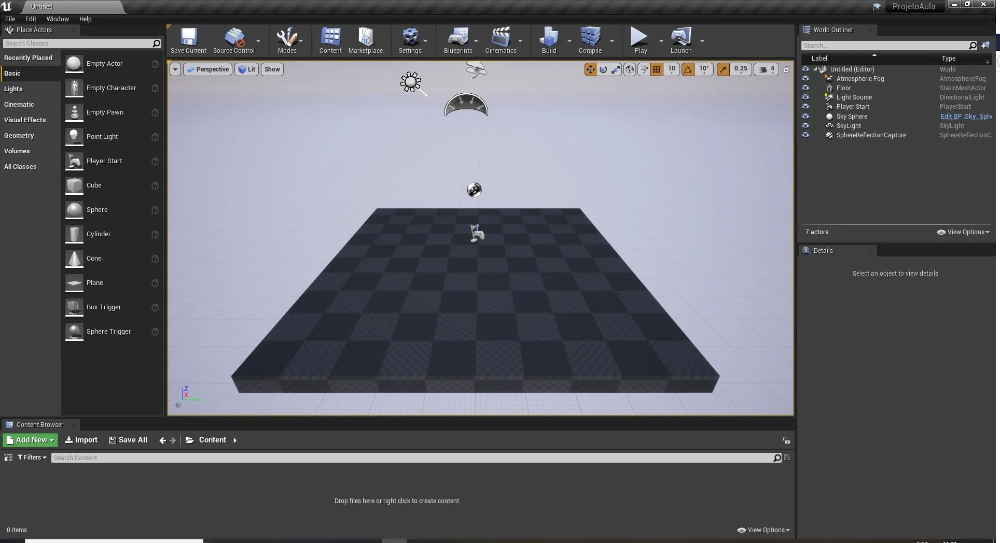

Aprenda estruturas de desenvolvimento e lógicas de programação, utilizando *Blueprints* e *C++*, bem como a construção de elementos de apresentação de jogos como por exemplo materiais, terrenos, inteligência artificial e conexões multiplayer.  

**Habilidades que serão aprendidas**

- Configuração e organização de projetos;
- Analisar e aplicar lógica de programação utilizando *Blueprint* e *C++*;
- Implementar regras de tempo e espaço;
- Implementar interface do usuário;
- Estruturar e configurar materiais, terrenos e iluminação;
- Implementar ambientes Multijogador;
- Implementar inteligência artificial;
- Construir a animação de personagens;
- Implementar Efeitos especiais.


<a name="capitulo1"></a>
[**Capítulo I - O Unreal Engine e sua lógica de programação.**](#1)

- [**1. Desenvolvendo jogos digitais**](#1.1)
    - [1.1 O que é uma Engine e Framework?](#1.1.1)
    - [1.2 Ciclo da lógica do desenvolvimento de um jogo](#1.1.2)
    - [1.3 O que é Unreal Engine?](#1.1.3)
- [**2. Como instalar o Unreal Engine?**](#1.2)
    - [2.1 O Unreal Engine e o Visual Studio](#1.2.1)
    - [2.2 Como instalar os pacotes de desenvolvimento e o Visual Studio para programação com C++?](#1.2.2)
- [**3. Criando um projeto para jogos no Unreal Engine**](#1.3)    
    - [3.1 Selecionando o tipo de projeto](#1.3.1)
    - [3.2 Escolhendo o Template](#1.3.2)
    - [3.3 Configurando o projeto inicialmente](#1.3.3)
    - [3.4 Tela inicial do Unreal Engine](#1.3.4)
    - [3.5 Iniciando um projeto no Unreal Engine 5](#1.3.5)
    - [3.6 Configurando o editor de código](#1.3.6)
- [**4. Entendo as pastas criadas**](#1.4)
    - [4.1 Pasta de código C++ - Source](#1.4.1)
    - [4.2 Pasta principal do projeto - Content](#1.4.2)
    - [4.3 Pastas temporárias que podem ser removidas](#1.4.3)
    - [4.4 Nomenclatura de pastas](#1.4.4)
    - [4.5 Compilando o projeto usando o Windows Explorer](#1.4.5)
    - [4.6 Atividade - Instale o Unreal Engine com Visual Studio.](#1.4.6)
- [5. Organizando pastas e logo do projeto](unreal_engine_organizando_pastas_e_logo.html)
- [6. Controle de versão com GitHub](unreal_engine_controle_de_versao_com_github.html)
- [7. Interface e Editores](interface_e_editores.html)  
- [8. Programação visual com Blueprint](unreal_engine_entendo_blueprint.html)
- [9. Programação C++ no Unreal Engine](unreal_engine_entendo_cpp.html)
- [10. Trabalhando com variáveis](unreal_engine_trabalhando_com_variaveis.html)  
- [11. Estruturas de controle de fluxo](unreal_engine_estruturas_de_controle_de_fluxo.html)
- [12. Manipulando Arrays](unreal_engine_manipulando_array.html)  
- [13. Utilizando Enums](unreal_engine_enum.html)    

***
**Capítulo II - Atores e movimentação**

1. [Implementando Atores](actor_atores.html)
1. [Utilizando Eventos, funções e macros](estruturando_logica_utilizando_eventos_funcoes_macros.html)  
1. [Implementando a movimentação do personagem](trabalhando_com_logica_movimentacao_de_personagem.html)    
1. [Comunicação entre Blueprints](comunicacao_entre_blueprint.html)    
1. [Delta time e sistema de coordenadas](deltatime_sistema_coordenadas.html)

***

**Capítulo III - Estruturas de dados e Interface com usuário**

1. [Variáveis estruturadas ou Structure](structure_variaveis_estruturadas.html)  
1. [Tabelas de dados ou Data tables - ](data_tables.html)
1. [Game Instance, Game State e Game Mode](unreal_engine_gameinstance_state_mode.html)
1. [Implementando a Interface com o jogador](unreal_engine_hud_interface.html)
1. [Lógica de programação dos objetos da interface](unreal_engine_hud_logica.html)

***
**Capítulo IV - Materiais e Landscape**

1. [Introdução aos Materiais](unreal_engine_material_introducao_aos_materiais.html)
1. [Construindo Materiais e entendo a lógica](unreal_engine_material_construindo_materiais_entendendo_a_logica.html)
1. [Material Instance](unreal_engine_material_instance.html)
1. [Materiais e Blueprint](unreal_engine_material_blueprint.html)
1. [Trabalhando com Iluminação](iluminacao.html)
1. [Criando terrenos - Landscape](landscape.html)  

***
**Capítulo V - Animação de personagens**

1. [Introdução a animação de personagens](unreal_engine_animacao_introducao.html)
1. [Preparando o projeto](unreal_engine_animacao_preparando_o_projeto.html)
1. [Utilizando Blend Space](unreal_engine_animacao_blend_space.html)        
1. [Implementando a Lógica da animação](unreal_engine_animacao_animation_blueprint.html)        
1. [Implementando a mira](unreal_engine_animacao_aim_offset.html)
1. [Trabalhando com Animação 2D](unreal_engine_animacao2d.html)

***
**Capítulo VI - Inteligência Artificial**
1. [Inteligência Artificial](inteligenciaartificial.html)

***
**Capítulo VII - Multiplayer em C++**            
1. [Multiplayer](multiplayer.html)

***
**Capítulo VIII - Efeitos especiais**
1. [Sequencer](#)
1. [Utilizando Niagara](#)

<a name="1"></a>
## Capítulo I - O Unreal Engine e sua lógica de programação

<a name="1.1"></a>
## 1. Desenvolvendo jogos digitais


> *Figura: So, You Want to Be a Game Developer? - https://medium.com/swlh/so-you-want-to-be-a-game-developer-e3b7f9f4ac70 .*

O desenvolvimento de jogos digitais envolve diversas áreas de conhecimento como por exemplo:
- Programação de computadores;
- Arte 3D e 2D;
- Computação gráfica;
- Elementos de construção de Narrativas;
- Efeitos sonoros;

Na construção da mecânica de um jogo é necessário utilizar uma linguagem de programação para implementar movimento, interação de personagens, inteligência artificial e outros elementos dinâmicos.
As linguagens de programação vem evoluindo para simplificar as rotinas e comandos assim agilizando o desenvolvimento e permitindo o programador focar no que deve ser feito escondendo alguns detalhes de como é feito.

> Conhecer e entender como é feito é importante para determinar as técnicas utilizadas e ser capaz e aproveitar ou mesmo melhorar os jogos.

Existem aplicações que auxiliam na produção de programas de computador ou jogos digitais, estas ferramentas abstraem a lógica complexa que faz com os objetos sejam apresentados de forma adequada na cena, no caso de jogos digitais. Tais ferramentas são chamadas de *Frameworks* [[1](#r1)]

<a name="1.1.1"></a>
### 1.1 O que é uma Engine e Framework?


> *Figura: Game Engine VS Game Framework - https://developerhouse.com/game-engine-vs-game-framework/ .*

No desenvolvimento de jogos um *Framework* pode ser definido como um conjunto de bibliotecas que auxiliam a programação, sendo que uma *engine* ou motor gráfico é mais completo pois abrange outros aspectos na produção de jogos.[[2](#r2)]

Algumas *Engine*.

1. Unreal engine;
1. Unity;
1. GameMaker;

<a name="1.1.2"></a>
### 1.2. Ciclo da lógica do desenvolvimento de um jogo
A maioria das *engines* seguem um ciclo de execução da lógica de programação baseado em :

- **Inicialização** - Executado ao iniciar o jogo carregando bibliotecas básicas;
- **Carga** - Responsável por carregar os objetos ou módulos;
- **Atualização** - Estado de atualização constante responsável por apresentar todos os estados do jogo;
- **Finalização** - Executa as rotinas para descarregar o jogo;

<a name="1.1.3"></a>
### 1.3 O que é Unreal Engine?


> *Figura: Unreal Engine - https://www.unrealengine.com/en-US/ .*

É uma *Engine* (motor gráfico) para desenvolvimento de jogos que engloba vários aspectos na sua produção, a segui listamos algumas funcionalidades:

1. Edição e compilação da lógica de programação;
1. Apresentação de elementos visuais da cena do jogo;
1. Editor da lógica de animações e manipulação de esqueletos e malhas;
1. Editor de interfaces para comunicação com os jogadores (HUD);
1. Editor de sequencias de animação;
1. Editor de sons;
1. Editor para construção de materiais;
1. Editor de efeitos especiais utilizando partículas;

---

<a name="1.2"></a>
## 2.  Como instalar o Unreal Engine?
1. Baixe e instale o [Inicializador da Epic Games](https://www.epicgames.com/store/pt-BR/download);
2. Inscreva-se para uma conta da Epic Games, se ainda não tiver uma;
3. Faça login no **Inicializador da Epic Games**;
4. Instale o **Unreal Engine** utilizando o menu `Unreal Engine` > `Biblioteca`.

<a name="1.2.1"></a>
### 2.1 O Unreal Engine e o Visual Studio
O **Unreal Engine** é um [Framework](https://pt.wikipedia.org/wiki/Framework) de desenvolvimento que incorpora vários editores e componentes para agilizar a construção de jogos e também um ambiente visual de programação abstraindo a lógica de programação.

Para que possamos programar em linguagem **C++** com **Unreal Engine** é necessário instalar o **Visual Studio** ou **Visual Code** e baixar os pacotes de desenvolvimento em **C++**.

A **Epic Games** utiliza um sistema para gerenciamento dos seus produtos, o **Inicializador da Epic Games** responsável por:
- Instalação e atualização de jogos;
- Navegação da loja de produtos;
- Instalação e atualização das versões do **Unreal Engine**;

   

*Figura: Gerenciamento de versões.*


<a name="1.2.2"></a>
### 2.2 Como instalar os pacotes de desenvolvimento e o Visual Studio para programação com C++?
1. Baixe o Visual Studio em : [Download Visual Studio](https://visualstudio.microsoft.com/pt-br/?rr=https%3A%2F%2Fwww.google.com%2F);
1. Selecione os pacotes de programação:
  - Desenvolvimento de jogos com C++;
  - Desenvolvimento para Desktop com C++.      

    

  *Figura: Visual Studio Update para desenvolvimento de jogos.*   

> **Por que instalar o pacote Desktop com C++ ?**
>    
>Porque muitas vezes é necessário testar uma funcionalidade ou mesmo testar um conceito da linguagem e ter o compilador disponível é uma mão na roda.


**[⬆ Volta para o Capítulo 1](#capitulo1)**

<a name="1.3"></a>
## 3. Criando um projeto para jogos no Unreal Engine
Neste passo vamos criar um projeto para jogos utilizando **C++** pois irá ajudar na compreensão da estrutura de pastas e arquivos do **Unreal Engine**. O nome do projeto será ProjetoAula e o usaremos em vários capítulos.

<a name="1.3.1"></a>
### 3.1 Selecionando o tipo de projeto    
Neste passo vamos selecionar a categoria *Games* para o projeto para que a Engine configure alguns parâmetros iniciais.

  

*Figura: Unreal 4 - Select or create New Project, Games.*        

<a name="1.3.2"></a>
### 3.2 Escolhendo o Template
Para este projeto vamos escolher o `template blank` para que possamos entender os elementos do projeto e adicionar posteriormente outros pacotes.

     

*Figura: Select Template blank.*

> `Templates` são modelos com elementos disponíveis para cada tipo de jogo escolhido.

<a name="1.3.3"></a>
### 3.3 Configurando o projeto inicialmente
Em configuração de projeto escolha **C++** e `No Starter Content`, esta opção não vai instalar o pacote padrão de *assets* da **Epic Games** pois agora não é necessário, em seguida escolha uma pasta onde o projeto deverá ser instalado em `Select a Location for project to be stored`.


*Figura: Unreal engine project Settings.*

<a name="1.3.4"></a>
### 3.4 Tela inicial do Unreal Engine
Quando todos os passos anteriores forem concluídos corretamente a tela inicial deve aparecer.  



*Figura: Unreal Engine tela inicial.*

<a name="1.3.5"></a>
### 3.5 Iniciando um projeto no Unreal Engine 5
A versão 5 tem uma apresentação um pouco diferente mas o conceito ainda é o mesmo dos passos anteriores.


*Figura: Unreal 5 - Select or create New Project, Games.*


*Figura: Unreal 5 - Tela inicial.*        

<a name="1.3.6"></a>
### 3.6 Configurando o editor de código
Para programar utilizando **C++** no Unreal devemos configurar um editor de código para ser responsável pela compilação, organização e edição da linguagem. A configuração esta em :

 `Menu` > `Editor Preferences` > `General` e `Source Code`, então escolha `Visualstudio`.   

   

*Figura: General - Source Code, Definindo o editor de código.*

>**Qual editor eu escolho, Visual Code ou Visual Studio?**
>
>Os dois são ótimos editores de código mas o Visual Code tem uma apresentação mais enxuta e quando se trata de utilizar ele para outras lingagens, como por exemplo Pyhton, ou mesmo editar um arquivo de formato Markdown é uma boa escolha.


**[⬆ Volta para o Capítulo 1](#capitulo1)**

<a name="1.4"></a>
## 4. Entendo as pastas criadas
Após criar o projeto vamos verificar como estão as pastas criadas pela *engine*, utilizando o `explorer` do Windows, navegue até a pasta do projeto para verificar os arquivos criados, devem aparecer as seguintes pastas e arquivos:

```bash
|-- .vs
|-- Binaries
|-- Config
|-- Content
|-- Intermediate
|-- Saved
|-- Source
|-- ProjetoAula.sln
|-- ProjetoAula.uproject
```
A seguir vamos entender as pastas do projeto.

<a name="1.4.1"></a>
### 4.1 Pasta de código C++ - Source
A pasta `Source` contém arquivos com código fonte em **C++** e o arquivo com extensão *uproject* é o principal arquivo do projeto.

<a name="1.4.2"></a>
### 4.2 Pasta principal do projeto - Content
`Content` é a principal pasta, pois nela vão ficar contidos todos os arquivos do jogo, em outras palavras esta pasta é o ponto de montagem do projeto como veremos nos próximos capítulos.

<a name="1.4.3"></a>
### 4.3 Pastas temporárias que podem ser removidas
As pastas abaixo podem ser removidas pois podemos construir a qualquer momento quando compilar o projeto.

```bash
|-- Binaries
|-- Build
|-- Intermediate
|-- Saved
```

<a name="1.4.4"></a>
### 4.4 Nomenclatura de pastas
É recomendado que os arquivos e pastas devam ter um padrão de nomenclatura para melhor organização do projeto, abaixo duas boas recomendações de organização, discutiremos mais nos próximos capítulos.    
- [Directory Structure](https://docs.unrealengine.com/en-US/Engine/Basics/DirectoryStructure/index.html "Directory Structure Overview of the directories that make up the engine and game projects.");
- [UE5 Style Guide](https://github.com/Allar/ue4-style-guide/blob/master/README.md#unreal-engine-4-linter-plugin "Gamemakin UE4 Style Guide() { A mostly reasonable approach to Unreal Engine 4").

**[⬆Volta para o Capítulo 1](#capitulo1)**

<a name="1.4.5"></a>
### 4.5 Compilando o projeto usando o Windows Explorer
Para recompilar o projeto e recriar os arquivos podemos utilizar o `explorer` do Windows seguindo os passos abaixo:
1. Apague as pastas `Binaries`, `Build`, `Intermediate` e `Saved`;
1. Click com botão direito do mouse no arquivo **ProjetoAula.uproject**;
1. Escolha a opção `Generate Visual Studio project files`;

       

    *Figura: Recriando os arquivos do projeto, Generate Visual Studio Project files.*

1. Aguarde o termino da operação e abra o projeto.

**[⬆ Volta para o Capítulo 1](#capitulo1)**

<a name="1.4.6"></a>
### 4.6. Atividade - Instale o Unreal Engine com Visual Studio.
**Regras.**

1. Instale todo o ambiente e crie um projeto de nome MeuPrimeiroProjeto.

**Desafio.**

1. Configure o Visual Studio para ser o editor padrão.

**[⬆ Volta para o Capítulo 1](#capitulo1)**
