***

HUD (*Heads-up Display*) ou UI (*Use Interface*) é um objeto especial do **Unreal Engine** para apresentar informações sobrepostas na tela e interagir com o jogador.

Neste capitulo vamos apresentar formas de interação com o jogador e depois construir objetos os necessários.

## Como interagir com o jogador?

Durante o tempo do jogo é necessário interagir com o jogador de diversas formas, informando status de jogo, personagem e até mesmo guias de missões. Geralmente são informações em formatado texto e imagens 2D que se sobrepõe a tela para informar o jogador.

De outra forma, o comunicação de ações globais do jogo como por exemplo iniciar uma missão, salvar o jogo, sair do jogo e gerenciamento de configuração são formas de interação jogo vs player que utilizam menus através de botões, caixas rolantes e outros componentes.

### Menos é Melhor

Uma dica simples, segundo as boas práticas de IHC (Interface Homem Computador), é **"Menos é melhor"**, onde devemos apresentar somente o necessário para o jogador e deixar a maior parte da experiência do jogador para o *Gameplay*.

Para construir um menu do jogo com **Unreal Engine** vamos seguir os seguintes passos:

1. Crie uma pasta para organizar os arquivos:

    ```sh
    Content\UI\
    ```

1. Crie um objeto blueprint `Widget` na pasta criada anteriormente.

    ```sh
    Content\UI\WBP_Menu
    ```

1. Edite e organize os elementos visuais do `Widget` e a lógica de programação.

1. Crie um *level* vazio para servir como base do menu.

1. Utilizando `Open Level Blueprint` para ao iniciar o *level*, `Begin Play` implemente a lógica para carregar o menu na cena.

Agora vamos apresentar informações do personagem na tela do jogador:

1. Crie um objeto blueprint `Widget` na pasta criada anteriormente.

   ```sh
   Content\UI\WBP_Character_info
   ```

1. Edite e organize os elementos visuais do `Widget` e a lógica de programação.

1. Na lógica de construção do `Widget` adicione uma variável para ter acesso a classe *Character* do personagem.

1. É possível apresentar o `Widget` quando o personagem é instancia na cena.

### Implementando o Widget para o construir o menu do jogo

No **Unreal Engine** utilizamos um objeto com atributos e métodos próprios para o tratamento e organização de informação na interface do jogador, a classe de objetos `Widget` que vem acompanhado por um editor especial.

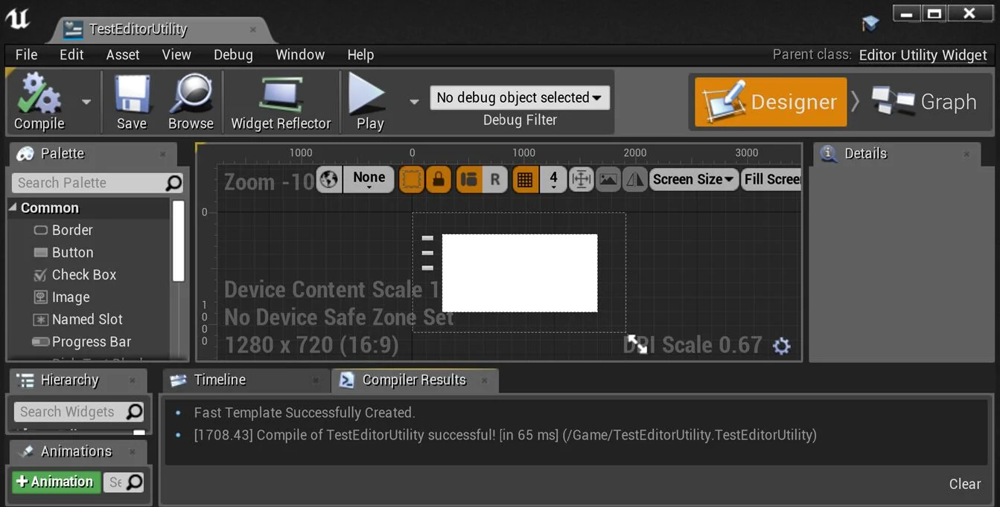

> Figura: Widget Editor Blueprint - Unreal Engine doc.

### Criando o Widget

Utilizando o `Context Menu` escolha a opção `User Interface/Widget Blueprint`.

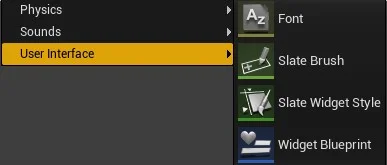

> Figura: Context Menu/ User Interface/ Widget Blueprint.

### Usando o editor de de Widget

O editor de Widget é divido em :

- `Designer` para apresentação e manipulação de elementos visualmente.

- `Graph` para inserir a lógica de ações utilizando **Blueprint**.


> Figura: Widget Designer e Graph.

### Hierarchy - Hierarquia de elementos

Os elementos apresentados na Widget seguem uma hierarquia que determina o posicionamento relativo na tela.

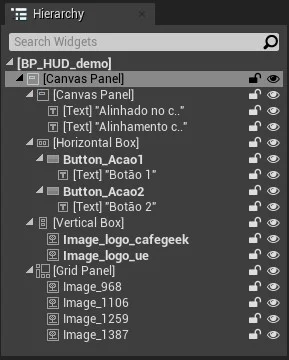  

> Figura: Widget Hierarchy.

- Observe que tem vários objetos alinhados hierarquicamente e que neste caso vão nos ajudar e organizar a tela, sendo a raiz da árvore o objeto `BP_HUD_demo`;

- Os elementos `Canvas Panel`, `Horizontal Box`, `Vertical Box Grid Panel` tem propriedades para alinhamento dos elementos hierarquicamente abaixo;

- `Grid Panel` está hierarquicamente superior ao `Image_968`, isso significa que o texto deverá ser alinhado em relação ao `Grid Panel`;

- Abaixo a apresentação dos elementos.

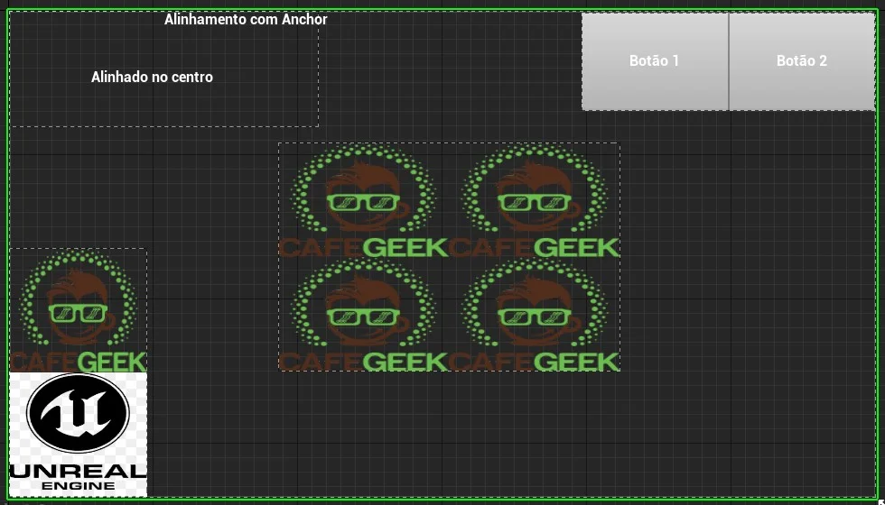

> Figura: Widget Designer.

### Entendo alinhamento utilizando Anchors

Para gerenciar melhor o posicionamento de objetos no `Widget Designer` vamos entender o objeto `Anchor` (Âncora).

- Ancorar um elemento é definir uma posição predefinida na tela.

  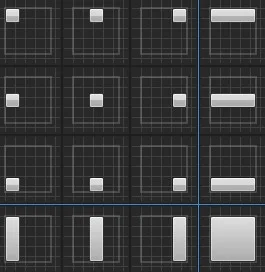

  >Figura: Widget Anchor alinhamento.

- No exemplo abaixo o elemento `Text` está posicionado na tela respeitando a âncora predefinida. A âncora pode ser alterada.  

  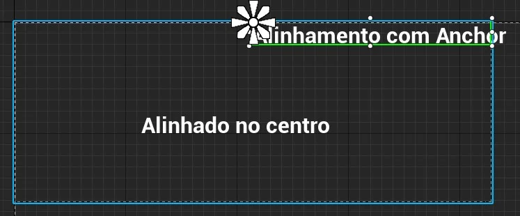

  >Figura: Widget icon Anchor.

- Observe os valores de **Position** **X** e **Y** são zero, isso nos diz que a texto esta totalmente alinhado a âncora.  

  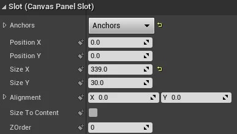

  >Figura: Widget Acnhors position UMG.

- Agora vamos dividir a âncora e alinhar o texto dentro das fronteiras da âncora.

  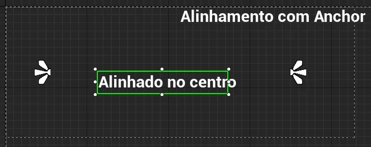

  >Figura: Widget Anchors Alinhamento separado UMG.

- Agora temos as propriedades `Offset Left` e `Right` com um valor que determina a posição do texto entre as fronteiras da âncora.

  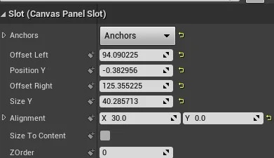

  >Figura: Widget Canvas propriedades Alinhamento.

- `Size to Content` determina que o elemento se ajustara ao tamanho do conteúdo;

- `Alignment`  permite alinhar o elemento com a `Anchors`, como por exemplo inserir os valores X = 0.5 e Y = 0.5 para centralizar o objeto com a `Anchor`.

### Horizontal ou Vertical Box

Estes elementos são utilizados para organizar os objetos Horizontal ou verticalmente. Ao adicionar elementos hierarquicamente abaixo de um `Vertical` ou `Horizontal box` eles serão organizados um ao lado do outro.

- `Horizontal box`- Alinhamento Horizontal dos elementos.  

  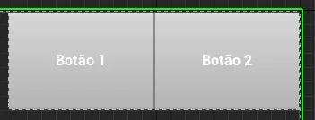

  >Figura: Widget Horizontal Box UMG.

- `Vertical box` - Alinhamento vertical dos elementos.  

  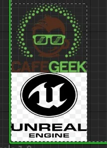

  >Figura: Widget Vertical Box UMG.

- Nas propriedades do elemento dentro do `Vertical Box` selecione `Size Fill` para preencher todo espaço do painel.  

  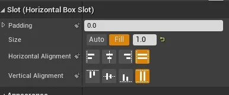

  >Figura: Widget Vertical Box Size fill UMG.

### Grid Panel

Como o nome anuncia, os elementos hierarquicamente agrupados abaixo do painel serão organizados em forma de um grid (matriz).

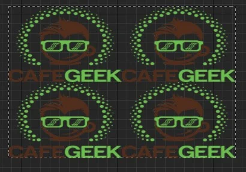

>Figura: Widget Grid Panel UMG.

- `Grid Panel` tem uma propriedade especial que determina qual o valor de preenchimento de cada coluna ou linha dentro do grid. O valor varia de 0 a 1, onde 0,5 é metade do espaço e 1 totalmente preenchido.  

  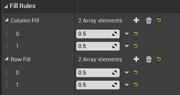

  >Figura: Widget Grid panel Column Fill UMG.

- O elemento agrupado também terá as propriedades `Row` e `Col` preenchidas sinalizando qual a posição do elemento dentro do grid.

  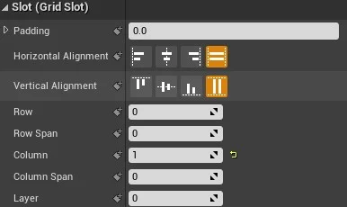

  >Figura: Widget Grid Panel Row Col UMG.
