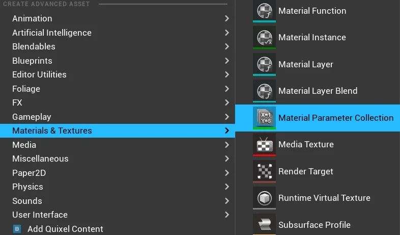
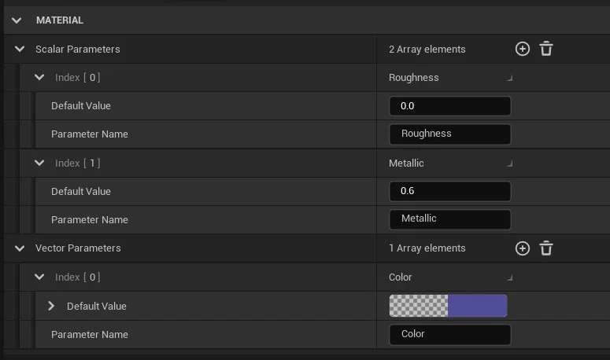
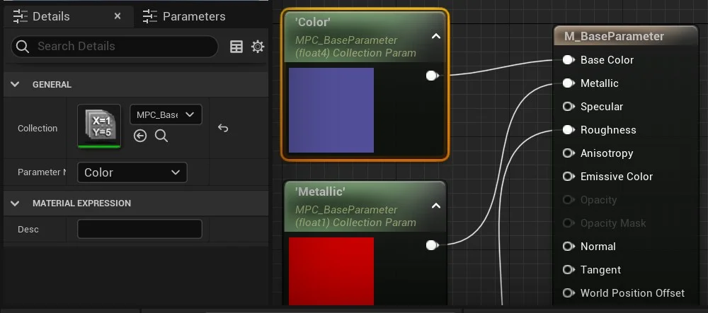
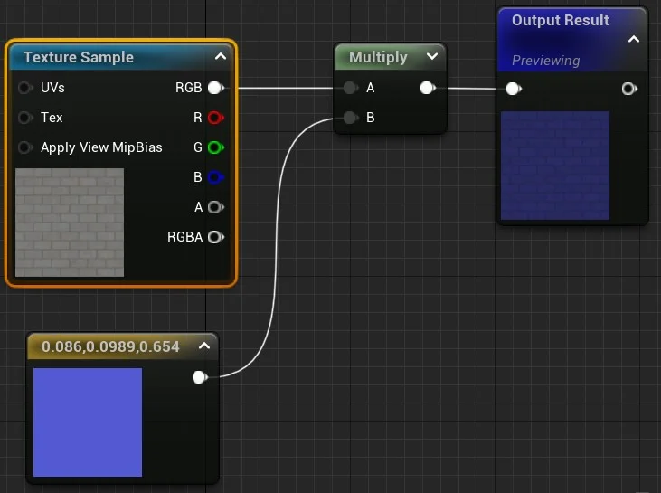
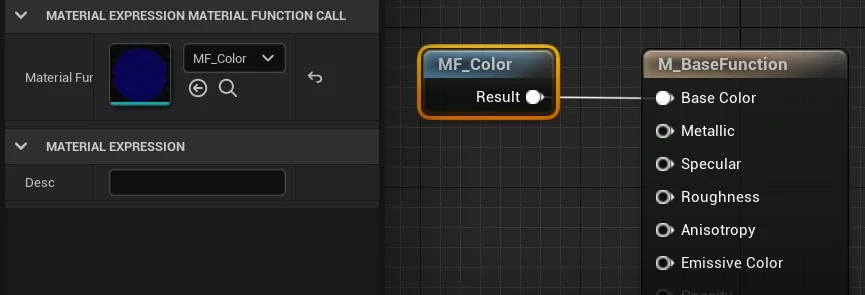
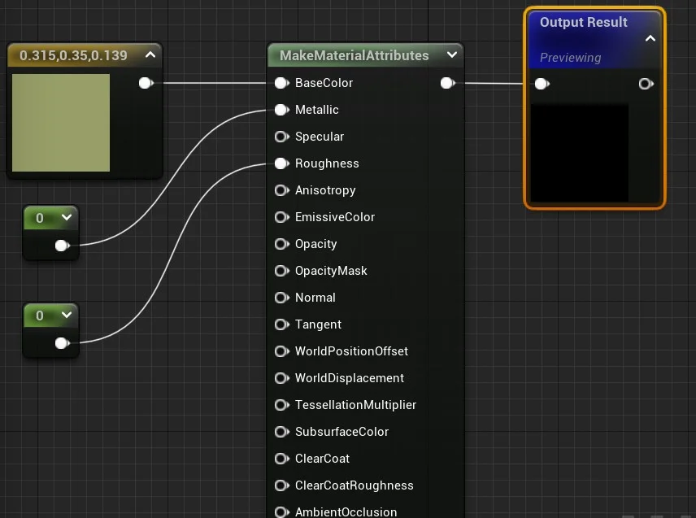
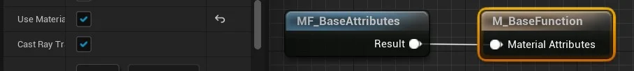
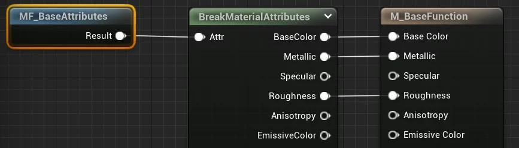

Podemos manipular os objetos do tipo material com scripts Blueprint possibilitando implementar objetos com materiais mais interativos, como por exemplo, um objeto que muda de cor ao click do mouse.

Para exemplificar utilizaremos o Level Blueprint interagindo com um objeto na cena.

Selecione um ator no `View Port` e adicione uma referência no `Open Level Blueprint` com a opção `Create a Reference to`.

<!-- <iframe title="Cafegeek - Material and Material #1 Click Objects and Change Color" src="https://blueprintue.com/render/3oeee-_g/" scrolling="no" allowfullscreen style="width:100%; height:300px;"></iframe>

>Link : <https://blueprintue.com/blueprint/3oeee-_g/>-->



O script acima muda a cor do ator ao clicar com o mouse.

### Implementando Material Instance com Blueprint

Abaixo a lógica para criar o material e a textura: `Create material instance` > `Set Texture Parameter Value`.

<!-- 

> Figura: Blueprint Material - Create material instance set.

-->



- `Create Dynamic Material Instance` - Cria um Material Instance dinâmico que pode ser modificado durante a *gameplay*;

- `Set Texture Parameter Value` - Atualiza o valor do parâmetro informado em `Parameter Name`, é do tipo textura;

- `Set Scalar Parameter Value` - Atualiza o valor escalar do parâmetro informado em `Parameter Name` com o valor `value`;

- `Set Vector Parameter Value` - Atualiza o vetor do parâmetro informado em `Parameter Name` com o valor `value`.

<iframe title="Cafegeek - Material and Blueprint #2 Create Dynanmic Material Instance and Set" src="https://blueprintue.com/render/eckgsjqu/" scrolling="no" allowfullscreen style="width:100%; height:300px;"></iframe>

>Link: <https://blueprintue.com/blueprint/eckgsjqu/>

1. No Level Blueprint implemente a lógica para chamar o Evento **MudaCorEvento**.

    

    > Figura: Blueprint Material - Open Level blueprint call event.

## Parameter Global

Podemos definir parâmetros globais para que os materiais possam referenciar parâmetros escalares e vetoriais.

> É uma ferramenta poderosa que os artistas podem usar para obter dados globais em muitos materiais de uma só vez. Ele também pode ser usado para gerar efeitos por nível, como quantidade de neve, quantidade de destruição, umidade, etc., que, de outra forma, exigiria a configuração de valores de parâmetros individuais em muitas instâncias de materiais diferentes em seu nível.

Criando parâmetros globais utilizamos a opção do menu de contexto `Materials & Textures > Material Parameter Gobal`.

> Figura: Blueprint Material - Parameter Collections.

Podemos adicionar e editar valores do tipo `Scalar` e `Vector` no objeto `Parameter Collection`.

> Figura: Blueprint Material - Editor de Parameter Collection.

No Editor de Materiais usamos a opção `Material Parameter Collection` e selecionamos o objeto criado com os parâmetros em `Collection`.

> Figura: Blueprint Material - Collection Parameter.

## Material Function

**Mateial Functions** ou Funções de material são pequenos fragmentos de códigos gráficos de material que podem ser salvos em pacotes e reutilizados em vários materiais, em outras palavras são funções de programação. Seu objetivo é agilizar o processo de criação de material, dando acesso instantâneo a redes comumente usadas de nós materiais.
São compostas basicamente por entradas de parâmetros e saída de dados.

Utilizamos o menu de Context `Material & Textures` > `Material Function` para criar as funções;

Abaixo o editor da lógica da função criada utilziando um nó  `Texture Sample` e um `Vector 3`.

> Figura: Blueprint Material Function - Output.

- Perceba que a função apresenta um nó de resultado;

- Podemos adicionar parâmetros para a função.

Chamamos a função dentro do editor de materiais usando a função `MaterialFunctionCall`.

> Figura: Bluepritn Material Function Call.

Podemos juntar vários atributos utilizando `MakeMaterialAttribute` possibilitando construir camadas ou `Layers` e utilizar no retorno da função.

> Figura: Blueprint Material - MakeMaterialAttribute.

Ao usar a nó é necessário configurar o nó resultado do material principal com `Use Material Attribute` para `True`.

> Figura: Blueprint Material - Nó resultado com Use Material Attribute true.

`BreakMaterialAttribute` é o inverso de `MakeMaterialAttribute` possibilitando a separação dos atributos recebidos por uma função.

> Figura: Blueprint Material - BreakMaterialAttribute.

### Parâmetros dentro das funções

Podemos adicionar parâmetros utilizamos o nó  `Input <Type>`.

Criamos o nó e ajustamos as propriedades do parâmetro:

- `Input Name` - Nome do parâmetro;

- `Input Type` - Lista de tipos (VectorX, Scalar, Texture);

- `Preview value` - Valores que podem ser usados como padrão;

- `Use Preview value as Default` - Usa os valores configurados como padrão.

Chamamos a função dentro de um material expression utiizando:

- F + LMB;

- LMB e digitando `Function/MaterialFunctionCall`.

Logo em seguida configuramos a propriedade `Material Function`.

### Adcionando Propriedades em uma material Function

Usamos `SetMaterialAttributes` e nas propriedades do nó selecionamos a propriedade que queremos acessar.

### Misturando atributos com outra função

Usamos `BlendMaterialAttribute` para misturar duas funções.

Exemplo 1 - Função com a cor da base.

>Figura: Material Funciton base.

Exemplo 2 - Função para utilizar na mistura.

>Figura: Material Funciton Rust base.

Exemplo 3 - Fazendo a mistura das duas funções.

>Figura: Material Funciton BlendMaterialAttribute.
