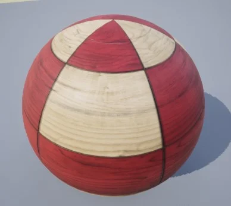
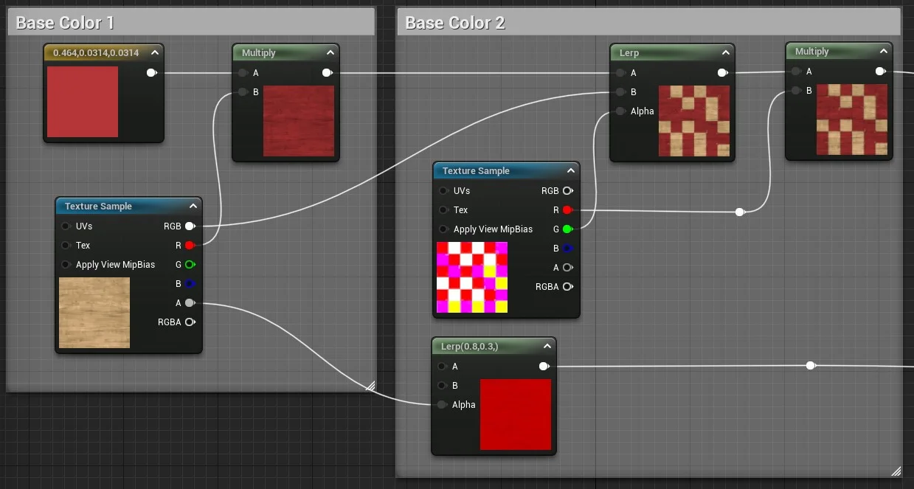
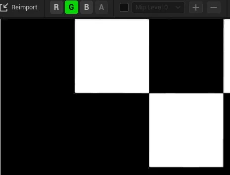
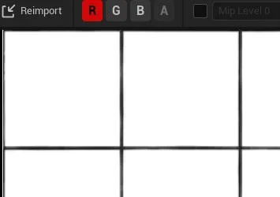
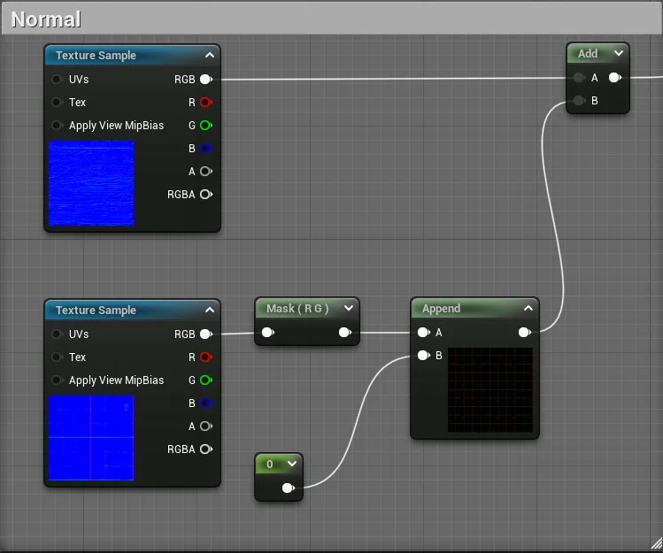
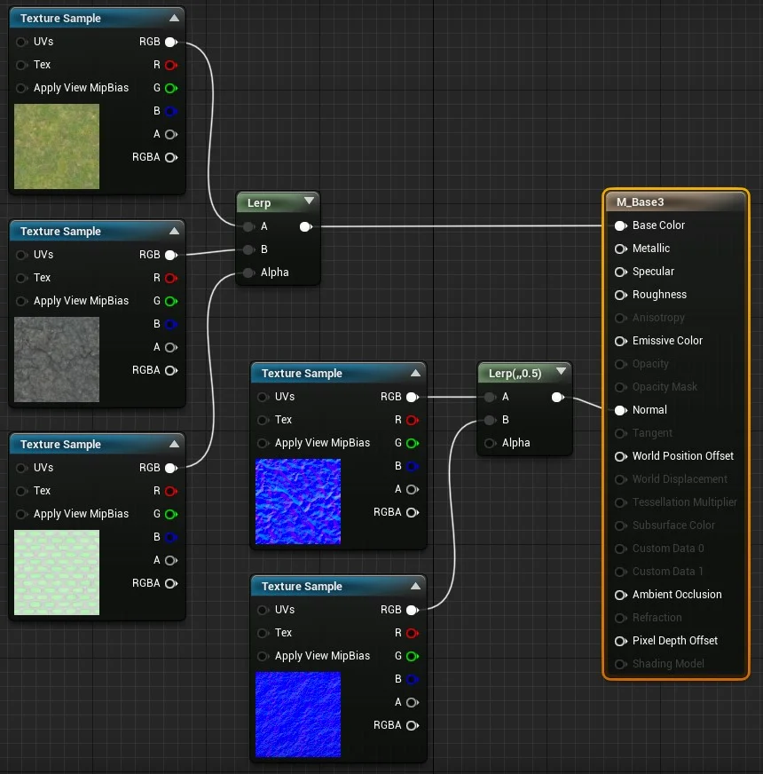
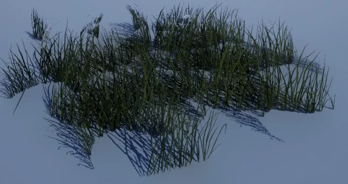
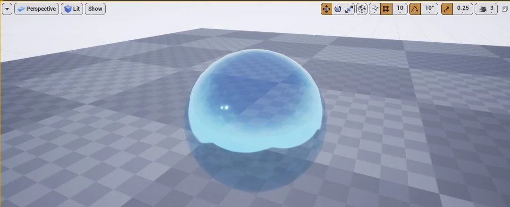

## Combinando elementos utilizando funções

Neste exemplo vamos combinar várias texturas e utilizar funções de manipulação para obter o resultado abaixo.



> Figura: Blueprint Material - Objeto com mistura de texturas.

É possível criar comentários no diagrama, abaixo lógica de construção de nós com comentários para facilitar a documentação.



> Figura: Blueprint Material - Lógica da combinação de texturas.

- `Base Color 1` - Cada pixel do canal R da textura é multiplicado pela cor.

  

  > Figura: Blueprint Material - Channel R Texture Wood Pine.

  - O valor 1 = branco e 0 = preto.

- `Base Color 2`

- `Lerp` - Recebe o resultado da multiplicação e dos canais RGB da textura para do passo anterior. No parâmetro  Alpha é informado o canal G textura.

  

  > Figura: Blueprint Material - Channel G Texture Ceramic Tile.

  Neste passo o valores 0 (branco) e 1 (preto) são multiplicados.

Exemplo de multiplicação entre vetores.

```c++
  resul =  ( Vetor3(0.0664,0.0366,0.401) * Vetor3(0,1,0) );
  // Resultado
   (0,0.0366,0)
```

- `Multiply` multiplica o canal R da textura com o resultado do Lerp.

  

  > Figura: Blueprint Material - Channel R Texture Ceramic Tile.

- `Normal Map` - Mapa normal.

  

  > Figura: Blueprint Material - Texture Normal.

- `Mask` - Filtra os canais passados como parâmetro;

- `Append` - Combina dois canais juntos para criar um vetor com mais canais que o original.

```c++
resul =  ( Mask(Vetor3(64,36,40),1,1,0));
// Resultado 2 colunas
(64, 36)
resul = append(resul, 0);
// Resultado 3 colunas
(64, 36,0)
```

- `Add` - Adiciona os valores de dois parâmetros e retorna um novo vetor, por exemplo.

```c++
resul =  Add( vetor3(1,3,4) , vetor3(2,4,1)  );
// Resultado
(3,7,5)
```

## Utilizando Panner e TextCoord

Neste exemplo será simulado o movimento da textura no objeto.


> Figura: Blueprint Material - Function Panner.

Representação da lógica.

```c++
  M_Base =  ( TexturaSample( panner(TexCoord(),0.1,0) ) * Vetor3(0.0664,0.0366,0.401));
```

- `Panner` - Produz coordenadas de textura UV que podem ser usadas para criar texturas panorâmicas ou móveis;

- `Multiply` - Pega duas entradas, multiplica-as juntas e produz o resultado.
Se você passar valores com vários canais, cada canal será multiplicado separadamente. Por exemplo, se você passar valores de cor RGB para cada entrada, o canal R da primeira entrada é multiplicado pelo canal R da segunda entrada e o resultado é armazenado no canal R da saída; o canal G da primeira entrada é multiplicado pelo canal G da segunda entrada e o resultado é armazenado no canal G da saída e assim por diante.
Ambas as entradas devem ter o mesmo número de valores, a menos que um dos valores seja um único valor flutuante. Nesse caso, cada canal da entrada multicanal é multiplicado pelo valor flutuante único e armazenado em um canal separado do valor de saída;

- `TexCoord` - Gera coordenadas de textura UV na forma de um valor vetorial de dois canais, permitindo que os materiais usem diferentes canais UV, especifiquem ladrilhos e, de outra forma, operem nos UVs de uma malha.

## Exemplo do nó Lerp

Interpola Linearmente entre A e B com base em Alfa (100% de A quando Alfa = 0 e 100% de B quando Alfa = 1)



> Figura: Blueprint Material - Exemplo de Lerp.

## World position Offset

Permite que os vértices de uma malha sejam manipulados no espaço do mundo pelo Material. Isso é útil para fazer objetos se moverem, mudarem de forma, girarem e uma variedade de outros efeitos. Isso é útil para coisas como animação ambiente.


> Figura: Blueprint Material - World Position Offset.

Os valores do nó Constant Vector 3, representam as coordenadas de posição do mundo (x,y,z) respectivamente.

Exemplo:


> Figura: Blueprint Material - World Position offset.

- `TexCoord` - U=0.15, V=0.15;

- `Panner` - Speed X =0.05, Speed Y= 0.1.

## Unlit Shading Model

Produz apenas Emissivo para cores, tornando-o perfeito para efeitos especiais como fogo ou iluminação de objetos. Observe que, neste exemplo, o Material não está projetando luz na cena. Em vez disso, seu alto valor Emissivo resulta em um efeito de brilho, que também é captado pela Máscara de Sujeira aplicada à câmera. Parece iluminar, mas nenhuma luz ou sombra será projetada por este objeto.


> Figura: Blueprint Material - Properties Unlit Shading Model.


> Figura: Material Properties blend Mode Unlit.

## Masked Blend Mode

É usado para objetos nos quais você precisa controlar seletivamente a visibilidade de forma binária (liga / desliga). Por exemplo, considere um material que simula uma cerca de arame ou grade. Você terá algumas áreas que parecem sólidas, enquanto outras são invisíveis. Esses materiais são perfeitos para o modo de `Blend Masked` .


> Figura: Blueprint Material - Properties blend mode masked.

- `Roughness` - Valor 1
- `Two Sided` - Valor `True`



> Figura: Blueprint Material - Properties blend mode masked result.

## Translucent Blend Mode

É usado para objetos que requerem alguma forma de transparência.

  

> Figura: Blueprint Material - Properties blend mode Translucent.

- `Material Domain` - Surface;

- `Blend Mode` - Translucent;

- `Lighting Mode` - Surface TranslucencyVolume.

Resultado.



> Figura: Blueprint Material - Properties blend mode Translucent.
