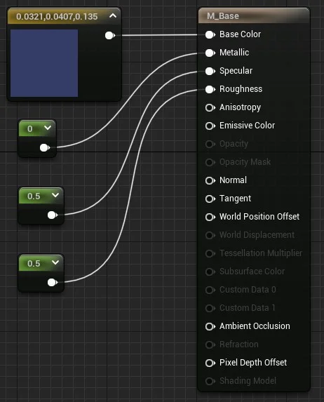
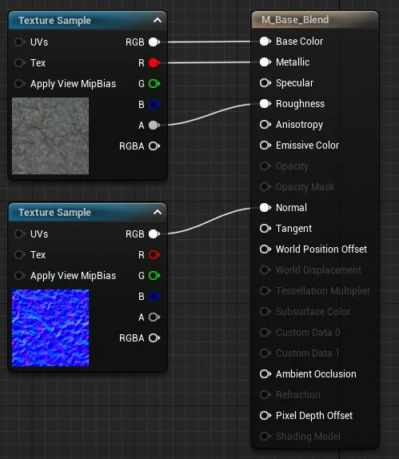
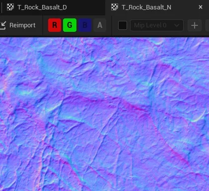
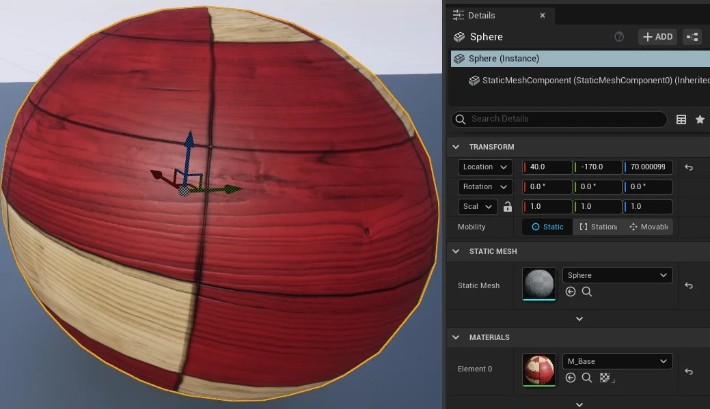

## O que é um material?

Podemos definir como uma coleção de imagens e instruções computacionais que são adicionadas a superfícies poligonais. Contudo materiais não são somente cores mas representação de imperfeições da superfície a qual foram aplicadas, como por exemplo, rasuras, aspereza e transparência.

> Figura: Material - Unreal Engine.

No exemplo acima podemos verificar uma esfera com diferentes tipos de materiais adicionados na sua superfície, onde cada um interage de forma diferente a iluminação.

## Materiais de base física - PBR

PBR *Physically Based Rendering* significa que o material descreve as propriedades visuais de uma superfície de uma maneira realmente plausível, de modo que os resultados realistas sejam possíveis em todas as condições de iluminação.

> Figura: Material PBR - <https://www.pikpng.com>.

## Estrutura do Material no Unreal Engine

A primeira e mais importante coisa a saber sobre os Materiais é que eles não são construídos por meio de código, mas por meio de uma rede de nós de script visual (chamados de Expressões de Material) dentro do Editor de Material. Cada nó contém um fragmento de código HLSL, designado para executar uma tarefa específica.

### Criando um material

Para criar um material utilizamos o menu de contexto e a opção `Material`.

1. Utilize Menu de contexto para criar um material;

    

    > Figura: Contex Menu > Material.
2. Salve o material como `M_Base`

### Editor de Materiais

> Figura: Editor Material, Unreal Engine 4.26.

1. Editor de materiais;

1. Barra de acesso rápido;

1. Pré-visualização do material;

1. Propriedades do nó selecionado;

1. Editor de lógica de nós;

1. Lista de funções ou nós disponíveis.

## O que são Material expressions?

Os nós de Expressão de Material ou Material Expression contêm pequenos fragmentos de código HLSL que realizam tarefas muito específicas dentro de um Material. Os materiais são construídos usando combinações de nós de Expressão de Material que são combinados para realizar certas tarefas.

Conectando Material Expressions, abaixo um exemplo de conexão.

> Figura: Blueprint Material - Exemplo de connection.

- Botão direito do mouse em qualquer área de trabalho (RMB) abre a lista de nós disponíveis;

- É possível fazer a busca de nós na aba `Palette` e arrastar com o mouse na área de trabalho.

Combinando `Material Expressions`, a área de trabalho é um modelo de programação visual que permite combinar variáveis e funções para construir a estrutura final. Cada nó apresenta uma saída para o próximo nó.

> **Atenção** - Devemos considerar o tipo de valor de retorno do nó no momento da conexão para evitar erros de tipos conflitantes, por exemplo float3 * float2.

## O Nó principal ou Node Result

O nó principal do material é responsável por exibir os resultados de todos os nós da *Expressão de Material* que são inseridos nele nas várias entradas. Cada entrada no nó Material Principal tem um efeito exclusivo sobre a aparência e o desempenho do Material.

Abaixo o nó principal e suas principais entradas.

> Figura: Blueprint Material - Nó principal ou Node Result.

- `Base Color`
  A Cor Base define a cor geral do Material, obtendo um valor Vector3 (RGB) em que cada canal é automaticamente fixado entre 0 e 1.

- `Normal maps`
  A entrada Normal leva em um mapa normal, que é usado para fornecer detalhes físicos significativos para a superfície, perturbando o "normal", ou direção de frente, de cada pixel individual.

- `Emissive`
  Dá aos artistas uma maneira muito barata e eficaz de dar a ilusão de que um Material está lançando luz quando na verdade não está. Os materiais emissivos fazem isso permitindo que o artista empurre os valores da entrada emissiva acima de 1,0, o que empurrará o material para a faixa HDR, emitindo um efeito Bloom que você pode ver ao olhar para uma fonte de luz muito brilhante.

## Propriedades do nó principal

Nem todas as entradas serão úteis para cada tipo de material que você criar. Por exemplo, ao desenvolver uma Função de Luz - um Material que é aplicado a uma luz - você só pode usar a entrada Cor Emissiva no material e nada mais, visto que outras entradas, como Metálico ou Aspereza, não seriam aplicáveis. Por isso, é importante saber que tipo de material você está criando antes de começar a se preocupar muito com as entradas. As três propriedades de controle primárias são:

### Blend Mode

Controla como o seu material se mesclará com os pixels por trás dele.

"Os modos de mesclagem descrevem como a saída do material atual se mesclará com o que já está sendo desenhado no fundo. Em termos mais técnicos, ele permite que você controle como o mecanismo combinará este Material (cor de origem) com o que já está no buffer de quadros (cor de destino) quando renderizado."

- `BLEND_Opaque` - Cor final = cor de origem. Isso significa que o material será desenhado na parte superior do fundo. Este modo de mesclagem é compatível com iluminação.

  

  >Figura: [Material Blen Modes - Opaque](https://docs.unrealengine.com/4.27/en-US/RenderingAndGraphics/Materials/MaterialProperties/BlendModes/)

- `BLEND_Masked` -  Cor final = cor de origem se `OpacityMask` > `OpacityMaskClipValue`, caso contrário, o pixel é descartado. Este modo de mesclagem é compatível com iluminação.

  

  

  >Figura: [Material Blen Modes - Masked](https://docs.unrealengine.com/4.27/en-US/RenderingAndGraphics/Materials/MaterialProperties/BlendModes/)

- `BLEND_Translucent` - Cor final = opacidade da cor de origem + cor de destino (1 - opacidade). Este modo de mistura NÃO é compatível com  iluminação dinâmica.

  

  

  >Figura: [Material Blen Modes - Translucent](https://docs.unrealengine.com/4.27/en-US/RenderingAndGraphics/Materials/MaterialProperties/BlendModes/)

- `BLEND_Additive` - Cor final = cor de origem + cor de destino. Este modo de mistura NÃO é compatível com iluminação dinâmica.

  

  

  >Figura: [Material Blen Modes - Additive](https://docs.unrealengine.com/4.27/en-US/RenderingAndGraphics/Materials/MaterialProperties/BlendModes/)

- `BLEND_Modulate` - Cor final = cor de origem x cor de destino. Este modo de mistura NÃO é compatível com iluminação dinâmica ou neblina, a menos que seja um material de decalque.
 
  

  

  >Figura: [Material Blen Modes - Modulate](https://docs.unrealengine.com/4.27/en-US/RenderingAndGraphics/Materials/MaterialProperties/BlendModes/)

### Shading Model

Define como a luz é calculada para a superfície do material.

>Figura: [Shading Models](https://docs.unrealengine.com/4.27/en-US/RenderingAndGraphics/Materials/MaterialProperties/LightingModels/)

### Material Domain

Controla como o material deve ser usado, por exemplo, se ele deve fazer parte de uma superfície, uma função leve ou um material pós-processamento.

> Esta configuração permite designar como este material será usado. Certos usos de materiais (como decalques) requerem instruções adicionais para o mecanismo de renderização considerar. Por isso, é importante designar o Material como sendo usado para esses casos

- `Surface` - Esta configuração define o Material como algo que será usado na superfície de um objeto; pense em metal, plástico, pele ou qualquer superfície física. Como tal, esta é a configuração que você usará na maioria das vezes;

- `Deferred Decal` -  Ao fazer um [Material de Decalque ou Decal Material](https://docs.unrealengine.com/4.26/en-US/Basics/Actors/DecalActor/), você usará esta configuração;

- `Light Function` - Usado ao criar um material para uso com uma função de luz;

- `Volume` - Usado ao descrever os atributos do material como um volume 3D;

- `Post-process` - Usado se o material for usado como um [Material de pós-processamento](https://docs.unrealengine.com/4.26/en-US/RenderingAndGraphics/PostProcessEffects/PostProcessMaterials/);

- `User Interface` - Usado quando este material é usado para interfaces de usuário UMG ou Slate;

- `Virtual Texture` - Usado ao fazer uma textura virtual em tempo de execução;

> Figura: Blueprint Material- Type input.

## Valores que determinam a física

Existem variáveis ou nós específicos para determinar uma propriedade física do material, por exemplo um valor `float` com valores entre 0 e 1 que expressam a escala de tonalidades de cor, sombra e pedaços (pixels) de uma área.

- Constant 1 ou valor escalar- Valor único.

   para implementar o nó.")

  > Figura: Blueprint Material - Constant 1 - (Clicando 1 + RMB) para implementar o nó.

- Constant 2 - Vetor de dois valores.

   para implementar o nó.")

  > Figura: Blueprint Material - Constant 2 - (Clicando 2 + RMB) para implementar o nó.

- Constant 3 - Vetor de três valores.

   para implementar o nó.")

  > Figura: Blueprint Material - Constant 3 - (Clicando 3 + RMB) para implementar o nó.

## Texture samples

Texturas são imagens que são usadas em materiais e são representadas pelo nó abaixo.  

.")

> Figura: Blueprint Material texture - (Clicando T + RMB).

Considerações sobre texturas no **Unreal Engine**.

Tamanhos :

- 1x1, 2x2, 4x4, 1024x1024 e 8192x8192
- As texturas serão importadas em qualquer tamanho, mas não serão mipmaps.

A seguir vamos abordar as características das texturas no **Unreal Engine**.

> Figura: Blueprint Material - Base texture.

### Roughness - rugosidade

`Roughness` (Aspereza e também chamada de brilho ou dispersão da micro-superfície) é um mapa semi-autoexplicativo. Eles definem como a luz é espalhada pela superfície do seu modelo.
Isso começa com um valor de zero, onde seu modelo não dispersará a luz, tornando os reflexos e a iluminação muito mais nítidos e brilhantes em seu material.
Por outro lado, se você aumentar a rugosidade ao máximo, a luz se espalhará mais pelo material. Isso faz com que a iluminação e os reflexos se espalhem pelo modelo, mas pareçam muito mais escuros.

Para exemplificar utilizaremos o canal A (Alpha) da textura `Rock Basalt`.

> Figura: Blueprint Material - Texture Roughness - Esses mapas são em tons de cinza, com o branco sendo a aspereza máxima e o preto sendo uma superfície lisa e brilhante.

### Normal - Coordenadas normals

Usado para simular a maneira como a luz interage com a superfície do material para simular saliências e amassados menores.
É importante observar que um mapa normal não mudará sua geometria base (consulte os mapas de altura posteriormente neste artigo).

> Figura: Blueprint Material - Texture Normal.

A cor base de um mapa normal é roxo claro, esta é a “parte inferior” do mapa normal que representa a superfície de sua malha poligonal. A partir daí, os valores RGB são usados para produzir rachaduras, saliências ou poros em seu modelo. Os valores R, G e B são iguais às coordenadas X, Y e Z em sua malha base.

### Metallic - Metálica

É usado para definir se o seu material (ou parte dele) é metal puro.
Os mapas de metal também são em tons de cinza, mas a prática recomendada é usar apenas os valores de branco e preto e fazer as variações entre o uso de seus mapas de rugosidade.

Para exemplificar utilizaremos o canal R (Red) da textura *Rock Basalt*.

> Figura: Blueprint Material - Texture Metallic.

Preto no mapa de *metalidade* significa que parte do mapa usará o mapa de albedo como a cor difusa (a cor que a textura mostra quando é atingida pela luz).
Em vez disso, o branco usará a cor albedo para definir a cor e o brilho de seus reflexos e definirá a cor difusa dos materiais como preto. A cor difusa não é mais necessária neste caso porque todas as cores e detalhes daquela parte do material agora virão dos reflexos, tornando-o preto.

## Aplicando o material no objeto

Para aplicar o material em um objeto podemos selecionar o objeto e atualizamos a propriedade `MATERIALS` selecionando o material criando anteriormente.

> Figura: Blueprint Material -  Applying Material.
