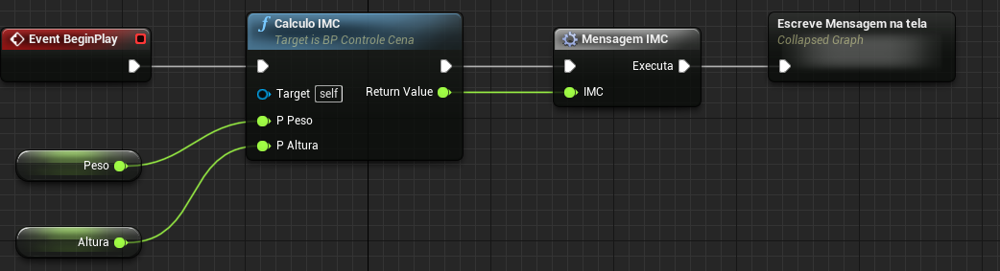

#  Módulos

### Eventos, funções e macros

## Conceito de Módulos

# Eventos
->Java,C++, C#

# Funções (**functions**)
- Pedaços de código que returnar algum valor
para o programa que executou a chamada.
- São mini programas com as características de alocação de memória, estruturas internas de código e variáveis locais.
- Podem receber parâmetros externos.  
- Funções não suporte o nó **Delay**.
- Funções podem ter ser replicadas
em jogos multiplayer.

Exemplo:  
**C++**   
```c
// Função com parâmetros
void CalculoIMC(float pPeso, float pAltura) {
  // Variável local
  float resultado;
  resultado =  (pAltura * pAltura) / pPeso;
  return = resultado
}  
```
**Blueprint**   


## Macros
- São essencialmente código colapsado.
- São basicamente um modelo *Template* de código ou nós.
- Suportam o nó **Delay**.
- Não podem ser replicados em jogos multiplayer.

Exemplo:  
**C++**
```cpp
  #define MIN(a,b) (((a)<(b)) ? a : b)

  std::cout << "The minimum is " << MIN(42, 8) << endl;
```

**Blueprint**


## Difenças entre macros e funções
|Macro  |Função  |
|:-:|-|
|  |  |
|  |  |
|  |  |

## Executando a função e a macros  

# Evento


### Referências

[Best Practices](https://docs.unrealengine.com/en-US/Engine/Blueprints/BestPractices/index.html)
