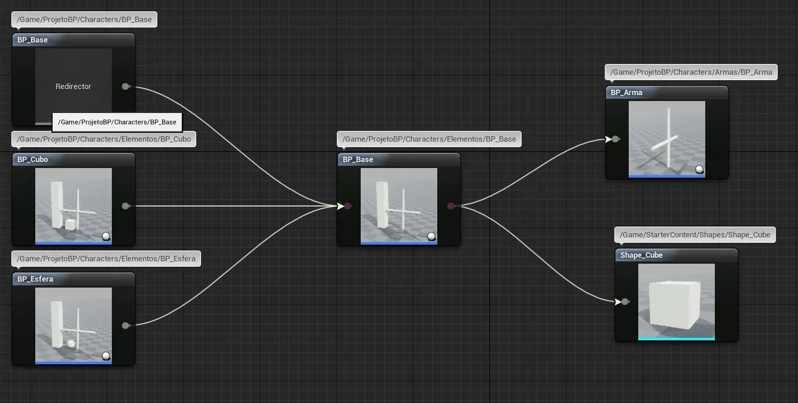

***

<a name="7"></a>
## CAPÍTULO 7 - Atores e movimentação

Um ator é qualquer objeto que pode ser colocado em um nível, é uma classe de básica de objetos do **Unreal Engine**, neste capitulo serão apresentados e implementados os atores *Actors* do seu projeto.

&nbsp;&nbsp;[**7.1 O que são Atores?**](#7.1)

&nbsp;&nbsp;&nbsp;&nbsp;&nbsp;&nbsp;[7.1.1 Utilizando classes com Blueprint ](#7.1.1)

&nbsp;&nbsp;&nbsp;&nbsp;&nbsp;&nbsp;[7.1.2 Componentes e Actors](#7.1.2)

&nbsp;&nbsp;&nbsp;&nbsp;&nbsp;&nbsp;[7.1.3 Static Mesh - Malhas estáticas](#7.1.3)

&nbsp;&nbsp;&nbsp;&nbsp;&nbsp;&nbsp;[7.1.4 Skeletal Mesh - Malha Esquelética](#7.1.4)

&nbsp;&nbsp;&nbsp;&nbsp;&nbsp;&nbsp;[7.1.5 Posição e coordenadas](#7.1.5)

&nbsp;&nbsp;&nbsp;&nbsp;&nbsp;&nbsp;[7.1.6 Trabalhando com herança com Blueprint](#7.1.6)

&nbsp;&nbsp;&nbsp;&nbsp;&nbsp;&nbsp;[7.1.7 Manipulando Actors](#7.1.7)

&nbsp;&nbsp;&nbsp;&nbsp;&nbsp;&nbsp;[7.1.8 Colisões](#7.1.8)

<a name="7.1"></a>
## 7.1 O que são Actors?
**Actors** ou Atores são uma classe genérica que oferece suporte a transformações 3D, como translação, rotação e escala. Atores podem ser criados (gerados) e destruídos por meio de código de jogo (**C++**  ou **Blueprints**). Em **C ++**, **AActor** é a classe base de todos os atores.  
É composto por Atributos, componentes, eventos e permitem Herança.
Para entender melhor devemos conceituar e entender o que são classes.

**O que são Classes?**

Classes são estruturas de dados que constituem a programação orientada a objetos. Contém seus próprios membros de dados e funções e podem ser acessados e usados criando uma instância de classe.    
Classes determinam como os objetos serão quando criados.   
Um objeto é uma instância de uma classe. Quando uma classe é definida, nenhuma memória é alocada, mas quando ela é instanciada (ou seja, um objeto é criado), a memória é alocada.   

Abaixo vamos apresentar a estrutura hierarquia de classes.

```bash
|-- UObject C++
    |-- Actor C++
    |   |-- Pawn
    |   |   |-- Character
    |   |-- GameMode
    |   |-- GameController
    |   |   |-- PlayerController
    |   |   |-- IAController
|-- UObject C++
    |-- Actor BP
    |   |-- Pawn BP
    |   |   |-- Character BP
    |-- GameController BP
```

Abaixo podemos exemplificar a implementação utilizando **C++**.

**C++**  

```cpp
class MyClass
{
    int MyInt;

    void MyFunction()
    {
        // do stuff
    }
};
```
**Blueprint.**   

Em **Blueprint** podemos obter os seguintes grupos de classes de atores:

- Actor;

- Pawn ;

- Character;


<a name="7.1.1"></a>
### 7.1.1 Utilizando classes com Blueprint
Como citado anteriormente classes são estruturas de dados com eventos, variáveis e componentes.      

Para criar uma classe utilizando **Blueprint** acesse o menu de contexto e selecione `Blueprint Class`.


> Figura: Pick Parent Class.

**Classe Actor.**

A classe **Actor** compreende objetos básicos que podem ser adicionados a o mundo.  

  

> Figura: Class Actor Details.

- `Parent Class` : Classe pai de Actor (Classe **C++**).

**Classe Pawn.**

A classe **Pawn** ou peão é a classe base de todos os atores que podem ser controlados por jogadores ou IA. Um peão é a representação física de um jogador ou entidade de IA dentro do mundo. Isso não significa apenas que o peão determina a aparência visual do jogador ou entidade de IA, mas também como ele interage com o mundo em termos de colisões e outros aspectos físicos

>Isso pode ser confuso em certas circunstâncias, pois alguns tipos de jogos podem não ter uma malha de jogador ou avatar visível dentro do jogo. Independentemente disso, o peão, *pawn*, ainda representa a localização física, rotação, etc. de um jogador ou entidade dentro do jogo. Um personagem é um tipo especial de peão que tem a capacidade de andar.  

`Default Pawn`  

Enquanto a classe *Pawn* fornece apenas o essencial para a criação de uma representação física de um jogador ou entidade de IA no mundo, a subclasse `DefaultPawn` vem com alguns componentes e funcionalidades adicionais.

A classe `DefaultPawn` contém um componente `DefaultPawnMovementComponent` nativo, um `CollisionComponent` esférico e um `StaticMeshComponent`.   

Para controlar o `DefaultPawnMovementComponent`, bem como a câmera, uma propriedade do tipo *Booleano* para adicionar ligações de movimento padrão também está presente na classe `DefaultPawn` e é definido como verdadeiro por padrão.

`Spectator Pawn`  

A classe `SpectatorPawn` é uma subclasse de `DefaultPawn`. Por meio de um **GameMode**, diferentes classes podem ser especificadas como padrões para *Pawn* e `SpectatorPawn`, e esta classe fornece uma estrutura simples ideal para a funcionalidade de espectador.

As Classes tem propriedades que definem a estrutura do objeto.     


> Figura: Details Class e estrutura.

- `Start with Tick Enabled` - Habilita o evento Tick na lógica. Pode ser desabilitado para ganhar performance;

- `Use Controller Rotation Pitch/Yaw` - Pode usar movimentação dos controladores;

- `Auto Possess Player/AI` - Faz com o **PlayerController** possua automaticamente o peão (*Pawn*);

- `Replication` : Opções para replicar o objeto pela rede.      

- `Can be Damaged` : Habilita os eventos de dano do objeto.

    

  > Figura: Propriedade Collision.  

**Classe Character.**

Um personagem é um *Pawn* que tem algumas funcionalidades básicas de movimento bípede por padrão.  
Com a adição de um componente `CharacterMovementComponent`, um `CapsuleComponent` e um `SkeletalMeshComponent`, a classe *Pawn* é estendida para a classe *Character* com muitos recursos. Um personagem é projetado para uma representação do jogador orientada verticalmente que pode andar, correr, pular, voar e nadar pelo mundo. Esta classe também contém implementações de rede básica e modelos de entrada.   


> Figura: Classe Character Details.

- `Animation Mode` - Habilita uma animação simples ou um **Blueprint** de animação ao objeto;

- `Anim Class` - Blueprint de animação associado.

<a name="7.1.2"></a>
### 7.1.2 Componentes e Actors
Os componentes são um tipo especial de objeto que os atores podem anexar a si próprios como subobjetos. Os componentes são úteis para compartilhar comportamentos comuns, como a capacidade de exibir uma representação visual e reproduzir sons. Eles também podem representar conceitos específicos do projeto, como a maneira como um veículo interpreta a entrada e muda sua própria velocidade e orientação. Por exemplo, um projeto com carros, aeronaves e barcos controláveis pelo usuário pode implementar as diferenças no controle e movimento do veículo, alterando qual componente um ator do veículo usa.    

**Adicionando componentes.**

Na aba `Components`s podemos adicionar componentes para os objetos de forma hierarquia.    

  

> Figura: Blueprint Add Component.

Exemplo de Componentes que podemos adicionar a classe s:  

- `Actor Child` - Componente associa outro ator a classe principal.

- `Static Mesh` - Adiciona um objeto de 3D;

- `Box Collsion` - Adiciona uma caixa de colisão;

Para editar os componentes utilizamos o Editor de objetos e componentes.

  

> Figura: Editando componentes.

<a name="7.1.3"></a>
### 7.1.3 Static Mesh - Malhas estáticas
**Static Mesh** são a unidade básica usada para criar a geometria do mundo para níveis (*level*) criados no **Unreal Engine**. A grande maioria de qualquer mapa em um jogo feito com **Unreal** consistirá em Malhas Estáticas, geralmente na forma de Atores de Malha Estática.

Consistem em um conjunto de polígonos que podem ser armazenados em cache na memória de vídeo e renderizados pela placa de vídeo. Isso permite que eles sejam renderizados com eficiência, o que significa que podem ser muito mais complexos do que outros tipos de geometria, como **Brushes**. Como são armazenados em cache na memória de vídeo, as malhas estáticas podem ser traduzidas, giradas e dimensionadas, mas não podem ter seus vértices animados de nenhuma forma.


> Figura: Statis Mesh ViewPort.  

**Componente StaticMesh.**

A aba `Components` apresenta uma lista hierarquia com os componentes associados ao objeto.      

  

> Figura: Componentes hierarquia.

**Propriedades do componente Static Mesh.**

  

> Figura: Propriedades do componente.

- `Transform` - Propriedades de localização do componente;

- `Static Mesh` - Malha associada ao componente;

- `Material` - Material associado a malha;

- `Simulate Physcis` - Habilita a simulação de física do objeto.

**Editor de StaticMesh.**

Visualização da malha e suas propriedades (vértices, UV e modelo de colisão).     


> Figura: Editor de StaticMesh.

<a name="7.1.4"></a>
### 7.1.4 Skeletal Mesh - Malha Esquelética
As **Skeletal mesh** são compostas por duas partes: Um conjunto de polígonos compostos para formar a superfície da Malha Esquelética e um conjunto hierárquico de ossos interconectados que podem ser usados para animar os vértices dos polígonos. **Skeletal mesh** são frequentemente usados no **Unreal Engine 4** para representar personagens ou outros objetos animados.

**A Estrutura.**

A baixo uma representação da hierarquia do Skeletal Mesh.

```bash
|-- Ator
    |-- Skeletal mesh
    |   |-- Mesh
    |   |-- Animation
    |   |-- Skeleton
    |   |-- Blueprint
    |   |-- Physics
    |-- Animation mode
    |   |-- Use Animation Bluprint
    |-- Anim Class
    |   |-- ThirdPerson_AnimBP_C
```

- `Mesh` - Malha do elemento;

- `Animation` - Animações associadas ao esqueleto;

- `Skeleton` - Estrutura de coordenadas alinhadas para marcar os ossos dos elementos;

- `Bluprint` - Lógica para sequenciamento de animações;

- `Physics` - Estrutura para gerenciamento da física da estruturas.

**Componentes Mesh.**

  

> Figura: Bluprint Component Mesh.

- `Mesh` - Malha Esquelética;
- `CameraBoom` - Objeto do tipo `SpringArm` (Braço) para controlar a câmera;
- `FollowCamera` - Objeto do tipo `Camera`;
- `CharacterMovement` - Componente responsável pela lógica de movimentos do objeto.

**Detalhes do componente Mesh.**

  

> Figura: Detalhes do componente Mesh.

**O Editor Skeletal Mesh.**


> Figura: Editor Skeletal Mesh.

Observe que o editor é divido em :

- `Skeleton` - Estrutura de conexões representando os ossos;

- `Mesh` - Malha o objeto;

- `Animation` - Sequencia de animações que determina os movimentos do objeto;

- `Blueprint` - Lógica de programação para sequenciamento de animações;

- `Physcis` - Estruturas para representar a física do esqueleto.

<a name="7.1.5"></a>
## 7.1.5 Posição e coordenadas
Os objetos adicionados em uma cena possuem coordenadas de localização dentro do 'mundo', vamos apresentar como manipular coordenadas.    

**Apresentando as coordenadas no ViewPort.**    


> Figura: Coordenadas no ViewPort.

**Transform.**

A seção **Transform** do painel Detalhes permite que você visualize e edite as transformações - Localização, Rotação e Escala - do (s) ator (es) selecionado (s). Além disso, quando aplicável, também contém as configurações para Mobilidade do Ator.   

  

> Figura: Transform - Coordenadas de posicionamento.

**Escrevendo na tela o posicionamento do ator no mundo.**


> Figura: Bluprint Print Location.

- `GetActorLocation` - Retorna um vetor contendo as coordenadas X,Y e Z da posição do ator no mundo. Utiliza o componente `RootComponent` para determinar os valores;

- `GetwordLocarion` - Retorna um vetor de coordenadas da posição do componente no mundo.

**Posição relativa no mundo.**

Os elementos associados a um ator, como por exemplo `StaticMeshes` tem posições relativas ao objeto ao qual estão associados.  

Considere o exemplo abaixo do objeto **BP_Ator**:

```bash
|-- BP_Ator
    |-- DefaultSceneRoot
    |   |-- StaticMesh
```
O objeto possui um componente `DefaultSceneRoot`.    


> Figura: DefaultSceneRoot.

A posição do ator no mundo é calculada utilizando o componente `DefaultSceneRoot` do tipo `Scene`. O componente `StaticMesh` tem um vetor de coordenadas relativas ao objeto de hierarquia superior, sendo X=0,Y=0 e Z=0.

**Escrevendo na tela o posição relativa do componente.**


> Figura: Blueprint - Print Relative location.

<a name="7.1.6"></a>
## 7.1.6 Trabalhando com herança com Blueprint

Como apresentado no conceito de classes, a herança permite usar classes já definidas para derivar novas classes, a seguir vamos verificar como implementar utlizando **Blueprint**.  

Exemplo:  
```bash
|-- Character
    |-- BeginPlay()
    |-- Humanos
    |   |-- Vida (float) = 100    
    |   |-- Dano (float) = 100        
    |   |-- BeginPlay() (herdado)
    |   |-- Heroi
    |   |   |-- Vida = 100 (herdado)
    |   |   |-- Dano = 50 (herdado)
    |   |-- Vilao
    |   |   |-- Vida = 100 (herdado)
    |   |   |-- Dano = 80 (herdado)    
```    
**Componente *ChildActor* implementa a ligação com outro ator.**

O componente **ChildActor** permite associar uma classe filha utilizando a lista de componentes.

  

> Figura: Blueprint - ChildActor.  

- `ChildActor` - É necessário informar a classe filho neste componente.

**Herança de propriedades e métodos.**

É possível sobrescrever os métodos da classe pai para adicionar uma nova lógica, vamos aos passos.    

1. Criando um evento para sobrescrever o evento `Begin Play`.   

  

  > Figura: Blueprint  - Functions Override.

1. Lógica adicionada no novo evento.    

  

  > Figura: Blueprint - Herança do evento Begin Play.

**Referências de atores e componentes.**



> Figura: Blueprint - View Class.

<a name="7.1.7"></a>
## 7.1.7 Manipulando Actors
Podemos adicionar, remover ou selecionar os atores que estão na cena do jogo, a seguir vamos implementar e entender esses comandos.

**Spawn e Destroy Actors - Criando e destruindo um Actor.**

O processo de criação de uma nova instância de um ator é conhecido como *spawning*. A geração de atores é realizada usando a função `SpawnActor`. Esta função cria uma nova instância de uma classe especificada e retorna um ponteiro para o Actor recém-criado. `SpawnActor` só pode ser usado para criar instâncias de classes que herdam da classe Actor em sua hierarquia.    

  

> Figura: Blueprint - Exemplo de SpawnActor e DestroyActor.

Utilizando o `Level Bluprint` podemos implementar o código acima.

1. Ao pressionar a tecla **H** o ator e criado na cena utilizando as coordenadas de um componente `targetPoint` adicionando na cena;

1. O comando `flip/flop` é utilizado para intercalar entre criar e destruir o ator, com os métodos `SpawnActor` e `DestroyActor` respectivamente;

1. Usamos `IsValid` para verificar se o ator existe na cena.

**Listando Actors por classe.**

Utilizando a função `GetAllActorOfClass` e o loop `For Each Loop` podemos listar todos os atores na cena.


> Figura: Blueprint - Exemplo de GetAllActorOfClass.

**Listando Actors utilizando *tag* (etiquetas)**

Adicionando uma *tag* (Etiqueta) na propriedade do ator podemos selecionar todos na cena que tenham a referida *tag*.


> Figura: Blueprint - Exemplo de GetAllActorWithTag.

<a name="7.1.8"></a>
## 7.1.8 Colisões

- Simplex collision

- Complex collision  
