Em este capitulo iremos implementar animações em duas dimensões utilizando o plugin Paper2D.

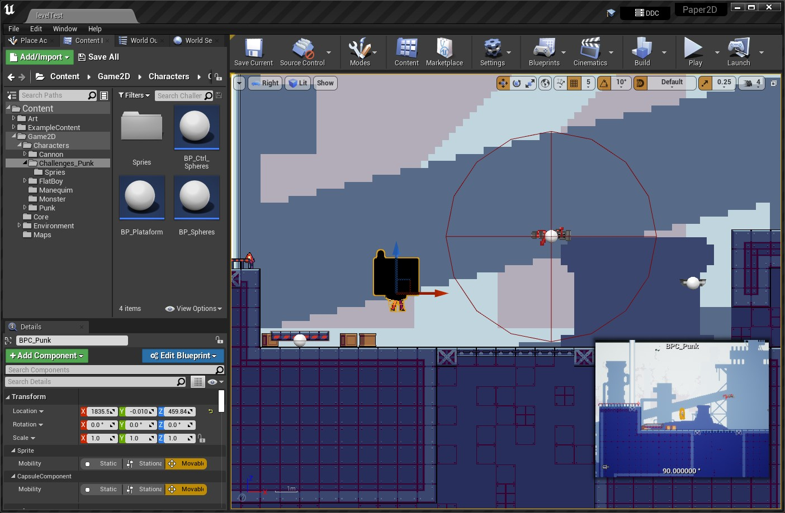

## Índice
1. [O que é Animação 2D?](#1)
1. [Como o Unreal Engine trabalha com animação 2D?](#2)
1. [Habilitando o plugin Paper2d](#3)
1. [Preparando o ViewPort](#4)
1. [Preparado os Sprites do projeto](#5)
    1. [Preparando as texturas](#5.1)
    1. [Criando sprites](#5.2)
1. [Agrupando sprites em Tile Sets](#6)
1. [Implementando uma cena utilizando Tile Map](#7)
1. [Criando sequencias de animação utilizando Flipbooks](#8)
1. [Adicionando e configurando o personagem do tipo PaperCharacter](#9)
1. [Implementando a lógica de animação do personagem do tipo PaperCharacter](#9)

## 1. O que é Animação 2D?
Animação em duas dimensões é uma técnica que utiliza sequenciamento de imagens estáticas.

*Figura: https://maestrofilmes.com.br/animacao-2d/*

## 2. Como o Unreal Engine trabalha com animação 2D?
O Unreal Engine implementa animação 2D utilizando o plugin **Paper2D** que facilita a manipulação e importação e elementos em duas dimensões. O sistema **Paper 2D** é um sistema baseado em *sprite* para a criação de jogos híbridos 2D e 2D / 3D inteiramente dentro do editor.

O **Paper 2D** é baseado em um conjunto de elementos que são :
- `Sprites` - Desenhos de duas dimensões, é uma malha plana com textura mapeada e um material associado;
- `Flipbook` - Objeto para sequenciar um conjunto de *sprites* simulando animações;
- `Tile Sets` - Objeto para agrupar e manipular um conjunto de *sprites*;
- `Tile Maps` - Objeto para "pintar" um grupo de *sprites* as cenas utilizando `Tile Set`.

## 3. Habilitando o plugin Paper2d
Antes de iniciar o trabalho devemos habilitar o plugin `Paper2D` em menu `Edit` > `Plugins`.

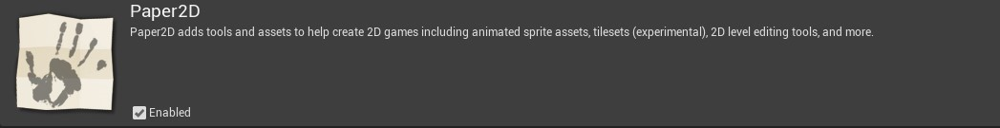

*Figura: Plugin Paper2D Enabled*

## 4. Preparando o ViewPort
Podemos organizar os elementos que são apresentados na cena predefinindo coordenadas no eixo Y.

1. No menu `Edit` > `Project Settings` navegue até `2D` para adicionar camadas/*Layers* e coordenadas de profundidade ao `ViewPort`.

  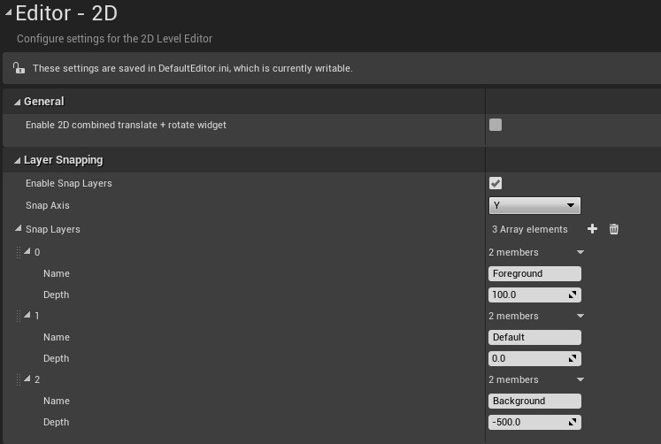

  *Figura: Project Settings 2D*

  - `Foreground` - Camada para os *sprites* que devem ficar na frente da cena;
  - `Default` - Camada para os *sprites* que devem estão alinhados com o personagem;
  - `Background` - Camada para os *sprites* que devem ficar atrás da cena;

2. Após a configuração no `ViewPort` devem aparecer as opções para organizar os objetos na cena.

  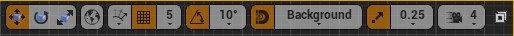

  *Figura: ViewPort Snap*

3. Os objetos adicionados na cena devem ficar no *snap* selecionado obedecendo a localização Y predefinida, esse processo é similar ao trabalho de desenho por camadas.

4. Para movimentar objetos entre os *snaps* selecione o objeto e pressione :
  - CTRL + DOWN para posicionar o objeto na camada anterior;
  - CTRL + UP para posicionar o objeto na camada posterior;

5. Para melhorar a visualização do cenário podemos configurar a visualização do `ViewPort` para **Right** a fim de controlar somente os eixos Z e X.

  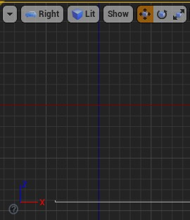

  *Figura: ViewPort Rigth Z,X*

## 5. Preparado os Sprites do projeto
Um Sprite em papel 2D é uma malha plana com mapeamento de textura e material associado que pode ser renderizado no mundo, criado inteiramente no Unreal Engine 4 (UE4). Em termos mais simples, é uma maneira rápida e fácil de desenhar imagens 2D no UE4.

### 5.1 Preparando as texturas
A fim de otimizar a renderização das texturas aplicamos os seguintes parâmetros para cada objeto:

1. Parâmetros da textura.

  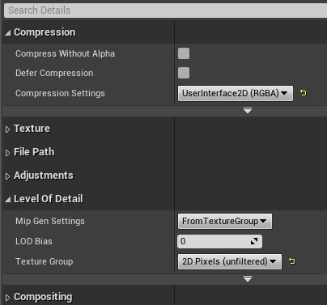

  *Figura: Figura: Details Texture parameteres 2D*

  - `Compression Settings`: UseInterface2D (RGBA) ;
  - `Mip Gen Settings`: NoMipMaps

  >A geração do Mip-map ocorre durante a importação da Textura e cria uma cadeia de Mip-map para a Textura. A cadeia mip-map consiste em vários níveis da imagem de amostra, cada um com metade da resolução do nível anterior. Esses dados permitem que a placa gráfica renderize mais rápido ao usar os mips inferiores (menos largura de banda da memória) e também reduz o aliasing da textura (cintilante) que se torna visível ao ter textura detalhada em certas distâncias.

2. Podemos aplicar automaticamente para uma ou várias texturas selecionadas usamos o menu de contexto `Sprite Actions` > `Apply Paper2D Texture Settings`.

  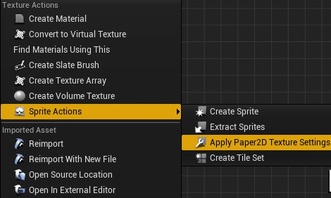

  *Figura: Apply Papper2D Texture Settings*

### 5.2 Criando sprites
Neste passo vamos criar os *sprites* utilizando texturas como base, seguindo os passos:
1. Selecione uma textura para ser apresentada no fundo da cena utilizando o menu de contexto acione `Sprite Actions` > `Create Sprite`;
2. Renomeie para SPR_Factory_Background;
3. [Usando o editor de Sprite](https://docs.unrealengine.com/4.27/en-US/AnimatingObjects/Paper2D/Sprites/Editor/)
4. Toolbar
  - `Add Box/Add Polygon/Add Circle`  - Adiciona um área adicional para colisão ou renderização da geometria;
5.  Mode Switching Toolbar
  - `Edit Source Region` - Exibe a textura de origem completa e permite que você defina a área que compõe o sprite individual;
  - `Edit RenderGeom` - Exibe e permite a edição da geometria de renderização do sprite.
  - `Edit Collision` - Exibe e permite a edição das formas de colisão do sprite;
6. Podemos adicionar física nos sprites em `Details` > `Simulate Physisc`;
7. Agora os *Sprites* podem ser adicionados na cena.

## 6. Agrupando sprites em Tile Sets
`Tile Sets` e `Tile Maps` no `Paper 2D` fornecem uma maneira rápida e fácil de fazer o layout da estrutura ou "layout geral" de seus níveis 2D. Ao criar e usar um conjunto de blocos (uma coleção de blocos extraídos de uma textura) com um mapa de blocos (uma grade 2D com largura e altura definidas em blocos), você pode selecionar vários blocos para "pintar" no mapa de blocos, que podem ser usado para seu layout de nível. Você também pode pintar ladrilhos (tiles) em várias camadas, cada uma das quais pode especificar qual ladrilho deve aparecer em cada célula do mapa para aquela camada específica.

Com `Tile Sets` podemos criar uma 'Paleta' de *sprites* para ser usadas no `Tile Maps`.

1. [O editor Tile Sets](https://docs.unrealengine.com/4.27/en-US/AnimatingObjects/Paper2D/TileMaps/);
2. Podemos criar acionando o menu `Paper2D` > `Tile Set`;
3. Editando Tile Set:
- `Tile Size`: Tamanho de cada Tile/Área que pode ser usada;
- `Tile Sheet Texture`:  Textura;
4. Para adicionar colisão nos elementos:

  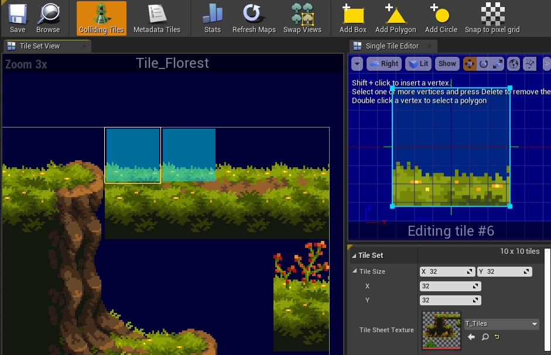

  *Figura: Tile Set Collision*
  - Selecione a opção `Colliding Tiles` para mostrar os elementos com colisão;
  - Adicione as coordenadas de colisão com `Add Box`;

## 7. Implementando uma cena utilizando Tile Map
`Tile Map` é um mapa de *sprites* para auxiliar na composição da cena.

1. Selecione um `Tile Set` para ser usado como paleta;
2. Para melhor controle dos elementos adicione 3 camadas na seguinte ordem:
  - Foreground - Camada para os elementos que devem ficar na frente do personagem;
  - Default - Camada para os elementos na mesma linha do personagem;c
  - Background - Camada para os elementos que ficam atrás do personagem;
3. `Projection Mode` - Orthogonal;
4. `Separation Per Layer` - Adicione um valor em pixel para separar cada camada;

## 8. Criando sequencias de animação utlizado Flipbooks
No Unreal Engine 4, os `Flipbooks` consistem em uma série de quadros-chave, cada um dos quais contém um Sprite a ser exibido e uma duração (em quadros) para exibi-lo. Uma opção de quadros por segundo determina a rapidez com que os quadros serão exibidos, indicando quantas "batidas" de animação ocorrerão em um segundo e os próprios quadros-chave podem ser editados no painel Detalhes ou usando uma linha do tempo que pode ser encontrada na parte inferior do Flipbook Editor.

Para implementar uma animação de corrida:
1. Utilizando o `Content Browser` selecione todos os *sprites* que simulam o movimento de corrida;
1. Com o botão direito do mouse escolha a opção `Create Flipbook`;
2. Exclua ou movimente os elementos para melhorar a animação;

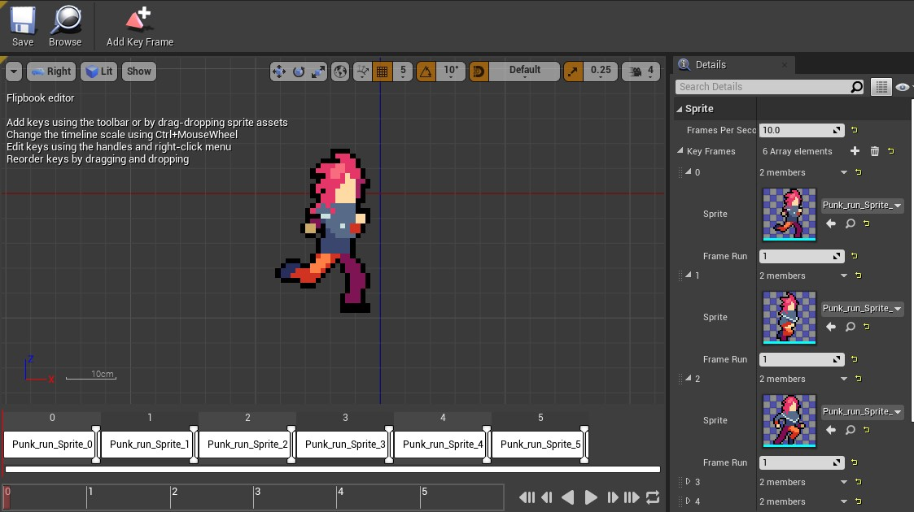

*Figura: Flipbook Animation Run*

## 9. Adicionando e configurando o personagem do tipo PaperCharacter
Neste passo vamos adicionar um personagem do tipo `Paper Character` para ser o player principal do projeto.

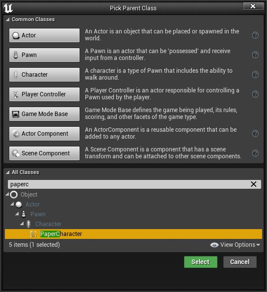

  *Figura: Blueprint class PaperCharacter*

Os componentes e parâmetros são diferentes aos do `Character` com malhas/*Mesh* então vamos adicionar e configurar os seguintes componentes:

1. `Sprite`.
  - `Source Flipbook`: FB_Animacao_idle criado anteriormente.
1. `Camera`;
  - `Projection mode` - Orthographic;
  - `Ortho Width` - 1024;
1. `SpringArm`;
  - `Do Collision Set` - False;
  - `Rotation` - Z= (-90);  
  - `Target Arm Length` - 1000;
  - `Inherit Yaw` - False (**Importante para a movimentação em Z (Yaw)**).
1. `Capsule` - Temos que ajustar o tamanho da capsula para a largura e altura do *sprite*.
  - `Capsule Half Height`;
  - `Capsule Radius`;
1. `Character Movement`.
  - `Use Flat Base for floor Checks` - true;
  - `Gravity Scale` - 2;  
  - `Jump Z Velocity` - 1000;
  - `Constraint to Plane`- true;
  - `Plane Constraint Normal` - Y=(-1);

## 10. Implementando a lógica de animação do personagem do tipo PaperCharacter
Neste passo vamos implementar a animação do personagem e definir um objeto de controle de estados de animação utilizando uma variável `Enumeration`.

1. Vamos criar uma variável `Enumeration` para controlar o estado da animação:

    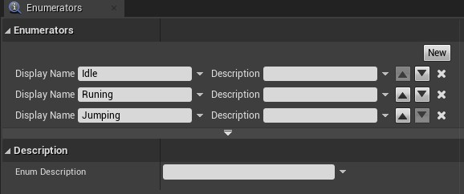

    *Figura: Blueprint class PaperCharacter*

  - Idle;
  - Running;
  - Jumping.
2. No personagem definimos as seguintes variáveis:

    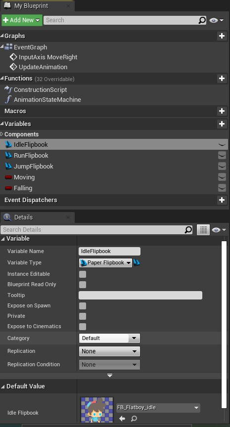

    *Figura: Character Varáveis*

  - Moving `Boolean` - Para identificar quando o personagem se movimenta;
  - Falling `Boolean` - Para identificar quando o personagem esta caindo;
  - IdleFlipbook `Paper Flipbook` - Com o valor do Flipbook definido para Idle;
  - RunFlipbook `Paper Flipbook` - Flipbook Run;  
  - JumpFlipbook `Paper Flipbook` - Flipbook Jump.  

3. Vamos utilizar o evento `MoveRight` para adicionar movimento travando a coordenada X em 1;

  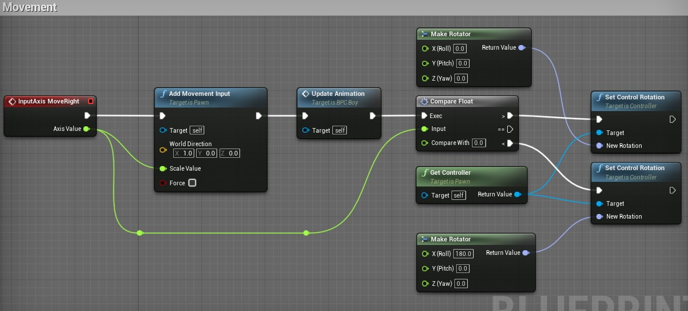

  *Figura: Movement MoveRight*

4. Vamos implementar um novo evento `UpdateAnimation` para inicializar variáveis, chamar uma função `Animation State Machine` que iremos implementar.

  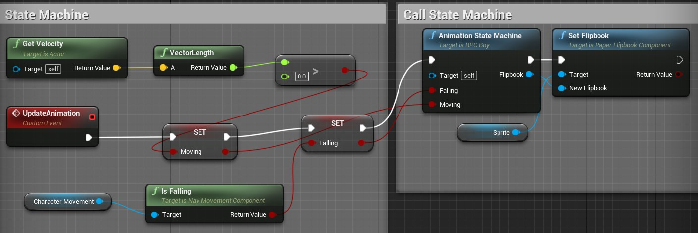  

  *Figura: Event UpdateAnimatio*
5. A lógica da função `Animation State Machine`

  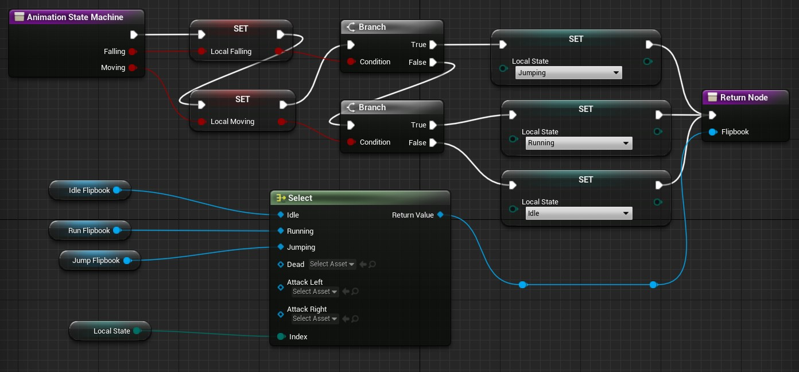

  *Figura: Function State Machine*

## Referências
- [O que é animação 2D e o que a difere dos outros tipos de animações?](https://blog.saga.art.br/animacao-2d/)
- [Getting Started with Paper 2D  Community Led Training  Unreal Engine Livestream](https://www.youtube.com/watch?v=Tf9Qd4isHTM)
- [Introduction to Paper2D v4.4  Unreal Engine](https://www.youtube.com/playlist?list=PLZlv_N0_O1gauJh60307mE_67jqK42twB)
- [Paper 2D](https://docs.unrealengine.com/4.26/en-US/AnimatingObjects/Paper2D/)
- [Texture Properties](https://docs.unrealengine.com/4.27/en-US/RenderingAndGraphics/Textures/Properties/)
- [Paper 2D Tile Sets / Tile Maps](https://docs.unrealengine.com/4.27/en-US/AnimatingObjects/Paper2D/TileMaps/)
- [Introduction to Paper2D](https://www.youtube.com/playlist?list=PLZlv_N0_O1gauJh60307mE_67jqK42twB)
