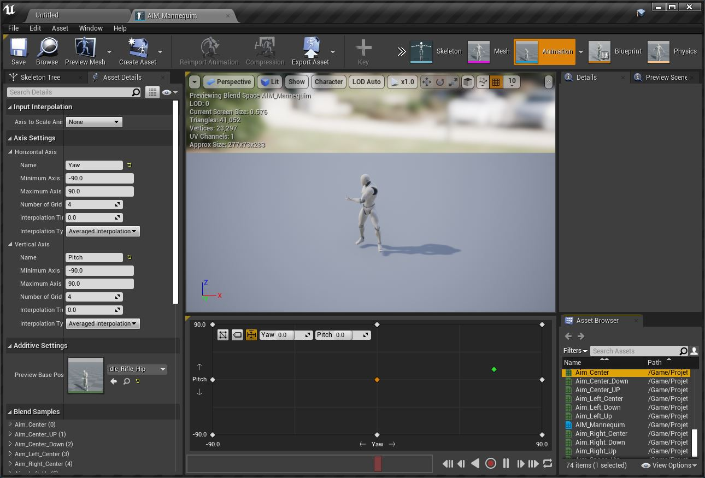

Neste capitulo vamos apresentar a animação Aim Offset.

## Índice
1. [Fluxo de trabalho](#1-fluxo-de-trabalho)
2. [Arquivo FBX](#2-arquivo-fbx)
3. [Skeleton](#3-skeleton)

## 1. Aim Offset
Um Aim Offset é um recurso que armazena uma série de poses que podem ser combinadas para ajudar um personagem a apontar uma arma. Durante a animação, o resultado do Aim Offset é misturado com outros movimentos, como correr, caminhar, pular, etc. para fazer com que o personagem pareça olhar suavemente em todas as direções.

## 2. Animation Starter Pack
A Epic Store oferece um pacote de animações para o Mannequin, facilitando a prototipação do personagem utilizando armas de tiro.


*Figura: Adicionando o pacote Animation Starter Pack*

## 3. Organizando as pastas

1. Crie as pastas
```bash
/Maps/Shooter
/Characters/Shooter
/Characters/Shooter/Animations
```

## Preparando animações
Neste passo vamos criar várias animações com o personagem mirando utilizando a animação `Aim_Space_hip` como base. Estas animações servem de referência para realizar a interpolação.

3. Mova o arquivo `/AnimStarterPack/Aim_Space_hip` para a pasta `/Characters/Shooter/Animations`

4. Duplique o arquivo várias vezes `Aim_Space_hip` e renomeio para os sequintes nomes:
- `Aim_Center`;
- `Aim_Center_Up`;
- `Aim_Center_Down`;

5. Editando a animação para criar novas animações.


*Figura: Editor Aim Offset*

6. Removendo frames.
Neste passo vamos remover frames antes e depois da pose final que estamos querendo obter.
  1. Posicione no frame 0;
  1. Clicando com o botão direito do mouse na barra de tempo, escolha `Remove from frame N1 to frame N2`;
  1. Onde N1 é  o Inicio e N2 é o final.

| Arquivo         |Início | Antes     |Depois   |
|:-               |:-:    |:-:        |:-:      |  
|Aim_Center       | 0     |1-87       |         |
|Aim_Center_Up    | 0     |0-10       |1-78     |
|Aim_Center_Down  | 0     |0-20       |1-68     |
|Aim_Left_Center  |30     |0 - 30     |1 - 57   |
|Aim_Left_Up      |40     |0 - 40     |1 - 48   |
|Aim_Left_Down    |50     |0 - 50     |1 - 37   |
|Aim_Right_Center |60     |0 - 60     |1 - 27   |
|Aim_Right_Up     |70     |0 - 70     |1 - 17   |
|Aim_Right_Down   |80     |0 - 80     |1 - 8    |

1. Edite a propriedade de vária animações ao mesmo tempo


- AdditiveSettings
  - Additive Anim Type : Mesh Space
  - Base Pose Type : Idle_Rifle_Hip


7. Criando Aim Offset Menu de contexto `Animation > Aim Offset` ou Escolha o esqueleto do Mannequin e utilizando BMP escolha `Create > Aim Offset`;



*Figura: Editor Aim Offset*

8. Altere os parâmetros em `Asset Details` para os seguintes valores:

Coordenadas horizontais
- Horizontal Axis
  - Name : Yaw
  - Minimun Axis Value : -90
  - Maximun Axis Value : 90

Coordenadas Verticais

- Vertical Axis
- Name : Pitch
- Minimun Axis Value : -90
- Maximun Axis Value : 90

1. Adicione as animações que foram preparadas anteriormente na janela Offset considerando a ordem dos eixos e movimentação.

|Animação         |Posição            |
|:-               |:-                 |
|Aim_Center       |Centro             |
|Aim_Left_Center  |Centro Esquerda    |

 > Continue adicionando as animações nas coordenadas


***

## Referências
- [Importing Animations](https://docs.unrealengine.com/4.26/en-US/WorkingWithContent/Importing/FBX/Animations/)
- [Skeleton Editor](https://docs.unrealengine.com/en-US/Engine/Animation/Persona/Modes/Skeleton/index.html)   
- [FBX Import Options Reference](https://docs.unrealengine.com/en-US/Engine/Content/Importing/FBX/ImportOptions/index.html)   
- [Animations Tools](https://docs.unrealengine.com/en-US/Engine/Animation/Persona/Modes/index.html)  
- [AnimGraph](https://docs.unrealengine.com/en-US/Engine/Animation/AnimBlueprints/AnimGraph/index.html)
- [Using Layered Animations](https://docs.unrealengine.com/4.26/en-US/AnimatingObjects/SkeletalMeshAnimation/AnimHowTo/AdditiveAnimations/)
- [Blend Nodes](https://docs.unrealengine.com/4.26/en-US/AnimatingObjects/SkeletalMeshAnimation/NodeReference/Blend/)
