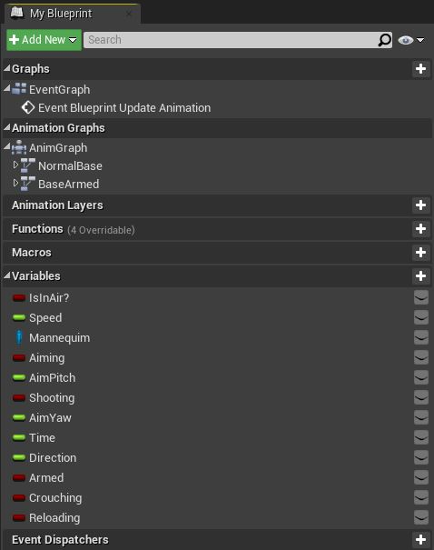
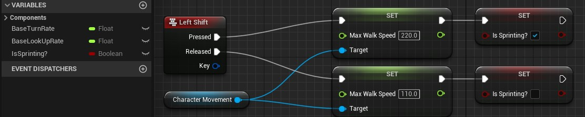
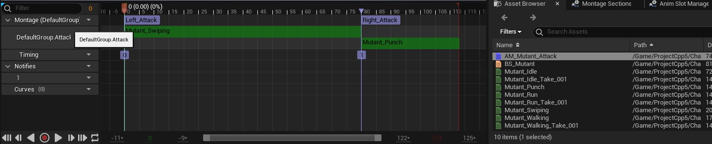
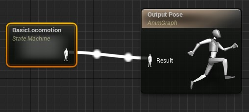
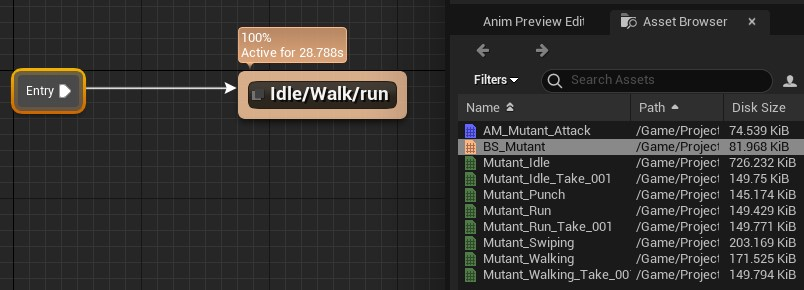
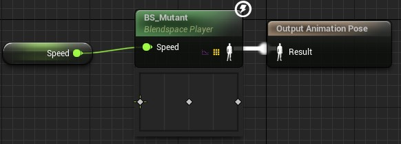
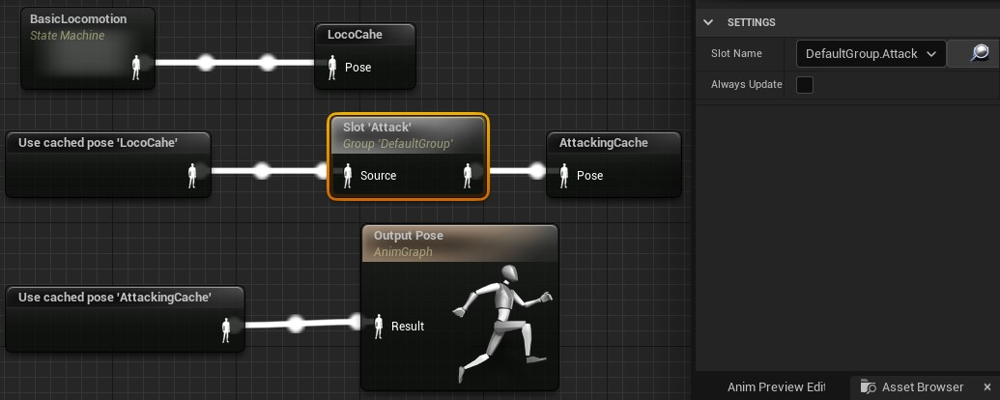
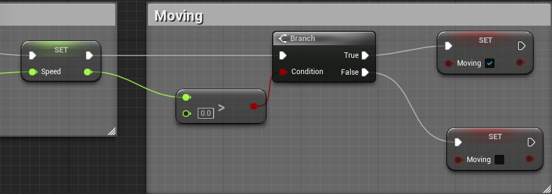

Em este capítulo iremos implementar várias animações utilizando Animation Bluerint para implementar a lógica de movimentação.

## Índice
1. [O que é Animation Blueprint?](#1)
1. [Implementado Animation Bluerint utilizando o Humano](#2)
1. [Estados de maquina ou State Machine](#3)
1. [Blend Space e State Machine](#4)
    1. [Blend Space 1D](#4.1)
    1. [Blend Space](#4.2)
1. [Saltando](#5)
1. [Implementado Animation Bluerint utilizando o Mutante](#6)
    1. [Vídeo Animation Bluerint do Mutante](#6.1) 
    1. [Implementando a corrida](#6.2)
    1. [Vídeo Implementado a corrida](#6.3) 
    1. [Montando a animação de ataque](#6.4)
    1. [Vídeo a animação de ataque](#6.5) 
    1. [Animação básica com AnimGraph](#6.6)
    1. [Animação de ataque com AnimGraph](#6.7)
    1. [Vídeo Atacando](#6.8) 
    1. [Atacando somente com os braços](#6.9)
    1. [Animação de ataque completa e correndo somente os braços](#6.10)
    1. [Vídeo Animação de ataque completa e correndo somente os braços](#6.11) 

## 1. O que é Animation Bluerint?
É um Blueprint especializado que controla a animação de uma malha esquelética. Os gráficos são editados dentro do `Animation Blueprint Editor`, onde você pode realizar a combinação da animação, controlar diretamente os ossos de um esqueleto ou configurar a lógica que definirá a pose final da animação para uma malha esquelética a ser usada por quadro.

Vamos implementar a lógica de movimentação utilizando o elemento Animation Bluerint para os personagens Human e Mutant.

## 2. Implementado Animation Bluerint utilizando o Humano
O Editor é separado em `AnimGraph` e `EventGraph`, onde o primeiro implementa a lógica de nós de sequencias de animação e o segundo a lógica de programação Blueprint.

1. Para criar o objeto ABP_Human utilizamos o menu de contexto > `Animation` > `Animation Bluerint`;
    

  *Figura Menu contexto Animation > Animation Blueprint*

1. Aba MyBlueprint com a organização do editor.

  

  *Figura: Editor Animmation Blueprint MyBlueprint*  

## 3. Estados de maquina ou State Machine
Uma máquina de estados representa uma sequencie lógica de estados associados a uma animação.

O nó `Output Pose` é o estado ou pose final da animação. A seguir vamos criar vários nós e a sua lógica.

1. No editor Animation Graphs crie um `State` com `Add new state`;

  

  *Figura: Animation graphs Output Pose*

1. Dentro do nó criado adicionaremos um novo estado com `Add State` com o nome `Idle/Walk/Run`.

  

  *Figura: Add State Idle/Walk/Run*

## 4. Blend Space e State Machine
Para exemplificar vamos apresentar os dois métodos de Blend Space com o personagem Humano mas antes vamos adicionar a lógica para implementar as variáveis `Speed` e `Direction` que servirão como parâmetros para as animações.

No gráfico de eventos ou EventGraph vamos adicionar o seguinte código.

*Figura: Animation Bluerint -Speeed e Direction*

### 4.1 Blend Space 1D
Criado anteriormente, BS_Human1D recebe como parâmetro `Speed` dentro do nó `Idle/Walk/Run`.

*Figura: Blend Space 1D dentro do State*

### 4.2 Blend Space
Nó `Idle/Walk/Run` adicionamos BS_Human que recebe como parâmetro `Speed` e `Direction` pois trabalha com duas coordenadas.

*Figura: Blend Space 1D dentro do State*

Para os passos posteriores vamos utilizar o BS_Human (Blend Space).

## 5. Saltando ou Jump
Para simular o salto do personagem vamos adicionar os seguintes estados e em seguida fazer as suas conexões.

*Figura: State Jump*

Em `Jump_Start` adicionamos a animação `S_Human_Jump_Start` iniciando a animação de salto.

*Figura: State Jump Start*

Repetimos a operação para os outros estados adicionando as animações :
- S_Human_Jump_Loop;
- S_Human_Jump_End;

N condição de controle de fluxo entre `Idle/Walk/Run` e `Jump_Start` vamos utilizar a variável `InAir` e testar se o valor é `True`.

*Figura: State Jump Start InAir*

Na condição de controle de fluxo entre `Jump_End` e `Idle/Walk/Run` vamos utilizar a variável `InAir` e testar se o valor não é `True`.

*Figura: State Jump Start Not InAir*

Na condição de controle de fluxo entre `Jump_Start` e `Jump_Loop` vamos utilizar a função `Current Time (Ratio) (S_Jump_Start)`. Esta função retorna a proporção de tempo atual da sequência e se o valor for menor 0.1 ou 10% de tempo para acabar deve ser feito a transição para outro nó.

*Figura: State Condition Current Time (Ratio)*

Na condição de controle de fluxo entre `Jump_End` e `Idle/Walk/Run` vamos utilizar a função `Current Time (Ratio) (S_Jump_End)` com a mesma lógica do nó descrito anteriormente.

*Figura: State Condition Current Time (Ratio) Jump End*

Devemos considerar que o salto depende se o personagem esta em queda e se a função `Jump` foi acionado na lógica da classe do personagem, neste casso `BP_Human`.

*Figura: Classe BP Função Jump*

## 6. Implementado Animation Bluerint utilizando o Mutante

1. Usando o menu de contexto `Animation > Animation Blueprint` para criar ABP_Mutant.

1. Agora vamos copiar todos os nos do `Event Graph` de `ThirdPerson_AnimBP` para o componente criado.

1. Arrastre o elemento BS_Mutant para `AnimGraph`.

  

  *Figura: AnimGraph BS_Mutant*

### 6.1 Vídeo Animation Bluerint do Mutante

*Vídeo: Animation Bluerint do Mutante*

### 6.2 Implementando a Corrida
Em este passo iremos implementar a corrida do personagem. Vamos configura o evento `Left Shift` para alterar a propriedade `Max Walk Speed` do componente `CharacterMomement` com os valores 220 para velocidade máxima e 110 para caminhada.

*Figura: Bluerint running*

### 6.3 Vídeo Implementando a corrida

*Vídeo: Implementando a corrida*

### 6.4 Montando a animação de ataque
Uma `Animation Montage` ou montagem de animação (ou montagem, para abreviar) fornece uma maneira de controlar um ativo de animação diretamente por meio do código Blueprint ou C ++. Com uma montagem de animação, você pode combinar várias sequências de animação diferentes em um único ativo que você pode dividir em seções para reprodução individualmente ou em combinação. Você também pode disparar eventos dentro de uma montagem que pode executar uma variedade de tarefas locais ou replicadas, como tocar sinais de som ou efeitos de partículas, alterar valores do jogador como contagem de munição ou até mesmo replicar o movimento raiz em jogos em rede (desde que o movimento raiz esteja ativado na animação).

Em este passo utilizaremos o `Animation Montage` para montar as animações de ataque esquerda e direita.

1. Menu de contexto `Animation > Animation Montage`;

  

  *Figura: Animation Montage*

1. Vamos baixar e instalar os arquivos Mutant_Punch.fbx e Mutant_Swipping do site https://mixano.com para animar ataque direita e ataque esquerda.
1. No editor de animação arrastre as animações para a linha de tempo. Observe que cada animação ocupa uma raia ou slot dentro de uma seção;
1. Adicione um novo slot de nome `Attack` e salve;
1. Selecione o novo slot em `Montage > DefaultGroup.Attack` e salve toda animação.

  

  *Figura: Animation Montage*

### 6.5 Vídeo montando Animação de ataque

*Vídeo: Animação de ataque*

## 6.6 Animação básica com AnimGraph
AnimGraph utiliza o conceito de máquinas de estado que fornecem uma maneira gráfica de quebrar a animação de uma malha esquelética em uma série de estados. Esses estados são então governados por Regras de transição que controlam como combinar de um estado para outro.

O processo de design para animação `Skeletal Mesh` se torna mais simples, pois você pode criar um gráfico que controla facilmente como seus personagens podem fluir entre os tipos de animação sem ter que criar uma rede **Blueprint** complexa.

Em este passo utilizaremos a lógica de programação com AnimGraph para combinar e programar a lógica de mudanças de estado ou poses.

A seguir vamos criar um nós dentro do gráfico de estados para simular a animação básica.

**BasicLocomotion**

Este estado dever conter a animação criadas anteriormente com o Blend space 1D, BS_Mutant.

1. Vamos adicionar um novo estado `Add New State Machine` com nome *BasicLocomotion*;
1. Conectamos o nó em `Output Pose` substituindo os estados anteriores se existirem;  
  

  *Figura: AnimGraph BasicLocomotion*

1. Arrastamos e colamos BS_Mutant para a `AnimGraph` e renomeamos o nó para `Idle/Walk/Run` pois ele contem essas animações;

  

  *Figura: AnimGraph Idle/Walk/Run*

**Idle/Walk/Run**

Em este estado passamos como parâmetro a variável `Speed` para animação BS_Mutant;

*Figura: AnimGraph Speed*

### 6.7 Animação de ataque com AnimGraph
Neste passo vamos implementar a animação de ataque com soco de direita e esquerda.

*Figura: AnimaGraph Attack*

1. Para passar de um estado para outro devemos salvar o estado anterior acionando o menu de contexto `New Save cached Pose...` dentro do `AnimGraph`;
1. Para acionar um estado salvo usamos `Use cached pose BasicLocomotion`, perceba que usamos o nome do estado salvo anteriormente.
1. Para acionar a montagem de animação `AM_Mutant_Attack` na qual definimos a sequencia de ataque usamos o menu de context `Slot DefaultGroup`;
1. Selecionando o Slot criado atualizamos `Slot Name` para `DefaultGroup.Attack` para acessar a sequencia de animação.

Agora vamos implementar a lógica para chamar as animações quando forem pressionados os botões do mouse direito e esquerdo.

1. No objeto BP_Mutant adicione os eventos de chamada de função e associe a função `Play Anim Montage`.

*Figura: Blueprint para chamar a animação de ataque*

### 6.8 Vídeo Atacando

*Vídeo: Animação com AnimGraph*

### 6.9 Atacando somente com os braços
Em este iremos continuar com a programação `AnimGraph` para fazer o personagem correr e atacar ao mesmo tempo.

**Layerd Blend per bone**

Podemos misturar várias animações no nó de estado e utilizar um osso (bone) como referência, no exemplo abaixo misturamos a animação básica `LocoCache`com `AttackingCache` adicionando o osso `Spine`.

*Figura: Layerd Blend per bone*

### 6.10 Animação de ataque completa e correndo somente os braços
Neste passo vamos misturar as animações condicionando a uma variável para que possamos definir o estado do personagem, correndo ou parado.

**Layerd Blend by bool**

Podemos condicionar a mistura de animações utilizando valores condicionais *boolean*.

*Figura: Layerd Blend by bool*

No `Event Graph` de `ABP_Mutant` adicionamos a lógica para verificar se o personagem esta me movimentando testando a variável `Speed`.

*Figura: Layerd Blend by bool*

### 6.11 Vídeo

*Vídeo: Correndo e atacando*

***

#### Referências
- [Skeleton Editor](https://docs.unrealengine.com/en-US/Engine/Animation/Persona/Modes/Skeleton/index.html)   
- [FBX Import Options Reference](https://docs.unrealengine.com/en-US/Engine/Content/Importing/FBX/ImportOptions/index.html)   
- [Animations Tools](https://docs.unrealengine.com/en-US/Engine/Animation/Persona/Modes/index.html)  
- [AnimGraph](https://docs.unrealengine.com/en-US/Engine/Animation/AnimBlueprints/AnimGraph/index.html)
- [Animating Objects](https://docs.unrealengine.com/4.26/en-US/AnimatingObjects/SkeletalMeshAnimation/AnimMontage/Overview/)
- [Blend depth](https://answers.unrealengine.com/questions/387906/what-does-the-blend-depth-parameter-in-layered-ble.html?sort=oldest)
