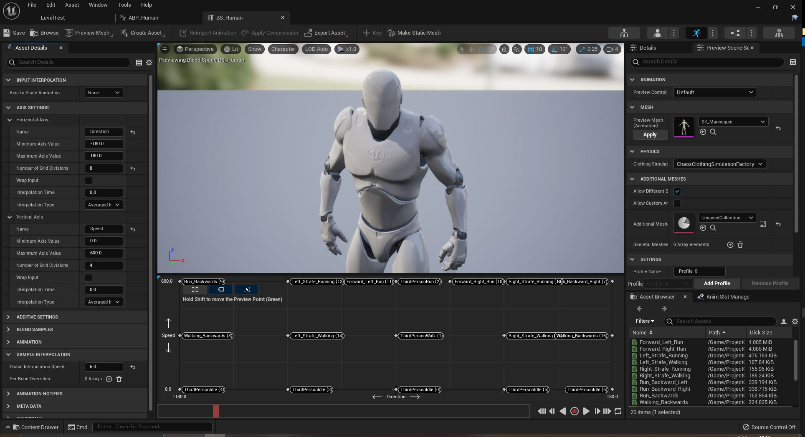

Em este capítulo iremos implementar várias animações utilizando um eixo de movimentação utilizando o elemento e editor `Blend space 1D` e `Blend space`.

## Índice
1. [O que é Blend Space?](#1)
1. [Carregando o Editor](#2)
1. [Blend Space 1D](#3)
    1. [Human](#3.1)
    1. [Mutant](#3.2)    
    1. [Vídeo Animation Blend Space 1D](#3.3)         
1. [Blend Space](#4)
1. [Atividades](#5)

## 1. O que é Blend Space?
O objetivo do `Blend Space` é reduzir a necessidade de criar nós individuais codificados para mesclar animações com um editor que realiza a mesclagem com base em propriedades ou condições específicas. Permitindo que o animador ou programador especifique as entradas, as animações e como as entradas são usadas para mesclar entre as animações, virtualmente qualquer tipo de mesclagem pode ser executado usando o Blend Space.

## 2. Carregando o editor
Para carregar o editor de animação na horizontal usamos o menu de contexto `Animation` > `Blend Space 1D`.

*Figura: Menu de contexto Animation > Blend Space 1D*

Nos próximos passos vamos criar várias sequencias de animações para o personagem BP_Human.

## 3. Blend Space 1D
Os Blend Spaces também podem ser criados em um formato unidimensional, conhecido como Blend Space 1D. Eles podem se misturar entre qualquer número de poses ou animações, mas o fazem com base em um único valor de entrada. Um exemplo de caso de uso para um Blend Space 1D seria quando você tem um personagem que se orienta automaticamente na direção em que está se movendo. Se o personagem não pode se desviar ou se mover em várias direções, um Blend Space 1D pode ser usado para se misturar de um Idle a um Walk e, finalmente, a Run com base em um único valor de Speed (como mostrado no exemplo abaixo).

Utilizamos o este elemento quando temos somente um parâmetro para controle da mudança de animações, neste caso o eixo horizontal com o parâmetro `Speed`.

*Figura: Editor Blen Space 1D*

### 3.1 Human
- Nome do arquivo: BS_Human1D;
- Sequencia de animação: Arraste as animações para o sequenciador conforme o parâmetro `Speed`;
- `Horizantal Axis`: Speed;
- `Maximum Axis Value`: 600;
  - (Velocidade máxima de corrida do personagem);
- `Interpolation Time`: 0.25.
  - Altere esse valor gradativamente para melhorar a mudança de estados.

Para acompanhar o movimentação pressione Shift + LMB e arrastre o mouse.

> Alteramos o nome do parâmetro para Speed com a finalidade de facilitar a identificação dentro da lógica de programação Bluerint que usaremos posteriormente.

### 3.2 Mutant
- Nome do arquivo: BS_Mutant
- `Horizontal Axis`
  - `Name` : Speed
  - `Maximum axis value` : 220
  - `Interpolation time` : 0.5

Para criar a movimentação no eixo horizontal vamos arrastar os elementos apresentados em `Asset Browser` para a linha do tempo.
- Mutant_Idle em tempo 0;  
- Mutant_Walking em tempo 110;  
- Mutant_Run em tempo 220;  

### 3.3 Vídeo Animation Blend Space 1D

*Vídeo: Animation Blend Space 1D*

## 4. Blend Space
Este elemento é utilizado quanto existem dois parâmetros para controle das animações por exemplo: Direction/Direção e Speed/Velocidade.

Menu de contexto `Animation` > `Blend Space`.

*Figura: Editor Blen Space*

- Nome do arquivo: BS_Human;
- Sequencia de animação: Arraste as animações para o sequenciador conforme o parâmetro `Speed` e `Direction`;
- `Horizantal Axis`: Direction;
- `Minimum Axis Value`: -180;
- `Maximum Axis Value`: 180;
  - (A direção do personagem varia entre esses valores);
- `Vertical Axis`: Speed
- `Minimum Axis Value`: 0;
- `Maximum Axis Value`: 600;
  - (Velocidade do personagem);

> Alteramos o nome do parâmetro para Speed com a finalidade de facilitar a identificação dentro da lógica de programação Bluerint que usaremos posteriormente.

## 5. Atividades

***
## Referências
