Em este capítulo iremos implementar várias animações utilizando um eixo de movimentação utilizando o elemento e editor `Blend space 1D`.

## Índice
1. [O que é Blend Space](#1-o-que-é-blend-space)
1. [Blend Space 1D](#2-blend-space-1d)
1. [Carregando o Editor](#3-carregando-o-editor)
1. [Configurando a animação](#4-configurando-a-animação)
1. [Vídeo Animation Blend Space 1D](#5-vídeo-animation-blend-space-1d) 
1. [Animando com Blueprint](#6-animando-com-blueprint)
1. [Vídeo Animation Bluerint](#7-vídeo-animation-blueprint) 
1. [A classe do personagem](#8-a-classe-do-personagem)
1. [Vídeo Classe do personagem](#9-vídeo-classe-do-personagem) 
1. [Implementando a Corrida](#10-implementando-a-corrida)
1. [Vídeo Implementado a Corrida](#11-vídeo-implmentando-a-corrida) 
1. [Montando a animação de ataque](#12-montando-a-animação-de-ataque)
1. [Vídeo montando Animação de ataque](#13-vídeo-montanto-animação-de-ataque) 
1. [Animação básica com AnimGraph](#14-animação-básica-com-animgraph)
1. [Animação de ataque com AnimGraph](#15-animação-de-ataque-com-animGraph)
1. [Vídeo Atacando](#16-vídeo-atacando) 
1. [Atacando somente com os braços](#17-atacando-somente-com-os-braços)
1. [Animação de ataque completa e correndo somente os braços](#18-animação-de-ataque-completa-e-correndo-somente-os-braços)
1. [Vídeo](#19-vídeo) 

## 1. O que é Blend Space
O objetivo do `Blend Space` é reduzir a necessidade de criar nós individuais codificados para mesclar animações com um editor que realiza a mesclagem com base em propriedades ou condições específicas. Permitindo que o animador ou programador especifique as entradas, as animações e como as entradas são usadas para mesclar entre as animações, virtualmente qualquer tipo de mesclagem pode ser executado usando o Blend Space.

## 2. Blend Space 1D
Os Blend Spaces também podem ser criados em um formato unidimensional, conhecido como Blend Space 1D. Eles podem se misturar entre qualquer número de poses ou animações, mas o fazem com base em um único valor de entrada. Um exemplo de caso de uso para um Blend Space 1D seria quando você tem um personagem que se orienta automaticamente na direção em que está se movendo. Se o personagem não pode se desviar ou se mover em várias direções, um Blend Space 1D pode ser usado para se misturar de um Idle a um Walk e, finalmente, a Run com base em um único valor de Speed (como mostrado no exemplo abaixo).

## 3. Carregando o editor
Para carregar o editor de animação na horizontal usamos o menu de contexto `Animation > Blend Space 1D`.

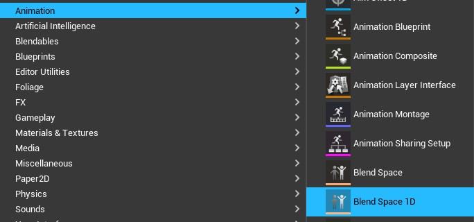

*Figura: Menu de contexto Animation > Blend Space 1D*

## 4. Configurando a animação
Vamos renomear a variável de controle do eixo horizontal para *Speed* e alterar os seus valores como exemplificado abaixo:
- `Horizontal Axis`
  - `Name` : Speed
  - `Maximum axis value` : 220
  - `Interpolation time` : 0.5

Para criar a movimentação no eixo horizontal vamos arrastar os elementos apresentados em `Asset Browser` para a linha do tempo.
- Mutant_Idle em tempo 0;  
- Mutant_Walking em tempo 110;  
- Mutant_Run em tempo 220;  

Para acompanhar o movimentação pressione Shift + LMB e arrastre o mouse.   

## 5. Vídeo Animation Blend Space 1D

*Vídeo: Animation Blend Space 1D*

## 6. Animando com Blueprint
Em este passo iremos implementar utilizando `Animation Blueprint` para criar um fluxo de animação.

Usando o menu de contexto `Animation > Animation Blueprint`.

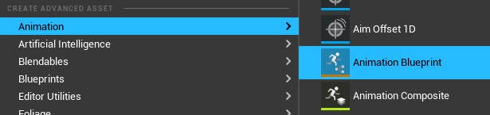  

*Figura Menu contexto Animation > Animation Blueprint*

1. Agora vamos copiar todos os nos do `Event Graph` de `ThirdPerson_AnimBP` para componente criado.

1. Arrastre o elemento BS_Mutant para `AnimGraph`.

  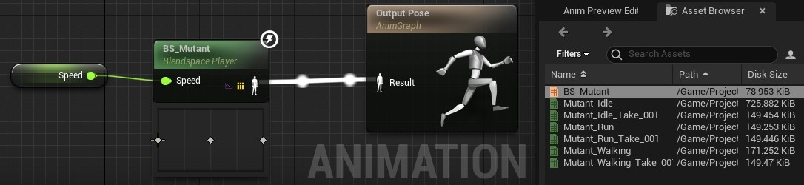

  *Figura: AnimGraph BS_Mutant*

## 7. Vídeo Animation Bluerint

*Vídeo: Animation Bluerint*

## 8. A classe do personagem
Em este passo iremos implementar a classe do personagem para incluir o esqueleto, malha e elementos do fluxo de animação.

1. Crie o objeto BP_Mutant do tipo `Character`;
1. Adicione os seguintes componentes e hierarquias:
   - `SpringArm` - Habilite a opção `Use Pawn Control Rotation`
   - `Camera` - Componente câmera.
1. Adicione a o esqueleto e animação do personagem criados anteriormente.
   - `Skeletal Mesh`: Mutant  
   - `Animation Mode`: Use Animation Bluerint
   - `Anim Class`: ABP_Mutant_C
1. Em `CharacterMomement` atualize os valores:
   - `Max Walk Speed`: 110
   - `Max Walk Speed Crouched`: 110
1. Copiar todos os nós do `Event Graph` de `ThirdPersonCharacter` para componente criado e declare as variáveis não reconhecidas.
1. Para testar a movimentação crie um level de teste e configure `World Settings` para:
   - `Default Pawn`: BP_Mutant

## 9. Vídeo Classe do personagem

*Vídeo: Animation Classe do personagem*

## 10. Implementando a Corrida
Em este passo iremos implementar a corrida do personagem. Vamos configura o evento `Left Shift` para alterar a propriedade `Max Walk Speed` do componente `CharacterMomement` com os valores 220 para velocidade máxima e 110 para caminhada.

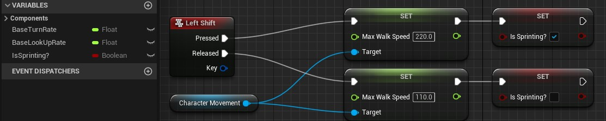

*Figura: Bluerint running*

## 11. Vídeo Implementando a corrida

*Vídeo: Implementando a corrida*

## 12. Montando a animação de ataque
Uma `Animation Montage` ou montagem de animação (ou montagem, para abreviar) fornece uma maneira de controlar um ativo de animação diretamente por meio do código Blueprint ou C ++. Com uma montagem de animação, você pode combinar várias sequências de animação diferentes em um único ativo que você pode dividir em seções para reprodução individualmente ou em combinação. Você também pode disparar eventos dentro de uma montagem que pode executar uma variedade de tarefas locais ou replicadas, como tocar sinais de som ou efeitos de partículas, alterar valores do jogador como contagem de munição ou até mesmo replicar o movimento raiz em jogos em rede (desde que o movimento raiz esteja ativado na animação).

Em este passo utilizaremos o `Animation Montage` para montar as animações de ataque esquerda e direita.

1. Menu de contexto `Animation > Animation Montage`;

  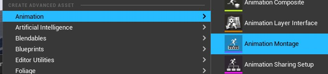

  *Figura: Animation Montage*

1. Vamos baixar e instalar os arquivos Mutant_Punch.fbx e Mutant_Swipping do site https://mixano.com para animar ataque direita e ataque esquerda.
1. No editor de animação arrastre as animações para a linha de tempo. Observe que cada animação ocupa uma raia ou slot dentro de uma seção;
1. Adicione um novo slot de nome `Attack` e salve;
1. Selecione o novo slot em `Montage > DefaultGroup.Attack` e salve toda animação.

  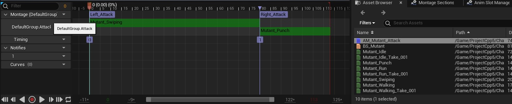

  *Figura: Animation Montage*

## 13. Vídeo montando Animação de ataque

*Vídeo: Animação de ataque*

## 14. Animação básica com AnimGraph
Em este passo utilizaremos a lógica de programação com AnimGraph para combinar e programar a lógica de mudanças de estado ou poses.

AnimaGraph utiliza o conceito de máquinas de estado que fornecem uma maneira gráfica de quebrar a animação de uma malha esquelética em uma série de estados. Esses estados são então governados por Regras de transição que controlam como combinar de um estado para outro. Como uma ferramenta, eles simplificam muito o processo de design para animação Skeletal Mesh, pois você pode criar um gráfico que controla facilmente como seus personagens podem fluir entre os tipos de animação sem ter que criar uma rede Blueprint complexa.

A seguir vamos criar um nós dentro do gráfico de estados para simular a animação básica.

**BasicLocomotion**

Este estado dever conter a animação criadas anteriormente com o Blend space 1D, BS_Mutant.

1. Vamos adicionar um novo estado `Add New State Machine` com nome *BasicLocomotion*;
1. Conectamos o nó em `Output Pose` substituindo os estados anteriores se existirem;  
  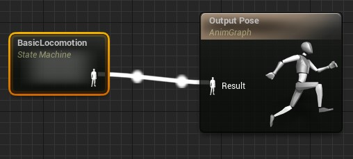

  *Figura: AnimGraph BasicLocomotion*

1. Arrastamos e colamos BS_Mutant para a `AnimGraph` e renomeamos o nó para `Idle/Walk/Run` pois ele contem essas animações;

  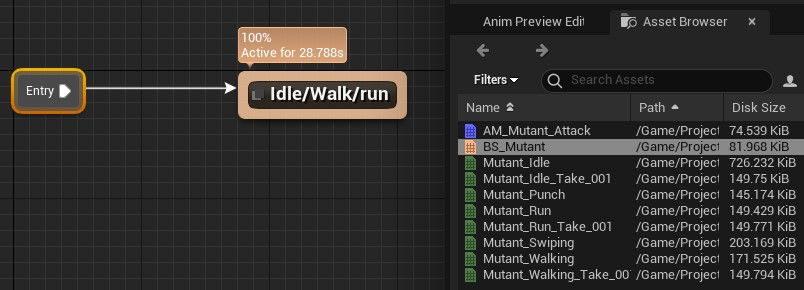

  *Figura: AnimGraph Idle/Walk/Run*

**Idle/Walk/Run**

Em este estado passamos como parâmetro a variável `Speed` para animação BS_Mutant;

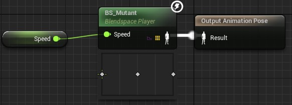

*Figura: AnimGraph Speed*

## 15. Animação de ataque com AnimGraph
Neste passo vamos implementar a animação de ataque com soco de direita e esquerda.

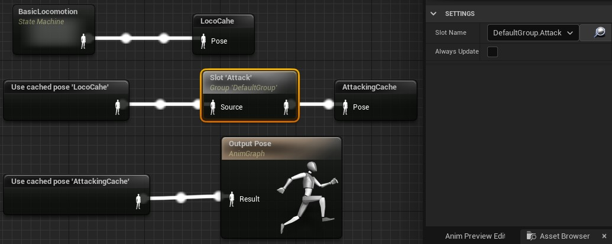

*Figura: AnimaGraph Attack*

1. Para passar de um estado para outro devemos salvar o estado anterior acionando o menu de contexto `New Save cached Pose...` dentro do `AnimGraph`;
1. Para acionar um estado salvo usamos `Use cached pose BasicLocomotion`, perceba que usamos o nome do estado salvo anteriormente.
1. Para acionar a montagem de animação `AM_Mutant_Attack` na qual definimos a sequencia de ataque usamos o menu de context `Slot DefaultGroup`;
1. Selecionando o Slot criado atualizamos `Slot Name` para `DefaultGroup.Attack` para acessar a sequencia de animação.

Agora vamos implementar a lógica para chamar as animações quando forem pressionados os botões do mouse direito e esquerdo.

1. No objeto BP_Mutant adicione os eventos de chamada de função e associe a função `Play Anim Montage`.

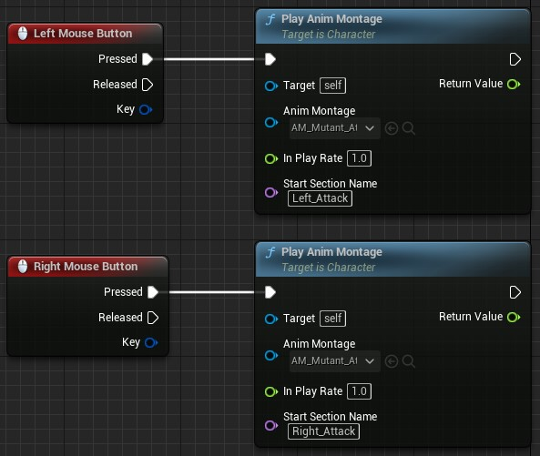

*Figura: Blueprint para chamar a animação de ataque*

## 16. Vídeo Atacando

*Vídeo: Animação com AnimGraph*

## 17. Atacando somente com os braços
Em este iremos continuar com a programação `AnimGraph` para fazer o personagem correr e atacar ao mesmo tempo.

**Layerd Blend per bone**

Podemos misturar várias animações no nó de estado e utilizar um osso (bone) como referência, no exemplo abaixo misturamos a animação básica `LocoCache`com `AttackingCache` adicionando o osso `Spine`.

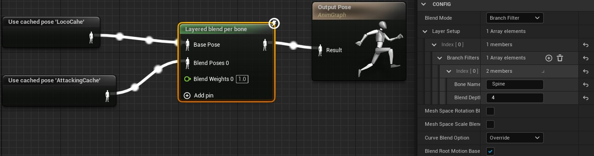

*Figura: Layerd Blend per bone*

## 18. Animação de ataque completa e correndo somente os braços
Neste passo vamos misturar as animações condicionando a uma variável para que possamos definir o estado do personagem, correndo ou parado.

**Layerd Blend by bool**

Podemos condicionar a mistura de animações utilizando valores condicionais *boolean*.

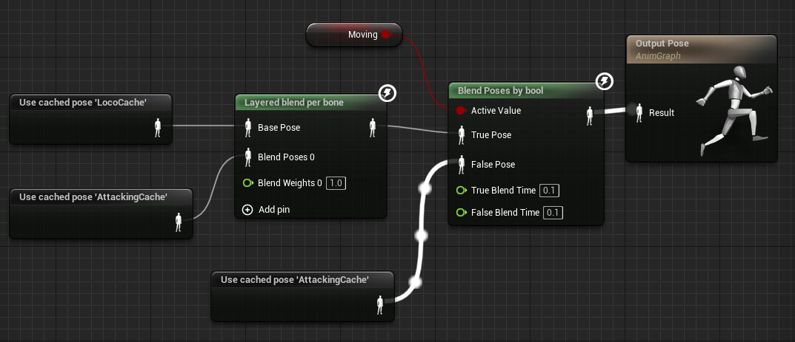

*Figura: Layerd Blend by bool*

No `Event Graph` de `ABP_Mutant` adicionamos a lógica para verificar se o personagem esta me movimentando testando a variável `Speed`.

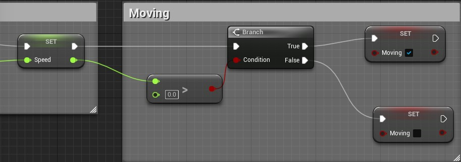

*Figura: Layerd Blend by bool*

## 19. Vídeo

*Vídeo: Correndo e atacando*

***

#### Referências
- [Skeleton Editor](https://docs.unrealengine.com/en-US/Engine/Animation/Persona/Modes/Skeleton/index.html)   
- [FBX Import Options Reference](https://docs.unrealengine.com/en-US/Engine/Content/Importing/FBX/ImportOptions/index.html)   
- [Animations Tools](https://docs.unrealengine.com/en-US/Engine/Animation/Persona/Modes/index.html)  
- [AnimGraph](https://docs.unrealengine.com/en-US/Engine/Animation/AnimBlueprints/AnimGraph/index.html)
- [Animating Objects](https://docs.unrealengine.com/4.26/en-US/AnimatingObjects/SkeletalMeshAnimation/AnimMontage/Overview/)
- [Blend depth](https://answers.unrealengine.com/questions/387906/what-does-the-blend-depth-parameter-in-layered-ble.html?sort=oldest)
