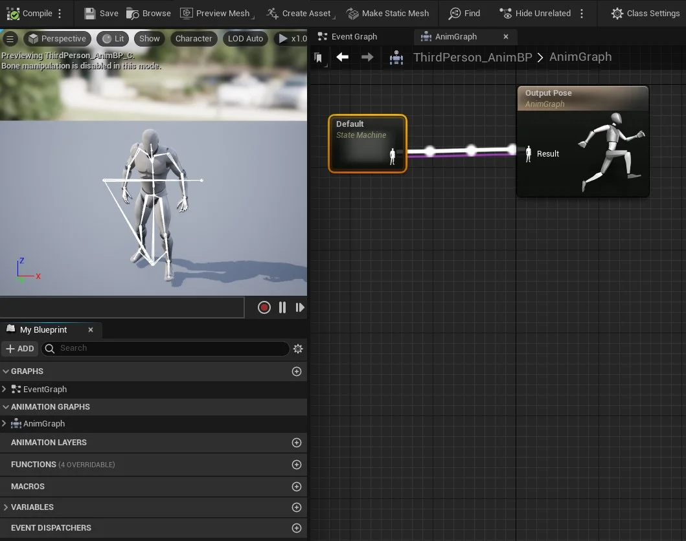

## CAPÍTULO 10 - Animação de personagens

Neste capitulo vamos apresentar o fluxo de trabalho e os elementos necessários para a animação de personagens.

> Figura: Unreal Engine e Animação de personagens.

&nbsp;&nbsp;[10.1 Fluxo de trabalho para animação utilizando Unreal Engine](#10.1)

&nbsp;&nbsp;&nbsp;&nbsp;&nbsp;&nbsp;[10.1.1Arquivo FBX](#10.1.1)

&nbsp;&nbsp;&nbsp;&nbsp;&nbsp;&nbsp;[10.1.2 Skeleton](#10.1.2)

&nbsp;&nbsp;&nbsp;&nbsp;&nbsp;&nbsp;[10.1.3 Anim Graph](#10.1.3)

&nbsp;&nbsp;&nbsp;&nbsp;&nbsp;&nbsp;[10.1.4 Sequence](#10.1.4)

&nbsp;&nbsp;&nbsp;&nbsp;&nbsp;&nbsp;[10.1.5 Skeletal Mesh](#10.1.5)

***

## 10.1 Fluxo de trabalho para animação utilizando Unreal Engine
O **Unrel Engine** fornece um fluxo de trabalho simples para construção de animações utilizando Skeletal Mesh importadas de aplicativos 3D para uso em jogos. Atualmente, apenas uma única animação para cada `Skeletal Mesh` pode ser exportada / importada em um único arquivo.

Abaixo uma visão geral técnica do uso do pipeline de animações.

|Importar               | Malha            | Animação       | Classe       |
|:--                    |:-                |:-              |:-            |
|1. Arquivo FBX         |2. Skeletal Mesh  |4. Sequence     |7. Character  |         
|                       |3. Skeletal       |5. Anim Graph   |              |         

### 10.1.1 Arquivo FBX
Embora o formato FBX seja proprietário, muitos aplicativos de modelagem e animação que não são da Autodesk podem abrir arquivos FBX. Isso permite que os criadores compartilhem modelos 3D entre si usando o formato FBX, que é eficiente porque armazena modelos como dados binários. Os arquivos .OBJ, .DXF, .3DS e .DAE (COLLADA) podem ser convertidos em arquivos FBX, usando o Autodesk FBX Converter (disponível para Windows e Mac, mas sem suporte a partir de 2013) ou Autodesk Viewer (Web).[(fileinfo)](https://fileinfo.com/extension/fbx "Fileinfo")

> Figura: File Autodesk FBX - fileinfo.com.

### 10.1.2 Skeleton
Skeleton ou Esqueleto da malha importada no arquivo FBX contendo controle de movimentação e `Sockets` para colar outros objetos e ossos virtuais.

- `Sockets` - Ponto de controle do esqueleto, permitindo colar outros objetos no ponto;

- `Virtual Bones` - Adiciona um osso que não está na malha original;

- `Retargeting` - Permite que as animações sejam reutilizadas entre os personagens que usam o mesmo recurso `Skeleton`;

- `Physics` - Controle de física e animação dos ossos.

> Figura: Bluprint - Editor Skeleton.

### 10.1.3 Anim Graph
Editor para implementação das animações utilizando codificação visual.

- `Event Graph` - Código *Blueprint* onde deversão ser processadas todas as variáveis de inicialização para controle de fluxo das animações;  

- `Anim Graph` - Nós de representação de máquinas de estado do personagem, `State Machine`;

  - `Slots` - Permite adicionar uma camada de funcionalidade ao fluxo;

  - `Layerd Blend` por bone - Permite diversas formas de mixar animações no fluxo;

  - `Pose Caching` - Permite reutilizar a informação de um determinado "estado";

  - `Final posse` - `Sequence recorder` e `Animation Sharing manager`.

> Figura: Blueprint - Editor Anim Graph.  

### 10.1.4 Sequence    
Editor que permite a edição de animações.                          
- `Blend Space` - Combina um grupo de animações com duas dimensões podendo usar variáveis;

- `Blend Space 1D` - Combina grupo de animações com uma dimensão podendo usar variáveis;

- `Montages` - Expõe a animação para o *Blueprint*;

- `Pose Assets` - Permite gravar uma nova posse do *Character*;

- `Notify Animations` - Adiciona uma etiqueta na `Timeline` da animação.

> Figura: Blueprint - Editor Blend Space 1D.  

### 10.1.5 Skeletal Mesh
Skeletal Mesh ou Malha do esqueleto cobre os ossos para gerenciamento de `LOD` e `clothing` (roupas).
