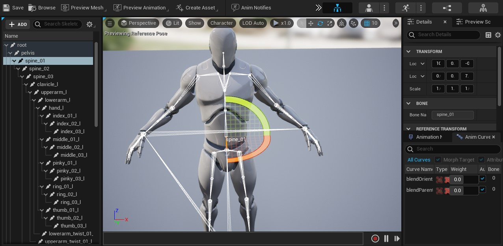
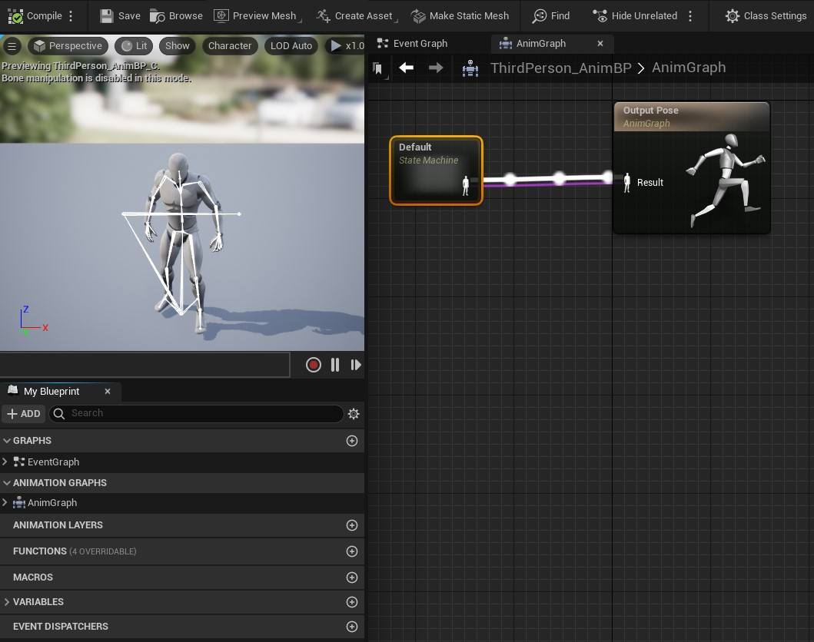
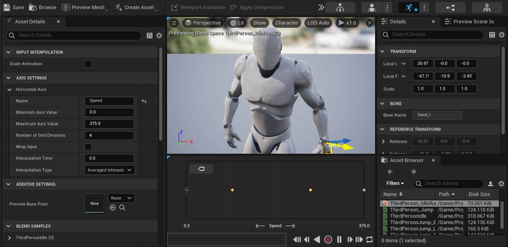

Neste capitulo vamos preparar e organizar os objetos e elementos necessários, como por exemplo, arquivos FBX, malhas e esqueletos e suas animações. Vamos também importar personagens do site Mixano.

## Índice
1. [Fluxo de trabalho](#1-fluxo-de-trabalho)
2. [Arquivo FBX](#2-arquivo-fbx)
3. [Skeleton](#3-skeleton)
    1. [Anim Graph](#3-1-anim-araph)
    1. [Sequence](#3-2-Sequence)
4. [Skeletal Mesh](#4-skeletal-mesh)
5. [Preparando o projeto](#5-preparando-o-projeto)
6. [Baixando o personagem](#6-baixando-o-personagem)
7. [Vídeo aula](#7-vídeo-aula)
8. [Atividades](#8-atividades)

## 1. Fluxo de trabalho
O *Unrel Engine* fornece um fluxo de trabalho simples para construção de animações utilizando Skeletal Mesh importadas de aplicativos 3D para uso em jogos. Atualmente, apenas uma única animação para cada *Skeletal Mesh* pode ser exportada / importada em um único arquivo.

Abaixo uma visão geral técnica do uso do pipeline de animações.

|Importar               | Malha         | Animação    | Classe    |
|:--                    |:-             |:-           |:-         |
| Arquivo FBX           |Skeletal Mesh  |Anim Graph   |Character  |         
|                       |Skeletal       |Sequence     |           |         

## 2. Arquivo FBX
Embora o formato FBX seja proprietário, muitos aplicativos de modelagem e animação que não são da Autodesk podem abrir arquivos FBX. Isso permite que os criadores compartilhem modelos 3D entre si usando o formato FBX, que é eficiente porque armazena modelos como dados binários. Os arquivos .OBJ, .DXF, .3DS e .DAE (COLLADA) podem ser convertidos em arquivos FBX, usando o Autodesk FBX Converter (disponível para Windows e Mac, mas sem suporte a partir de 2013) ou Autodesk Viewer (Web).[(fileinfo)](https://fileinfo.com/extension/fbx)


*Figura: File Autodesk FBX - fileinfo.com*

## 3. Skeleton
Skeleton ou Esqueleto da malha importada no arquivo FBX contendo controle de movimentação e `Sockets` para colar outros objetos e ossos virtuais.
- `Sockets` - Ponto de controle do esqueleto, permitindo colar outros objetos no ponto;
- `Virtual Bones` - Adiciona um osso que não está na malha original;
- `Retargeting` - Permite que as animações sejam reutilizadas entre os personagens que usam o mesmo recurso `Skeleton`;
- `Physics` - Controle de física e animação dos ossos.



*Figura: Editor Skeleton*

### 3.1 Anim Graph
Editor para implementação das animações utilizando codificação visual.
- `Event Graph` - Código *Blueprint* onde deversão ser processadas todas as variáveis de inicialização para controle de fluxo das animações;  
- `Anim Graph` - Nós de representação de máquinas de estado do personagem, `State Machine`;
  - `Slots` - Permite adicionar uma camada de funcionalidade ao fluxo;
  - `Layerd Blend` por bone - Permite diversas formas de mixar animações no fluxo;
  - `Pose Caching` - Permite reutilizar a informação de um determinado "estado";
  - `Final posse` - `Sequence recorder` e `Animation Sharing manager`.



*Figura: Editor Anim Graph*  

### 3.2 Sequence    
Editor que permite a edição de animações.                          
- `Blend Space` - Combina um grupo de animações com duas dimensões podendo usar variáveis;
- `Blend Space 1D` - Combina grupo de animações com uma dimensão podendo usar variáveis;
- `Montages` - Expõe a animação para o *Blueprint*;
- `Pose Assets` - Permite gravar uma nova posse do *Character*;
- `Notify Animations` - Adiciona uma etiqueta na `Timeline` da animação.



*Figura: Editor Blend Space 1D*  


## 4. Skeletal Mesh
Skeletal Mesh ou Malha do esqueleto cobre os ossos para gerenciamento de `LOD` e `clothing` (roupas).

## 5. Preparando o projeto
Em este passo iremos preparar as pastas, configuração inicial do projeto e *Character* do
jogador.

1. Criar o projeto AulaAnimação;
1. Importar a pacote ThirdPerson;
1. Criar as pastas para organização do projeto:
```bash
|--Projeto
      |--Core
          |--Character
      |--Characters
          |--Mannequim
             |--Mesh
             |--Animations          
          |--Mutant
             |--Mesh
             |--Animations
      |--Maps               
```
1.  Mover os objetos:
```bash    
cp /Mannequim/Character/Mesh/Sk_Mannequim  /Characteres/Mannequim/Mesh
cp /Mannequim/Character/Mesh/SK_Mannequin_PhysicsAsset  /Characteres/Mannequim/Mesh
cp /Mannequim/Character/Mesh/UE4_Mannequin_Skeleton  /Characteres/Mannequim/Mesh
cp /Mannequim/Animations/  /Character/Mannequim/Animations
 ```
1. Criar a Classe `BP_PlayerBase` (Blueprint classe `Character`) em `/Core/Character`;
1. Copiar todos elementos do `Eventh Graph` de `ThirdPersonCharacter` para `BP_PlayerBase`;
1. Adicionar e alinhar os componentes em `BP_PlayerBase`:
 - `Spring Arm` - (Location=0.0,0.0,8.4).
 - `Camera`.
 - `Mesh` - (Location=0.0,0.0,-89) (Rotation=-0,0,270).
1. Crie os seguintes objetos *Blueprint*:
 - BP_GameModeBase do tipo `Game Mode Base`;
 - BP_PlayerController do tipo `Player Controller`.
1. Crie um `Level` do tipo `Default` de nome **LevelTest** e salve na pasta `Projeto/Maps`.
1. Em `World Settings` configure:
 - `GameMode Override` - BP_GameModeBase.
 - `Default Pawn Class` - BP_PlayerBase.

## 6. Baixando o personagem
Em este passo iremos utilizar o site [Mixano.com](https://www.mixamo.com/) para baixar o personagem Mutant.  
1. Character : Mutant
1. Animations:
   - Mutant Walking (In place = true)
   - Mutant Idle
   - Mutant Run (In place = true)
   - Mutant Jumping

> Neste exemplo utilizaremos a opção `In Place = true` para exemplificar.  

## 7. Vídeo aula
[](https://youtu.be/G7c8DMdrsGY "Aula 02")

*Vídeo: Aula 02 - Baixando personagem*

## 8. Atividades


***

#### Referências
- [Importing Animations](https://docs.unrealengine.com/4.26/en-US/WorkingWithContent/Importing/FBX/Animations/)
- [Skeleton Editor](https://docs.unrealengine.com/en-US/Engine/Animation/Persona/Modes/Skeleton/index.html)   
- [FBX Import Options Reference](https://docs.unrealengine.com/en-US/Engine/Content/Importing/FBX/ImportOptions/index.html)   
- [Animations Tools](https://docs.unrealengine.com/en-US/Engine/Animation/Persona/Modes/index.html)  
- [AnimGraph](https://docs.unrealengine.com/en-US/Engine/Animation/AnimBlueprints/AnimGraph/index.html)
