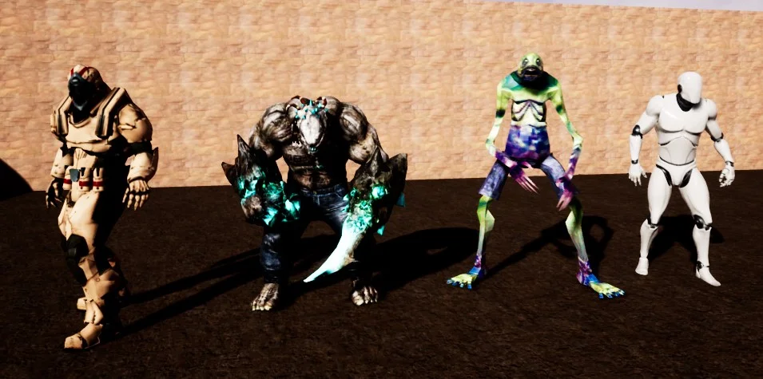
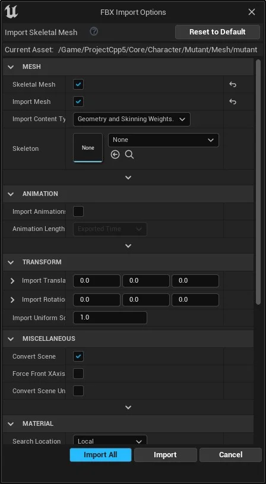

<a name="10"></a>
## CAPÍTULO 10 - Animação de personagens

Neste capitulo vamos preparar e organizar os objetos e elementos necessários, como por exemplo, arquivos FBX, malhas e esqueletos e suas animações. Vamos também importar personagens do site Mixano.



> Figura: Unreal Engine - Preparando o projeto de animação.


&nbsp;&nbsp;[10.2  Organizando pastas de bibliotecas](#10.2)

&nbsp;&nbsp;&nbsp;&nbsp;&nbsp;&nbsp;[10.2.1 Ambiente e controle](#10.2.1)    

&nbsp;&nbsp;&nbsp;&nbsp;&nbsp;&nbsp;[10.2.2 Animações e esqueleto do Mutat](#10.2.2)    

***

<a name="10.2"></a>
## 10.2 Organizando pastas de bibliotecas
Em este passo iremos preparar as pastas, configuração inicial do projeto e personagens.

1. Criar o projeto AulaAnimação com `Blueprint ThirdPerson`;

2. Adicione ao projeto `Animation Starter Pack`;

3. Criar as pastas para organização do projeto:

```bash
|--Projeto
      |--Core
          |--Character
      |--Characters
          |--Human
             |--Mesh
             |--Animations                
          |--Mannequim
             |--Mesh
             |--Animations          
          |--Mutant
             |--Mesh
             |--Animations
      |--Maps               
|--ExampleContent
      |-- AnimStarterPack
      |-- ThirdPerson      
```

Mova todas as pastas de bibliotecas externas para a pasta ExampleContent, como por exemplo ThirdPerson.

4.  Mova os objetos:
```bash    
cp /Mannequim/Character/Mesh/Sk_Mannequim  /Characteres/Mannequim/Mesh
cp /Mannequim/Character/Mesh/SK_Mannequin_PhysicsAsset  /Characteres/Mannequim/Mesh
cp /Mannequim/Character/Mesh/UE4_Mannequin_Skeleton  /Characteres/Mannequim/Mesh
cp /Mannequim/Animations/  /Character/Mannequim/Animations
 ```

**Classes do personagem Base.**

Podemos utilizar um personagem base para servir de Referência ou classe pai para outros personagens.

1. Criar a Classe `BP_PlayerBase` (Blueprint classe `Character`) em `/Core/Character`;

2. Copiar todos elementos do `Eventh Graph` de `ThirdPersonCharacter` para `BP_PlayerBase`;

3. Adicionar e alinhar os componentes em `BP_PlayerBase`:

 - `Spring Arm` - (Location=0.0,0.0,8.4).
 - `Camera`.
 - `Mesh` - (Location=0.0,0.0,-89) (Rotation=-0,0,270).

**Classe do Humano.**

Esta classe irá utilizar o esqueleto e animações do Mannequim (Unreal Mannequim) para representar um humano.

1. Criar a Classe `BP_Human` (Blueprint classe `Character`) em `/Characters/Human`;

  - Menu Context > `Blueprint` > `Character`;

2. Adicione e alinhe os componentes em `BP_Human`:
  - `Spring Arm` - (Location=0.0,0.0,8.4);

  - `Camera` - Associe esse componente no `SpringArm`;

  - `Mesh` - (Location=0.0,0.0,-89) (Rotation=-0,0,270);

3. Atualize a `Mesh` para `Sk_Mannequim`;

**Classe Mutante ou  Mutant.**

Para esta classe vamos importar o esqueleto e animações.

1. Crie o objeto BP_Mutant do tipo `Character`;

2. Adicione os seguintes componentes e hierarquias:

   - `SpringArm` - Habilite a opção `Use Pawn Control Rotation`;

   - `Camera` - Componente câmera.

3. Adicione a o esqueleto e animação do personagem criados anteriormente.

   - `Skeletal Mesh`: Mutant;

   - `Animation Mode`: Use Animation Bluerint;

   - `Anim Class`: ABP_Mutant_C;

4. Em `CharacterMomement` atualize os valores:

   - `Max Walk Speed`: 110;

   - `Max Walk Speed Crouched`: 110;

5. Copiar todos os nós do `Event Graph` de `ThirdPersonCharacter` para componente criado e declare as variáveis não reconhecidas.

6. Para testar a movimentação crie um level de teste e configure `World Settings` para:

   - `Default Pawn`: BP_Mutant;

**Vídeo Classe do Mutant.**

[](https://youtu.be/obLJb4RBySA "Vídeo: Unreal Engine - Animation Classe do personagem.")

> Vídeo: Unreal Engine - Animation Classe do personagem.

<a name="10.2.1"></a>
### 10.2.1 Ambiente e controle
Neste passo vamos implementar os [Controles](http://cafegeek.eti.br/unreal-engine/unreal_engine_gameinstance_state_mode.html) do personagem e criar um level para testes.

1. Crie os seguintes objetos *Blueprint*:

 - BP_GameModeBase do tipo `Game Mode Base`;

 - BP_PlayerController do tipo `Player Controller`.

2. Crie um `Level` do tipo `Default` de nome **LevelTest** e salve na pasta `Projeto/Maps`.

3. Em `World Settings` configure:

 - `GameMode Override` - BP_GameModeBase;

 - `Default Pawn Class` - BP_PlayerBase.

<a name="10.2.2"></a>
### 10.2.2 Animações e esqueleto do Mutant

**Baixando o personagem Mutant.**

Em este passo iremos utilizar o site [Mixano.com](https://www.mixamo.com/) para baixar o personagem Mutant.  

1. Character : Mutant

2. Animations:

   - Mutant Walking (In place = true)

   - Mutant Idle

   - Mutant Run (In place = true)

   - Mutant Jumping

Observação: Neste exemplo utilizaremos a opção `In Place = true` para exemplificar.  

**Vídeo Baixando personagem.**

[](https://youtu.be/G7c8DMdrsGY "Vídeo: Unreal Engine - Baixando personagem do Mixano.")

> Vídeo: Unreal Engine - Baixando personagem do Mixano.

**Importando Mesh e Skeletal.**

1. Crie a pasta `/Projeto/Characteres/Mutant/Mesh`;

2. Copie o arquivo `mutant.fbx` para a pasta criada no passo anterior;

3. Importe o arquivo com a opção `Import All`:

   

   > Figura: Unreal Egnine - Blueprint FBX import options.

**Importando animações.**

1. Crie a pasta `/Projeto/Characteres/Mutant/animations`;

2. Copie os arquivos para pasta criada no passo anterior:

 - Mutant_Run.fbx;

 - Mutant_Idle.fbx;

 - Mutant_Walking.fbx.

3. Desmarque a opção `Import Mesh` para que a malha não seja importada novamente;

4. Escolha o esqueleto do personagem com `SKeleton`.

**Vídeo Importando personagem.**

[](https://youtu.be/6ZLatHfD7P8 "Vídeo: Unreal Engine - Importando personagem FBX baixdo do Mixano")

> Vídeo: Unreal Engine - Importando personagem FBX baixdo do Mixano.
