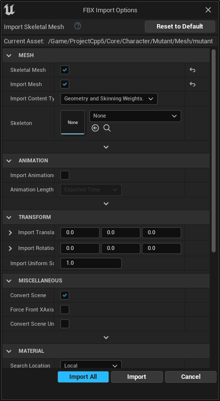

Neste capitulo vamos preparar e organizar os objetos e elementos necessários, como por exemplo, arquivos FBX, malhas e esqueletos e suas animações. Vamos também importar personagens do site Mixano.


## Índice
1. [Preparando o projeto](#1)
2. [Baixando o personagem](#2)
3. [Vídeo Baixando personagem](#3)  
4. [Importando Mesh e Skeletal](#4)
5. [Importando animações](#5)
6. [Vídeo Importando personagem](#6)  
7. [Atividades](#7-atividades)

<a name="1"></a>
## 1. Preparando o projeto
Em este passo iremos preparar as pastas, configuração inicial do projeto e *Character* do
jogador.

1. Criar o projeto AulaAnimação com Bluerint ThirdPerson;
1. Adicione ao projeto Animation Starter Pack;
1. Criar as pastas para organização do projeto:
```bash
|--Projeto
      |--Core
          |--Character
      |--Characters
          |--Human
             |--Mesh
             |--Animations                
          |--Mannequim
             |--Mesh
             |--Animations          
          |--Mutant
             |--Mesh
             |--Animations
      |--Maps               
|--ExampleContent
      |-- AnimStarterPack
      |-- ThirdPerson      
```

> Mova todas as pastas de bibliotecas externas para a pasta ExampleContent, como por exemplo ThirdPerson.

1.  Mova os objetos:
```bash    
cp /Mannequim/Character/Mesh/Sk_Mannequim  /Characteres/Mannequim/Mesh
cp /Mannequim/Character/Mesh/SK_Mannequin_PhysicsAsset  /Characteres/Mannequim/Mesh
cp /Mannequim/Character/Mesh/UE4_Mannequin_Skeleton  /Characteres/Mannequim/Mesh
cp /Mannequim/Animations/  /Character/Mannequim/Animations
 ```

**Classe do personagem Base**
1. Criar a Classe `BP_PlayerBase` (Blueprint classe `Character`) em `/Core/Character`;
1. Copiar todos elementos do `Eventh Graph` de `ThirdPersonCharacter` para `BP_PlayerBase`;
1. Adicionar e alinhar os componentes em `BP_PlayerBase`:
 - `Spring Arm` - (Location=0.0,0.0,8.4).
 - `Camera`.
 - `Mesh` - (Location=0.0,0.0,-89) (Rotation=-0,0,270).

 **Classe BP_Human**
1. Criar a Classe `BP_PlayerBase` (Blueprint classe `Character`) em `/Characters/Human`.
1. Menu Context > Blueprint > Character  > BP_Human;
1. Adicione e alinhe os componentes em `BP_Human`:
  - `Spring Arm` - (Location=0.0,0.0,8.4);
  - `Camera` - Associe esse componente no `SpringArm`;
  - `Mesh` - (Location=0.0,0.0,-89) (Rotation=-0,0,270);
1. Atualize a `Mesh` para `Sk_Mannequim`;

**Objetos de controle**
1. Crie os seguintes objetos *Blueprint*:
 - BP_GameModeBase do tipo `Game Mode Base`;
 - BP_PlayerController do tipo `Player Controller`.

**Level do personagem**
1. Crie um `Level` do tipo `Default` de nome **LevelTest** e salve na pasta `Projeto/Maps`.
1. Em `World Settings` configure:
 - `GameMode Override` - BP_GameModeBase.
 - `Default Pawn Class` - BP_PlayerBase.

 **BP_Mutant**
 1. Crie o objeto BP_Mutant do tipo `Character`;
 1. Adicione os seguintes componentes e hierarquias:
    - `SpringArm` - Habilite a opção `Use Pawn Control Rotation`
    - `Camera` - Componente câmera.
 1. Adicione a o esqueleto e animação do personagem criados anteriormente.
    - `Skeletal Mesh`: Mutant  
    - `Animation Mode`: Use Animation Bluerint
    - `Anim Class`: ABP_Mutant_C
 1. Em `CharacterMomement` atualize os valores:
    - `Max Walk Speed`: 110
    - `Max Walk Speed Crouched`: 110
 1. Copiar todos os nós do `Event Graph` de `ThirdPersonCharacter` para componente criado e declare as variáveis não reconhecidas.
 1. Para testar a movimentação crie um level de teste e configure `World Settings` para:
    - `Default Pawn`: BP_Mutant

 9. Vídeo Classe do personagem
 [](https://youtu.be/obLJb4RBySA "Aula 06")

 *Vídeo: Animation Classe do personagem*

<a name="2"></a>
## 2. Baixando o personagem Mutant
Em este passo iremos utilizar o site [Mixano.com](https://www.mixamo.com/) para baixar o personagem Mutant.  
1. Character : Mutant
1. Animations:
   - Mutant Walking (In place = true)
   - Mutant Idle
   - Mutant Run (In place = true)
   - Mutant Jumping

> Neste exemplo utilizaremos a opção `In Place = true` para exemplificar.  

<a name="3"></a>
## 3. Vídeo Baixando personagem
[](https://youtu.be/G7c8DMdrsGY "Aula 02")

*Vídeo: Baixando personagem*

<a name="4"></a>
## 4. Importando Mesh e Skeletal
1. Crie a pasta `/Projeto/Characteres/Mutant/Mesh`;
1. Copie o arquivo `mutant.fbx` para a pasta criada no passo anterior;
1. Importe o arquivo com a opção `Import All`:

   

   *Figura: FBX import options*

<a name="5"></a>
## 5. Importando animações
1. Crie a pasta `/Projeto/Characteres/Mutant/animations`;
1. Copie os arquivos para pasta criada no passo anterior:
 - Mutant_Run.fbx;
 - Mutant_Idle.fbx;
 - Mutant_Walking.fbx.
1. Desmarque a opção `Import Mesh` para que a malha não seja importada novamente;
1. Escolha o esqueleto do personagem com `SKeleton`.

<a name="6"></a>
## 6. Vídeo Importando personagem
[](https://youtu.be/6ZLatHfD7P8 "Aula 03")

*Vídeo: Importando personagem*


## Atividades

***

## Referências
- [Importing Animations](https://docs.unrealengine.com/4.26/en-US/WorkingWithContent/Importing/FBX/Animations/)
- [Skeleton Editor](https://docs.unrealengine.com/en-US/Engine/Animation/Persona/Modes/Skeleton/index.html)   
- [FBX Import Options Reference](https://docs.unrealengine.com/en-US/Engine/Content/Importing/FBX/ImportOptions/index.html)   
- [Animations Tools](https://docs.unrealengine.com/en-US/Engine/Animation/Persona/Modes/index.html)  
- [AnimGraph](https://docs.unrealengine.com/en-US/Engine/Animation/AnimBlueprints/AnimGraph/index.html)
- [Creating Transition Rules](https://docs.unrealengine.com/4.27/en-US/AnimatingObjects/SkeletalMeshAnimation/StateMachines/TransitionRules/)
