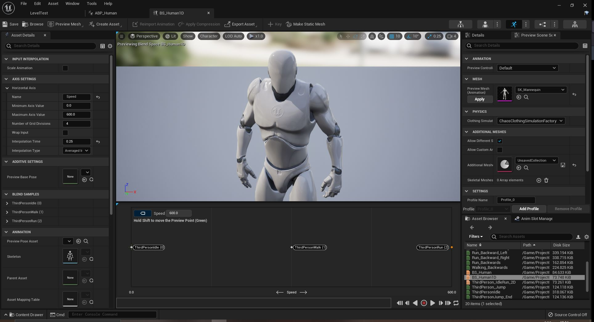
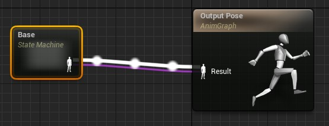
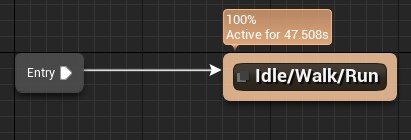
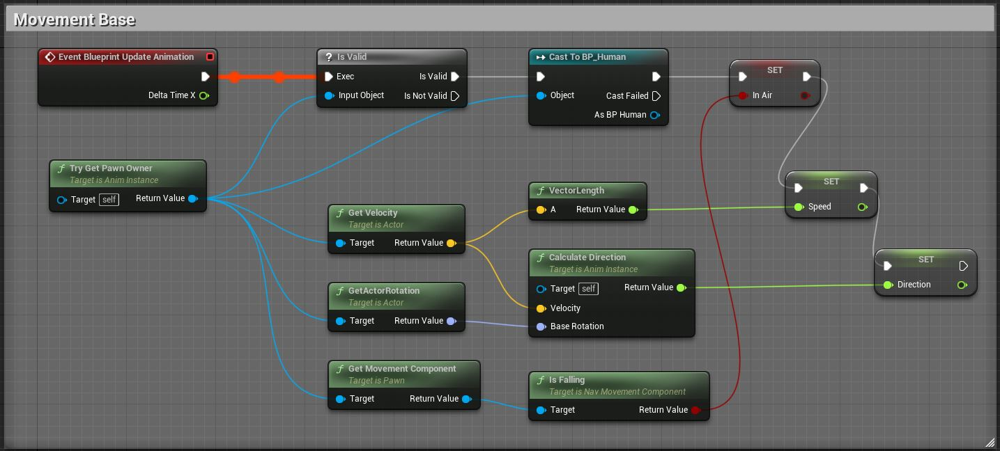
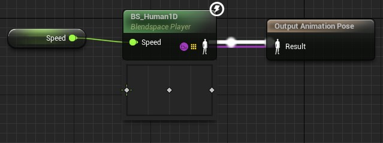
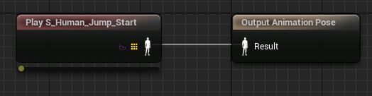
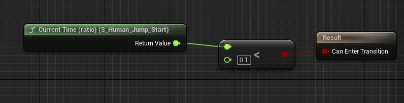

Neste capitulo vamos preparar e organizar os objetos e elementos necessários, como por exemplo, arquivos FBX, malhas e esqueletos e suas animações. Vamos também importar personagens do site Mixano.


## Índice
1. [Preparando o projeto](#1-preparando-o-projeto)
2. [Baixando o personagem](#2-baixando-o-personagem)
3. [Vídeo Baixando personagem](#3-vídeo-baixando-personagem)  
4. [Importando Mesh e Skeletal](#4-importando-mesh-e-skeletal)
5. [Importando animações](#5-importando-animações)
6. [Vídeo Importando personagem](#6-vídeo-importando-personagem)  
7. [Atividades](#7-atividades)

## 1. Preparando o projeto
Em este passo iremos preparar as pastas, configuração inicial do projeto e *Character* do
jogador.

1. Criar o projeto AulaAnimação;
1. Importar a pacote ThirdPerson;
1. Criar as pastas para organização do projeto:
```bash
|--Projeto
      |--Core
          |--Character
      |--Characters
          |--Human
             |--Mesh
             |--Animations                
          |--Mannequim
             |--Mesh
             |--Animations          
          |--Mutant
             |--Mesh
             |--Animations
      |--Maps               
```
1.  Mover os objetos:
```bash    
cp /Mannequim/Character/Mesh/Sk_Mannequim  /Characteres/Mannequim/Mesh
cp /Mannequim/Character/Mesh/SK_Mannequin_PhysicsAsset  /Characteres/Mannequim/Mesh
cp /Mannequim/Character/Mesh/UE4_Mannequin_Skeleton  /Characteres/Mannequim/Mesh
cp /Mannequim/Animations/  /Character/Mannequim/Animations
 ```

**Classe do personagem Base**
1. Criar a Classe `BP_PlayerBase` (Blueprint classe `Character`) em `/Core/Character`;
1. Copiar todos elementos do `Eventh Graph` de `ThirdPersonCharacter` para `BP_PlayerBase`;
1. Adicionar e alinhar os componentes em `BP_PlayerBase`:
 - `Spring Arm` - (Location=0.0,0.0,8.4).
 - `Camera`.
 - `Mesh` - (Location=0.0,0.0,-89) (Rotation=-0,0,270).

**Objetos de controle**
1. Crie os seguintes objetos *Blueprint*:
 - BP_GameModeBase do tipo `Game Mode Base`;
 - BP_PlayerController do tipo `Player Controller`.

**Level do personagem**
1. Crie um `Level` do tipo `Default` de nome **LevelTest** e salve na pasta `Projeto/Maps`.
1. Em `World Settings` configure:
 - `GameMode Override` - BP_GameModeBase.
 - `Default Pawn Class` - BP_PlayerBase.

## 2. Baixando o personagem Mutant
Em este passo iremos utilizar o site [Mixano.com](https://www.mixamo.com/) para baixar o personagem Mutant.  
1. Character : Mutant
1. Animations:
   - Mutant Walking (In place = true)
   - Mutant Idle
   - Mutant Run (In place = true)
   - Mutant Jumping

> Neste exemplo utilizaremos a opção `In Place = true` para exemplificar.  

## 3. Vídeo Baixando personagem
[](https://youtu.be/G7c8DMdrsGY "Aula 02")

*Vídeo: Baixando personagem*

## 4. Importando Mesh e Skeletal
1. Crie a pasta `/Projeto/Characteres/Mutant/Mesh`;
1. Copie o arquivo `mutant.fbx` para a pasta criada no passo anterior;
1. Importe o arquivo com a opção `Import All`:

   

   *Figura: FBX import options*

## 5. Importando animações
1. Crie a pasta `/Projeto/Characteres/Mutant/animations`;
1. Copie os arquivos para pasta criada no passo anterior:
 - Mutant_Run.fbx;
 - Mutant_Idle.fbx;
 - Mutant_Walking.fbx.
1. Desmarque a opção `Import Mesh` para que a malha não seja importada novamente;
1. Escolha o esqueleto do personagem com `SKeleton`.

## 6. Vídeo Importando personagem
[](https://youtu.be/6ZLatHfD7P8 "Aula 03")

*Vídeo: Importando personagem*

## 7. Personagem Human

### 7.1 Crie a classe Bluerint BP_Human
Criar a Classe `BP_PlayerBase` (Blueprint classe `Character`) em `/Characters/Human`.
- Menu Context > Blueprint > Character  > BP_Human;
- Adicione e alinhe os componentes em `BP_Human`:
 - `Spring Arm` - (Location=0.0,0.0,8.4);
 - `Camera` - Associe esse componente no `SpringArm`;
 - `Mesh` - (Location=0.0,0.0,-89) (Rotation=-0,0,270);
- Atualize a `Mesh` para `Sk_Mannequim`;

### 7.2 Blend Space 1D
Utilizamos o este elemento quando temos somente um parâmetro para controle da mudança de animações, neste caso o eixo horizontal com o parâmetro `Speed`.



*Figura: Editor Blen Space 1D*

- Nome do arquivo: BS_Human1D;
- Sequencia de animação: Arraste as animações para o sequenciador conforme o parâmetro `Speed`;
- `Horizantal Axis`: Speed;
- `Maximum Axis Value`: 600;
  - (Velocidade máxima de corrida do personagem);
- `Interpolation Time`: 0.25.
  - Altere esse valor gradativamente para melhorar a mudança de estados.

> Alteramos o nome do parâmetro para Speed com a finalidade de facilitar a identificação dentro da lógica de programação Bluerint que usaremos posteriormente.

### 7.3 Blend Space
Este elemento é utilizado quanto existem dois parâmetros para controle das animações por exemplo: Direction/Direção e Speed/Velocidade.


*Figura: Editor Blen Space*

- Nome do arquivo: BS_Human;
- Sequencia de animação: Arraste as animações para o sequenciador conforme o parâmetro `Speed` e `Direction`;
- `Horizantal Axis`: Direction;
- `Minimum Axis Value`: -180;
- `Maximum Axis Value`: 180;
  - (A direção do personagem varia entre esses valores);
- `Vertical Axis`: Speed
- `Minimum Axis Value`: 0;
- `Maximum Axis Value`: 600;
  - (Velocidade do personagem);

> Alteramos o nome do parâmetro para Speed com a finalidade de facilitar a identificação dentro da lógica de programação Bluerint que usaremos posteriormente.


### 7.3 Criando o Animation Bluerint
Vamos implementar a lógica de movimentação utilizando o elemento Animation Bluerint que permite construir uma máquina de estados para cada animação.

1. Context Menu > Animation > Animation Bluerint;
1. No editor Animation Graphs crie um `State` com `Add new state`;

  

  *Figura: Animation graphs Output Pose*

1. Dentro do nó criado adicionaremos um novo estado com `Add State` com o nome `Idle/Walk/Run`.

  

  *Figura: Add State Idle/Walk/Run*

### 7.4 Blend Space e State
Para exemplificar vamos apresentar os dois métodos de Blend Space mas antes vamos adicionar a lógica para implementar as variáveis `Speed` e `Direction` que servirão como parâmetros para as animações.



*Figura: Animation Bluerint -Speeed e Direction*


1. `Blend Space 1D` - Criado anteriormente, BS_Human1D recebe como parâmetro `Speed` dentro do nó `Idle/Walk/Run`.

  

  *Figura: Blend Space 1D dentro do State*

1. `Blend Space`  - Criado anteriormente, BS_Human recebe como parâmetro `Speed` e `Direction` dentro do nó `Idle/Walk/Run`.

  

  *Figura: Blend Space 1D dentro do State*

### 7.4 Saltando - Jump
Para simular o salto do personagem vamos adicionar os seguintes estados e em seguida fazer as suas conexões.


*Figura: State Jump*

Em `Jump_Start` adicionamos a animação `S_Human_Jump_Start` iniciando a animação de salto.



*Figura: State Jump Start*

Repetimos a operação para os outros estados adicionando as animações :
- S_Human_Jump_Loop;
- S_Human_Jump_End;

N condição de controle de fluxo entre `Idle/Walk/Run` e `Jump_Start` vamos utilizar a variável `InAir` e testar se o valor é `True`.


*Figura: State Jump Start InAir*

Na condição de controle de fluxo entre `Jump_End` e `Idle/Walk/Run` vamos utilizar a variável `InAir` e testar se o valor não é `True`.


*Figura: State Jump Start Not InAir*

Na condição de controle de fluxo entre `Jump_Start` e `Jump_Loop` vamos utilizar a função `Current Time (Ratio) (S_Jump_Start)`. Esta função retorna a proporção de tempo atual da sequência e se o valor for menor 0.1 ou 10% de tempo para acabar deve ser feito a transição para outro nó.



*Figura: State Condition Current Time (Ratio)*

Na condição de controle de fluxo entre `Jump_End` e `Idle/Walk/Run` vamos utilizar a função `Current Time (Ratio) (S_Jump_End)` com a mesma lógica do nó descrito anteriormente. 


*Figura: State Condition Current Time (Ratio) Jump End*

Devemos considerar que o salto depende se o personagem esta em queda e se a função `Jump` foi acionado na lógica da classe do personagem, neste casso `BP_Human`.


*Figura: Classe BP Função Jump*


## Atividades


***

## Referências
- [Importing Animations](https://docs.unrealengine.com/4.26/en-US/WorkingWithContent/Importing/FBX/Animations/)
- [Skeleton Editor](https://docs.unrealengine.com/en-US/Engine/Animation/Persona/Modes/Skeleton/index.html)   
- [FBX Import Options Reference](https://docs.unrealengine.com/en-US/Engine/Content/Importing/FBX/ImportOptions/index.html)   
- [Animations Tools](https://docs.unrealengine.com/en-US/Engine/Animation/Persona/Modes/index.html)  
- [AnimGraph](https://docs.unrealengine.com/en-US/Engine/Animation/AnimBlueprints/AnimGraph/index.html)
- [Creating Transition Rules](https://docs.unrealengine.com/4.27/en-US/AnimatingObjects/SkeletalMeshAnimation/StateMachines/TransitionRules/)
