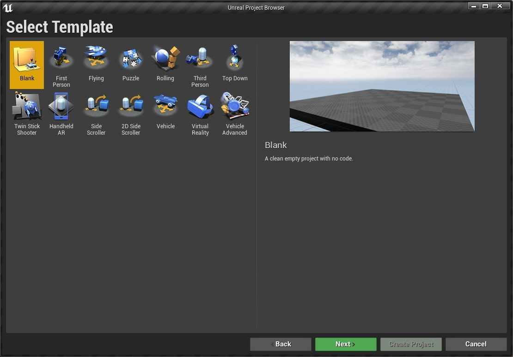
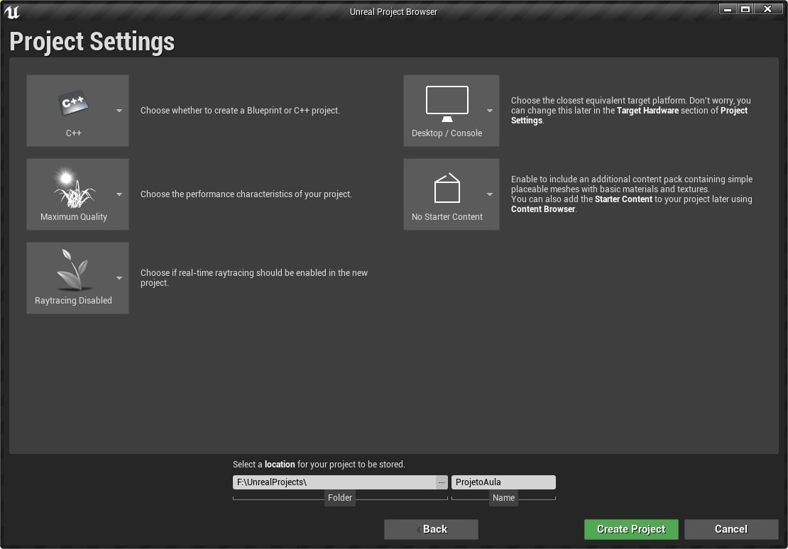
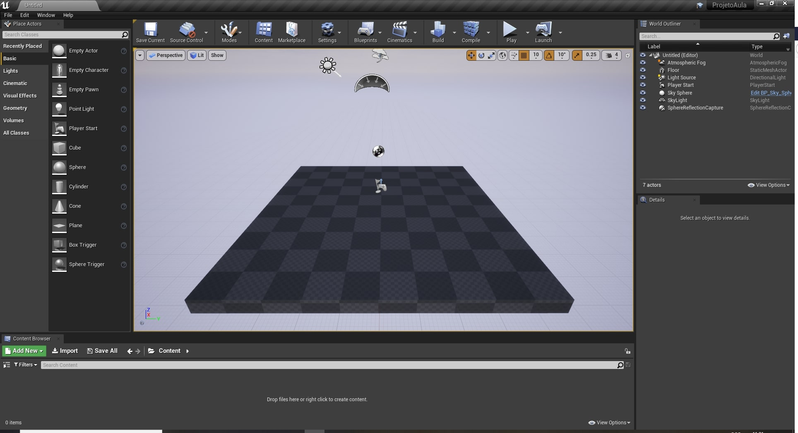

Neste capítulo vamos instalar o **Unreal Engine** e o Microsoft Visual Studio para programação C++.

   


## Índice
1. **[Instalando o Unreal e o Visual Studio](#1)**
    1. [Siga o passos recomendados pela Epic Games](#1.1)
    1. [Instalando os pacotes e o Visual Studio para programação com C++](#1.2)    
1. **[Criando um projeto para jogos no Unreal Engine](#2)**
    1. [Selecionando o tipo de projeto](#2.1)
    1. [Escolhendo o Template](#2.2)
    1. [Configurando o projeto inicialmente](#2.3)
    1. [Tela inicial do Unreal Engine](#2.4)
    1. [Iniciando um projeto no Unreal Engine 5](#2.5)
1. **[Entendo as pastas criadas](#3)**
    1. [Pasta de código C++ - Source](#3.1)
    1. [Pasta principal do projeto - Content](#3.2)
    1. [Pastas temporárias que podem ser removidas](#3.3)
    1. [Nomenclatura de pastas](#3.4)
1. **[Compilando o projeto usando o Windows Explorer](#4)**    
1. **[Configurando o editor de código](#5)**
1. [Atividades](#6)
    1. [Instale o Unreal Engine com Visual Studio](#6.1)

***

<a name="1"></a>
## 1. Instalando o Unreal e o Visual Studio
O **Unreal Engine** é um [Framework](https://pt.wikipedia.org/wiki/Framework) de desenvolvimento que incorpora vários editores e componentes para agilizar a construção de jogos. A **Epic Games** utiliza um sistema para gerenciamento dos seus produtos, o **Inicializador da Epic Games** responsável por:
- Instalação e atualização de jogos;
- Navegação da loja de produtos;
- Instalação e atualização das versões do **Unreal Engine**;
     

    *Figura: Gerenciamento de versões.*

<a name="1.1"></a>
### 1.1 Siga o passos recomendados pela Epic Games
1. Baixe e instale o [Inicializador da Epic Games](https://www.epicgames.com/store/pt-BR/download);
2. Inscreva-se para uma conta da Epic Games, se ainda não tiver uma;
3. Faça login no **Inicializador da Epic Games**;
4. Instale o Unreal Engine.

<a name="1.2"></a>
### 1.2 Instalando os pacotes e o Visual Studio para programação com C++
Para que possamos programar em linguagem **C++** com **Visual Studio** e o **Unreal Engine** é necessário baixar os pacotes de desenvolvimento em **C++**.

1. [Download Visual Studio](https://visualstudio.microsoft.com/pt-br/?rr=https%3A%2F%2Fwww.google.com%2F);
1. [Documentação Unreal e Visual Studio](https://docs.unrealengine.com/en-US/Programming/Development/VisualStudioSetup/index.html);
1. Selecionando os pacotes de programação;
    

    *Figura: Visual Studio Update para desenvolvimento de jogos.*   

  - Desenvolvimento de jogos com C++;
  - Desenvolvimento para Desktop com C++.      
  > **Por que instalar este pacote?**    
Porque muitas vezes foi necessário testar uma funcionalidade ou mesmo testar um conceito da linguagem e ter o compilador disponível foi uma mão na roda.

**[⬆ Volta para o início](#índice)**

<a name="2"></a>
## 2. Criando um projeto para jogos no Unreal Engine
Neste passo vamos criar um projeto para jogos utilizando **C++** pois irá ajudar na compreensão da estrutura de pastas e arquivos do **Unreal Engine**. O nome do projeto será ProjetoAula e o usaremos em vários capítulos.

<a name="2.1"></a>
### 2.1 Selecionando o tipo de projeto    
Neste passo vamos selecionar a categoria *Games* para o projeto.

  

*Figura: Unreal 4 - Select or create New Project, Games.*        

<a name="2.2"></a>
### 2.2 Escolhendo o Template
Para este projeto vamos escolher o `template blank` para que possamos entender os elementos do projeto e adicionar posteriormente outros pacotes.

     

*Figura: Select Template blank.*

> `Templates` são modelos com elementos disponíveis para cada tipo de jogo escolhido.

<a name="2.3"></a>
### 2.2 Configurando o projeto inicialmente
Em configuração de projeto escolha **C++** e `No Starter Content`, esta opção não vai instalar o pacote padrão de *assets* da **Epic Games** pois agora não é necessário, em seguida escolha uma pasta onde o projeto deverá ser instalado em `Select a Location for project to be stored`.



*Figura: Unreal engine project Settings.*

<a name="2.4"></a>
### 2.4 Tela inicial do Unreal Engine
Quando todos os passos anteriores forem concluídos corretamente a tela inicial deve aparecer.  



*Figura: Unreal Engine tela inicial.*

<a name="2.5"></a>
### 2.5 Iniciando um projeto no Unreal Engine 5
A versão 5 tem uma apresentação um pouco diferente mas o conceito ainda é o mesmo dos passos anteriores.


*Figura: Unreal 5 - Select or create New Project, Games.*


*Figura: Unreal 5 - Tela inicial.*        

**[⬆ Volta para o início](#índice)**

<a name="3"></a>
## 3. Entendo as pastas criadas
Após criar o projeto vamos verificar como estão as pastas criadas pela *engine*, utilizando o `explorer` do Windows, navegue até a pasta do projeto para verificar os arquivos criados, devem aparecer as seguintes pastas e arquivos:

```bash
|-- .vs
|-- Binaries
|-- Config
|-- Content
|-- Intermediate
|-- Saved
|-- Source
|-- ProjetoAula.sln
|-- ProjetoAula.uproject
```
A seguir vamos entender as pastas do projeto.

<a name="3.1"></a>
### 3.1 Pasta de código C++ - Source
A pasta `Source` contém arquivos com código fonte em **C++** e o arquivo com extensão *uproject* é o principal arquivo do projeto.

<a name="3.2"></a>
### 3.2 Pasta principal do projeto - Content
`Content` é a principal pasta, pois nela vão ficar contidos todos os arquivos do jogo, em outras palavras esta pasta é o ponto de montagem do projeto como veremos nos próximos capítulos.

<a name="3.3"></a>
### 3.3 Pastas temporárias que podem ser removidas
As pastas abaixo podem ser removidas pois podemos construir a qualquer momento quando compilar o projeto.

```bash
|-- Binaries
|-- Build
|-- Intermediate
|-- Saved
```

<a name="3.4"></a>
### 3.4 Nomenclatura de pastas
É recomendado que os arquivos e pastas devam ter um padrão de nomenclatura para melhor organização do projeto, abaixo duas boas recomendações de organização, discutiremos mais nos próximos capítulos.    
- [Estrutura do diretório](https://docs.unrealengine.com/en-US/Engine/Basics/DirectoryStructure/index.html);
- [UE4 Style Guide](https://github.com/Allar/ue4-style-guide/blob/master/README.md#unreal-engine-4-linter-plugin).

**[⬆ Volta para o início](#índice)**

<a name="4"></a>
## 4. Compilando o projeto usando o Windows Explorer
Para recompilar o projeto e recriar os arquivos podemos utilizar o `explorer` do Windows seguindo os passos abaixo:
1. Apague as pastas `Binaries`, `Build`, `Intermediate` e `Saved`;
1. Click com botão direito do mouse no arquivo **ProjetoAula.uproject**;
1. Escolha a opção `Generate Visual Studio project files`;

       

    *Figura: Recriando os arquivos do projeto, Generate Visual Studio Project files.*

1. Aguarde o termino da operação e abra o projeto.

**[⬆ Volta para o início](#índice)**

<a name="5"></a>
## 5. Configurando o editor de código
Para programar utilizando **C++** no Unreal devemos configurar um editor de código para ser responsável pela compilação, organização e edição da linguagem. A configuração esta em :

 `Menu` > `Editor Preferences` > `General` e `Source Code`, então escolha `Visualstudio`.   

   

*Figura: General - Source Code, Definindo o editor de código.*

>**Qual editor eu escolho, Visual Code ou Visual Studio?**
>
>Os dois são ótimos editores de código mas o Visual Code tem uma apresentação mais enxuta e quando se trata de utilizar ele para outras lingagens, como por exemplo Pyhton, ou mesmo editar um arquivo de formato Markdown é uma boa escolha.

**[⬆ Volta para o início](#índice)**

<a name="6"></a>
## 6. Atividades
<a name="6.1"></a>
### 6.1 - Instale o Unreal Engine com Visual Studio.
#### Regras
1. Instale todo o ambiente e crie um projeto de nome MeuPrimeiroProjeto.

#### Desafio      
1. Configure o Visual Studio para ser o editor padrão.

**[⬆ Volta para o início](#índice)**


***
## Referências
- [Estrutura do diretório](https://docs.unrealengine.com/en-US/Engine/Basics/DirectoryStructure/index.html)  
- [UE4 Style Guide](https://github.com/Allar/ue4-style-guide/blob/master/README.md#unreal-engine-4-linter-plugin)
- [Setting Up Visual Studio for Unreal Engine](https://docs.unrealengine.com/en-US/Programming/Development/VisualStudioSetup/index.html)
- [Installing Unreal Engine](https://docs.unrealengine.com/en-US/GettingStarted/Installation/index.html)
