Neste capítulo será apresentadas técnicas de programação para comunicação entre Blueprints.

&nbsp;&nbsp;[7.4 Como facilitar a comunicação entre objetos Blueprint? ](#7.4)  

&nbsp;&nbsp;&nbsp;&nbsp;&nbsp;&nbsp;[7.4.1 Estrutura da comunicação entre Blueprints](#7.4.1)

&nbsp;&nbsp;&nbsp;&nbsp;&nbsp;&nbsp;[7.4.2 Comunicação utilizando Acesso direto](#7.4.2)  

&nbsp;&nbsp;&nbsp;&nbsp;&nbsp;&nbsp;[7.4.3 Utilizando CAST](#7.4.3)      

&nbsp;&nbsp;&nbsp;&nbsp;&nbsp;&nbsp;[7.4.4 Utilizando o objeto Blueprint Interface](#7.4.4)  

&nbsp;&nbsp;&nbsp;&nbsp;&nbsp;&nbsp;[7.4.5 Event Dispatcher](#7.4.5)  

***

<a name="7.4"></a>
## 7.4 Como facilitar a comunicação entre objetos Blueprint?
Construindo um meio para que objetos individuais separados interagirem uns com os outros.  

Útil para fazer coisas como:
- Transmitindo um evento para vários ouvintes.
- Dizendo a um objeto específico para fazer algo.
- Consultando outro objeto por:   
  - Estado.    
  - Valores de propriedade.    
  - Valores variáveis.   
  - Resultados.   

<a name="7.4.1"></a>  
### 7.4.1 Estrutura da comunicação entre Blueprints
A seguir apresentamos um diagrama de como os elementos podem se comunicar e trocar informações.

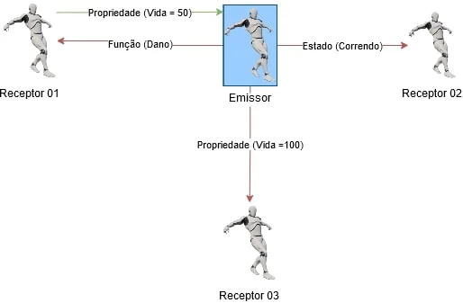

> Figura: Estrutura de Comunicação entre Blueprints.

A comunicação envolverá o seguinte:
- Um projeto de envio, um remetente de informações (Emissor).
- Pelo menos um `Receiving Blueprint` para receber as informações (Receptor).
- A comunicação exigirá uma referência em algum ponto.    
  Em outras palavras, uma das partes, o remetente ou o receptor,  deve tomar conhecimento da outra, isso ocorre porque, como afirmado acima, não existe um sistema de comunicação de amplo espectro.
- Toda a comunicação do **Blueprint** é unilateral.
  - **Blueprints** podem enviar dados para frente e para trás, mas requer que ambos os **Blueprints** configurem seus próprios caminhos individuais de comunicação.
  - As consultas são possíveis, mas são iniciadas pelo remetente (ainda unidirecional).   

**Preparando o ambiente de testes.**

Vamos criar um ator com os seguintes parâmetros para que funcione como controlador de objetos;
1. Crie um `Blueprint Actor` com nome *ControleLuz*;
2. Adicione e configure um `Static Mesh`;
3. Adicione e configure um `Box Colision`;
4. Implemente a função *LampadaVisible* para desligar e ligar a iluminação os objetos `Light Point` passados como parâmetro;    
  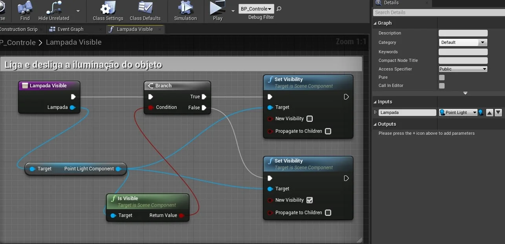    

  > Figura: Blueprint - Função para desligar e ligar uma point PointLight Component.

5. Adicione a variável *Lampada* do tipo `Point Light` e configure `Instance Editable` para `true`;         
        

  > Figura: Blueprint - propriedades do elemento PointLightComponent.

6. Adicione dois objetos `Light Point` na cena;
7. Em um dos objetos de iluminação adicione a `tag` *lampada*;
8. Associe um objeto na cena com a propriedade *Lampada* do *ControleLuz*;

<a name="7.4.2"></a>
### 7.4.2. Comunicação utilizando Acesso direto
Nesta passo iremos acessar diretamente o objeto e suas propriedades, usando o evento `OnBeginOverLap` para alterar o estado da lâmpada de ligado para desligado pois o mesmo é passado como parâmetro.  

**Chamando a função LampadaVisible.**

Criando um referência do objeto é possível acessar a função **LampadaVisible**.

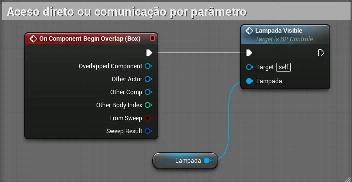

> Figura: Bluprint - Lógica da chamada da função usando OnBeginOverLap.  

Quando qualquer objeto colidir com o *ControleLuz* a lâmpada ira desligar ou ligar.   

**Vídeo.**

[](https://youtu.be/td6_Nm2tYfc "Vídeo: Comunicação entre Blueprints | Comunicação utilizando Acesso direto| 02 | Unreal Engine")   

> Vídeo: Comunicação entre Blueprints | Comunicação utilizando Acesso direto| 02 | Unreal Engine.*

<a name="7.4.3"></a>
### 7.4.3 Utilizando CAST

**CAST** ou conversão é um operador especial que força um tipo de dados a ser convertido em outro.

**C++.**   

```cpp
AStaticMeshActor* StaticMesh = Cast<AStaticMeshActor>(SM);
```

O comando acima inicializa o objeto `StaticMesh` do tipo `AStaticMeshActor`.

Para este passo usaremos o evento `OnEndOverlap` para ler todos os objetos que tem a `tag` *lampada* da cena e carregar em um *array* de objetos. Para cada objeto será executado o comando `CAST` informando o `type` para ter acesso a todas a funcionalidades do objeto.

**CAST do objeto PointLight.**

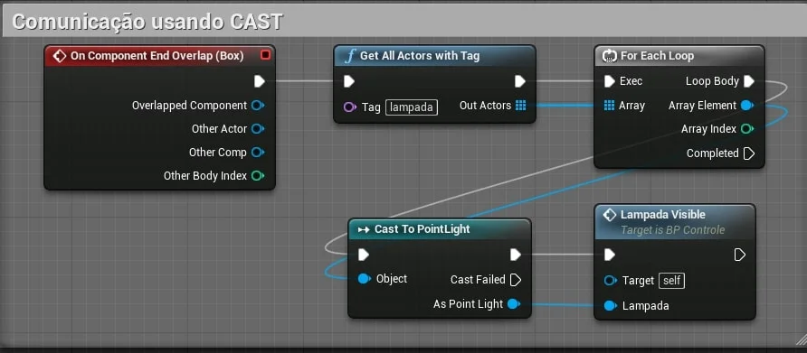      

> Figura:Bluprint - Lógica para pegar todos os objetos com uma determinada tag e chamar uma função usando GetAllActorWithTag e Cast to PointLight.

- `GetAllActorWithTag` - Retorna um array com todos os objetos da cena com a **tag** passada como parâmetro, no caso *Lampada*.

**Vídeo.**

[](https://youtu.be/VT6uob6UiSQ "Vídeo: Comunicação entre Blueprints | Usando Cast 03 Unreal Engine")    

> Vídeo: Comunicação entre Blueprints | Usando Cast 03 Unreal Engine.

<a name="7.4.4"></a>
### 7.4.4 Utilizando o objeto Blueprint Interface

**Blueprint interface** permite que vários tipos diferentes de objetos compartilhem e sejam acessados através de uma interface comum. Simplificando, as **Blueprint interfaces** permitem que diferentes **Blueprints** compartilhem e enviem dados entre si.

**Menu Blueprint/Blueprint Interface.**

Podemos implementar um **Blueprint interface** Utilizando o menu de contexto.

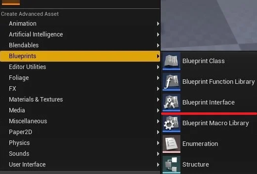    

> Figura: Blueprint - Menu > Blueprint Interface.


Crie o objeto com o nome *BPI_Colecionaveis* para que possamos continuar o exemplo.

**Editor de Blueprint Interface.**

Clicando e abrindo o objeto criado anteriormente perceba que o objeto não tem lógica pois neste caso o objeto funciona como uma ponte para eventos em outros objetos que deverão ter sua própria lógica.

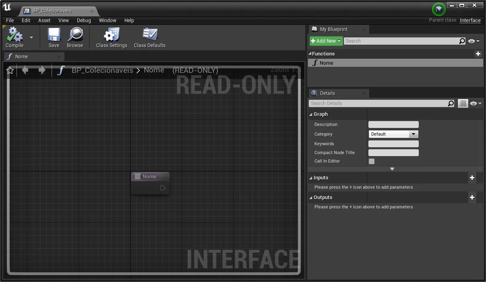      

> Figura: Blueprint - Editor da function interface.

Em seguida adicione uma função chamada *Nome* para que possa servir como função ponte.

**Implementando um objeto para utilizar a interface.**

1. Crie o ator *BP_Cadeira* do tipo `Blueprint Actor`;

2. Adicione e configure um `Static Mesh` com um malha de uma cadeira ou mesa;

3. Utilizando a opção `Class Settings` adicione a interface *BPI_Colecionaveis*.

4. Uma vez a interface configurada as funções de  *BPI_Colecionaveis* ficarão disponíveis através de eventos.   
  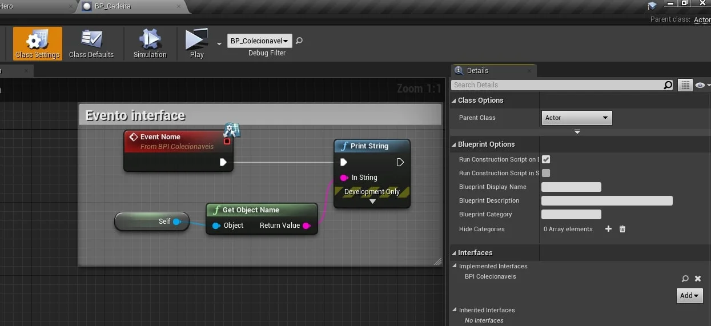     

  > Figura: Blueptint - Lógica da função Nome com GetObjectName.

5. Adicione no `Character` jogável *BP_Hero* e implemente a lógica abaixo.   
  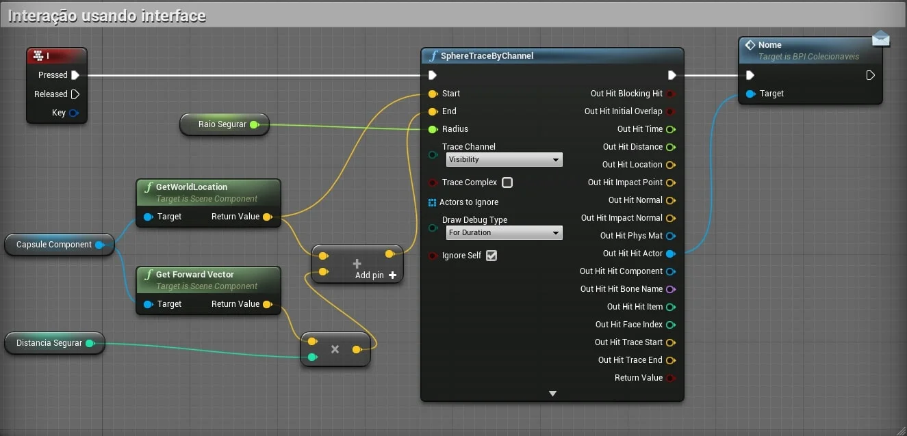     

  > Figura: Blueprint - Utilizando a função SphereTraceByChannel para capturar objetos e chamar a função nome.

  - **RaioSegurar** - Raio da esfera que é disparada;

  - **DistanciaSegurar** - Distância do raio disparado;

  - **Nome** - A função *Nome* da interface ficará disponível para ser chamada.     

**Utilizando parâmetros na Interface.**

1. Implemente a função *ExecutaAcao* com parâmetro *Acao* do tipo `string`, usaremos esse parâmetro para determinar ações que o objeto pode executar;       
  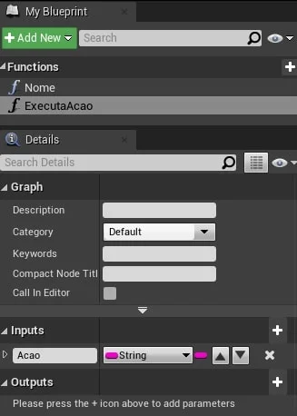   

  > Figura: Blueptint - Declaração da função com parâmetros.

2. Ao chamar a função é fornecido um valor.   
  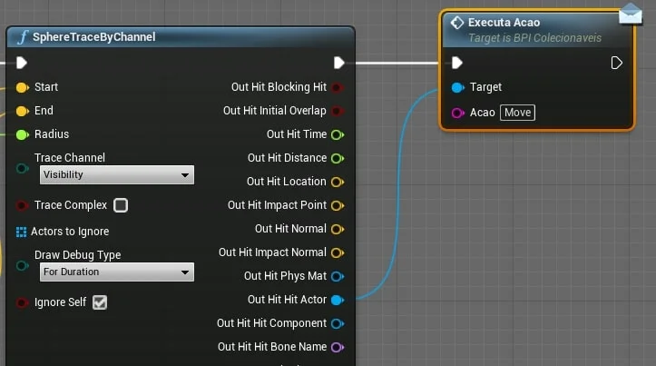     

  > Figura: Blueptint - Exemplo da chamada da função com parâmetros.

3. Implemente a lógica de tratamento do parâmetro dentro do objeto cadeira ou mesa.        
  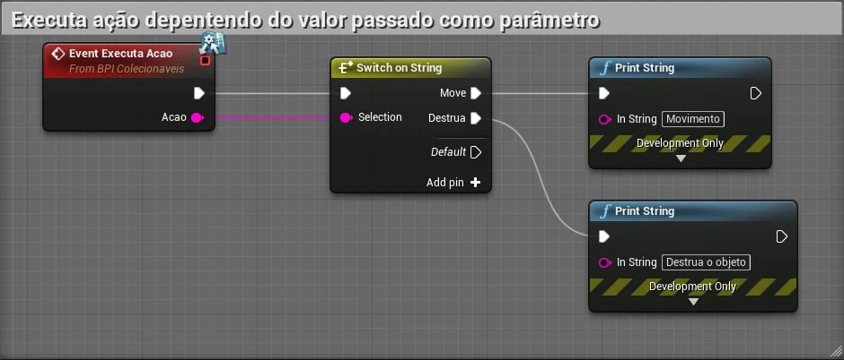  

  > Figura: Blueptint - Dentro do objeto podemos chamar o evento para chamar a Interface.


Podemos melhorar o controle utilizando uma variável `enumeration` para parametrizar as ações.  

**Vídeo.**

[](https://youtu.be/ugqPc5-YQV4 "Vídeo: Comunicação entre Blueprints | Utilizando o objeto Blueprint Interface| 04 | Unreal Engine")      

> Vídeo: Comunicação entre Blueprints | Utilizando o objeto Blueprint Interface| 04 | Unreal Engine.

<a name="7.4.5"></a>
### 7.4.5 Event Dispatcher

São eventos que transmitem mensagens para outros **Blueprints**, os receptores "ouvem" as mensagens e podem implementar a sua própria lógica de tratamento.   

Vinculando um ou mais eventos a um `Event Dispatcher` , você pode fazer com que todos esses eventos sejam disparados assim que o `Event Dispatcher` for chamado.     

Esses eventos podem ser vinculados a uma classe **Blueprint**, mas os `Event Dispatchers` também permitem que eventos sejam disparados dentro do `Level Blueprint`.

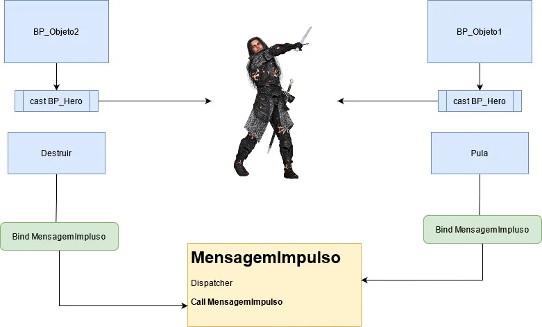

> Figura: Estrutura do EventDispatcher.

**Exemplo utilizando o Character BP_Hero que será o emissor dos eventos.**

1. Adicionamos `EventDispatcher`;

2. No `Event Graph` implementados a chamada do evento utilizando **Call** (Call nome do evento).     

  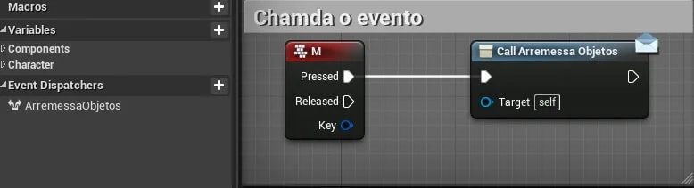    

  > Figura: Blueprint - Exemplo de chamada do evento Bind Event com a função Arremessa Objetos.

**Lógica dos objetos que vão interagir com o personagem.**

1. No objeto **BP_Cubo** por exemplo adicionamos referência ao personagem **BP_Hero** usando `cast` para ter acesso ao evento registrado no `dispatcher`;     
  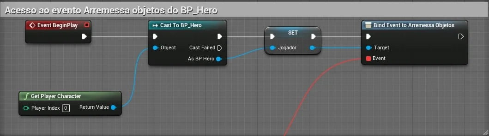      

  > Figura: Blueprint - Cast de outro objeto para acessar o Dispatcher registrado dentro desse objeto.

2. Implementamos `Bind Event` do disptacher para  associar um evento a chamada.     

  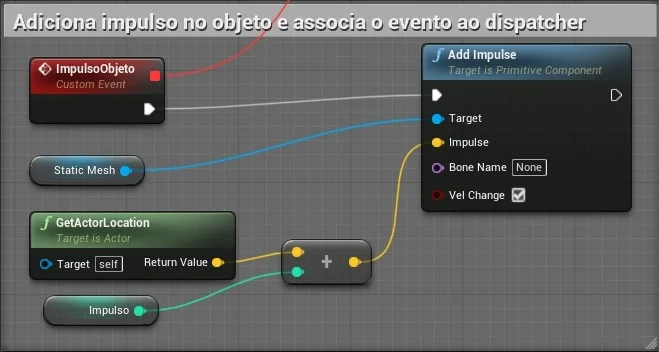

  > Figura: Blueprint - Adicionando impulso, arremessando os objetos.

**Vídeo.**

[](https://youtu.be/bmxFZH3hFxc "Vídeo: Comunicação entre Blueprints | Event Dispatcher| 05 | Unreal Engine")   

> Vídeo: Comunicação entre Blueprints | Event Dispatcher| 05 | Unreal Engine.    
