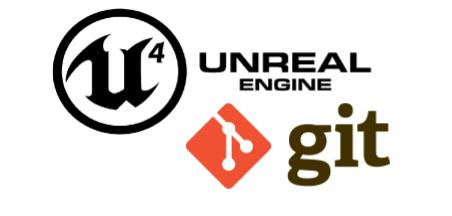

Neste capítulo vamos instalar o *git* para versionamento de arquivos contendo lógicas de programação e apresentar comandos básicos.




## Índice
1. **[Para que server o controle de versão?](#1)**
1. **[Ferramentas para controle de versão](#2)**
1. [Instalando Git Client e criando uma conta no GitHub](#3)
1. [Entendo o fluxo de trabalho](#4)  
1. [Utilizando comandos do PowerShell para utilizar o Git Client](#5)  
    1. [Clonando o projeto](#51)
    1. [Criando o projeto](#52)
    1. [Atualizando o projeto no servidor](#53)
    1. [Atualizando o projeto no cliente](#54)
1. [Ignorando pastas e arquivos](#6)

***

<a name="1"></a>
## 1. Para que server o controle de versão?
Quando programamos existe a necessidade de gerenciar as alterações que ocorrem durante o desenvolvimento do projeto e até mesmo depois, acompanhe o seguinte exemplo:  
- Trecho de código inicial, vamos chamá-lo de **A**.
```cpp
if (a > b) {
  resultado = (a + b)
}
```
- Então, alteramos o código, vamos chamar de **B**, ou mesmo o corrigimos para :
```cpp
if (a > b) {
  resultado = (a + b * 10)
}
```
Perceba que para facilitar a manutenção e desenvolvimento em equipe e pensando em documentar a lógica temos que dispor das seguintes facilidades.
- Capacidade reverter o código atual para o estado anterior, lógica **A**.
- Necessidade de compartilhar o código como outros desenvolvedores.
- Necessidade de documentar as alterações no momento que forem compartilhadas.

<a name="2"></a>
## 2. Ferramentas para controle de versão
Existem várias ferramentas para controle de versão disponíveis no mercado, sendo que o **Unreal Engine** trabalha de forma nativa com **SVN**, **Perforce** e **Git**, esta última até o momento esta em versão beta.      

<a name="2.1"></a>
### 2.1 Algumas ferramentas de versionamento
- **GitHub** - É um serviço de armazenamento de nuvem para gerenciamento de códigos de aplicação. É possível ter uma conta gratuita e armazenar até 500Mb por projeto;
- **Gitlab** - É um serviço de armazenamento de nuvem para gerenciamento de códigos de aplicação concorrente do Github mas com o diferencial que pode ser instalado em um ambiente corporativo;
- **SVN** - Gerenciador de versão para vários tipos de arquivos, inclusive arquivos de mídia, para ambientes corporativos;
- **Git LFS** - Large File System é uma versão do git para armazenamento de arquivos de mídia ou binários, podendo armazenar de forma gratuita até 1GB.

<a name="2.2"></a>
### 2.2 Estrutura do GIT


<a name="3"></a>
## 3. Começando a trabalhar com o Git e o Unreal Engine
Neste passo vamos preparar o ambiente e projeto para começar a trabalhar com o gerenciamento de versões e  utilizaremos o GitHub como repositório de arquivos e gerenciador de versões, para tal executaremos os próximos passos.

<a name="3.1"></a>
### 3.1 Criando uma conta e o projeto no Github
Temos que criar uma conta no [Github](https://github.com/), em seguida criamos um novo repositório para o projeto  **ProjetoAula** com os seguintes parâmetros:

- `Repository name` - ProjetoAula;
- `Public` - Qualquer pessoa pode acessar;
- `Initialize this repository with:` - Marque as opções:
    - `Add a README file` - Cria um arquivo em formato Markdown para servir como apresentação do projeto;
    - `Add .gitignore` - Arquivo para controlar o que pode ser enviado para o repositório;

<a name="3.2"></a>
### 3.2 Instalando Git Client
É necessário instalar o **Git client** no computador local para que seja criada a estrutura de versionamento local.

Utilizaremos comandos do **PowerShell** para testar a instalação.

1. Instale o [Cliente GIT](https://git-scm.com/downloads);
1. Crie uma chave de autenticação (Key-Gen) com o GIT-BASH;
```shell
ssh-keygen
```
> Este passo só é necessário se no momento de envio (push) solicitar senha e o sistema operacional não gerenciar as credenciais adequadamente.

1. Adicione a chave no GitHub **Settings >SSH and GPG Keys**;
1. Para testar execute os comandos:
```shell
mkdir -p D:\temp\testegit
cd D:\temp\testegit
git init
git status
git remote -v
```
1. É possível instalar e utilizar uma aplicação visual para gerenciar do comandos, como por exemplo o [GIT-Desktop](https://desktop.github.com/) ou [Sourcetree](https://www.sourcetreeapp.com/) .

<a name="4"></a>
## 4. Entendo o fluxo de trabalho
Quando utilizamos um gerenciador de versão temos que seguir um fluxo de trabalho para compartilhar o código armazenado localmente.

Segue abaixo:
1. `Add` - Adicionar as alterações para um registro local, isso permite verificar quais arquivos foram alterados.
1. `Commit` - Comprometer ou Confirmar as alterações e criar uma etiqueta ou informação para identificar o trabalhado realizado, por exemplo:    
  ```bash
  feat: Adicionado lógica de movimentação do jogador com mouse X e Y em BP_HeroBase.
  fix: Corrigido o evento MostraMenu em BP_GameInstance, anteriormente o objeto apresentava erro no momento de instanciar o objeto BP_MenuPrincipal, foi adicionado o nó IsValid antes da execução.
  fix: Lista de correções #14,#252
  ```
1. `Push` - Empurrar ou publicar, neste caso, as alterações para o servidor.

<a name="5"></a>
## 5. Utilizando comandos do PowerShell para utilizar o Git Client
É interessante aprender comandos do **PowerShell** para utilizar o **Git Client** pois existem diversas situações que não estão nas ferramentas visuais, como por exemplo:
- Resolução de conflitos.
- Adicionar nome de versão para um determinado conjunto de arquivos.

Então vamos apresentar os principais comandos.

<a name="5.1"></a>
### 5.1 Clonando o projeto
Clonar o projeto significa baixar o projeto do servidor para a máquina cliente (local).

```shell
    mkdir -p D:\UnrealProjects
    git clone https://github.com/myerco/ProjetoAula.git
    cd ProjetoMP
    git status
```
<a name="5.2"></a>
### 5.2. Criando o projeto
Podemos criar um novo projeto no cliente e em seguida atualizar o servidor.     
```shell
    mkdir -p D:\UnrealProjects\ProjetoMP
    cd D:\UnrealProjects\ProjetoMP
    git init
    git remote add origin https://github.com/myerco/ProjetoAula.git
    git remote -v
```
<a name="5.3"></a>
### 5.3 Atualizando o projeto no servidor
Mudanças podem ser replicadas do cliente para o servidor.
```shell
    git add .
    git commit -m "feat: Atualizando o projeto.. Alteração de movimentação de personagem"
    git push origin master
```
<a name="5.4"></a>
### 5.4 Atualizando o projeto no cliente (local)
O comando `pull` baixa os arquivos do servidor.
```shell
    git status
    git pull origin master
```
<a name="6"></a>
## 6. Ignorando pastas e arquivos
É importante ignorar pastas e arquivos do cliente para que não possam ser publicadas no servidor utilizando o arquivo `.gitignore` na pasta raiz do projeto, considerando os seguintes aspectos.

**Segurança**  
Arquivos de controle de senhas ou outros dados relativos a segurança não podem ficar disponíveis publicamente.

**Arquivos e pastas temporárias**  
Estes arquivos podem ser recriados ao compilar o projeto.

**Arquivos grandes**  
Arquivos de imagens ou elementos de grande tamanho podem ser excluídos do versionamento e devemos considerar outras métodos de armazenamento como por exemplo:
  - [Git LFS](https://git-lfs.github.com/)
  - [SVN](https://tortoisesvn.net/)

### Exemplo de arquivo .gitignore  
```shell
# Projetos exemplo
ThirdPerson/
ThirdPersonBP/
Geometry/
Mannequin/
StarterContent/
# Visual Studio 2015 user specific files
.vs/
# Compiled Object files
*.slo
*.lo
*.o
*.obj
```

***
## Referências
- [Top 20 Git commands with examples](https://dzone.com/articles/top-20-git-commands-with-examples)
- [Source Control](https://docs.unrealengine.com/en-US/Basics/UI/SourceControl/index.html)
- [Using SVN as Source Control](https://docs.unrealengine.com/en-US/ProductionPipelines/SourceControl/SVN/index.html)
- [Git, GitHub, & Workflow Fundamentals ]([https://dev.to/mollynem/git-github--workflow-fundamentals-5496)
