***

<a name="8"></a>
## CAPÍTULO 8 - Estruturas de dados e Interface com usuário

Neste capitulo vamos explorar os objetos do tipo **Data tables** que são basicamente tabelas de dados disponíveis para os desenvolvedores e são definidas por tipos *Structure*.  

&nbsp;&nbsp;[8.2 O que são Data Tables?](#8.2)

&nbsp;&nbsp;&nbsp;&nbsp;&nbsp;&nbsp;[8.2.1 Criando um objeto do tipo Data Table](#8.2.1)

&nbsp;&nbsp;&nbsp;&nbsp;&nbsp;&nbsp;[8.2.2 Inserindo dados no objeto do tipo Data Table](#8.2.2)

&nbsp;&nbsp;&nbsp;&nbsp;&nbsp;&nbsp;[8.2.3 Importando dados de um arquivo csv](#8.2.3)

&nbsp;&nbsp;&nbsp;&nbsp;&nbsp;&nbsp;[8.2.4 Exemplo de utilização de Data Table](#8.2.4)

***

<a name="8.2"></a>
## 8.2 O que são Data Tables?
**Data Tables** são estruturas de dados com vários tipos de variáveis agrupados e podem ser utilizadas para armazenamento de forma estática de informações dos personagens e suas características, recursos do jogo como espadas, escudos, magias, propriedades do jogo como níveis, dificuldades e pontuação.

<a name="8.2.1"></a>
### 8.2.1 Criando um objeto do tipo Data Table

1. Vamos implementar o **SElementos** do tipo *Structure* que servirá como base para o objeto `Data Table`.     
    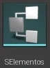  

    > Figura: Blueprint - Structure SElementos.

2. Vamos definir as seguintes variáveis.      
  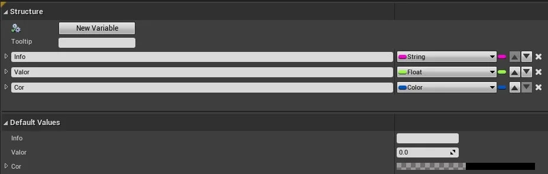   

  > Figura: Blueprint - Criando as variáveis dentro da estrutura.

3. Utilizando o menu de contexto escolha `Miscellaneous` > `Data Table`.          
  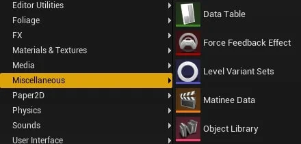

  > Figura: Blueprint - Menu de contexto Miscellaneous > Data Table.

4. Devemos definir a estrutura de dados da tabela utilizando o variável **SElementos** do tipo `Structure`.    
  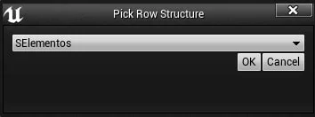   

  > Figura: Blueprint - Definindo a estrutura da tabela usando Structure e Data Table.

5. *DTElementos* do tipo `Data Tables`.   
  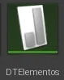

  > Figura: Blueprint - Data Table.

<a name="8.2.2"></a>
### 8.2.2 Inserindo dados no objeto do tipo Data Table

Ao abrir o objeto de Data Table é apresentado um editor para manipulação de dados, inserindo, removendo e alterando as linhas.  
A coluna **RowName** não pode ser repetida, funcionado como identificador único da linha.     

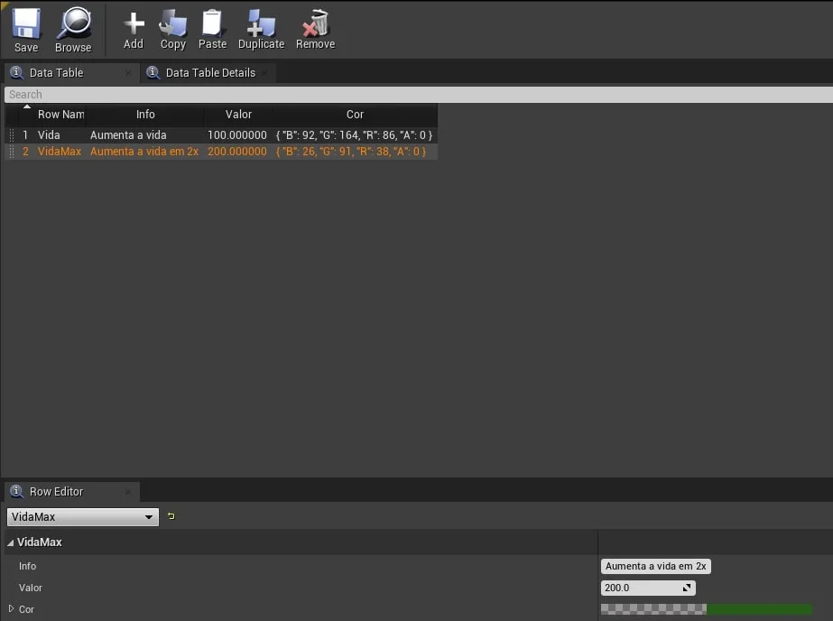

> Figura: Blueprint - Exemplo do editor para inserir linhas na tabela.

<a name="8.2.3"></a>
### 8.2.3 Importando dados de um arquivo csv
É possível importar as linhas de um arquivo texto com elementos separados por vírgulas.

Primeiramente vamos definir um arquivo separado por vírgulas com as informações necessárias para o nosso propósito.

```csv
rowname,Name,type,property,value
1,Mithril,Rock,Life,10
2,The Ring of Barahir,Ring,Strength,50
3,Soul Stone,Gem,Damage,50
4,Mithril Stone Black,Rock,Life,10
```

Agora vamos implementar o objeto SArtifact do tipo *Structure* com a seguinte estrutura para que possamos carregar os dados do arquivo:

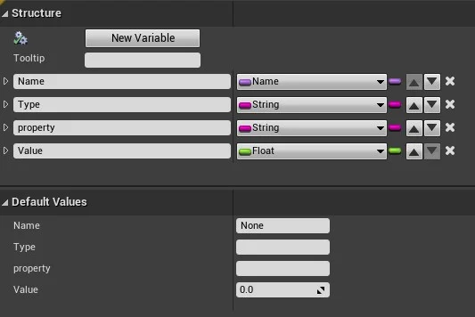

> Figura: Blueprint - Definindo Structure para carregar os dados.

Em seguida implemente o objeto TArtifact do tipo `Data Table` e com o botão direito do mouse em cima do objeto e selecione `Reimport`, logo em seguida escolha o arquivo csv:          

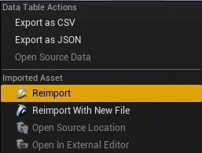

> Figura: Blueprint - Data Table Reimport.

Os dados serão importados e na aba `Data Table Details` os parâmetros de importação serão apresentados.

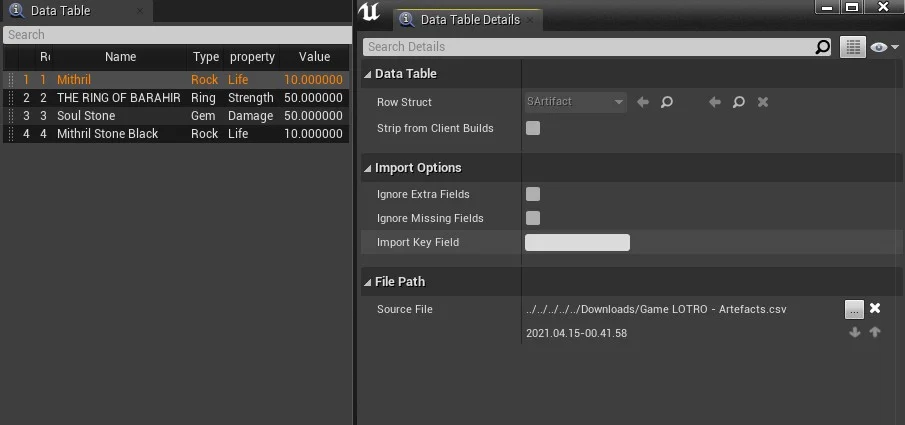

> Figura: Blueprint - Data Table Details.

<a name="8.2.4"></a>
### 8.2.4 Exemplo de utilização de Data Table
Para este exemplo vamos implementar um objeto para automaticamente adicionar outros objetos (Vida) na cena, a posição dos objetos pode se controlada com um vetor de coordenadas.  

**Implementando o objeto BP_Vida.**

Este objeto deverá estar na cena para interação com o jogador pois pode aumentar o valor da vida do personagem com as seguintes variáveis e componentes.  

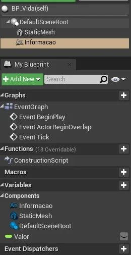

> Figura: Blueprint - Exemplo do objeto BP_vida.

**Implementando o objeto BP_Elementos.**

Este objeto serve como referência na cena para posicionamento de objetos *BP_Vida* com as seguintes variáveis e componentes.   

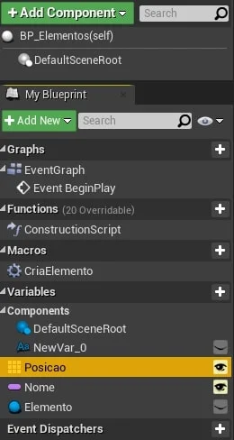

> Figura: Blueprint - Exemplo do objeto de posicionamento dos objetos vida.


Observe que a variável **Posicao** é do tipo vector e tem a propriedade `Show 3D Widget` habilitada para facilitar o posicionamento do elemento na cena.  

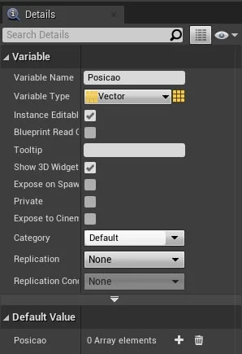   

> Figura: Blueprint - Show 3D Widget.

O Vetor **Posicao** na cena.   

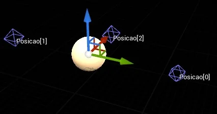

> Figura: Blueprint - Posição do ator na cena.

Detalhes das coordenadas.   

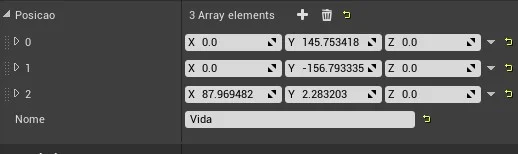

> Figura: Blueprint - Coordenadas.

**Logíca da carga dos dados.**

Para cada elemento do vetor *Posicao* é implementado um objeto do tipo BP_vida nas coordenadas de vetor.   

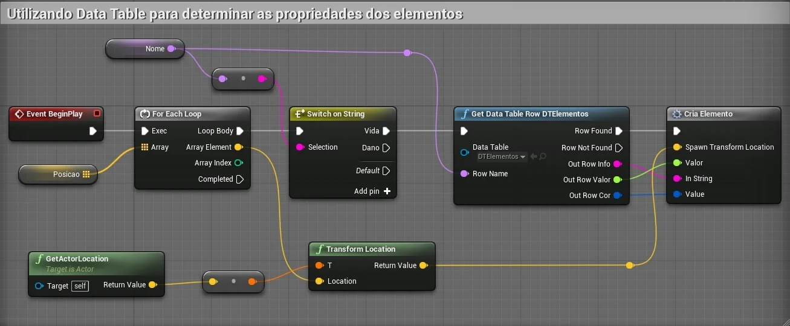

> Figura: Blueprint - Carregando dados utilizando GetDataTableRow.

- `Get data Table Row` - Tenta recuperar uma linha da `DataTable` por meio de texto em **RowName**.  No exemplo a linha recuperada deve coincidir com uma variável passada como parâmetro;

Para cada objeto adicionado na cena são definidas propriedades.    

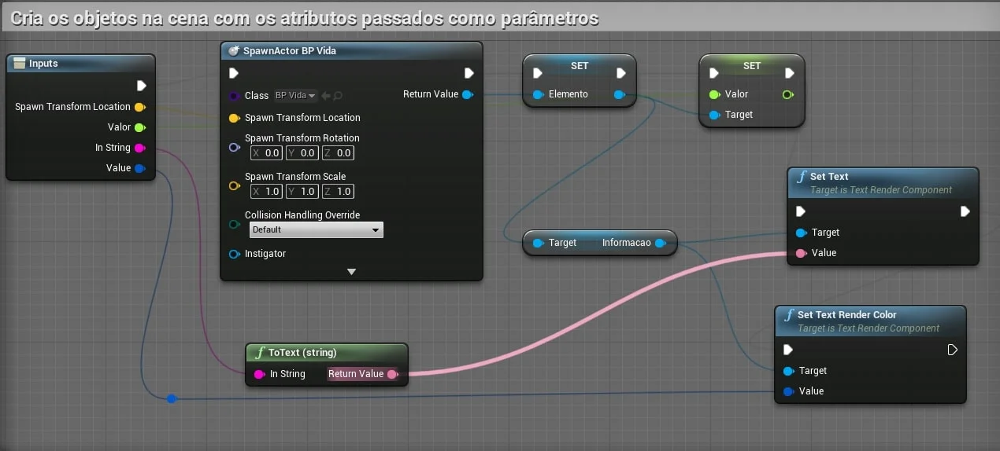

> Figura: Blueprint - Criando objetos usando os dados do Data Table.
