***

<a name="7"></a>
## CAPÍTULO 7 - Atores e movimentação

Neste capítulo serão apresentados os elementos de controle de tempo (Delta Time) dentro do **Unreal Engine** e utilizar para  implementar movimentação de objetos.
Apresentaremos também como funciona o sistema de coordenadas dos objetos.

&nbsp;&nbsp;[7.5 O que é Delta time?](#7.5)

&nbsp;&nbsp;&nbsp;&nbsp;&nbsp;&nbsp;[7.5.1 Lista de comandos do console](#7.5.1)

&nbsp;&nbsp;&nbsp;&nbsp;&nbsp;&nbsp;[7.5.2 Delta seconds](#7.5.2)

&nbsp;&nbsp;&nbsp;&nbsp;&nbsp;&nbsp;[7.5.3 Timeline](#7.5.3)

&nbsp;&nbsp;&nbsp;&nbsp;&nbsp;&nbsp;[7.5.4 Abrindo portas](#7.5.4)

&nbsp;&nbsp;&nbsp;&nbsp;&nbsp;&nbsp;[7.5.5 Curves](#7.5.5)   

&nbsp;&nbsp;&nbsp;&nbsp;&nbsp;&nbsp;[7.5.6 Velocidade](#7.5.6)

&nbsp;&nbsp;&nbsp;&nbsp;&nbsp;&nbsp;[7.5.7 Sistema de coordenadas](#7.5.7)  

<a name="7.5"></a>
## 7.5 O que é Delta Time?
É o tempo entre cada frame.  
Frame: Um quadro ou imagem apresentada, uma animação é composta por vários frames.

**Exemplo.**

|       |   |   |   |   |   |   |   |   |   |   |
|:-:    |-  |-  |-  |-  |-  |-  |-  |-  |-  |-  |
|Frames | 1 | 2 | 3 | 4 | 5 | 6 | 7 | 8 | 9 | 10|
| Delta | 1 | 2 | 3 |4  | 5 | 6 | 7 | 8 | 9 |   |

- 10 Fps = 10 frames a cada segundo;
1 segundo / 9 = 0,1 segundo ou 100ms;
- 100 FPS = 100 frames a cada segundo;
1 segundo /99 = 0,01 segundo ou 10ms
- 30 FPS = 1/29 , 0.034 34ms;
- 60 FPS = 1/59 , 0.017 17ms;

<a name="7.5.1"></a>
### 7.5.1 Lista de comandos do console

Para habilitar o console de comandos para verificar e alterar o *FPS* do jogo utilizando o Menu `Project Settings` > `Open`.   

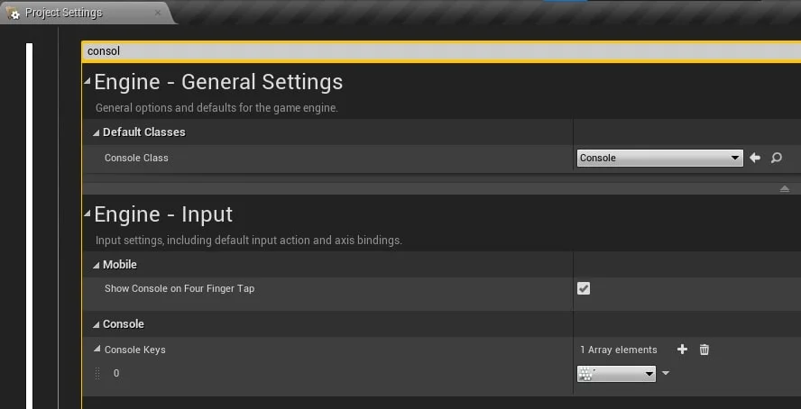

> Figura: Unreal Engine - Project Settings configuração do comando para acessar o Console.


1. Para acessar o interpretador de comandos pressionando a tecla  **´**, configurada anteriormente, e o editor de comandos aparece na tela.
2. Apresenta o valor de FPS.
```bash
stat fps
```
3. Altera o valor de FPS para 100.
```bash
t.MaxFPS 100
```
4. Exibe informações de desempenho para os threads Frame, Game, Draw, GPU, RHIT e DynRes do projeto.
```bash
stat unit
```
5. Fornece feedback sobre quanto tempo os vários *Ticks* de jogo estão demorando.
```bash
stat game
```

<a name="7.5.2"></a>
### 7.5.2 Delta seconds
**Delta Seconds** é a quantidade de tempo decorrido desde o último evento **Tick**. Ao multiplicar seu deslocamento por **Delta Seconds**, seu movimento será independente da taxa de quadros.    

Por exemplo, seu peão tem uma velocidade máxima de 100. Se um segundo tivesse se passado desde o último tique de evento, seu peão moveria todas as 100 unidades. Se meio segundo tivesse passado, ele moveria 50 unidades.

**Tabela de velocidade.**

|Distância  | Velocidade | Distância/Velocidade |  FPS | Delta Seconds | Y |
|:-:|-|-|-|-|-|
|100  | 10 | 10 | 100 | 0,1 | 1 |
|100  | 10 | 10 | 60 | 0,166 | 1,6 |
|100  | 10 | 10 | 30 | 0,333 | 3 |
|100  | 10 | 10 | 20 | 0,5 | 5 |

`Delta seconds` = Intervalo entre os quadros.


**Utilizando o Delta seconds com Event Tick.**

Para exemplificar vamos controlar o movimento do objeto independente do *FPS* utilizando o evento `Tick`.  

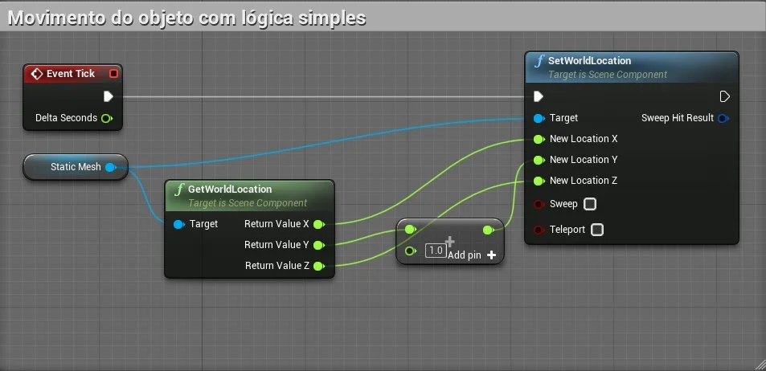

> Figura: Blueprint - Event Tick com DeltaTime e SetWorldLocation.

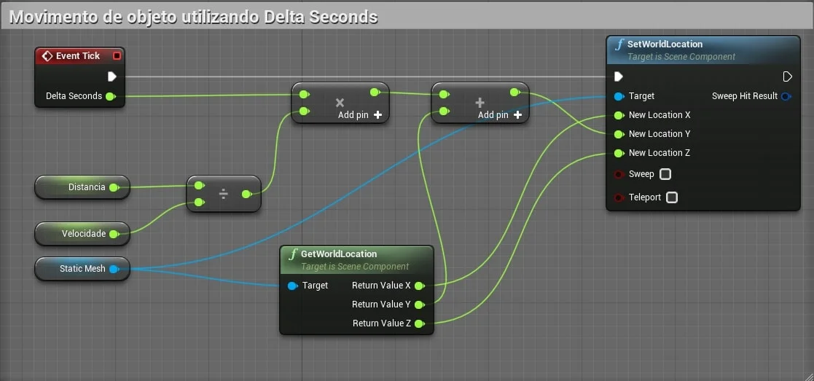

> Figura: Blueprint - Event Tick com DeltaTime e SetWorldLocation e calculando a velocidade.

- **Distancia** - Valor = 1000;

- **Velocidade** - Valor = 10;

- O resultado esperado é que mesmo com um *FPS* baixo o movimento ainda se mantenha uniforme.

**Fixando o FPS do projeto.**

Podemos fixar o *FPS* do projeto utilizando o menu `Project settings` > `Use fixed frame rate`.  

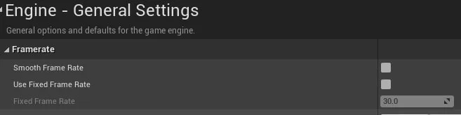

> Figura: Unreal Engine - General Settings Frame Rate.

**Vídeo.**

[](https://youtu.be/gQdT8rah4CU "Vídeo: Delta time e sistema de coordenadas  - Utilizando o Delta seconds 02  - Unreal Engine")

> Vídeo: Delta time e sistema de coordenadas  - Utilizando o Delta seconds 02  - Unreal Engine.


<a name="7.5.3"></a>
### 7.5.3 Timeline
Os nós da linha de tempo são nós especiais dentro de **Blueprints** que permitem que uma animação simples baseada em tempo seja projetada e reproduzida rapidamente com base em eventos no jogo. As linhas do tempo são como sequências de matinê simples, pois permitem que valores simples sejam animados e que eventos sejam disparados ao longo do tempo.

**Utilizando variáveis no Timeline.**

Para este exemplo vamos utilizar um objeto *Lampada* do tipo `Light Component`  para apresentar a estrutura de nó *TratamentoLuz* do tipo `TimeLine`.

1. Criamos o objeto *BP_ControleLuz* do tipo `Box Trigger`.   
  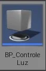

  > Figura: Blueprint - Box Trigger BP_ControleLuz.

2. Em *BP_ControleLuz* adicionamos a variável *Lampada* do tipo `PointLight` e a configuramos como publica;

3. Adicionamos na cena um componente `PointLight`;

4. Adicionamos o BP_ControleLuz na cena e associamos o objeto `PointLight` na propriedade *Lampada*.    
  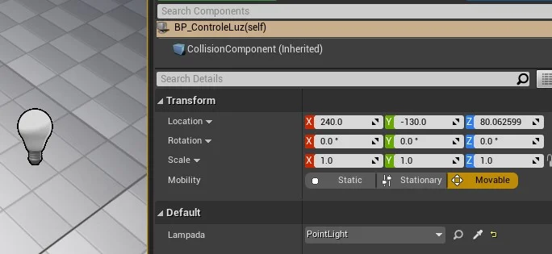

  > Figura: Blueprint - CollisionComponent e PointLight.

5. Em *BP_ControleLuz* adicionamos a lógica do tratamento de luz;   
  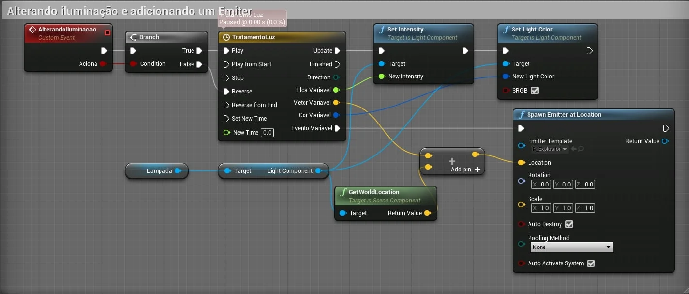

  > Figura: Blueprint - Lógica para tratamento da luz utilizando Set Light Color, Set Intensity e TimeLine.

6. Variáveis do objeto `TimeLine`.    
  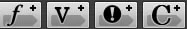

  > Figura: Blueprint - Variáveis do objeto Timeline.

7. **FloatVariavel** - Do tipo `float` controla a intensidade da luz durante o tempo 1.   
  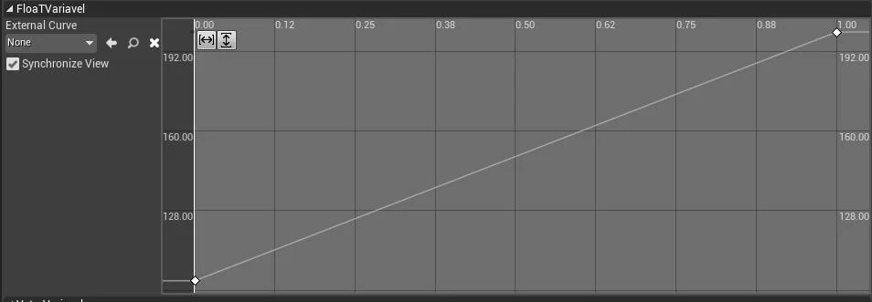

  > Figura: Blueprint - Exemplo de variável float do DeltaTime.

8. **Vetorvariavel** - Do tipo `Vector` altera o valor das coordenadas durante o tempo 4.    
  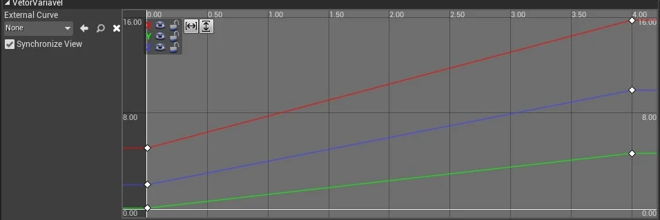  

  > Figura: Blueprint - Exemplo de variável Vector do DeltaTime.

9.  **CorVariavel** - Do tipo `color` altera as cores da luz conforme o tempo passa.  
  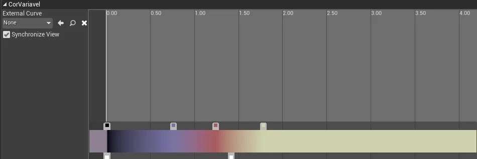  

  > Figura: Blueprint - Exemplo de variável Color do DeltaTime.

10. **EventoVariavel** - Do tipo `Event` dispara um evento no tempo 2,4 e 6.   
  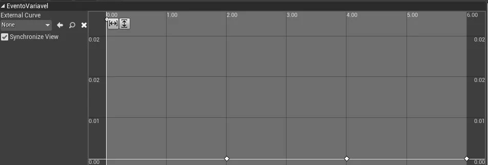

  > Figura: Blueprint - Exemplo de um evento do DeltaTime.

**Acionando o evento para alterar a iluminação.**

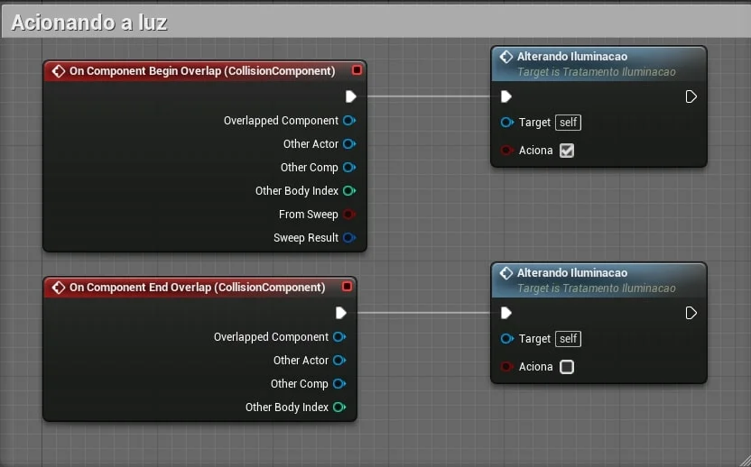

> Figura: Blueprint - Exemplo da lógica para alterar a iluminação.

**Funções Blueprint para tratamento.**

- `SetLooping`;

- `SetTimeLength`;

- `GetTimeLength`;

- `GetPlaybackPosition`;

- `Auto play`;

- `Ignore time dilation`;

- `Set timer by event e clear timer`;

- `SetTimerbyEvent`;

- `ClearAndInvalidateTimerByHandle`;

- `SetTimerbyFunction`;

**Vídeo.**

[](https://youtu.be/qOUYp-XWUtw "Vídeo: Delta time e sistema de coordenadas  - Timeline  03  Float - Unreal Engine")

> Vídeo: Delta time e sistema de coordenadas  - Timeline  03  Float - Unreal Engine.

[](https://youtu.be/EJQwXxjiS58 "Vídeo: Delta time e sistema de coordenadas  - Timeline  04  Color - Unreal Engine")

> Vídeo: Delta time e sistema de coordenadas  - Timeline  04  Color - Unreal Engine.

[](https://youtu.be/YkvP6tMMly0 "Vídeo: Delta time e sistema de coordenadas  - Timeline  05 Event - Unreal Engine.")

> Vídeo: Delta time e sistema de coordenadas  - Timeline  05 Event - Unreal Engine.

[](https://youtu.be/w5VpoM95B-Q "Vídeo: Delta time e sistema de coordenadas  | Timeline  06  Vector | Unreal Engine")

> Vídeo: Delta time e sistema de coordenadas  - Timeline  06  Vector - Unreal Engine.


<a name="7.5.4"></a>
### 7.5.4 Abrindo portas
Nos exemplos a seguir vamos movimentar um objeto para simular a movimentação de abertura de uma porta de duas formas, deslizando e girando.  

**Deslizando a porta.**

Neste exemplo vamos implementar um movimento no eixo Y de abertura de uma porta.

1. Adicionando o elemento Movimentando `TimeLine` e alerando a posição do objeto.   
  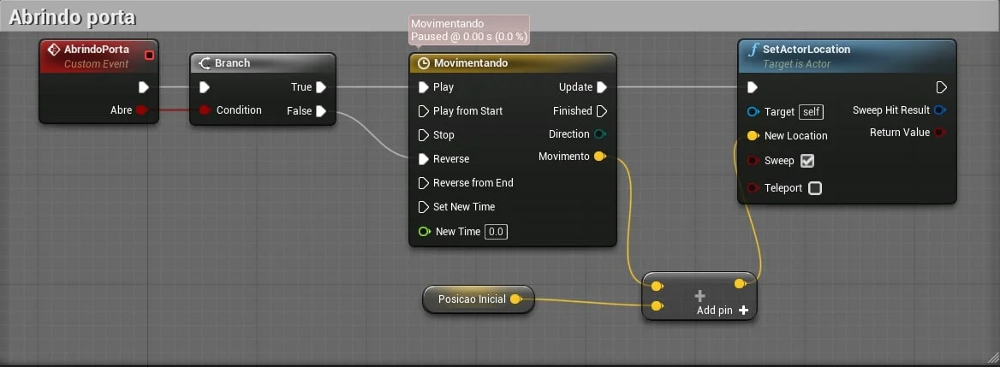

  > Figura: Blueprint - Exemplo de movimentação deslizando a porta.

2. *Movimentando* utiliza a variável Movimento do tipo `Vector`. Somente o valor de Y é alterado.   
  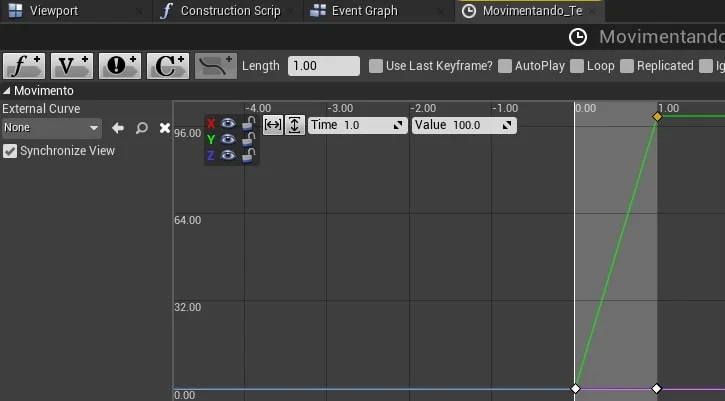

  > Figura: Blueprint - Exemplo de movimentação com vector somente com o eixo Y.

3. Salvamos a posição inicial do objeto.    
  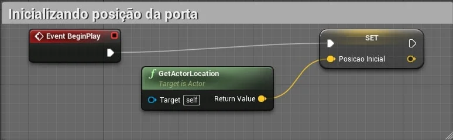

  > Figura: Blueprint - Salvando a posição de um objeto em um vetor.

**Girando a porta.**

Neste exemplo vamos implementar um movimento no eixo Z, girando e abrindo a porta.

1. Utilizamos a função `MakeRotator`.   
  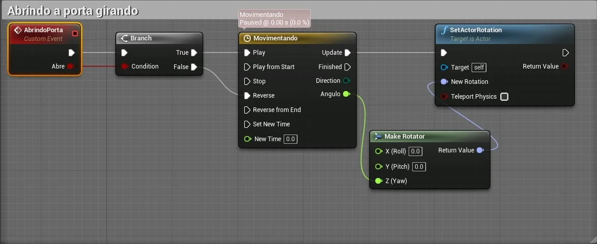

  > Figura: Blueprint - Exemplo de movimentação girando a porta utilizando Make Rotator.

2. Movimentando utiliza a variável *Angulo* do tipo `Vector`.   
  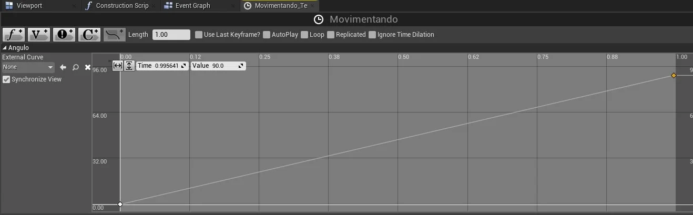

  > Figura: Blueprint - Exemplo de movimentação utilizando ângulo de abertura.

3. Acionando a porta.   
  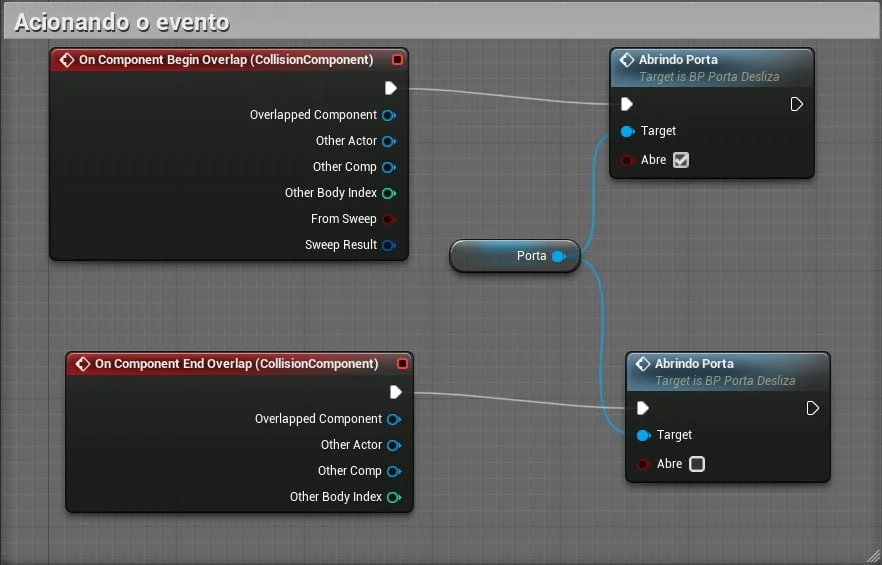

  > Figura: Blueprint - Exemplo de abertura da porta utilizando CollisionComponent.

<a name="7.5.5"></a>
### 7.5.5 Curves
Podemos criar um tipo de objeto `Curve` para que possamos utilizar em vários Blueprints.

1. Para criar um objeto do tipo `Curve` utilizamos o menu de contexto `Miscellaneous` > `Curve`.    
  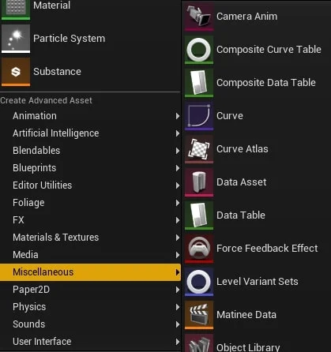

  > Figura: Blueprint - Menu de contexto Miscellaneous > Curve.

2. Objeto C_TempoPorta.       
  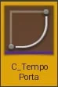

  > Figura: Blueprint - Objeto C_TempoPorta.

3. Associando o objeto **C_TempoPorta** a **Movimentando**.   
  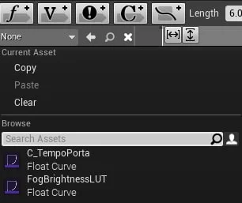

  > Figura: Blueprint - Associando a curva ao Timeline.

- `SetVectorCurve`;

<a name="7.5.6"></a>
### 7.5.6 Exemplo de calculo de velocidade.  

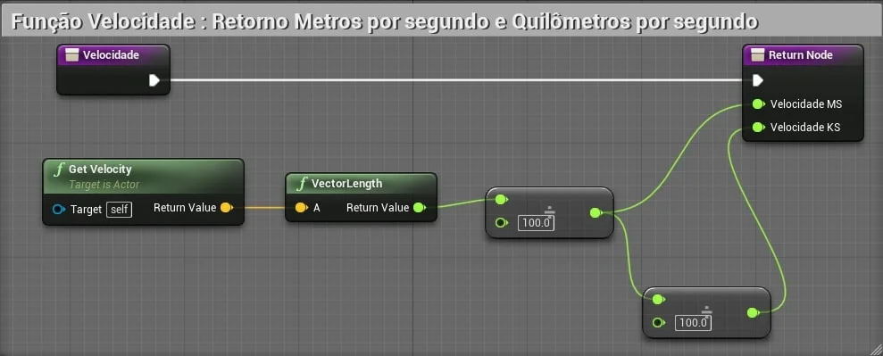

> Figura: Blueprint - Exemplo da lógica de calculo de velocidade.

<a name="7.5.7"></a>
### 7.5.7 Sistema de coordenadas
O sistema de coordenadas descreve uma maneira de usar números para especificar a localização de um ponto (ou pontos) no espaço 2D ou 3D. Em um motor de jogo, é função do sistema de coordenadas define a localização de cada objeto e para qual **direção** ele está voltado. Com esses dados podemos calcular a distância entre objetos, rotação, velocidade e todos os tipos de outras informações úteis.

**Plano Cartesiano.**

Para demonstrar vamos utilizar um vetor de 2D (x,y).

|  |  |  |  |  | (Y) |  |  |  |  |  ||
|:-:|-|-|-|-|-|-|-|-|-|-|-|
|  |  |  |  |  |  **5**|  |  |  | D |  ||
|  |  |  |  |  |  **4**|  |  |  |  |  ||
|  |  |  | B |  |  **3**|  |  |  |  |  ||
|  |  |  |  |  | **2** |  |  | C |  |  ||
| |  |  |  |  | **1** |  |  |  |  |  |  |
|**-5** | **-4** | **-3** | **-2** | **-1** | **0** |  **1** | **2** |**3**  |**4**  | **5** |  **(X)**|
|  |  |  |  |  | **-1** |  |  |  |  |  |  |
| |  |  |  |  | **-2** |  |  |  |  |  |  |
|  |  |  |  |  | **-3** |  |  |  |  |  ||
|  | A |  |  |  | **-4** |  |  |  |  |  ||
|  |  |  |  |  | **-5** |  |  |  |  |  ||

**Posição dos elementos.**

- v = v(x,y)
- A = a(-4,-4)
- B = b(-2,3)
- C = b(3,2)
- D = b(4,5)

**Movimento no sistema coordenadas X,Y.**

Uma direção nos diz como nos mover no sistema de coordenadas x, y. Um valor positivo nos diz para nos movermos na direção positiva e um valor negativo nos diz para nos movermos na direção negativa (com base no sistema de coordenadas).

**Movimentando o elemento B**  

- B = b(-2,3) **->** b(-1,4)

**Magnitude.**

A Magnitude nos diz o quanto nos movemos. A distância de um movimento provará ser muito útil e pode ser calculada apenas com o vetor. Isso é feito usando o Teorema de Pitágoras. Assuma um objeto na posição (50, 25) e queremos movê-lo para (53, 23). Isso significa um Vetor de (3, -2).

- A = a(-4,-4) **->** a(2,-1)  
  O objeto se deslocou de (-4,-4) até a nova posição (2,1)  
  Andou 6 posições em X e 5 em Y

- Direção de A = (6,5)  

- Distância percorrida = raiz_quadrada(6 ^ *2* + 5 ^*2*) = **7.8**

> Você pode usar isso para calcular novas posições e movimentos. Suponha que você tenha um objeto na posição (12, 4) e deseja movê-lo na direção (3,2), mas deseja que a distância seja 4 vezes a distância normal. Para fazer isso funcionar e obter a nova posição, você multiplica o vetor pelo escalar V = (3 * 4, 2 * 4) (12, 8) A nova posição no sistema de coordenadas x / y é obtida adicionando este vetor para a posição original: (12 + 12, 4 + 8) (24, 12)

**Normalização.**

Aprendemos que um vetor é um par de números que contém uma direção e que pode ser usado para derivar uma magnitude. Quando um vetor contém um par de números, como (10, 5), ele indica que o movimento será de 10 unidades na direção X positiva e 5 unidades na direção Y positiva. Este vetor especifica quantas unidades mover, mas também indica uma direção geral em porcentagens. Essa é a proporção de movimento de 10 por 5. O cálculo dessa porcentagem de movimento é chamado de Normalização de um vetor.  
O vetor normalizado é um par de números, cada um deles menor que um. Você pode criar um vetor normalizado obtendo a magnitude de um vetor e dividindo cada valor do Vetor pela magnitude. Com um vetor de (3,4) a magnitude é 5.

- 5 = raiz_quadrada(3 ^ *2* + 4 ^*2*)

- (3/5, 4/5) => (.6,.8)

**Resultado.**  

O vetor normalizado das coordenadas (3,4) é (-.6,.8).

**Calculando distância.**

- **Cube**  
  **a**=GetActorLocation(0,-600,70)

- **Cube2**  
  **b**=GetActorLocation(600,600,70)

- **Resultado**  
  Resultado =  a - b
  > (600,1200,0)  

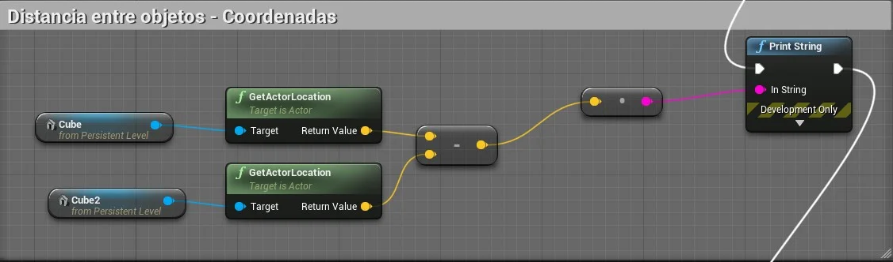

> Figura: Blueprint - Exemplo de lógica para calculo da distância de dois objetos.


- `VectorLength` - Calcula o comprimento do vetor, onde Comprimento = VectorLength(Resultado) (1341.64078);
  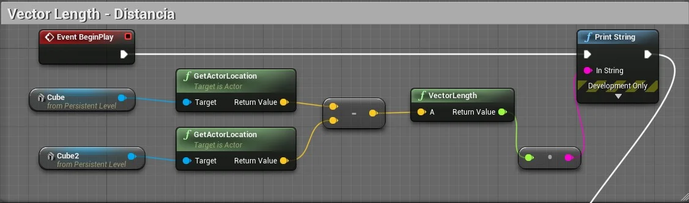

  > Figura: Blueprint - Exemplo de VectorLength.

- `GetDistanceTo` - Calcula a distância de dois objetos, onde Distancia = GetDistanceTo(Cubo,Cubo2) (1341.64078);
  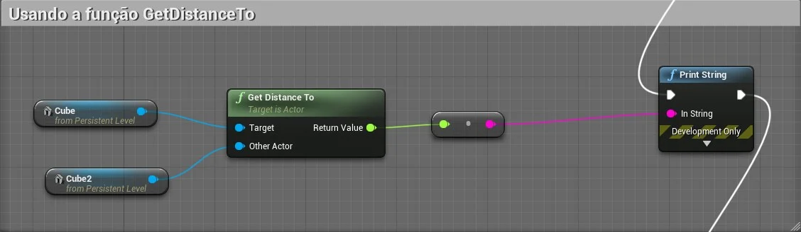

  > Figura: Blueprint - Exemplo de GetDistanceTo.

- `Normalize`  

  **a** = Cubo.GetActorLocation(0,-600,70)   

  Resultado = Normalize(**a**,0)

  > (0,0.99,0.16)

  > Os valores variam entre 0 e 1.

  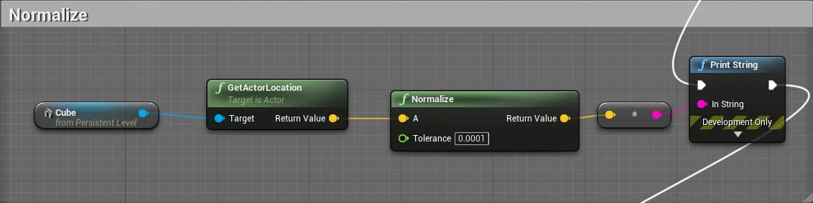

  > Figura: Blueprint - Exemplo de Normalize.

**Verificando para onde o ator está apontando.**

Usaremos várias funções para demonstrar como verificar a direção que o ator está apontando.

- `GetActorForwardVector`   

  **a** = Cubo.GetActorForwardVector()
  > 1,0,0

- `GetActorUpVector`  
    **a** = Cubo.GetActorUpVector()
    > 0,0,1

- `GetActorRightVector`  
  **a** = Cubo.GetActorRightVector()
  > 0,1,0

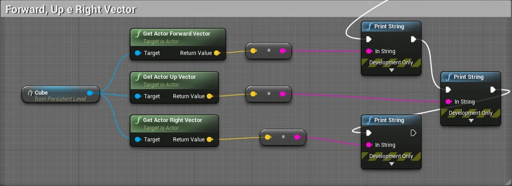

> Figura: Blueprint - Exemplo de GetActorForwardVector para definir onde o ator esta apontando.

**Acompanhando o movimento de um objeto.**

Usaremos a função `FindLookAtRotation`. No exemplo o **Cubo3** vai apontar para a face. O personagem é do tipo `Character`.

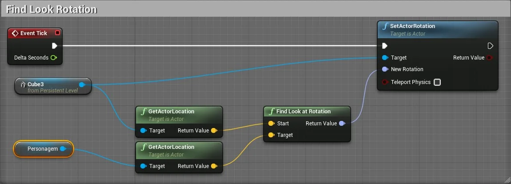

> Figura: Blueprint - Exemplo de FindLookAtRotation.
