Neste capítulo será apresentado o modelo da lógica de programação utilizando **Blueprint** e os seus elementos.

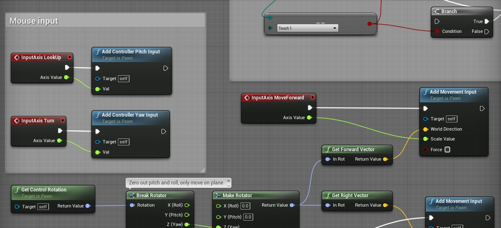


## Índice
1. **[O que são Blueprints e Visual Scripting?](#1)**  
    1. [Características](#1.1)  
    1. [Representação da construção do projeto no Unreal Engine](#1.2)  
1. **[O que é Level Blueprint? ](#2)**  
     1. [Utilizando o level Blueprint para escrever mensagens na tela](#2.1)  
1. **[Blueprint de atores](#3)**
    1. [Atores predefinidos ou Place Actors](#3.1)  
    1. [Classes Blueprint ou Blueprint Class](#3.2)  
1. **[Componentes - Components](#4)**  
    1. [Components e a aba My Blueprint](#4.1)  
1. **[Estrutura da classe Actor no Unreal Engine](#5)**  
    1. [Construction Script](#5.1)  
    1. [Event Graph](#5.2)  
    1. [BeginPlay](#5.3)  
    1. [ActorBeginOverlap](#5.4)  
    1. [Tick](#5.5)      
1. **[Comentários](#6)**
1. [Atividades](#7)

***

<a name="1"></a>
## 1. O que são *Blueprints* e *Visual Scripting?*
O sistema *Blueprints Visual Scripting* no *Unreal Engine* é um sistema completo de script de jogo baseado no conceito de usar uma interface baseada em nó para criar elementos de jogo a partir do *Unreal Editor*. Como acontece com muitas linguagens de script comuns, ele é usado para definir classes orientadas a objetos (OO) ou objetos na *engine* .

<a name="1.1"></a>
### 1.1 Características
- Blueprints focam em ser acessíveis, versáteis para qualquer membro do projeto;  
- Simplifica tarefas para programadores e engenheiros de projeto.
- É fácil de entender, interagir e construir.  

<a name="1.2"></a>
### 1.2 Representação da construção do projeto no Unreal Engine
Abaixo a representação hierárquica da estrutura de elementos que compõem um projeto do **Unreal Engine**.

```bash
|-- C++  
|   |-- Herança - Classes derivam e herdam de suas classes pai  
|   |   |-- Framework - Classes Padrão  
|   |   |   |-- Actor  
|   |   |   |   |-- GameMode
|   |   |   |   |   |-- Pawn
|   |   |   |   |   |-- Controller
|   |   |   |   |   |-- GameState
|   |   |   |   |   |-- PlayerState
|   |   |   |   |-- GameInstance
|   |   |-- Events/Functions/Var - Eventos, funções e variáveis.
|   |-- Blueprint
|   |   |-- Components
|   |   |   |-- Static Mesh
|   |   |   |-- Emiter
|   |   |-- Editores
|   |   |   |-- Timeline
|   |   |   |-- Componentes
|   |   |   |-- Editor de script
|   |   |-- Communication BP to BP - Comunicação entre Blueprints
|   |   |   |-- Casting
|   |   |   |-- Interface
|   |   |   |-- Event Dispacher
|   |-- Compilação - Compilação do Bytecode.
|   |   |-- Navitization - Durante o processo de preparação, o Blueprint pode ser cruzado para c ++ e nativizado*
|   |-- VM - Executado em uma máquina virtual
```
- [Arquivo Referência](https://github.com/drstreit/unreal_schematics)

> **Nativização**
>
>A nativização é uma funcionalidade relativamente nova no Unreal Engine, que permite aos desenvolvedores converter suas classes criadas em Blueprint para código nativo C++ no momento em que é construído o pacote final do jogo. Isso faz com que seja possível aliar a facilidade de prototipação dos Blueprints ao desempenho do C++, acelerando o processo de desenvolvimento e também reduzindo a possibilidade de erros na programação, levando em consideração que ao desenvolver em Blueprint todas as entradas e saídas de dados, assim como o fluxo das operações são verificados pela máquina virtual enquanto os testes estão sendo realizados, isso permite garantir que tudo funcione conforme o esperado, ou na pior das hipóteses, alerte ao desenvolvedor caso algo não saia como o esperado, por meio de mensagens intuitivas e claras

**[⬆ Volta para o início](#índice)**

<a name="2"></a>
## 2. O que é Level Blueprint?  
Um `Level Blueprint` é um tipo especializado de **Blueprint** que atua como um gráfico de evento global em todo o nível ou *Level*. Cada *Level* em seu projeto tem seu próprio `Level Blueprint` criado por padrão, que pode ser editado no *Unreal Editor*.

Para editar utilizamos a opção `Blueprints` > `Open Level Blueprint`.

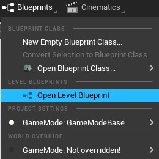        

*Figura:  Open Level Blueprint*

<a name="21"></a>
## 2.1 Utilizando o level Blueprint para escrever   mensagens na tela
Para escrever uma mensagem no `ViewPort` ao executar o jogo utilizaremos o evento `BeginPlay` e conectaremos o nó `Print String` para escrever uma mensagem na tela.

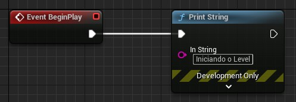      

*Figura: Iniciando o level e escrevendo uma mensagem na tela*

- `BeginPlay`: Este evento é executado quando o *level* é carregado.
- `Print String`: É uma função que recebe como parâmetro um texto (*String*) e a escreve na tela.

**[⬆ Volta para o início](#índice)**

<a name="3"></a>
## 3. Atores e Classes
Atores são objetos de uma determinada classe que suportam vários componentes, métodos e variáveis. Por exemplo:

- Personagem Herói - tem atributos, como vida e velocidade, tem componentes, como esqueleto e malha, e métodos, como direção e movimentação.

A lógica de programação dos atores é expressada em **Blueprint** e nos próximos capítulos vamos abordar este temo com mais detalhes.

<a name="3.1"></a>
### 3.1 Atores predefinidos ou Place Actors
No nível mais fundamental, um ator é qualquer objeto que você pode colocar em um *Level*.

Para adicionar o ator predefinido na cena utilizamos a opção `Create` e escolhemos o tipo de ator.

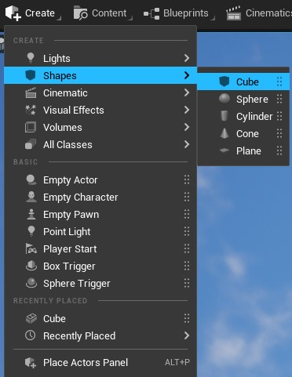       

*Figura: Create > Shapes para criar um objeto poligonal*

Ou podemos acessar o menu principal `Menu` > `Place Actors` para ter acesso a mais atores.

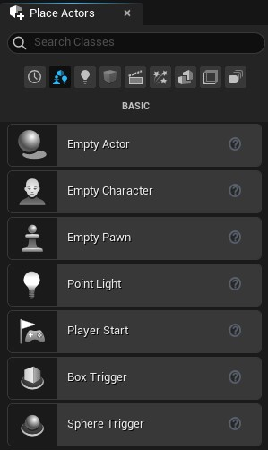        

*Figura: Windows >Place Actors*

<a name="3.2"></a>
### 3.2 Classes Blueprint ou Blueprint Class
Uma classe **Blueprint**, muitas vezes abreviada como Blueprint, é um ativo que permite que os criadores de conteúdo adicionem funcionalidades facilmente às classes de jogo existentes. Os projetos são criados dentro do **Unreal Editor** visualmente, em vez de digitar o código, e salvos como ativos em um pacote de conteúdo. Essencialmente, eles definem uma nova classe ou tipo de ator que pode então ser colocado em mapas como instâncias que se comportam como qualquer outro tipo de ator.  

Para adicionar um ator na cena utilizamos o menu de acesso rápido `Context Menu` e acionando com o botão direito do mouse na aba `Content`.  

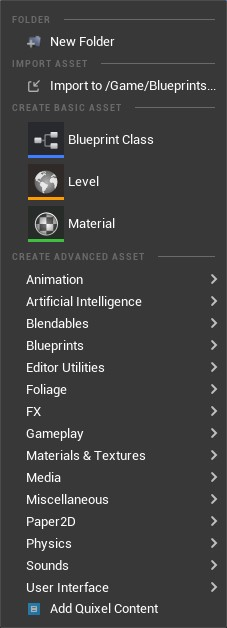       

*Figura: Context Menu*

Escolha de Classe de atores  `Blueprint Class`.

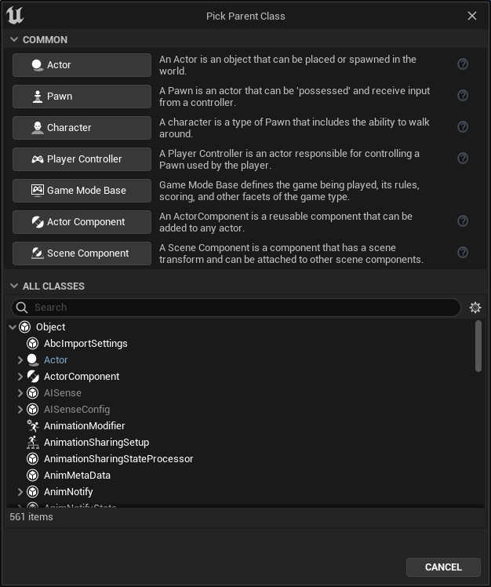     

*Figura: Pick Parent Classe e All Classes*

**[⬆ Volta para o início](#índice)**

<a name="4"></a>
## 4. Componentes -  Components
Os *Components* ou componentes são um tipo especial de objeto que os atores podem anexar a si próprios como subobjetos.

Os componentes são úteis para compartilhar comportamentos comuns, como a capacidade de exibir uma representação visual e reproduzir sons. Eles também podem representar conceitos específicos do projeto, como a maneira como um veículo interpreta a entrada e muda sua própria velocidade e orientação.

Por exemplo, um projeto com carros, aeronaves e barcos controláveis pelo usuário pode implementar as diferenças no controle e movimento do veículo, alterando qual componente um ator do veículo usa.

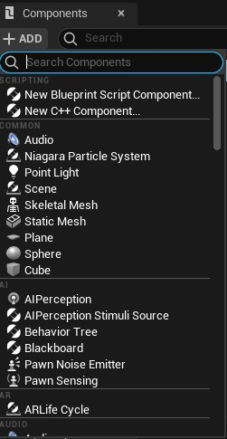       
*Figura: Add Components*

<a name="4.1"></a>
### 4.1 Components e a aba My Blueprint
Para ter acesso aos componentes que estão associados a um determinado objeto utilizamos a aba `My Blueprint`, que é uma representação visual do agrupamento de componentes, funções, variáveis e macros, abaixo um exemplo.

       

*Figura: Aba MyBlueprint*

**[⬆ Volta para o início](#índice)**

<a name="5"></a>
## 5. Estrutura da classe Actor no Unreal Engine
A classe `Actor` é composta por vários elementos, entre eles estão as variáveis, métodos e funções, abaixo uma representação dessa estrutura.

```bash
|-- Objeto
|   |-- Events
|   |   |-- BeginPlay
|   |   |-- ActorBeginOverlap
|   |   |-- Tick
|   |-- Functions
|   |   |-- ConstructionScript
|   |-- Variables      
|   |   |-- VariavelLocal
```
 A representação visual da lógica de programação da classe `Actor` é divida em:

 - `Construction Script`;
 - `Event Graph`.

A seguir vamos aprender mais sobre esses elementos.

<a name="5.1"></a>
### 5.1 Construction Script
Lógica de que é executada na construção do objeto, similares ao eventos *Construtor* em C++.  

**Exemplo:**

Apresentando uma mensagem ao construir o objeto.      

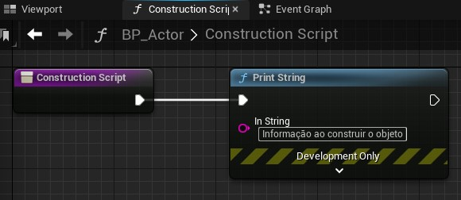        

*Figura: Construction Script*

<a name="5.2"></a>
### 5.2 Event Graph
Contém um gráfico de nós e suas ligações representando a lógica de um Blueprint.  

> Exibe a representação visual de um gráfico específico de nós, pois mostra todos os nós contidos no gráfico, bem como as conexões entre eles. Ele fornece recursos de edição para adicionar e remover nós, organizar nós e criar links entre nós. Os pontos de interrupção também podem ser definidos na guia Gráfico para auxiliar na depuração de Blueprints.


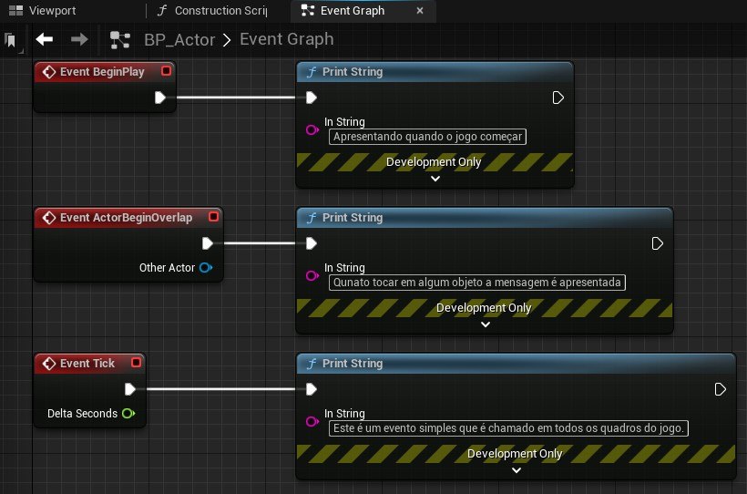       

*Figura: Event Graph*

<a name="5.3"></a>
### 5.3 BeginPlay
Este evento é acionado para todos os Atores quando o jogo é iniciado, quaisquer Atores gerados após o jogo ser iniciado terão isso chamado imediatamente.

<a name="5.4"></a>
### 5.4 ActorBeginOverlap
Este evento será executado quando uma série de condições forem atendidas ao mesmo tempo:
-  A resposta à colisão entre os atores deve permitir sobreposições.
- Ambos os Atores que devem executar o evento têm que gerar Eventos de Sobreposição definido como verdadeiro.
- E, finalmente, a colisão de ambos os Atores começa a se sobrepor; movendo-se juntos ou um é criado sobrepondo-se ao outro.

<a name="5.5"></a>
### 5.5 Tick
Este é um evento simples que é chamado em todos os quadros do jogo. Tem como parâmetro a variável **Delta Seconds**.

> Vários motores gráficos ou *Game Engines*, como por exemplo *Unity* e *Pico-8*  tem os mesmos eventos com as mesmas Características.

**[⬆ Volta para o início](#índice)**

<a name="6"></a>
## 6. Comentários   
Os comentários podem ser incluídos diretamente em nós **Blueprint** únicos ou podem ser incluídos como caixas de comentários para agrupar nós relacionados e fornecer descrições sobre sua funcionalidade.

Eles podem ser usados apenas para fins organizacionais para tornar os gráficos mais legíveis, mas também podem ser usados para fins informativos, pois permitem que descrições textuais sejam adicionadas da mesma forma que adicionar comentários ao código.

Selecione os nós e digite "C" no teclado para adicionar um comentário.  

**Exemplo:**

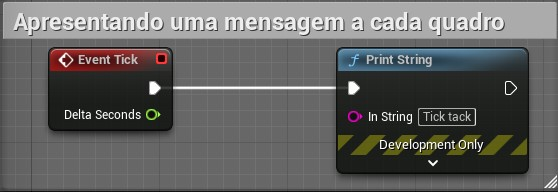       

*Figura: Comment Example*

Podemos adicionar Características aos comentários que detalham melhor a lógica dos nós envolvidos, como por exemplo adicionando cores.    

- **Vermelho** - Lógica principal ou crítica.  
- **Azul** - Lógica de atores.  
- **Verde** - Lógica de estruturas de controle.  

Detalhes do comentário.   

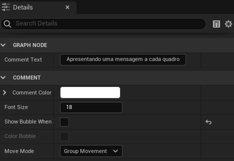       

*Figura: Comment Details*


<a name="7"></a>
## 7. Atividades
<a name="7.1"></a>
### 7.1 - Crie um level apresentar uma mensagem na tela.

#### Regras
1. Utilize variáveis para parametrizar a mensagem.

#### Desafio      
1. Adicione vários objetos de diferentes tipos.

**[⬆ Volta para o início](#índice)**

***
## Referências
- [Blueprint](https://docs.unrealengine.com/en-US/Engine/Blueprints/index.html)
- [Level Blurprint](https://docs.unrealengine.com/en-US/Engine/Blueprints/UserGuide/Types/LevelBlueprint/index.html)
- [Actors](https://docs.unrealengine.com/en-US/Programming/UnrealArchitecture/Actors/index.html)
- [Components](https://docs.unrealengine.com/en-US/Programming/UnrealArchitecture/Actors/Components/index.html)
- [Event Graph](https://docs.unrealengine.com/en-US/Engine/Blueprints/UserGuide/EventGraph/index.html)
- [Placing Actors](https://docs.unrealengine.com/en-US/Engine/Actors/Placement/index.html)
- [Blueprint Class](https://docs.unrealengine.com/en-US/Engine/Blueprints/UserGuide/Types/ClassBlueprint/index.html)
- [Comments](https://docs.unrealengine.com/en-US/Engine/Blueprints/UserGuide/Comments/index.html)
- [Events](https://docs.unrealengine.com/en-US/ProgrammingAndScripting/Blueprints/UserGuide/Events/index.html)
- [Nativização](https://bibliotecadigital.ipb.pt/bitstream/10198/18264/4/pauta-relatorio-9.pdf)
