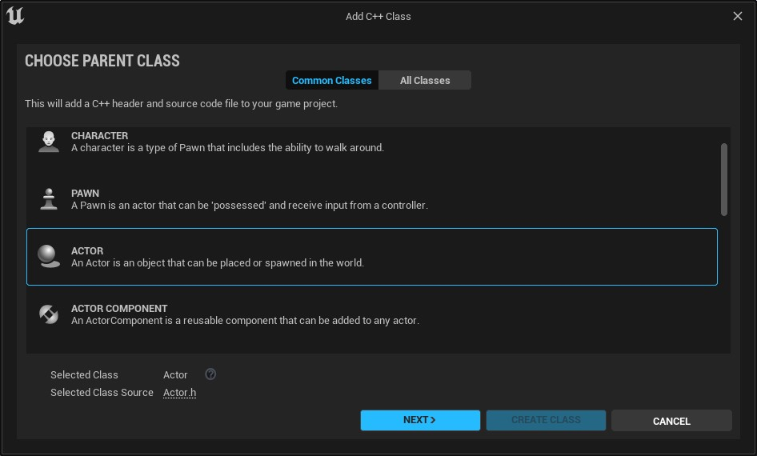
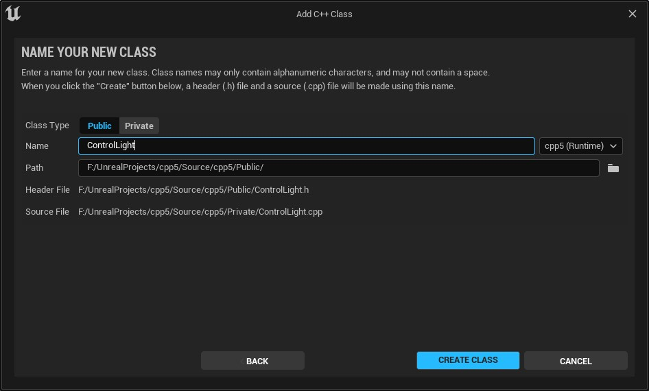
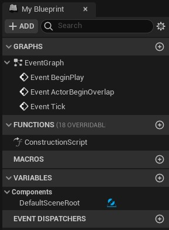

Neste capítulo será apresentado o modelo da lógica de programação utilizando **C++** e os seus elementos.


## Índice
1. **[O que são Blueprints e Visual Scripting?](#1)**  
    1. [Características](#1.1)  
    1. [Representação da construção do projeto no Unreal Engine](#1.2)
1. **[Trabalhando com Levels](#2)**      
1. [Atividades](#8)

***

Neste capítulo vamos utilizar a linguagem **C++** para o desenvolvimento.

## 1. Blueprints vs C++
- Blueprints são mais fáceis de ser lidos e entendidos pelos membros da equipe,
- C++ evitam sobrecarga de chamadas de função economizando ciclos de CPU.
- C++ Conseguem acesso a Library math.
- Sistema de versionamento do C++ utiliza ferramentas como o GIT ou SVN, Blueprints necessita de ferramenta específica.
- Para projeto em plataformas mobile o recomendado é C++.

## 2. O que é ideal?
- Depende do problema.
- Equipes pequenas e projetos pequenos = Blueprints
- Equipes pequenas com cultura de desenvolvimento e necessidade de processamento = c++

## 3. Herança do modelo de desenvolvimento

| Origem      | Destino       |       |
|:-           |:-             |:-     |
|Classe C++   |Blueprints     |Certo  |
|Blueprints   |Classe C++     | Errado|

## 4. Blueprintable
Expõe esta classe como uma classe base aceitável para a criação de Blueprints. O padrão é NotBlueprintable, a menos que herdado de outra forma. Isso é herdado por subclasses.

1. Uma breve história sobre Herança.
  - classe Pessoa  c++
    int Vida;  
    Movimentacao();  
  - classe Hugo Blueprint
      Vida ->Herdada   
      Movimentacao() - Herdada  
      AddActiveTrigger()  
      float SpeedPlataforma  
      int Vida #Error  

1. Tipos de variáveis

| Blueprint | C++     |
|:-:        |:-       |
|integer    |int32    |
|Vector     |FVector  |
|String     |FString  |


1. Migrando a plataforma
- Verificando a classe pai do Blueprint **BP_Plataforma** = *static_mesh_actor*.
1. Criar a classe c++ **Plataforma** do tipo
*AStaticMeshActor*
1. Alterara classe pai do **BP_Plataforma** para **Plataforma**


```cpp

#include "CoreMinimal.h"
#include "Engine/StaticMeshActor.h"
#include "Plataforma.generated.h"

/**
 *
 */
UCLASS(ClassGroup=(Custom),meta=(BlueprintSpawnableComponent) )
class PROJETOPLATAFORMA_API APlataforma : public AStaticMeshActor
{
	GENERATED_BODY()

public:
	APlataforma();

	virtual void Tick(float DeltaTime) override;

	virtual void BeginPlay() override;

	UPROPERTY(EditAnywhere, Meta = (MakeEditWidget = true))
		FVector TargetLocation;

	UPROPERTY(EditAnywhere, BlueprintReadWrite, Category = "Plataforma")
		float SpeedPlataform = 20;

	UFUNCTION(BlueprintCallable, Category = "Plataforma")
	void AddActiveTrigger();

	UFUNCTION(BlueprintCallable, Category = "Plataforma")
	void RemoveActiveTrigger();


protected:
	FVector GlobalStartLocation;
	FVector GlobalTargetLocation;

	UPROPERTY(EditAnywhere)
		int ActiveTriggers = 1;
};
```
## Include
É uma forma de incluir um arquivo padrão ou definido pelo usuário no programa e é principalmente escrito no início de qualquer programa C / C ++.  
Esta diretiva é lida pelo pré-processador e ordena que ele insira o conteúdo de um arquivo de cabeçalho do sistema ou definido pelo usuário no programa a seguir. Esses arquivos são importados principalmente de uma fonte externa para o programa atual. O processo de importação de tais arquivos que podem ser definidos pelo sistema ou pelo usuário é conhecido como Inclusão de Arquivo. Este tipo de diretiva de pré-processador diz ao compilador para incluir um arquivo no programa de código-fonte.
```cpp
#include "CoreMinimal.h"
#include "Engine/StaticMeshActor.h"
#include "Plataforma.generated.h"
```
## Encapsulamento
Public – Quando precede uma lista de membros de classe, o  públic  palavra-chave especifica que esses membros são acessíveis a partir de qualquer função. Isso se aplica a todos os membros declarados até o próximo especificador de acesso ou o fim da classe. Ou seja visível a todos.

Private – Quando precede uma lista de membros de classe, o private palavra-chave especifica que esses membros são acessíveis somente dentro de funções de membro e amigos da classe.  Isso se aplica a todos os membros declarados até o próximo especificador de acesso ou o fim da classe. Ou seja visível somente para membros dentro da classe.

Protected – O protected palavra-chave especifica o acesso a membros de classe no lista de membros até o próximo especificador de acesso (pública ou private) ou no final da definição de classe.  O Protected é mistura entre Public e Private ou seja é visível somente para membros da classe e visível para subclasses.

##  UCLASS
Você também pode declarar classes C ++ personalizadas, que se comportam como classes UE4, declarando seus objetos C ++ personalizados como UCLASS. UCLASS usa *Smart Pointers* do UE4 e rotinas de gerenciamento de memória para alocação e desalocação de acordo com as regras do Smart Pointer, podem ser carregados e lidos pelo *UE4 Editor* e opcionalmente acessados a partir de Blueprints.

## UFUNCTION
Um **UFunction** é uma função C ++ que é reconhecida pelo sistema de reflexão Unreal Engine 4 (UE4). Qualquer **UObject** ou biblioteca de função Blueprint pode declarar uma função de membro como um **UFunction**, colocando a macro UFUNCTION na linha acima da declaração da função no arquivo de cabeçalho. A macro oferecerá suporte a Especificadores de Função para alterar como o UE4 interpreta e usa uma função.

### UFUNCTION Especificadores
Ao declarar funções, os especificadores de função podem ser adicionados à declaração para controlar como a função se comporta com vários aspectos do mecanismo e do editor.
```cpp
UFUNCTION(BlueprintCallable, Category = "Plataforma")
void RemoveActiveTrigger();
```
- **BlueprintAuthorityOnly** - Esta função só será executada a partir do código Blueprint se for executada em uma máquina com autoridade de rede (um servidor, servidor dedicado ou jogo para um único jogador).
- **BlueprintCallable** - A função pode ser executada em um gráfico Blueprint ou Level Blueprint.

***

## UPROPERTY
As propriedades são declaradas usando a sintaxe de variável C ++ padrão, precedida pela macro UPROPERTY que define metadados de propriedade e especificadores de variável.
```cpp
UPROPERTY(EditAnywhere, Meta = (MakeEditWidget = true))
  FVector TargetLocation;
```

### UPROPERTY especificadores
Ao declarar propriedades, os Especificadores de Propriedade podem ser adicionados à declaração para controlar como a propriedade se comporta com vários aspectos do Motor e do Editor.
- **BlueprintReadOnly** - Esta propriedade pode ser lida pelo Blueprints, mas não modificada. Este especificador é incompatível com o especificador **BlueprintReadWrite**.
- **BlueprintReadWrite** - Esta propriedade pode ser lida ou escrita a partir de um Blueprint. Este especificador é incompatível com o especificador **BlueprintReadOnly**.
- **EditAnywhere** - Indica que esta propriedade pode ser editada por janelas de propriedades, em arquétipos e instâncias. Este especificador é incompatível com qualquer um dos especificadores "visíveis".
- **MakeEditWidget** - Usado para propriedades *Transform* ou *Rotator*, ou Matrizes de *Transforms* ou *Rotators*. Indica que a propriedade deve ser exposta na janela de visualização como um *widget* móvel.
***
## Funções Virtuais - virtual
Uma função virtual é uma função de membro que é declarada dentro de uma classe base e é redefinida (Substituída) por uma classe derivada. Quando você se refere a um objeto de classe derivada usando um ponteiro ou uma referência à classe base, pode chamar uma função virtual para esse objeto e executar a versão da função da classe derivada.

As funções virtuais garantem que a função correta seja chamada para um objeto, independentemente do tipo de referência (ou ponteiro) usado para a chamada da função.
Eles são usados principalmente para obter polimorfismo de tempo de execução
As funções são declaradas com uma palavra-chave virtual na classe base.
A resolução da chamada de função é feita em tempo de execução.

```c
#include <iostream>
using namespace std;

class base {
  public:
	virtual void print()
	{
		cout << "print base class" << endl;
	}
	void show()
	{
		cout << "show base class" << endl;
	}
};
class derived : public base {
  public:
	void print()
	{
		cout << "print derived class" << endl;
	}
	void show()
	{
		cout << "show derived class" << endl;
	}
};
int main()
{
	base* bptr;
	derived d;
	bptr = &d;
	// virtual function, binded at runtime
	bptr->print();
	// Non-virtual function, binded at compile time
	bptr->show();
}
```


Criando classe c++

Menu Tools > New C++ Class



*Figura: Create Class C++*



*Figura: Add C++ Class*


Pasta privada com os arquivos header das classes:
```bash
<Projeto>/Private/ControlLight.h
```

```cpp
// Diretiva de compilação que serve para fazer com que o arquivo seja
// incluído somente uma vez durante o processo de compilação.
#pragma once

#include "CoreMinimal.h"
#include "GameFramework/Actor.h"
// Arquivo criado durante a compilação
#include "ControlLight.generated.h"

// Macro utilizada para indicar que uma C++ fará parte do Unreal
// Reflection system. Isto é necessário para
//que a classe seja reconhecida pelo editor do Unreal Engine.

UCLASS()
class CPP5_API AControlLight : public AActor
{
	GENERATED_BODY()

public:
	// Construtor da classe
	AControlLight();

protected:
	// Método chamado quando o jogo inicia ou quando a classe
  // é adicionada na cena.

  virtual void BeginPlay() override;

public:
	// Método chamado a cada quadro.
	virtual void Tick(float DeltaTime) override;

};

```

Pasta publica com a implementação das classes :
```bash
<Projeto>/Public/ControlLight.cpp
```

```cpp
#include "ControlLight.h"

// Sets default values
AControlLight::AControlLight()
{
 	// Set this actor to call Tick() every frame.  You can turn this off to improve performance if you don't need it.
	PrimaryActorTick.bCanEverTick = true;

}

// Called when the game starts or when spawned
void AControlLight::BeginPlay()
{
	Super::BeginPlay();

}

// Called every frame
void AControlLight::Tick(float DeltaTime)
{
	Super::Tick(DeltaTime);

}

```

<a name="1"></a>
## 1. O que são *Blueprints* e *Visual Scripting?*
**[⬆ Volta para o início](#índice)**


<a name="5.1"></a>
### 5.1 Components e a aba My Blueprint
Para ter acesso aos componentes que estão associados a um determinado objeto utilizamos a aba `My Blueprint`, que é uma representação visual do agrupamento de componentes, funções, variáveis e macros, abaixo um exemplo.

       

*Figura: Aba MyBlueprint.*

**[⬆ Volta para o início](#índice)**


**[⬆ Volta para o início](#índice)**


**[⬆ Volta para o início](#índice)**

***

## Referências
- [Unreal Property System (Reflection)](https://www.unrealengine.com/en-US/blog/unreal-property-system-reflection?sessionInvalidated=true)
- [The UCLASS() macro ](https://romeroblueprints.blogspot.com/2020/10/the-uclass-macro.html)
- [Exposing Gameplay Elements to Blueprints](https://docs.unrealengine.com/en-US/Engine/Blueprints/TechnicalGuide/ExtendingBlueprints/index.html)
- [Macros](
https://docs.unrealengine.com/en-US/Engine/Blueprints/UserGuide/Macros/index.html)
- [UFunctions](https://docs.unrealengine.com/en-US/Programming/UnrealArchitecture/Reference/Functions/index.html)
- [UPROPERTY](https://docs.unrealengine.com/en-US/Programming/UnrealArchitecture/Reference/Properties/index.html)
- [Access modifiers in C++](https://www.geeksforgeeks.org/access-modifiers-in-c/)
- [Virtual Function in C++](https://www.geeksforgeeks.org/virtual-function-cpp/)
- [Inheritance](https://www.youtube.com/watch?v=X8nYM8wdNRE&list=PLlrATfBNZ98dudnM48yfGUldqGD0S4FFb&index=27)
- [Virtual Functions in C++](https://www.youtube.com/watch?v=oIV2KchSyGQ&list=PLlrATfBNZ98dudnM48yfGUldqGD0S4FFb&index=28)
