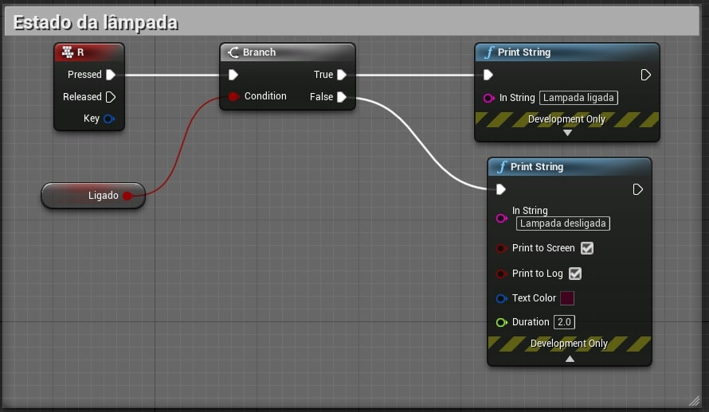
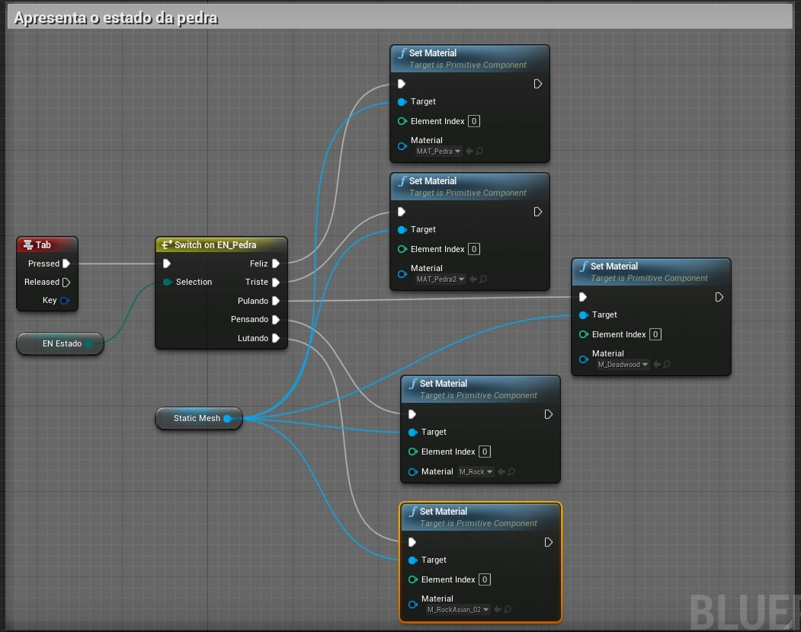

Neste capitulo serão apresentados Enumerações (*Enumeration*). Enumeração é algo como nomear ou numerar um a um (geralmente em uma lista).

## Índice
1. **[O que são Enums?](#1)**
1. **[Criando Enums com Blueprint](#2)**
1. **[Exemplos de uso](#3)**
    1. [A Lâmpada](#3.1)
    1. [A pedra das emoções](#3.2)

<a name="1"></a>
## 1. O que são Enums?
Uma enumeração é um tipo definido pelo usuário que consiste em um conjunto de constantes integrais nomeadas que são conhecidas como enumeradores.

Exemplo:

```cpp
enum cores = { vermelho,amarelo, azul, verde = 20, preto}
```
<a name="2"></a>
## 2. Criando Enums com Blueprint
Execute o comando no menu de contexto `Blueprints` > `Enumeration` e logo depois preencha os valores conforme a tela abaixo.  


*[Figura: Blueprint e Enum.*

Objeto criado `EN_Estado` e `EN_Pedra`.  


*Figura: Blueprint Enum no Context Browser.*

<a name="3"></a>
## 3. Exemplos de uso
A seguir vamos apresentar alguns exemplos da implementação e uso de objetos do tipo `Enum`.

<a name="3.1"></a>
### 3.1 A Lâmpada

1. Verificando o estado de uma lâmpada utilizando uma variável do tipo `boolean`.  
  

  *Figura: Blueprint Verificando o estado de uma lâmpada.*
1.  Alterando o componente `PointLight` para ligar e desligar a iluminação.    
  

  *Figura: Blueprint Ligando e desligando o PointLight.*   
1.  Verificando o estado utilizando o `Enum`.   
  

  *Figura: Blueprint Lendo Enum.*  
1.  Ligando e desligando utilizando o `Enum`.   
  

  *Figura: Blueprint Ligando e desligando usando Enum.*

<a name="3.2"></a>
### 3.2 A pedra e as emoções
1. Alterando o estado emocional da pedra.    
  

  *Figura: Blueprint alterando Enum.*
1. Apresentando o estado emocional da pedra.   
  

  *Figura: Blueprint escrevendo o conteúdo do Enum.*
1. Alterando as cores da pedra conforme a emoção.  
  

  *Figura: Blueprint alterando o material de uma malha utilizando um Enum como parâmetro.*

***
## Referências
- [Enums in unreal Engine](https://couchlearn.com/enums-in-unreal-engine-4-blueprints/)
