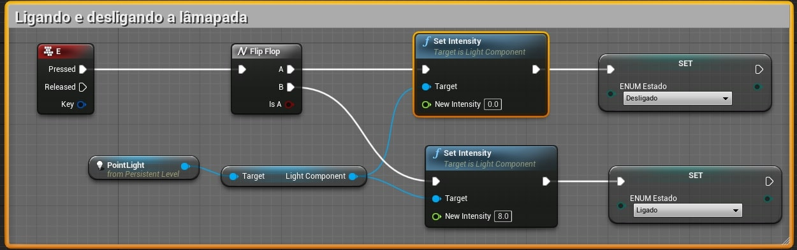
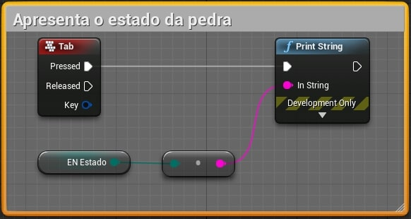

Neste capitulo serão apresentados Enumerações (*Enumeration*). Enumeração é algo como nomear ou numerar um a um (geralmente em uma lista).

## Índice
1. **[O que são Enums?](#1)**
1. **[Criando Enums com Blueprint](#2)**
1. **[Exemplos de uso](#3)**
    1. [A Lâmpada](#3.1)
    1. [A pedra das emoções](#3.2)

<a name="1"></a>
## 1. O que são Enums?
Uma enumeração é um tipo definido pelo usuário que consiste em um conjunto de constantes integrais nomeadas que são conhecidas como enumeradores.

Exemplo:

```cpp
enum cores = { vermelho,amarelo, azul, verde = 20, preto}
```
<a name="2"></a>
## 2. Criando Enums no Unreal Engine

**Blueprint.**

Execute o comando no menu de contexto `Blueprints` > `Enumeration` e logo depois preencha os valores conforme a tela abaixo.  


*[Figura: Blueprint e Enum.*

Objeto criado `EN_Estado` e `EN_Pedra`.  


*Figura: Blueprint Enum no Context Browser.*

**C++.**

Arquive header.

`Visual Studio` > `Arquivo` > `Novo` > `Arquivo` > Escolha Visual C++, Arquivo de Cabeçalho (.h)

```cpp
// EnumName.h
UENUM(BlueprintType)
namespace EStatusEnum {
// Definimos namespace para que não existam conflitos no acesso aos elementos.
	enum Status
	{
		Ligada     UMETA(DisplayName = "Ligada"),
		Desligada      UMETA(DisplayName = "Desligada"),
	};

}
```

Arquivo de implementação.

```cpp
// Hero.cpp
UPROPERTY(EditAnywhere, BlueprintReadWrite, Category = Status)
  TEnumAsByte < EStatusEnum::Status > status;
```


<a name="3"></a>
## 3. Exemplos de uso
A seguir vamos apresentar alguns exemplos da implementação e uso de objetos do tipo `Enum`.

<a name="3.1"></a>
### 3.1 A Lâmpada

Verificando o estado de uma lâmpada utilizando uma variável do tipo `boolean`.  

**Blueprint.**


*Figura: Blueprint Verificando o estado de uma lâmpada.*

**C++.**

```cpp
void AFirstPersonBaseCodeCharacter::SetupPlayerInputComponent(class UInputComponent* InputComponent)
  {
          // set up gameplay key bindings
          check(InputComponent);
          ...
          InputComponent->BindAxis("AnyKey", this, &AFirstPersonBaseCodeCharacter::AnyKey);
          ...
  }   
void AFirstPersonBaseCodeCharacter::AnyKey(float Value)
  {
    if bLigado
    {
      UE_LOG(LogTemp, Warning, TEXT("Lâmpada ligada."));  
    }    
    else
      UE_LOG(LogTemp, Warning, TEXT("Lâmpada desligada."));
  }    
```

Alterando o componente `PointLight` para ligar e desligar a iluminação.    

**Blueprint.**


*Figura: Blueprint Ligando e desligando o PointLight.*   

**C++.**

Arquivo Header.

```cpp
#pragma once

#include "CoreMinimal.h"
#include "GameFramework/Actor.h"
#include "ControlLight.generated.h"

UCLASS()
class CPP5_API AControlLight : public AActor
{
	GENERATED_BODY()

public:
	UPROPERTY()
		USceneComponent* Root;

	UPROPERTY(EditAnywhere, BlueprintReadWrite, Category = "Parameters")
		bool bLigado;

	UPROPERTY(EditAnywhere, BlueprintReadWrite, Category = "Parameters")
		float fIntensidade;

	UPROPERTY(EditAnywhere, BlueprintReadWrite, Category = "Parameters")
		class UPointLightComponent* PointLight;

	UPROPERTY(EditAnywhere, Meta = (MakeEditWidget = true))
		FVector TargetLocation;

	AControlLight();

protected:

	virtual void BeginPlay() override;

	void AnyKey();

public:
	virtual void Tick(float DeltaTime) override;
	void InitControl();

	class APlayerController* PlayerControllControlLight;

};
```

Arquivo de implementação.

```cpp
#include "ControlLight.h"
#include "Components/PointLightComponent.h"
#include "Kismet/GameplayStatics.h"
#include "Components/InputComponent.h"

// Sets default values
AControlLight::AControlLight()
{
	PrimaryActorTick.bCanEverTick = true;
	Root = CreateDefaultSubobject<USceneComponent>("Root");
	RootComponent = Root;
	PointLight = CreateDefaultSubobject<UPointLightComponent>(TEXT("Ponto de Luz"));
	PointLight->SetRelativeTransform(FTransform(FRotator(0, 0, 0), FVector(250, 0, 0),FVector(0.1f)));
	fIntensidade = 10000;
	bLigado = true;
}

void AControlLight::InitControl()
{
	FVector GlobalLocation = GetTransform().TransformPosition(TargetLocation);
	PointLight->SetWorldLocation(GlobalLocation);
	PointLight->SetIntensity(fIntensidade);
}

// Called when the game starts or when spawned
void AControlLight::BeginPlay()
{
	Super::BeginPlay();
	PlayerControllControlLight = UGameplayStatics::GetPlayerController(this, 0);
	EnableInput(PlayerControllControlLight);
	AControlLight::InitControl();
}

// Called every frame
void AControlLight::Tick(float DeltaTime)
{
	Super::Tick(DeltaTime);
	if (PlayerControllControlLight != NULL)
	{
		if (PlayerControllControlLight->WasInputKeyJustPressed(EKeys::T))
		{
			AnyKey();
		}
	}
}

void AControlLight::AnyKey()
{
	if (bLigado)
	{
		fIntensidade = 0;
		bLigado = false;

	}
	else
	{
		fIntensidade = 10000;
		bLigado = true;
	}
	PointLight->SetIntensity(fIntensidade);
}

```

Verificando o estado utilizando o `Enum`.   

**Blueprint.**


*Figura: Blueprint Lendo Enum.*  

**C++.**
```cpp
// Definindo um status no enum.
status = EStatusEnum::Ligada;

UE_LOG(LogTemp, Warning,TEXT("O enum é = %s"), *UEnum::GetValueAsString(status));
```

Ligando e desligando utilizando o `Enum`.   

**Blueprint.**



*Figura: Blueprint Ligando e desligando usando Enum.*

**C++.**
```cpp
...
if (status = EStatusEnum::Ligada) {
  fIntensidade = 0;
  bLigado = false;
  status = EStatusEnum::Desligada;
}
else {
  fIntensidade = 10000;
  bLigado = true;
  status = EStatusEnum::Ligada;
}
```

<a name="3.2"></a>
### 3.2 A pedra e as emoções
1. Alterando o estado emocional da pedra.    
  

*Figura: Blueprint alterando Enum.*

Apresentando o estado emocional da pedra.   
  

  *Figura: Blueprint escrevendo o conteúdo do Enum.*
1. Alterando as cores da pedra conforme a emoção.  
  

  *Figura: Blueprint alterando o material de uma malha utilizando um Enum como parâmetro.*

***
## Referências
- [Enums in unreal Engine](https://couchlearn.com/enums-in-unreal-engine-4-blueprints/)
