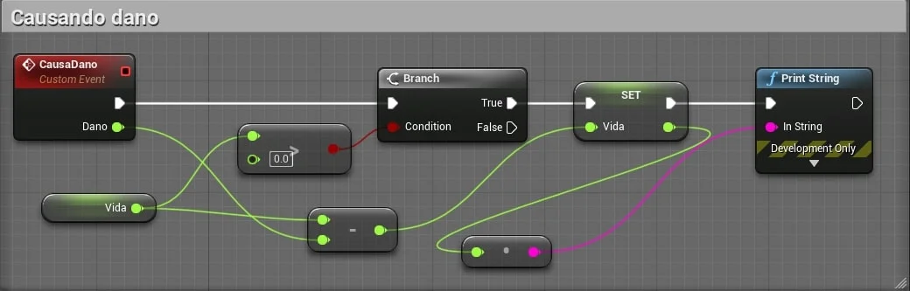
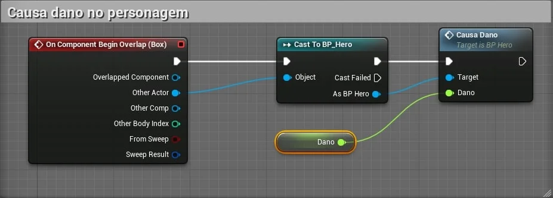
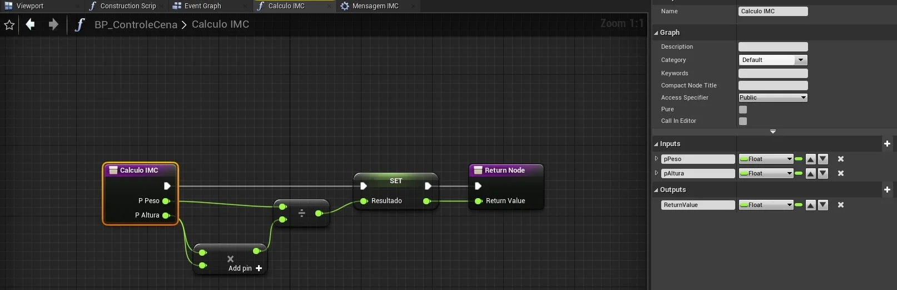
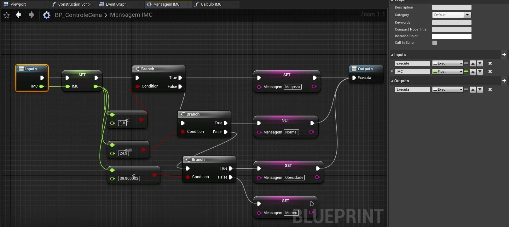
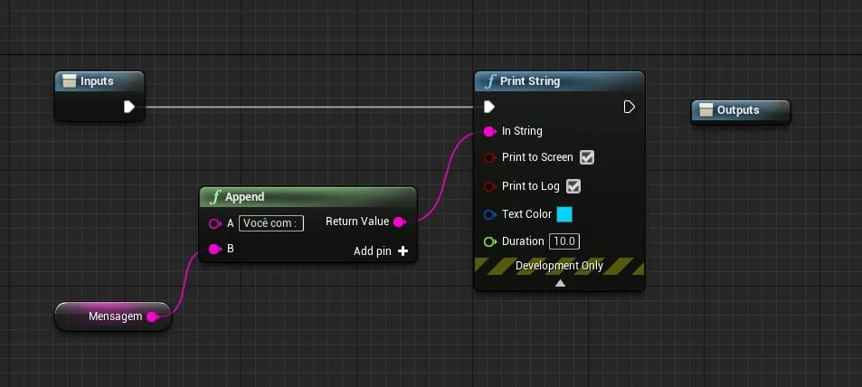
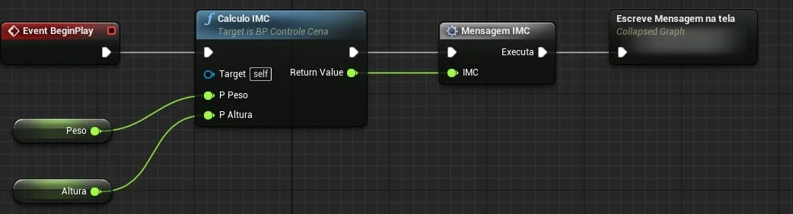

Neste capitulo serão apresentado como estruturar a lógica de programação utilizando métodos, funções e macros.

&nbsp;&nbsp;[7.2.1 Entendo Métodos e funções em programação](#7.2.1)

&nbsp;&nbsp;[7.2.2 O que são Eventos (Events) em Blueprint](#7.2.2)

&nbsp;&nbsp;[7.2.3 Funções (Functions)](#7.2.3)

&nbsp;&nbsp;[7.2.4 Macros](#7.2.4)

&nbsp;&nbsp;[7.2.5 Collapse Nodes](#7.2.5)

&nbsp;&nbsp;[7.2.6 Executando a função e a macros](#7.2.6)

***

<a name="7.2.1"></a>
## 7.2.1 Entendo Métodos e funções em programação
Para entender melhor a estrutura de programação que representa a construção de eventos e funções vamos abordar alguns conceitos de programação.

**Programação Orientada a Objetos.**

Um método é um procedimento ou função em Conceitos de **Programação Orientada a Objetos**. Considerando que uma função é um grupo de código reutilizável que pode ser usado em qualquer parte do programa. Isso ajuda na necessidade de escrever o mesmo código repetidamente. Também ajuda os programadores a escrever códigos modulares.

**Métodos.**

Um método também funciona da mesma forma que o da função.  

Um método é definido dentro de uma classe. Por exemplo: main () em Java.  

Um método pode ser privado, público ou protegido.

O método é invocado apenas por sua referência / objeto. Por exemplo: se a classe tem *obj* como um nome de objeto, o método é chamado por: obj.method ();  

Um método é capaz de operar em dados que estão contidos na classe.    
Cada objeto tem seu próprio método que está presente na classe.

|Pessoa |                   |
|:-:    |:--                |
|+      |eyesColor:enum     |
|+      |hairColor:enum     |
|       |                   |
|+      |Walk()             |
|+      |Run()              |
|+      |Jump()             |
|+      |Crouch()           |

**Funções.**

Uma função é um bloco de instruções que recebe uma entrada específica, faz alguns cálculos e, finalmente, produz a saída.  

Uma função é definida independentemente. Por exemplo: main () em **C++**

Por padrão, uma função é pública.

Ele pode ser acessado em qualquer lugar em todo o programa.  

É chamado pelo próprio nome.  

Ele tem a capacidade de retornar valores, se necessário.

Se uma função for definida, ela será a mesma para todos os objetos criados.  

```cpp
#include <iostream>

static int multiply(int a, int b) {
	return a * b;
}

int main() {
	std::cout << multiply(2, 2) << std::endl;
	std::cin.get();
}
```

<a name="7.2.2"></a>
### 7.2.2 O que são Eventos (Events) em Blueprint

Os eventos são nós chamados a partir do código do jogo para iniciar a execução de uma rede individual dentro do `EventGraph`. Eles permitem que os **Blueprints** executem uma série de ações em resposta a certos eventos que ocorrem dentro do jogo, como quando o jogo começa, quando um nível é reiniciado ou quando um jogador sofre dano.

Os eventos podem ser acessados dentro do **Blueprints** para implementar novas funcionalidades ou para substituir ou aumentar a funcionalidade padrão. Qualquer número de eventos pode ser usado em um único `EventGraph`; embora apenas um de cada tipo possa ser usado.

**Evento de dano  no personagem.**



> Figura: Blueprint - Evento de CasoDano.

- `CausaDano` é um evento customizado utilizando a opção `Add Custom Event` no menu de contexto dentro do `Event Graph`;

- Pertence a classe *BP_Hero* do tipo **Character**.

**Chamando o evento.**



> Figura: Blueprint - Evento de chamado de evento.

- Utilizando o evento `OnComponentBeginOverlap` para acionar o evento **CausaDano**.

**Evento e Métodos.**

Os métodos são procedimentos ou funções que realizam as ações próprias do objeto. Assim, os métodos são as ações que o objeto pode realizar. Tudo o que o objeto faz é através de seus métodos, pois é através dos seus métodos que um objeto se manifesta, através deles que o objeto interage com os outros objetos.

**C++**

```cpp
class Actor {
  void BeginPlay();
  void Tick();
  void BeginOverlap();
  void Identificar() delegate;
};

class ExemploEventos : public Actor {

};
```

```cpp

void AProjeto::BeginPlay() {
  Super::BeginPlay();
};

void AProjeto::DestruaMundoNerd(World* mundo ) {
   destroy();
};

// Called every frame
void AProjeto::Tick(float DeltaTime)
{
	Super::Tick(DeltaTime);

};
```
<a name="7.2.3"></a>
## 7.2.3 Funções (functions)
São mini programas com as características de alocação de memória, estruturas internas de código e variáveis locais.
Podem receber parâmetros externos e retornam algum valor para o programa que executou a chamada.  

- Tem seu próprio `Event Graph`;

- Funções não suportam o nó `Delay` ou eventos de temporização;

- Funções podem ter ser replicadas em jogos multiplayer;

- Não aceitam eventos customizados.

**C++.**   

```cpp
// Função com parâmetros
void CalculoIMC(float pPeso, float pAltura) {
  // Variável local
  float resultado;
  resultado =  (pAltura * pAltura) / pPeso;
  return = resultado;
};
```
**Blueprint.**   



> Figura: Blueprint - Exemplo de CalculoIMC.

<a name="7.2.4"></a>
## 7.2.4 Macros
Blueprint Macros, ou Macros, são essencialmente iguais a gráficos de nós recolhidos. Eles têm um ponto de entrada e um ponto de saída designado por nós de túnel. Cada túnel pode ter qualquer número de pinos de execução ou de dados que são visíveis no nó da macro quando usados em outros **Blueprints** e gráficos.

- São basicamente um modelo *Template* de código ou nós;

- Não aceitam eventos customizados;

- Não podem ser replicados em jogos multiplayer.

**C++.**

```cpp
  #define MIN(a,b) (((a)<(b)) ? a : b)

  std::cout << "The minimum is " << MIN(42, 8) << endl;
```

**Blueprint.**



> Figura: Blueprint - Exemplo Macro.

<a name="7.2.5"></a>
## 7.2.5 Collapse Nodes
Usado principalmente para organização de código, escondendo nós da estrutura principal.



> Figura: Blueprint - Exemplo Collapse nodes.

- Aceitam parâmetros de entrada e saída;

- No menu de contexto do `Event Graph`  acionamos a opção `Collapse Nodes`;

- Vai ser criado um gráfico de eventos próprio.

<a name="7.2.6"></a>
## 7.2.6 Executando a função e a macro  



> Figura: Blueprint - Exemplo de Call function marco.
