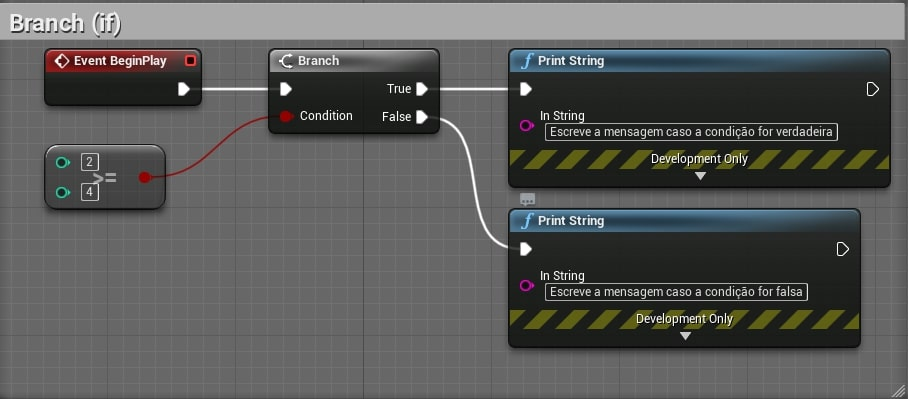
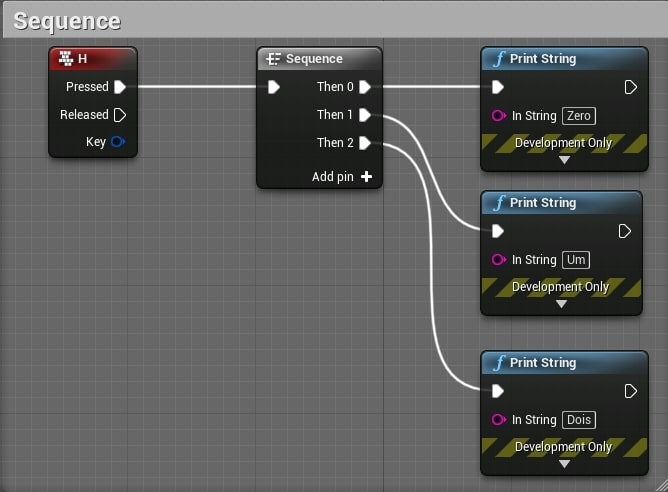
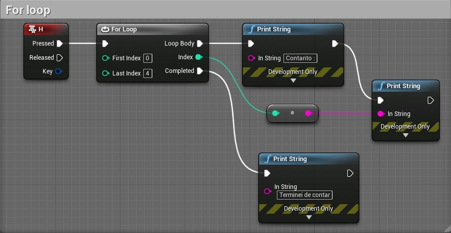
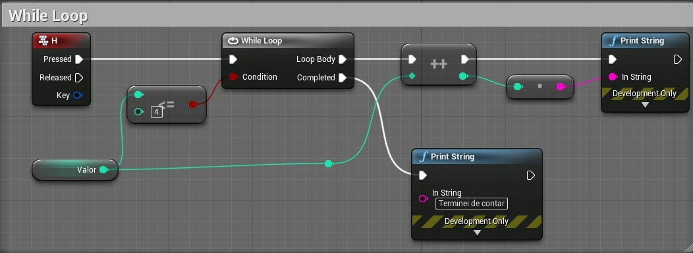
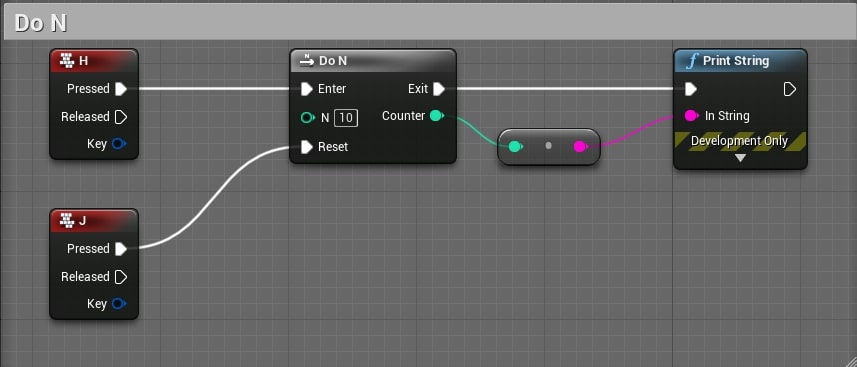
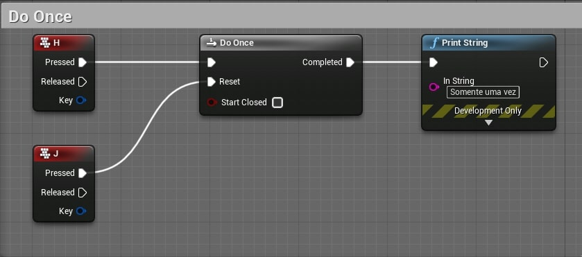
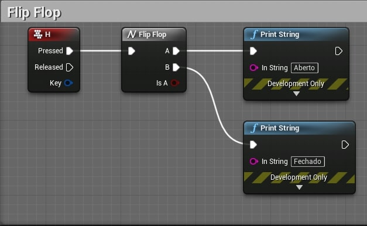
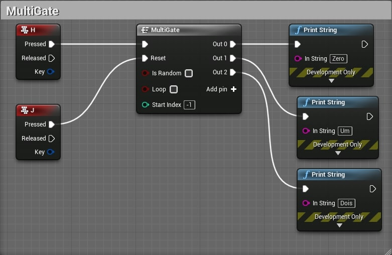

Neste capitulo serão apresentados as estruturas de controle de lógica de programação.

## Índice
1. [O que são estruturas de controle ou fluxo?](#1)
1. [Branch (if)](#1)
1. [Sequence](#2)
1. [For Loop](#3)
1. [While Loop](#4)
1. [Do N](#5)
1. [Do once](#6)
1. [Flip Flop](#7)
1. [Gate e Multi Gate](#8)

*** 

<a name="1"></a>
## 1. O que são estruturas de controle ou fluxo?
Em linguagens de programação existem métodos de tomada de decisão para tarefas corriqueiras que os programas podem executar, por exemplo a escolha de qual caminho ou instrução executar. Em Bluprints utilizamos nós específicos para controle de fluxo como por exemplo o **Branch**.

**Exemplo de fluxo de execução.**

Considere a sequencia de comandos abaixo:
```cpp
int i, x, resultado=0;
i = 2;
x = 10;
resutado = i + x;
cout << "O resultado é : ";
cout << resultado;
```
O resultado desse código é o valor 12 sendo apresentado na tela.

Agora vamos alterar o fluxo de execução:
```cpp
int i, x, resultado=0;
i = 2;
x = 10;
if ( i > x )
  resutado = i + x;
cout << "O resultado é : ";
cout << resultado;
```
O resultado será 0 pois a condição de controle de fluxo **if** provocou um desvio do fluxo de instruções.

A seguir vamos entender como isso é descrito com programação visual usando Blueprint.

<a name="2"></a>
## 2. Branch (if)
Estrutura condicional que testa uma variável utilizando uma expressão lógica e redireciona o fluxo da lógica.

`Blueprint`



`C++`
```cpp
if ( 2 >= 4)
{
  cout << "Escreve a mensagem caso a condição for verdadeira\n";
}
else
{
  cout << "Escreve a mensagem caso a condição for false\n";
}
```
<a name="3"></a>
## 3. Sequence
O nó **Sequence** permite que um único pulso de execução acione uma série de eventos em ordem. O nó pode ter qualquer número de saídas, todas chamadas assim que o nó Sequência receber uma entrada. Eles sempre serão chamados em ordem, mas sem qualquer demora. Para um usuário típico, as saídas provavelmente parecerão ter sido disparadas simultaneamente.

`Blueprint`



`C++`
```cpp
// Não tem similar em C++, deve ser implementado
```

<a name="4"></a>
## 4. For Loop
O nó For Loop funciona como um loop de código padrão, disparando um pulso de execução para cada índice entre o início e o fim.

`Blueprint`



`C++`
```cpp
for (int i = 0; i < 4; i++ ){
      cout << "Contanto: ";
      cout << i;
    }
cout << "Teminei de contar\n";    
```

<a name="5"></a>
## 5. While Loop
Uma condição de teste e um corpo são tudo o que constitui um **loop While**. Antes de executar a (s) instrução (ões) em seu corpo, o Blueprint avalia a condição de teste **WhileLoops** para determinar se ela é verdadeira.

`Blueprint`


`C++`
```cpp
int valor = 0;
while ( valor <= 4) {
    i++;
    cout << i;
    }
cout << "Teminei de contar\n";    
```

<a name="6"></a>
## 6. Do N
O nó **DoN** disparará um pulso de execução N vezes. Depois que o limite for atingido, ele interromperá todas as execuções de saída até que um pulso seja enviado para sua entrada Reset.

`Blueprint`


No exemplo acima toda vez que a tecla **H** for pressionada um valor vai ser apresentado. Quanto o valor 10 for atingido a instrução **Print String** não será executada.  
Pressionando a tecla **J** a contagem será reiniciada.

`C++`
```cpp
// Não tem similar em C++, deve ser implementado
```

<a name="7"></a>
## 7 Do once
O nó DoOnce - como o nome sugere - disparará um pulso de execução apenas uma vez. Desse ponto em diante, ele interromperá toda a execução de saída até que um pulso seja enviado para sua entrada Reset. Este nó é equivalente a um nó **DoN** onde N = 1.

`Blueprint`



`C++`
```cpp
// Não tem similar em C++, deve ser implementado.
```

<a name="8"></a>
## 8 Flip Flop
O nó FlipFlop obtém uma saída de execução e alterna entre duas saídas de execução. Na primeira vez que é chamado, a saída A é executada. Na segunda vez, B. Depois A, B e assim por diante. O nó também possui uma saída booleana que permite rastrear quando a Saída A foi chamada.

`Blueprint`



`C++`
```cpp
// Não tem similar em C++, deve ser implementado
```

<a name="9"></a>
## 9 Gate e Multi Gate
O nó MultiGate recebe um único pulso de dados e o encaminha para qualquer número de saídas potenciais. Isso pode ocorrer sequencialmente, aleatoriamente e pode ou não ser executado em loop.

`Blueprint`



`C++`
```cpp
// Não tem similar em C++, deve ser implementado
```
***
## Referências
- [Flow Control](https://docs.unrealengine.com/en-US/ProgrammingAndScripting/Blueprints/UserGuide/FlowControl/index.html)
- [C++](https://docs.microsoft.com/pt-br/cpp/cpp/if-else-statement-cpp?view=msvc-160)
- [Programar em C++/Decisão e controle de fluxo](https://pt.wikibooks.org/wiki/Programar_em_C%2B%2B/Decis%C3%A3o_e_controle_de_fluxo)
