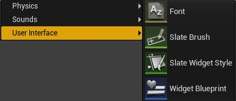
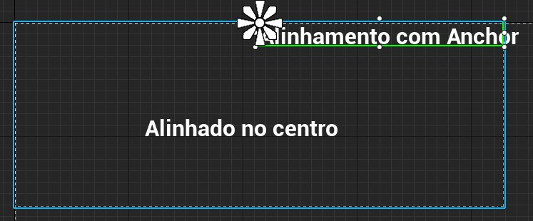

HUD (*Heads-up Display*) ou UI (*Use Interface*) é um objeto especial do **Unreal Engine** para apresentar informações sobrepostas na tela e interagir com o jogador.

Neste capitulo vamos apresentar formas de interação com o jogador e depois construir objetos os necessários.

## Índice
1. [Como interagir com o jogador?](#1)
    1. [Menos é Melhor](#1.1)
    1. [Para apresentar informações do personagem na tela do jogador com Unreal Engine os passos são seguintes:](#1.2)
    1. [Para apresentar informações do personagem na tela do jogador com Unreal Engine os passos são seguintes:](#1.3)
1. [Implementando o Widget para o construir o menu do jogo](#2)
    1. [Criando o Widget](#2.1)
    1. [Editor de de Widget](#2.2)
    1. [Hierarquia de elementos](#2.3)
    1. [Entendo alinhamento utilizando Anchors](#2.4)            
    1. [Horizontal ou Vertical Box](#2.5)    
    1. [Grid Panel](#26)    
1. [ATIVIDADES](#7)
    1. [Apresentando mensagens para interagir com o personagem](#7.1)                      


<a name="1"></a>
## 1. Como interagir com o jogador?
Durante o tempo do jogo é necessário interagir com o jogador de diversas formas, informando status de jogo, personagem e até mesmo guias de missões. Geralmente são informações em formatado texto e imagens 2D que se sobrepõe a tela para informar o jogador.       

De outra forma, o comunicação de ações globais do jogo como por exemplo iniciar uma missão, salvar o jogo, sair do jogo e gerenciamento de configuração são formas de interação jogo vs player que utilizam menus através de botões, caixas rolantes e outros componentes.

<a name="1.1"></a>
### 1.1 Menos é Melhor!
Uma dica simples, segundo as boas práticas de IHC (Interface Homem Computador), é **"Menos é melhor"**, onde devemos apresentar somente o necessário para o jogador e deixar a maior parte da experiência do jogador para o *Gameplay*.

<a name="1.2"></a>
### 1.2 Para construir um menu do jogo com Unreal Engine os passos são seguintes:
1. Crie uma pasta para organizar os arquivos:
```sh
 Content\UI\
 ```
1. Crie um objeto blueprint `Widget` na pasta criada anteriormente.
```sh
Content\UI\WBP_Menu
```
1. Edite e organize os elementos visuais do `Widget` e a lógica de programação.
1. Crie um *level* vazio para servir como base do menu.
1. Utilizando `Open Level Blueprint` para ao iniciar o *level*, **Begin Play** implemente a lógica para carregar o menu na cena.

<a name="1.3"></a>
### 1.3 Para apresentar informações do personagem na tela do jogador com Unreal Engine os passos são seguintes:
1. Crie um objeto blueprint `Widget` na pasta criada anteriormente.
```sh
Content\UI\WBP_Character_info
```
1. Edite e organize os elementos visuais do `Widget` e a lógica de programação.
1. Na lógica de construção do `Widget` adicione uma variável para ter acesso a classe *Character* do personagem.
1. É possível apresentar o `Widget` quando o personagem é instancia na cena.

<a name="2"></a>
## 2. Implementando o Widget para o construir o menu do jogo
No **Unreal Engine** utilizamos um objeto com atributos e métodos próprios para o tratamento e organização de informação na interface do jogador, a classe de objetos `Widget` que vem acompanhado por um editor especial.    


*Figura: Widget Editor Blueprint - Unreal Engine doc*


<a name="2.1"></a>
### 2.1 Criando o Widget
Utilizando o **Context Menu** escolha a opção **User Interface/Widget Blueprint**.      

    

*Figura: Context Menu/ User Interface/ Widget Blueprint*

<a name="2.2"></a>
### 2.2 Editor de de Widget
O editor de Widget é divido em :
- `Designer` para apresentação e manipulação de elementos visualmente.
- `Graph` para inserir a lógica de ações utilizando **Blueprint**.    

      

    *Figura: Widget Designer e Graph*

<a name="2.3"></a>
### 2.3 Hierarchy - Hierarquia de elementos
Os elementos apresentados na Widget seguem uma hierarquia que determina o posicionamento relativo na tela.      

  

*Figura: Widget Hierarchy*

- Observe que tem vários objetos alinhados hierarquicamente e que neste caso vão nos ajudar e organizar a tela, sendo a raiz da árvore o objeto `BP_HUD_demo`.
- Os elementos `Canvas Panel`, `Horizontal Box`, `Vertical Box Grid Panel` tem propriedades para alinhamento dos elementos hierarquicamente abaixo.
- `Grid Panel` está hierarquicamente superior ao `Image_968`, isso significa que o texto deverá ser alinhado em relação ao `Grid Panel`
- Abaixo a apresentação dos elementos.

    

*Figura: Widget Designer*

<a name="2.4"></a>
### 2.4 Entendo alinhamento utilizando Anchors
Para gerenciar melhor o posicionamento de objetos no `Widget Designer` vamos entender o objeto `Anchor` (Âncora).   

- Ancorar um elemento é definir uma posição predefinida na tela.   
        

    *Figura: Widget Anchor alinhamento*

- No exemplo abaixo o elemento `Text` está posicionado na tela respeitando a âncora predefinida. A âncora pode ser alterada.  
      

    *Figura: Widget Anchor*
- Observe os valores de **Position** **X** e **Y** são zero, isso nos diz que a texto esta totalmente alinhado a âncora.  
      

    *Figura: Widget Acnhors position UMG*

- Agora vamos dividir a âncora e alinhar o texto dentro das fronteiras da âncora.   
  

    *Figura: Widget Anchors Alinhamento separado UMG*
- Agora temos as propriedades `Offset Left` e `Right` com um valor que determina a posição do texto entre as fronteiras da âncora.   
      

    *Figuera: Widget Canvas propriedades Alinhamento*
- `Size to Content` determina que o elemento se ajustara ao tamanho do conteúdo.
- `Alignment`  permite alinhar o elemento com a `Anchors`, como por exemplo inserir os valores X = 0.5 e Y = 0.5 para centralizar o objeto com a `Anchor`.

<a name="2.5"></a>
### 2.5 Horizontal ou Vertical Box
Estes elementos são utilizados para organizar os objetos Horizontal ou verticalmente. Ao adicionar elementos hierarquicamente abaixo de um `Vertical` ou `Horizontal box` eles serão organizados um ao lado do outro.   

- `Horizontal box`- Alinhamento Horizontal dos elementos.  
       

    *Figura: Widget Horizontal Box UMG*

- `Vertical box` - Alinhamento vertical dos elementos.  
      

    *Figura: Widget Vertical Box UMG*

- Nas propriedades do elemento dentro do `Vertical Box` selecione `Size Fill` para preencher todo espaço do painel.  
        

    *Figura: Widget Vertical Box Size fill UMG*

<a name="2.6"></a>
### 2.6 Grid Panel
Como o nome anuncia, os elementos hierarquicamente agrupados abaixo do painel serão organizados em forma de um grid (matriz).   

    

*Figura: Widget Grid Panel UMG*

- `Grid Panel` tem uma propriedade especial que determina qual o valor de preenchimento de cada coluna ou linha dentro do grid. O valor varia de 0 a 1, onde 0,5 é metade do espaço e 1 totalmente preenchido.  
      

    *Figura: Widget Grid panel Column Fill UMG*

- O elemento agrupado também terá as propriedades `Row` e `Col` preenchidas sinalizando qual a posição do elemento dentro do grid.    
      

  *Figura: Widget Grid Panel Row Col UMG*

<a name="7"></a>
## 7 ATIVIDADES
<a name="7.1"></a>
### 7.1 Apresentando mensagens para interagir com o personagem
#### Regras
1. Implemente um objeto *Widget* com um texto colorido e formatado.
1. O *Widget* é acionado pressionando a tecla F quando o personagem ficar próximo.

#### Desafio      
1. Implemente um gameplay em primeira pessoa dentro de uma casa.


***
## Referências
- [1.1 - HUD Example](https://docs.unrealengine.com/en-US/Resources/ContentExamples/Blueprints_HUD/1_1/index.html)
- [User Interfaces & HUDs](https://docs.unrealengine.com/en-US/InteractiveExperiences/Framework/UIAndHUD/index.html)
-[Anchors](https://docs.unrealengine.com/en-US/InteractiveExperiences/UMG/UserGuide/Anchors/index.html)
- [Quick Start](https://docs.unrealengine.com/en-US/InteractiveExperiences/UMG/QuickStart/index.html)
