
## CAPÍTULO 8 - Estruturas de dados e Interface com usuário

Neste capitulo vamos apresentar a lógica de programação os objetos do HUD.

&nbsp;&nbsp;[8.5 Lógica de programação do Widget - Graph](#8.5)

&nbsp;&nbsp;&nbsp;&nbsp;&nbsp;&nbsp;[8.5.1 Executando o menu](#8.5.1)

&nbsp;&nbsp;&nbsp;&nbsp;&nbsp;&nbsp;[8.5.2 Apresentando informações para o jogador](#8.5.2)

&nbsp;&nbsp;&nbsp;&nbsp;&nbsp;&nbsp;[8.5.3 Organizando os objetos](#8.5.3)

***

## 8.5  Lógica de programação do Widget - Graph
A lógica de controle de ações dos botões e a inicialização está em `Graph`, onde encontramos alguns eventos já conhecidos como por exemplo `Event Construct` e `Tick`.    

**Event Construct para inicializar variáveis utilizadas no Widget.**

Para que o objeto menu tenha acesso a propriedades da classe do jogador vamos inicialiazar a uma variável local utilizando `Event Construct`.
Ao iniciar o Widget definimos uma variável **Jogador** do tipo `BP_Hero` para que possamos ter acesso as propriedades nome e vida por exemplo.

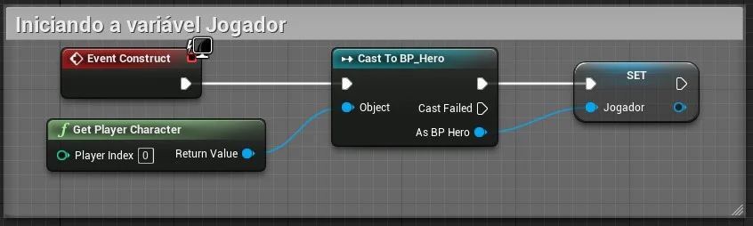

> Figura: Blueprint - Widget Graph Event Construct.

**Botões e eventos (Button and Events).**

Os elementos do tipo `Button` tem eventos relacionados na sua estrutura, como por exemplo: `On Clicked`, `On Pressed` e outros.

Vamos utilizar o evento `OnClick` para executar a função `Open Level` para carregar outro *level* do projeto. Deverá ser informado o nome do *Level* que queremos abrir.   

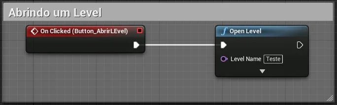    

> Figura: Blueprint -  Widget HUD Blueprint e Open Level.

**Acionando o botão Sair para finalizar o jogo.**

Ao clicar no botão Sair vamos chamar a função `Quit Game` que finaliza do jogo.  

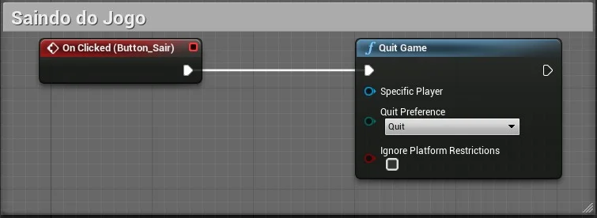    

> Figura: Blueprint - Widget HUD Blueprint Quit Game.

### 8.5.1 Executando o menu
Neste passo vamos criar um *Level* vazio para executar o menu, quando o menu for chamado a tela inteira deve mudar.   
Caso o `Widget` seja o menu principal que deverá ser chamado no início do jogo é necessário adicionar o mesmo em [Level e inicialização](index.html#2.4)

1. Vamos criar um Level Vazio `Empty Level` para funcionar como base do menu.    
  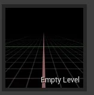      

  > Figura: Widget Empty Level.

2. Em `Open Level Blueprint` vamos adicionar a lógica para criar um objeto do tipo `BP_HUD_Demo` e adicionar na tela com a função `AddToViewPort`.   
  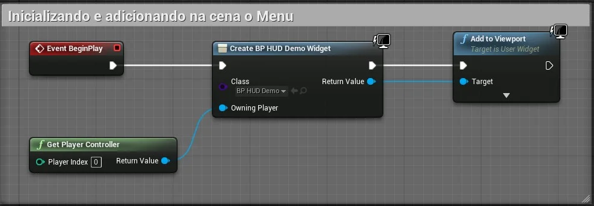

  > Figura: Widget HUD Add ViewPort.

### 8.5.2 Apresentando informações para o Jogador
Para este passo vamos implementar os seguintes elementos para apresentar informações para o jogador, como por exemplo a vida do personagem.    

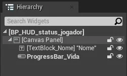    

> Figura: Widget HUD Player Elements.

- `TextBlock` - Para apresentar o nome do jogador;

- `ProgressBar` - Para apresentar a vida do jogador.

**Fazendo a ligação do elemento da interface com uma função.**

Devemos conectar os elementos da interface com funções por meio de uma propriedade `Bind`.   

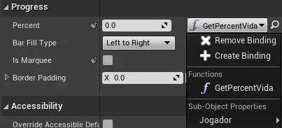      

> Figura: Blueprint - Widget HUD Progress Bar Bind.

**Função do calculo de vida do jogador.**

Para calcular o valor da vida do jogador vamos implementar uma função, abaixo a lógica da função associada a elemento `ProgressBar`.    

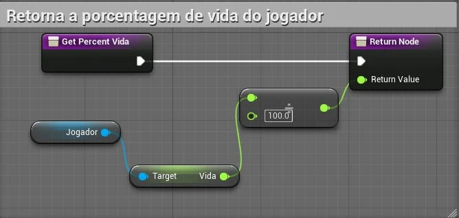    

> Figura: Widget HUD Progress Bar function.

**Função para pegar o nome do jogador.**

Podemos utilizar [Variáveis estruturadas](unreal_engine_structure_variaveis_estruturadas.html) para manipulação das propriedades do jogador.   

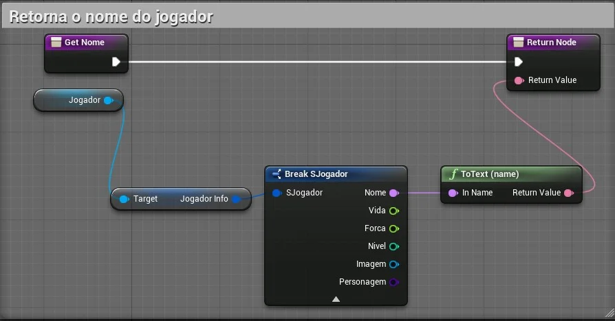      

> Figura: Widget HUD name player function.

### 8.5.3 Organizando os objetos
A seguir vamos apresentar algumas implementações e organizaremos todos os objetos criados para controlar melhor a lógica de programação de cada elemento, considerando:  

- Separação da lógica de negócios e os visuais de sua IU;

- Permite iteração rápida de layout e visuais;

- Depuração eficaz da lógica de negócios;

- Performance.

**Criando o objeto SaveGame para salvar dados do jogo.**

Para exemplificar algumas funções do menu como por exemplo salvar dados do jogo vamos realizar as seguintes operações.

1.  Implementar um objeto BP_SaveGameDemo do tipo `SaveGame`, para isso utilizamos o menu de contexto e escolhemos `Blueprint`.        
  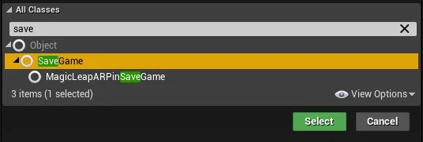    

  > Figura: Blueprint - Class SaveGame.   

2. Adicionamos variáveis dentro do objeto para definir o que deve ser salvo, neste exemplo utilizaremos a variável `JogadorInfo` do tipo `S_jogador` que é uma
  [Variável Structure](unreal_engine_structure_variaveis_estruturadas.html).     
  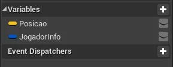    

  > Figura: Blueprint - SaveGame variáveis.

Nos próximos passos vamos criar o objeto *BP_GameInstanceJogo* do tipo [**GameInstance**](unreal_engine_gameinstance_state_mode.html#5) e adicionar os eventos customizados (`Add custon event`) a seguir.

**Evento para apresentar o menu na tela.**

Implementamos um evento customizado para adicionar lógica dos eventos.

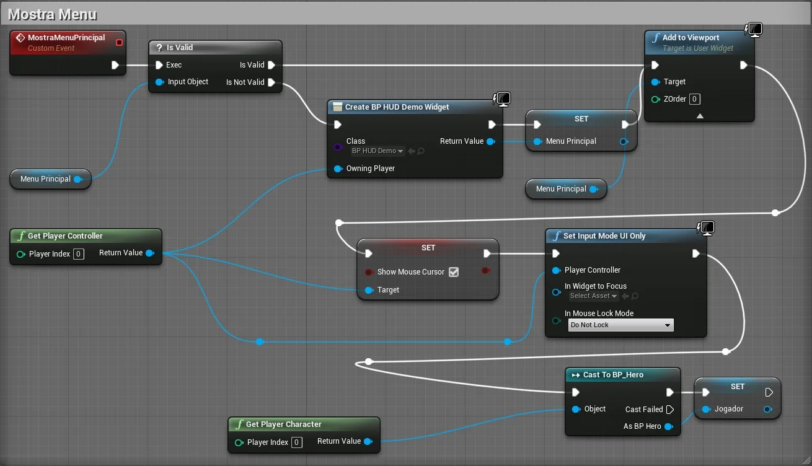    

> Figura: Widget HUD Blueprint Logic Add to ViewPort.

- `Show Mouse Cursor` - Esta variável é uma propriedade de `PlayerController`  e Configurando para *true* o ponteiro do mouse deve aparecer na tela.
- `Set Input Mode UI Only` - Esta função determina que o controle de entrada de dados será somente pelo `Widget`.

**Evento para abrir um Level.**

Neste passo vamos adicionar um evento customizado ,`add custom event`, para carregar um *level* na cena.

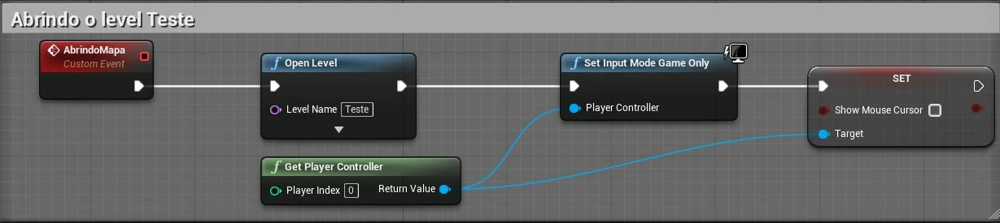      

> Figura: Blueprint - Logica para Open Level.

- `Open Level` - Função para abrir um *Level* do jogo. É necessário informar o nome do *level* no parâmetro *Level Name*;

- `Set Input Mode Game Only` - Esta função determina que o controle de entrada de dados será somente pelo jogo.

**Salvando dados.**

Para salvar informações vamos utilizar a função `Save Game to Slot`.

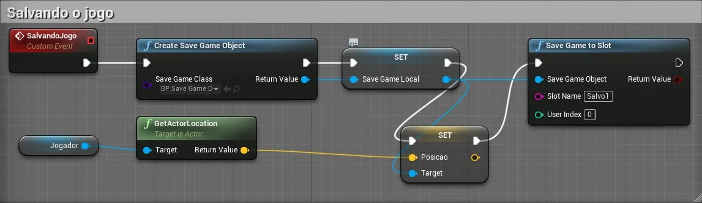

> Figura: Logica de SaveGame com slot.

- `Create Save Game Object` - Cria um objeto do tipo `BP_SaveGameDemo`, definido anteriormente;

- `Save Game to Slot` - Salva os dados e cria um `Slot Name` *Salvo1*.

**Evento para carregar dados.**

Para carregar dados salvos utilizamos a função `Load Game from Slot` passando como parâmetro o nome do *slot*.

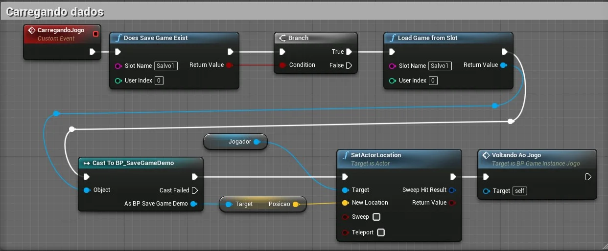      

> Figura: Logica para carregar dados - Load Game From Slot.

- `Does Save Game Exist` - Retorna verdadeiro se encontra um jogo salvo com o nome *Salvo1* informado em `Slot Name`;

- `Load Game from Slot` - Carrega as variáveis salvas em `Slot Name`, neste caso *Salvo1*.

**Voltando ao jogo.**

Vamos agora remover o menu ou objeto `Widget` da cena utilizando a função `Remove from parent`.

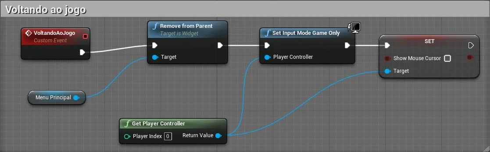    

> Figura: Blueprint - Remove From Parent.

- `Remove from Parent` - Remove o widget de seu `Widget` pai. Se este `Widget` foi adicionado à tela do jogador ou à janela de visualização, ele também será removido desses recipientes.

**Iniciando Game Instance no Widget.**

No objeto BP_HUD_Demo vamos substituir ou adicionar a lógica dos botões, mas antes devemos inicializar a `Game Instance`.   

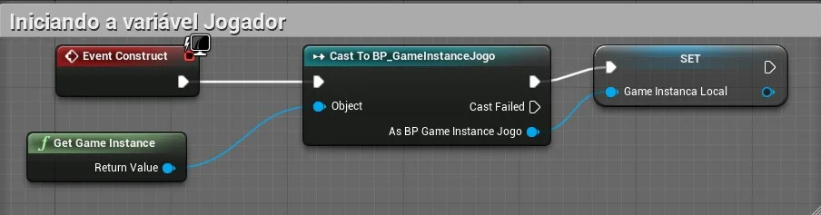

> Figura: Blueprint - Widget HUD gameinstance.

**Efetuando as chamadas das funções.**

No evento click dos botões vamos adicionar os eventos construídos dentro da *Game Instance* isolando a regra de negócios (dados e lógica e manipulação).   

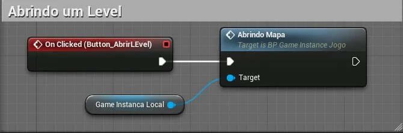      

> Figura: Blueprint - Widget HUD with Game Instance on click.

Repetimos esse processo para associar todos os eventos aos botões.
