Neste capitulo serão apresentados os conceitos de estruturas de *arrays* ou vetores e suas funções para manipulação.


<iframe src="https://blueprintue.com/render/anpm5v28/" scrolling="no" allowfullscreen </iframe>

## Índice
1. [O que são variáveis do tipo array?](#1)
     1. [Exemplo de números inteiros](#1.1)
     1. [Exemplo de números Números float](#1.2)
     1. [Exemplo com String](#1.3)
     1. [Representação](#1.4)
1. [Declarando arrays](#2)
1. [Método Get para arrays](#3)
1. [Get utilizando uma variável como índice](#4)
1. [Último índice e a quantidade de elementos do `array`](#5)
1. [Removendo elementos utilizando `Remove`](#6)
1. [Listando todos os elementos utilizando **For**](#7)
1. [Usando o comando `Find`](#8)
1. [Comando remove `index`](#9)
1. [Comando remove](#10)
1. [Limpando o `array` com *clear*](#11)
1. [Atualiza o `array` nome clássicos com dados do `array` de nome](#12)
1. [Contando elementos dentro de um `array`](#13)

***

<a name="1"></a>
## 1. O que são variáveis do tipo array?
É um conjunto de variáveis do mesmo tipo agrupadas dentro de uma estrutura e acessíveis por um índice.  

Vamos aos exemplos.

<a name="1.1"></a>
### 1.1 Exemplo de números inteiros  

```cpp
a = ( 5,2,7,3,9)  
```

<a name="1.2"></a>
### 1.2 Exemplo de números Números *float*  

```cpp
a = ( 5.1,2.9,7.0,3.121,9.43)  
```

<a name="1.3"></a>
### 1.3 Exemplo com *String*  

```cpp
s = ( "Ana","José","Hugo","Hulda")
```

<a name="1.4"></a>
### 1.4 Representação
Podemos representar os arrays da seguinte forma:

| s         |s[0] |s[1] |s[2] | s[3]  |
|---        |---  |---  |---  |---    |
|**Valor**  |Ana  |José |Hugo |Hulda  |
|**Índice** |  0  | 1   | 2   | 3     |

- s[0] - O valor entre colchetes indica a posição (índice) do elemento no array.
- O índice em C++ inicia com o valor 0.

<a name="2"></a>
## 2. Declarando arrays
Para declarar variáveis do tipo `array` devemos primeiro escolher um tipo de variável primitivo, como por exemplo um tipo `String`, e logo em seguita determinar que será um `array`, vamos aos exemplos.

**Blueprint**    

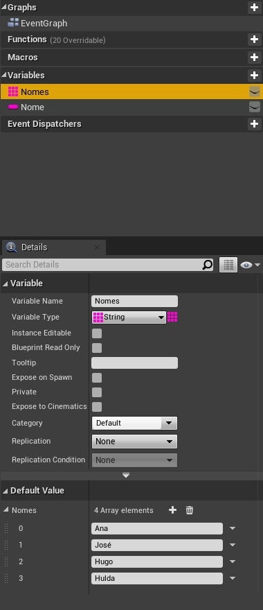

- `Nomes` - É uma variável array, como o ícone de mini grid informa,do tipo **String**.
- `Default Value` - Contem a lista de valores contidos inicialmente no `array`.

**C++ Unreal**  

```cpp
FString  pessoas[4] = { "Ana","José","Hugo","Hulda"};
int  pessoas[3] = { 4,3,7};
```

<a name="3"></a>
## 3. Método *Get* para *arrays*
Para acessar qualquer elemento dentro `array` é necessários utilizar o índice.  

**Blueprint**  

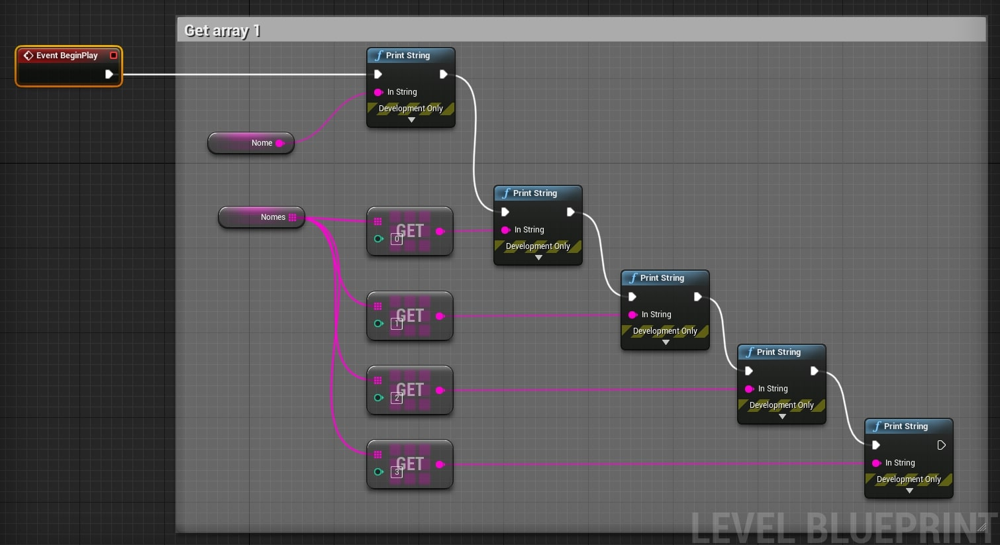

**C++ Unreal**  

```cpp
FString s = pessoa[0];
UE_LOG(LogTemp,Warning,TEXT("O nome é %s",*s));
```

<a name="4"></a>
## 4. Get utilizando uma variável como índice
Podemos utilizar uma variável para acessar elementos do array.

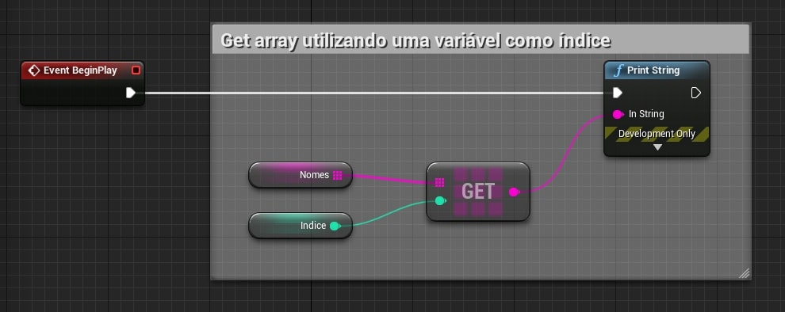

- **Indice** - Definimos o valor 1 para acessar o elemento da referida posição.

<a name="5"></a>
## 5. Último índice e a quantidade de elementos do `array`
Podemos determinar a quantidade de elementos ou valor do último índice do `array` utilizando as propriedades abaixo.    

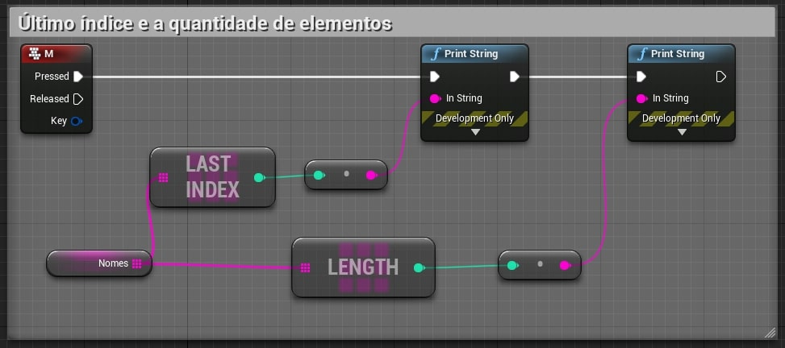

- `Last Index` - Retorna o valor do último índice e o comando.
- `Length` - Retorna a quantidade de elementos do `array`.

<a name="6"></a>
## 6. Removendo elementos utilizando *Remove*
É possível remover elementos de dentro do `array`.    

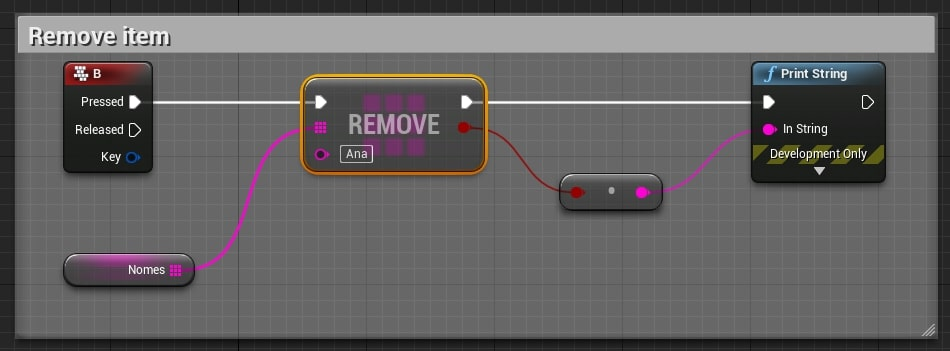

<a name="7"></a>
## 7. Listando todos os elementos utilizando *For*
Na lógica abaixo percorremos todo `array` e listamos cada elemento.   

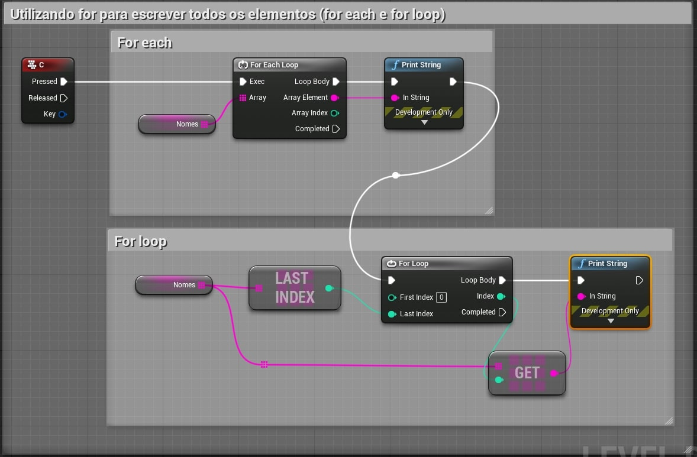

- `For Each Loop` - Para cada elemento do `array` é processada uma interação.
- `For Loop` - Para cada elemento do `array`, dentro dos parâmetros `First Index` e `Last Index` é processada uma interação.

<a name="8"></a>
## 8. Usando o comando *Find*
`Find` procura um elemento dentro do `array` e se encontra retorna o valor do índice do elemento, caso não encontre retorna -1.   

**Blueprint**      

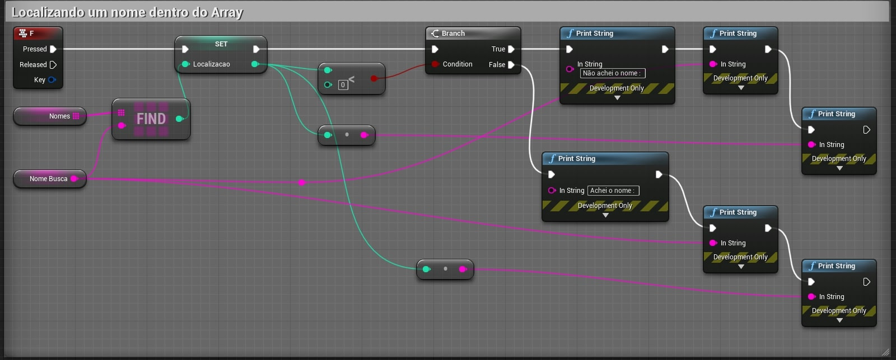    

**C++ Unreal**

```cpp
int32 Index;
if (StrArr.Find(TEXT("Hello"), Index))
{
    // Index == 3
}
```

<a name="9"></a>
## 9. Comando *remove index*
Remover um elemento do `array` utilizando o índice.      

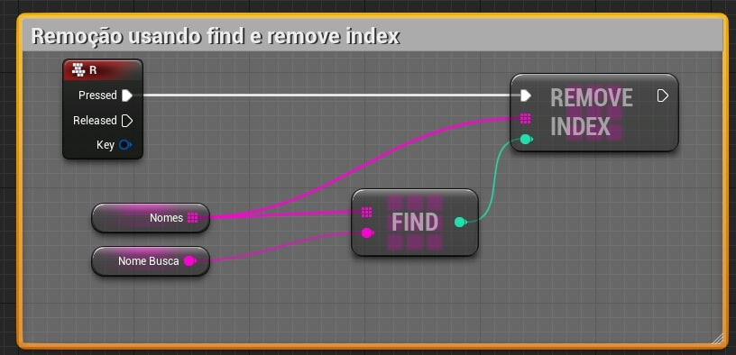

<a name="10"></a>
## 10. Comando *remove*
Executa uma busca utilizando um parâmetro, **NomeBusca** no exemplo abaixo, e o remove do `array`.    

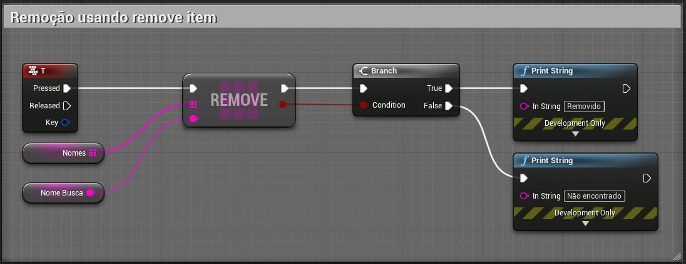

<a name="11"></a>
## 11. Limpando o array com *clear*
Remove todos os elementos do `array`.

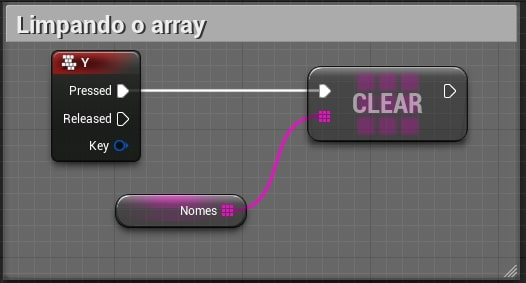

<a name="12"></a>
## 12. Atualiza o `array` **nome clássicos** com dados do `array` de **nome**

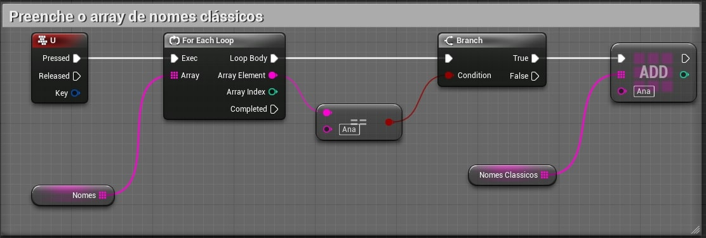

<a name="13"></a>
## 13. Contando elementos dentro de um `array`
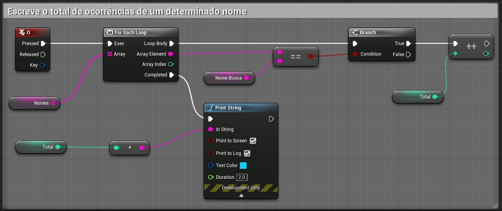

***
### Referências
- [Unreal Engine Blueprints Array](https://docs.unrealengine.com/en-US/Engine/Blueprints/UserGuide/Arrays/index.html)   
- [Unreal Engine Array Nodes](https://docs.unrealengine.com/en-US/Engine/Blueprints/UserGuide/Arrays/ArrayNodes/index.html)    
- [C++](https://www.codegrepper.com/code-examples/cpp/ue4+c%2B%2B+array)

***
