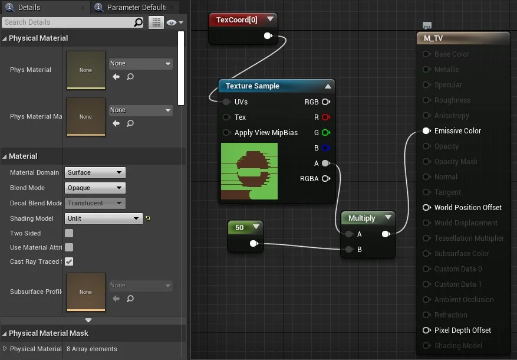

<a name="8"></a>
## CAPÍTULO 9 - Materiais e Landscape

Neste capítulo vamos apresentar a lógica de construção de materiais, denomina *Material Expressions* no Unreal Engine e suas funções.


&nbsp;&nbsp;[9.2 Material expressions](#9.2)

&nbsp;&nbsp;&nbsp;&nbsp;&nbsp;&nbsp;[9.2.1 Combinando elementos utilizando funções](#9.2.1)

&nbsp;&nbsp;&nbsp;&nbsp;&nbsp;&nbsp;[9.2.2 Utilizando Panner e TextCoord](#9.2.2)

&nbsp;&nbsp;&nbsp;&nbsp;&nbsp;&nbsp;[9.2.3 Exemplo do nó Lerp](#9.2.3)

&nbsp;&nbsp;&nbsp;&nbsp;&nbsp;&nbsp;[9.2.4 Texturas](#9.2.4)

&nbsp;&nbsp;&nbsp;&nbsp;&nbsp;&nbsp;[9.2.5 Aplicando o material no objeto](#9.2.5)

&nbsp;&nbsp;&nbsp;&nbsp;&nbsp;&nbsp;[9.2.6 World position Offset](#9.2.6)

&nbsp;&nbsp;&nbsp;&nbsp;&nbsp;&nbsp;[9.2.7 Unlit Shading Model](#9.2.7)

&nbsp;&nbsp;&nbsp;&nbsp;&nbsp;&nbsp;[9.2.8 Masked Blend Mode](#9.2.8)

&nbsp;&nbsp;&nbsp;&nbsp;&nbsp;&nbsp;[9.2.9 Translucent Blend Mode](#9.2.9)


***

<a name="9.2"></a>
## 9.2 O que são Material expressions?
Os nós de Expressão de Material ou Material Expression contêm pequenos fragmentos de código HLSL que realizam tarefas muito específicas dentro de um Material. Os materiais são construídos usando combinações de nós de Expressão de Material que são combinados para realizar certas tarefas.

Conectando Material Expressions, abaixo um exemplo de conexão.       

       

> Figura: Blueprint Material - Exemplo de connection.

- Botão direito do mouse em qualquer área de trabalho (RMB) abre a lista de nós disponíveis;

- É possível fazer a busca de nós na aba `Palette` e arrastar com o mouse na área de trabalho.

Combinando `Material Expressions`, a área de trabalho é um modelo de programação visual que permite combinar variáveis e funções para construir a estrutura final. Cada nó apresenta uma saída para o próximo nó.    

**Atenção**
devemos considerar o tipo de valor de retorno do nó no momento da conexão para evitar erros de tipos conflitantes, por exemplo float3 * float2.

<a name="9.2.1"></a>
### 9.2.1 Combinando elementos utilizando funções

Neste exemplo vamos combinar várias texturas e utilizar funções de manipulação para obter o resultado abaixo.

     

> Figura: Blueprint Material - Objeto com mistura de texturas.

É possível criar comentários no diagrama, abaixo lógica de construção de nós com comentários para facilitar a documentação.

     

> Figura: Blueprint Material - Lógica da combinação de texturas.

`Base Color 1`

Cada pixel do canal R da textura é multiplicado pela cor.     

    

> Figura: Blueprint Material - Channel R Texture Wood Pine.

- O valor 1 = branco e 0 = preto.

`Base Color 2`

`Lerp` recebe o resultado da multiplicação e dos canais RGB da textura para do passo anterior. No parâmetro  Alpha é informado o canal G textura.


> Figura: Blueprint Material - Channel G Texture Ceramic Tile.

Neste passo o valores 0 (branco) e 1 (preto) são multiplicados.

**Exemplo de multiplicação entre vetores.**      

```c++
  resul =  ( Vetor3(0.0664,0.0366,0.401) * Vetor3(0,1,0) );
  // Resultado
   (0,0.0366,0)
```

- `Multiply` multiplica o canal R da textura com o resultado do Lerp.

      

> Figura: Blueprint Material - Channel R Texture Ceramic Tile.

`Normal Map.`

     

> Figura: Blueprint Material - Texture Normal.

- `Mask` - Filtra os canais passados como parâmetro;

- `Append` - Combina dois canais juntos para criar um vetor com mais canais que o original.

```c++
resul =  ( Mask(Vetor3(64,36,40),1,1,0));
// Resultado 2 colunas
(64, 36)
resul = append(resul, 0);
// Resultado 3 colunas
(64, 36,0)
```
- `Add` - Adiciona os valores de dois parâmetros e retorna um novo vetor, por exemplo.

```c++
resul =  Add( vetor3(1,3,4) , vetor3(2,4,1)  );
// Resultado
(3,7,5)
```

<a name="9.2.2"></a>
### 9.2.2 Utilizando Panner e TextCoord
Neste exemplo será simulado o movimento da textura no objeto.

     

> Figura: Blueprint Material - Function Panner.

**Lógica**

```c++
  M_Base =  ( TexturaSample( panner(TexCoord(),0.1,0) ) * Vetor3(0.0664,0.0366,0.401));
```

- `Panner` - Produz coordenadas de textura UV que podem ser usadas para criar texturas panorâmicas ou móveis;

- `Multiply` - Pega duas entradas, multiplica-as juntas e produz o resultado.   
Se você passar valores com vários canais, cada canal será multiplicado separadamente. Por exemplo, se você passar valores de cor RGB para cada entrada, o canal R da primeira entrada é multiplicado pelo canal R da segunda entrada e o resultado é armazenado no canal R da saída; o canal G da primeira entrada é multiplicado pelo canal G da segunda entrada e o resultado é armazenado no canal G da saída e assim por diante.          
Ambas as entradas devem ter o mesmo número de valores, a menos que um dos valores seja um único valor flutuante. Nesse caso, cada canal da entrada multicanal é multiplicado pelo valor flutuante único e armazenado em um canal separado do valor de saída;

- `TexCoord` - Gera coordenadas de textura UV na forma de um valor vetorial de dois canais, permitindo que os materiais usem diferentes canais UV, especifiquem ladrilhos e, de outra forma, operem nos UVs de uma malha.

<a name="9.2.3"></a>
### 9.2.3 Exemplo do nó Lerp
Interpola Linearmente entre A e B com base em Alfa (100% de A quando Alfa = 0 e 100% de B quando Alfa = 1)

     

> Figura: Blueprint Material - Exemplo de Lerp.

<a name="9.2.4"></a>
### 9.2.4 Texturas
A seguir vamos abordar as características das texturas no **Unreal Engine**.

     

> Figura: Blueprint Material - Base texture.

**Roughness - rugosidade.**

`Roughness` (Aspereza e também chamada de brilho ou dispersão da micro-superfície) é um mapa semi-autoexplicativo. Eles definem como a luz é espalhada pela superfície do seu modelo.     
Isso começa com um valor de zero, onde seu modelo não dispersará a luz, tornando os reflexos e a iluminação muito mais nítidos e brilhantes em seu material.    
Por outro lado, se você aumentar a rugosidade ao máximo, a luz se espalhará mais pelo material. Isso faz com que a iluminação e os reflexos se espalhem pelo modelo, mas pareçam muito mais escuros.      

Para exemplificar utilizaremos o canal A (Alpha) da textura `Rock Basalt`.      

   

> Figura: Blueprint Material - Texture Roughness - Esses mapas são em tons de cinza, com o branco sendo a aspereza máxima e o preto sendo uma superfície lisa e brilhante.


**Normal - Coordenadas normals**

Usado para simular a maneira como a luz interage com a superfície do material para simular saliências e amassados menores.    
É importante observar que um mapa normal não mudará sua geometria base (consulte os mapas de altura posteriormente neste artigo).   

     

> Figura: Blueprint Material - Texture Normal.

A cor base de um mapa normal é roxo claro, esta é a “parte inferior” do mapa normal que representa a superfície de sua malha poligonal. A partir daí, os valores RGB são usados para produzir rachaduras, saliências ou poros em seu modelo. Os valores R, G e B são iguais às coordenadas X, Y e Z em sua malha base.

**Metallic - Metálica.**

É usado para definir se o seu material (ou parte dele) é metal puro.      
Os mapas de metal também são em tons de cinza, mas a prática recomendada é usar apenas os valores de branco e preto e fazer as variações entre o uso de seus mapas de rugosidade.     

Para exemplificar utilizaremos o canal R (Red) da textura *Rock Basalt*.

     

> Figura: Blueprint Material - Texture Metallic.

Preto no mapa de *metalidade* significa que parte do mapa usará o mapa de albedo como a cor difusa (a cor que a textura mostra quando é atingida pela luz).   
Em vez disso, o branco usará a cor albedo para definir a cor e o brilho de seus reflexos e definirá a cor difusa dos materiais como preto. A cor difusa não é mais necessária neste caso porque todas as cores e detalhes daquela parte do material agora virão dos reflexos, tornando-o preto.


<a name="9.2.5"></a>
### 9.2.5 Aplicando o material no objeto
Para aplicar o material em um objeto podemos selecionar o objeto e atualizamos a propriedade `MATERIALS` selecionando o material criando anteriormente.

   

> Figura: Blueprint Material -  Applying Material.

<a name="9.2.6"></a>
### 9.2.6 World position Offset
Permite que os vértices de uma malha sejam manipulados no espaço do mundo pelo Material. Isso é útil para fazer objetos se moverem, mudarem de forma, girarem e uma variedade de outros efeitos. Isso é útil para coisas como animação ambiente.

     

> Figura: Blueprint Material - World Position Offset.

Os valores do nó Constant Vector 3, representam as coordenadas de posição do mundo (x,y,z) respectivamente.

**Exemplo.**    

   

> Figura: Blueprint Material - World Position offset.

- `TexCoord` - U=0.15, V=0.15;

- `Panner` - Speed X =0.05, Speed Y= 0.1.

<a name="9.2.7"></a>
### 9.2.7 Unlit Shading Model
Produz apenas Emissivo para cores, tornando-o perfeito para efeitos especiais como fogo ou iluminação de objetos. Observe que, neste exemplo, o Material não está projetando luz na cena. Em vez disso, seu alto valor Emissivo resulta em um efeito de brilho, que também é captado pela Máscara de Sujeira aplicada à câmera. Parece iluminar, mas nenhuma luz ou sombra será projetada por este objeto.

     

> Figura: Blueprint Material - Properties Unlit Shading Model.


> Figura: Material Properties blend Mode Unlit.

<a name="9.2.8"></a>
### 9.2.8 Masked Blend Mode
É usado para objetos nos quais você precisa controlar seletivamente a visibilidade de forma binária (liga / desliga). Por exemplo, considere um material que simula uma cerca de arame ou grade. Você terá algumas áreas que parecem sólidas, enquanto outras são invisíveis. Esses materiais são perfeitos para o modo de `Blend Masked` .     

     

> Figura: Blueprint Material - Properties blend mode masked.

- `Roughness` - Valor 1
- `Two Sided ` - Valor `True`

   

> Figura: Blueprint Material - Properties blend mode masked result.

<a name="9.2.9"></a>
### 9.2.9 Translucent Blend Mode
É usado para objetos que requerem alguma forma de transparência.

  

> Figura: Blueprint Material - Properties blend mode Translucent.


- `Material Domain` - Surface;

- `Blend Mode` - Translucent;

- `Lighting Mode` - Surface TranslucencyVolume.

Resultado.

     

> Figura: Blueprint Material - Properties blend mode Translucent.
