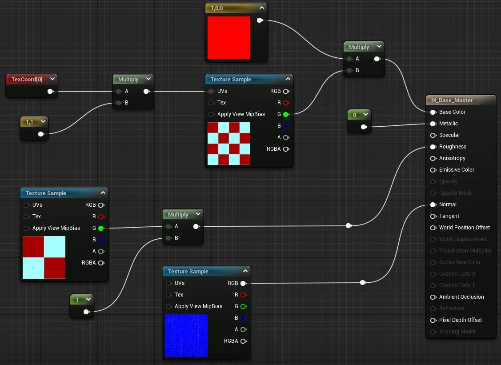
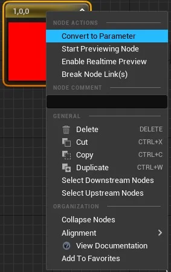
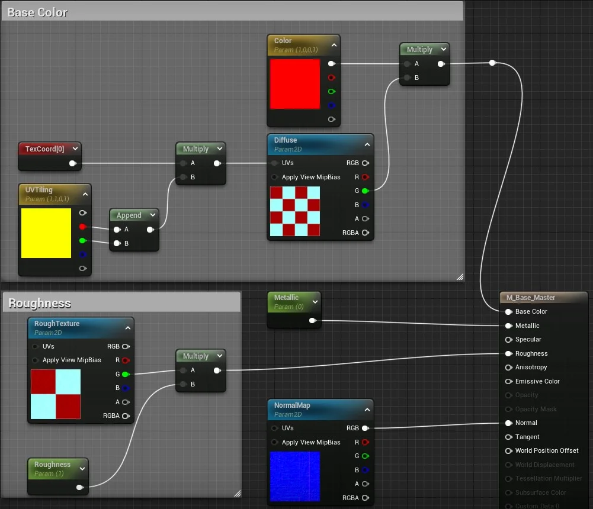
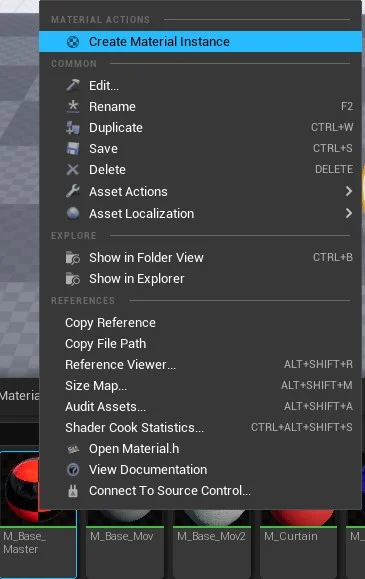
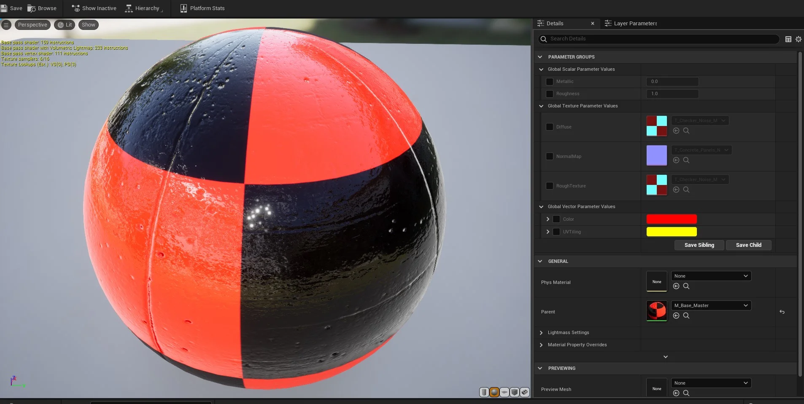
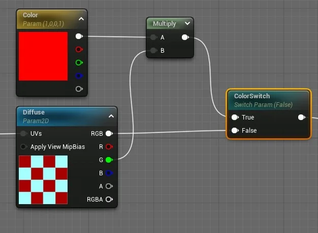
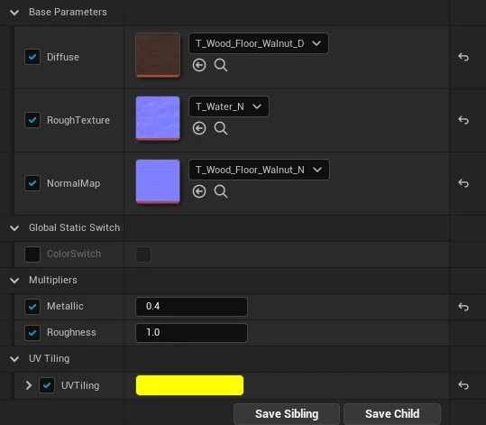
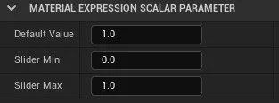

## CAPÍTULO 9 - Materiais e Landscape

Neste capitulo vamos apresentar o objeto *Material Instance* que flexibiliza a implementação de materiais no Unreal Engine.

&nbsp;&nbsp;[9.3 O que é Material Instance?](#9.3)

&nbsp;&nbsp;&nbsp;&nbsp;&nbsp;&nbsp;[9.3.1 Editor de material Instance](#9.3.1)

&nbsp;&nbsp;&nbsp;&nbsp;&nbsp;&nbsp;[9.3.2 Switch Parameter](#9.3.2)

&nbsp;&nbsp;&nbsp;&nbsp;&nbsp;&nbsp;[9.3.3 Organizando parâmetros e definindo valor máximo e mínimo](#9.3.3)

***

## 9.3 O que é Material Instance?
A **Mateial Instance** ou Instanciação de Material é uma maneira de criar um Material pai, que pode então ser usado como base para fazer uma ampla variedade de Materiais filhos de aparência diferente. Para obter essa flexibilidade, o **Material Instancing** usa um conceito chamado herança: as propriedades do pai são fornecidas aos seus filhos. Aqui está um exemplo de herança de material em ação.

**Convertendo nós em parâmetros.**

Convertemos os nós em parâmetros para que possam ser manipulados posteriormente pelo **Material Instance**. Para que possamos exemplificar segue abaixo os passos.

1. Vamos criar o material base com o nome `M_Base_Master`.     

       

  > Figura: Blueprint Material Instance - Base Master.

2. Agora vamos converter os nós em parâmetros.     

     

  > Figura: Blueprint Material Instance - Convert to Parameter.

3. Resultado dos material com parâmetros.

       

  > Figura: Blueprint Material Instance -  Resultado do material com parâmetros.

4. Definimos os seguintes atributos nos parâmetros:

  - `Parameter name` - Nome para o parâmetro que representa o input do material.

  - `Group` - Usado para agrupar os parâmetros por um determinado valor ou tema.        

5.  Sugestão de grupos:

  - Texture Parameter Values: Diffuse,NormalMap, Rough Texture;
  - Scalar Parameter Values:  Valores escalares;
  - Metallic, Roughness: Vector Parameter Values : Color (R,G,B,A), UVTiling(R,G,B,A).

**Criando Material Instance.**

Selecione o material `M_Base_Master` ou outro material e com o botão direito acione o menu de contexto e escolha `Create Material Instance`.     

   

> Figura: Blueprint Material Instance - Create material instance.

### 9.3.1 Editor de material Instance

  

> Figura: Blueprint Material Instance instance editor.

- `Details` - Propriedades e acesso aos parâmetros;

- `Parameter Groups` - Grupo definido nos parâmetros dentro do material pai.      
  Os parâmetros estão agrupados por tipo de valor Texture, Scalar e Vector;

- `Parent` - Material pai.

### 9.3.2 Switch Parameter
`StaticSwitchParameter` recebe duas entradas e gera a primeira, se o valor do parâmetro for verdadeiro, e a segunda, caso contrário. No exemplo abaixo se o parâmetro for verdadeiro a multiplicação com a cor pode ser realizada caso contrário o textura não é multiplicada.

> Figura: Blueprint Material Instance - Swith Parameter.

### 9.3.3 Organizando parâmetros e definindo valor máximo e mínimo
Podemos organizar os parâmetros agrupando com a opção `Group` do nó e com `Sort Priority` ordenamos a visualização.

**Group.**

No exemplo abaixo criamos os grupos:

- Base Parameters;

- Multipliers;

- UV Tiling.

     

> Figura: Blueprint Material Instance - Parameter Group.

**Valor Mínimo e Máximo.**

Podemos limitar os valores mínimo e máximo que podem ser passados como parâmetro utilizando a opção `Slider`.

> Figura: Blueprint Material Instance - Slider Min e Slider Max.
