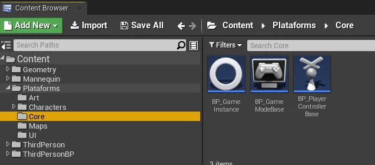
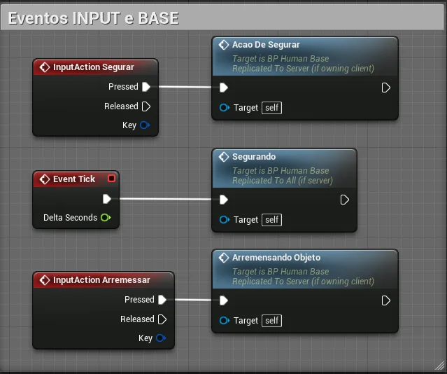

<a name="10"></a>
## CAPÍTULO 12 - Multiplayer

Neste capítulo vamos implementar e organização elementos para conexão, replicação e inicialização de um jogo multiplayer.

&nbsp;&nbsp;[12.1 Implementando um jogo multiplayer](#12.1)

&nbsp;&nbsp;&nbsp;&nbsp;&nbsp;&nbsp;[12.1.1 Executando e configurando o projeto](#12.1.1)

&nbsp;&nbsp;&nbsp;&nbsp;&nbsp;&nbsp;[12.1.2 Implementando o menu](#12.1.2)

&nbsp;&nbsp;&nbsp;&nbsp;&nbsp;&nbsp;[12.1.4 Replicação](#12.1.4)

&nbsp;&nbsp;&nbsp;&nbsp;&nbsp;&nbsp;[12.1.5 Implementando o objeto de para ser arremessado](#12.1.5)

***

<a name="12.1"></a>
## 12.1 Implementando um jogo multiplayer

**Tipos de Conexão**

- A conexão somente é possível com versões do mesmo programa.

**Cliente e Servidor**

Programa cliente se conecta através de uma rede a um programa servidor.

Servidor pode ficar somente no atendimento ou pode realizar tarefas


> Figura: Unreal Engine - Tipos de conexão - Cliente Servidor.


**Ponto a Ponto**

Programa cliente se conecta com outro computador ouvindo a rede

Os computadores ficam operantes;


> Figura: Unreal Engine - Tipos de conexão - Ponto a Ponto.

**Implementação no jogo.**

- Servidor (Host) - Jogo em modo escuta **listen**;
- Cliente - Jogo tem que conectar em um outro através de um endereço de rede;
- Busca servidores;


**Exemplo.**

Servidor

```sh
  C:\Program Files\UE_4.17\Engine\Binaries\Win64\UE4Editor.exe
  C:\PATH_TO_MY_PROJECT.uproject /Game/ThirdPersonCPP/Maps/ThirdPersonExampleMap -server -log -port=8003
  ```
Cliente
```sh
C:\Program Files\UE_4.17\Engine\Binaries\Win64\UE4Editor.exe
C:\PATH_TO_MY_PROJECT.uproject 192.168.1.90:8003 -game -log
```

<a name="12.1.1"></a>
### 12.1.1 Executando e configurando o projeto

Para executar o jogo em modo multiplayer utilize o menu principal e acesse a opção `Play` escolhendo as seguintes opções:

- `Number of Players` : Escolha a quantidade de conexões que o projeto recebera.

- `Net Mode`.

  

> Figura: Unreal Engine - Multiplayer, Executando várias instâncias do jogo.

A seguir vamos implementar as estruturas de controle do game `GameMode`, `GameInstance` e `PlayerController`.   



> Figura: Unreal Engine - Multiplayer, Implementando estruturas de controle.


Criando o `GameInstance`.  


> Figura: Unreal Engine - Multiplayer, Implementando a GameInstance.

Implementando o evento **OpenMenu**.   


> Figura: Unreal Engine - Multiplayer, Implementando a chamada do menu do jogo.

Configurando o projeto com GameInstance  


> Figura: Unreal Engine - Multiplayer, Configurando a Gameinstance.

<a name="12.1.2"></a>
### 12.1.2 Implementando o menu

Implementando os mapas.  


> Figura: Unreal Engine - Multiplayer, Menu.

Implementando a lógica de chamada do menu no level **Menu** utilizando o `Open Level Blueprints`.  

  

> Figura: Unreal Engine - Multiplayer, Chamando o menu com BeginPlay.

Implementando o `Widget` WBP_Menu.  


> Figura: Unreal Engine - Multiplayer, Implementando o Widget para o Menu.

Implementando os seguintes elementos do menu.


> Figura: Unreal Engine - Multiplayer, Adicionando botões no menu.

Implementar os eventos para instanciar uma conexão.   


> Figura: Unreal Engine - Multiplayer, Lógica Blueprint para criar uma conexão no servidor remoto.

Conectar ao servidor utilizando IP.  


> Figura: Unreal Engine - Multiplayer, Lógica Blueprint para criar uma conexão no servidor remoto por IP.

<a name="12.1.3"></a>
### 12.1.3 Executando o jogo

- Number of Players: Quantidade de conexões

- Net Mode:
  

  > Figura: Unreal Engine - Multiplayer, Play As Listen Server.

  `Play Offline` - Executa o jogo em modo offline;  
  `Play As Listen server` - Executa o jogo (tela principal) em modo servidor;  
  `Play As Client` - Executa o jogo (tela principal) em modo Cliente, iniciando a servidor em outra janela.


- Adicionar dois `PlayerStart`.  

  

  > Figura: Unreal Engine - Multiplayer, Dois PlayerStart.

<a name="12.1.4"></a>
### 12.1.4 Replicação

**Replicação de eventos.**

Para utilizar a replicação de eventos é necessário criar eventos customizados `Add custom event`.

**Servidor** - Executado apenas no servidor que hospeda o jogo;  

**Cliente** - Executado apenas no cliente que possui o ator ao qual a função pertence. Caso o Ator não possua conexão própria, esta lógica não será executada;   

**NetMulticast** - Executado em todos os clientes que estão conectados ao servidor, bem como no próprio servidor.

**Objetos não Replicados.**

- HUD

- UMG Widgets

"Replicar Movimento" funciona apenas para um componente raiz. Para este recurso, `StaticMeshComponent` deve ser escolhido como "root".  

[replication for moving actor](https://answers.unrealengine.com/questions/836572/replication-for-moving-actor.html?sort=oldest
)

**Replicação de variáveis.**

Usaremos as variáveis **Vida**, **Nome** e **VidaMax** para exemplificar.

- Vida

- Nome

- VidaMax

<a name="12.1.5"></a>
### 12.1.5 Implementando o objeto de para ser arremessado

Implementando um Blueprints Static Mesh Actor e configurando a replicação do objeto.  

  

> Figura: Unreal Engine - Multiplayer,Static Mesh para o jogo.

O componente atachado também deverá ser replicado.  

  

> Figura: Unreal Engine - Multiplayer, Component Replication.

**Implementando a manipulação do objeto pelo personagem.**

Eventos de entrada de dados (INPUT)

  

> Figura: Unreal Engine - Multiplayer, Lógica Blueprint chamando a ação de segurar.

Evento **AcaoDeSegurar**.

  

> Figura: Unreal Engine - Multiplayer, Lógica Blueprint do evento AcaoDeSegurar.

Evento **AcaoDeSegurar** continuação.

  

> Figura: Unreal Engine - Multiplayer, Lógica Blueprint do evento AcaoDeSegurar continuação.

Agarrar objeto, este evento prende o objeto ao personagem.

  

> Figura: Unreal Engine - Multiplayer, Lógica Blueprint do evento para prender o objeto.

Evento **Segurando**, este evento utiliza o event tick para alterar a posição do objeto preso ao personagem.

  

> Figura: Unreal Engine - Multiplayer, Lógica Blueprint do evento para alterar a posição do objeto preso ao personagem.

Soltando objeto.

  

> Figura: Unreal Engine - Multiplayer, Lógica Blueprint do evento para soltar o objeto.

Ação de arremessar o objeto.

  

> Figura: Unreal Engine - Multiplayer, Lógica Blueprint da ação que arremessa o objeto.

Adicionando o objeto simulando um arremesso.


> Figura: Unreal Engine - Multiplayer, Lógica Blueprint simulando o arremesso.  
