<a name="7"></a>
## CAPÍTULO 7 - Atores e movimentação

Neste capítulo vamos implementar apresentar a lógica de movimentação de atores com **Blueprint** e aplicar em um jogo de plataforma.

&nbsp;&nbsp;[**7.3 Implementando a movimentação do personagem**](#7.3)

&nbsp;&nbsp;&nbsp;&nbsp;&nbsp;&nbsp;[7.3.1 Movimentação de peão Pawn](#7.3.1)

&nbsp;&nbsp;&nbsp;&nbsp;&nbsp;&nbsp;[7.3.2 Utilizando Enumeration para registro de poses/estados do personagem](#7.3.2)

&nbsp;&nbsp;&nbsp;&nbsp;&nbsp;&nbsp;[7.3.3 Exemplo de movimentação da Plataforma](#7.3.3)

&nbsp;&nbsp;&nbsp;&nbsp;&nbsp;&nbsp;[7.3.4 Usando o evento Tick - Blueprint](#7.3.4)

&nbsp;&nbsp;&nbsp;&nbsp;&nbsp;&nbsp;[7.3.5 Usando o evento Tick - C++](#7.3.5)


***

<a name="7.3"></a>
## 7.3. Implementando a movimentação do personagem
**Unreal Engine** utiliza Input Actions e Mappings para vincular ações e mapeamento de chaves e eixos de entrada.

- Facilita o mapeamento de várias chaves para o mesmo comportamento;

- Possibilita o remapeamento de chaves.

**Actions Mappings.**

Vincular um evento a uma entrada de dados (teclado, mouse, Gamepad, etc).  
Mapeamento de um evento a um botão:
- Valores 0 e 1  

Exemplo:
  1. Tecla Espaço = Pulo;
  1. Tecla Enter = Disparo;
  1. Tecla C  = Agachar.

**C++.**
```cpp
InputComponent->BindAction("Pulo", IE_Released, this, &ASampleCharacter::OnEndPulo);
```
**Axis Mappings.**

Mapeamento de Movimentação nos eixos;  

Mapeamento um evento a um botão ou a um eixo de controle;

É atualizado constantemente.  

Escala de valores.  

Exemplo:
  1. Tecla W = MoverDireita
  1. Tecla D = MoverEsquerda


**C++**
```cpp
InputComponent->BindAxis("MoveParaFrente", this, &ASampleCharacter::MoveForward);
```

**Mapeamento Input do projeto.**

No exemplo abaixo associamos a ação Pulo com o tecla **Space Bar** e **GamePad FaceButtonBotton**. Ao definir uma ação em **Bindings** a *game engine* cria um evento do mesmo nome.    

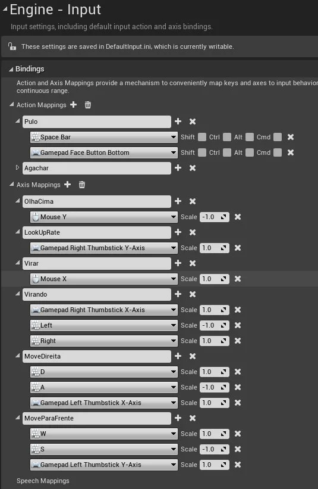    

> Figura: Menu > Project > Input.

<a name="7.3.1"></a>
## 7.3.1 Movimentação de peão Pawn
Para exemplificar a implementação utilizaremos uma classe do tipo **Pawn**

**Componentes.**

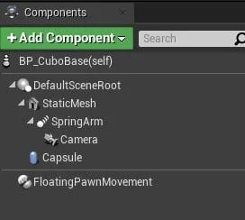

> Figura: Blueprint - FloatingPawnMovement.

- `Capsule`- Implementa uma capsula com colisão simples que pode determinar a movimentação do jogador;

- `FloatingPawnMovement` - Habilita lógica de movimentação do peão.

**Habilitando a entrada de comandos.**

É necessário habilitar a entrada de comandos para a classe **Pawn**.  

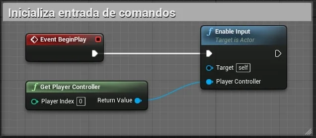

> Figura : Blueptint - Exemplo Enabled Input.

- `PlayerController` - Implementa funcionalidade para pegar os dados de entrada do jogador e traduzi-los em ações, como movimento, uso de itens, armas de fogo, etc.

**Implementando movimentação com teclado.**

Devemos executar a chamada dos eventos criados no mapeamento e associados a *inputs*.

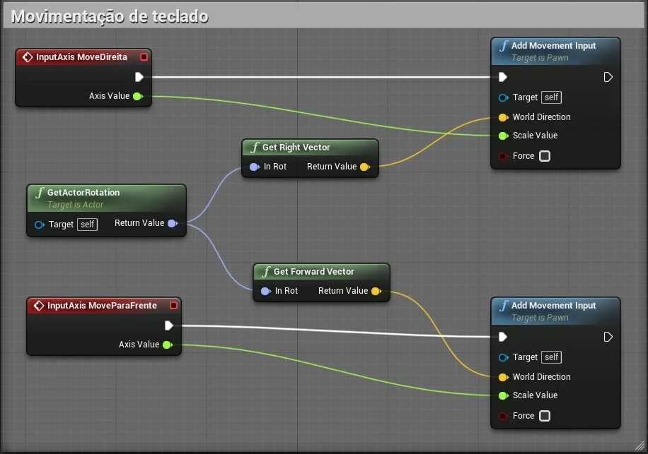

> Figura: Blueprint - Movimentação de teclado Add Movement Input com InputAxis.

- `GetActorRotation` - Retorna a rotação do `RootComponent` (Componente raiz que determina a posição do objeto)deste Ator;

- `Get Right Vector` - Obtenha o vetor correto (Y)  desse componente, no espaço do mundo;

- `Get Forward Vector` - Obtenha o vetor de direção da unidade para frente (X) deste componente, no espaço do mundo;

- `Add Movement Input` - Adiciona entrada de movimento ao longo do vetor de direção do mundo dado (geralmente normalizado) escalado por 'ScaleValue'. Se ScaleValue <0, o movimento será na direção oposta. As classes base de peão não aplicam movimento automaticamente, cabe ao usuário fazer isso em um evento Tick. Subclasses como **Character** e `DefaultPawn` manipulam automaticamente essa entrada e se movem;

- `Scale Value` - Escala para aplicar à entrada. Isso pode ser usado para entrada analógica, ou seja, um valor de 0,5 aplica-se à metade do valor normal, enquanto -1,0 inverteria a direção.

**Captura de coordenadas.**

Captura as coordenadas do ator para que possamos utilizar os métodos de movimentação **Virar** e **OlhaCima**  

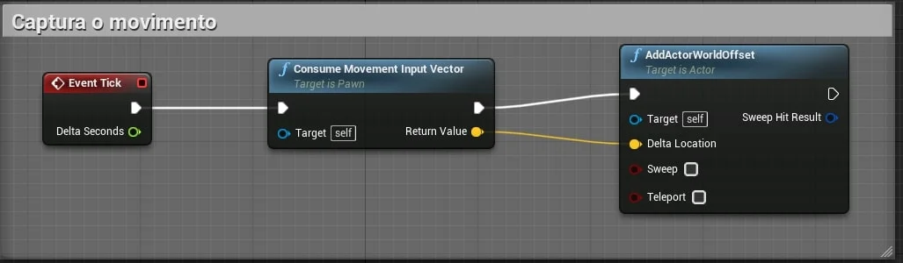

> Figura: Blueprint - Exemplo Consume Movement Input Vextor e AddActorWorldOffset.

**Movimentação utilizando mouse.**

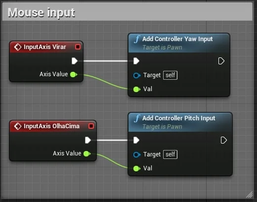

> Figura: Blueprint - InputAxis e Add Controller Yaw Input e Add Controller Pitch Input.

- **Yaw e Pitch** - Representam respectivamente as coordenadas:  
      X = Roll
      Y = Pitch
      Z = Yaw

**Controle de movimentação do ator (Classe)**

Caso as opções `Use controller rotation pitch/Yaw` estiverem ativas (**true**) a cápsula do ator irá sem movimentar no seu próprio eixo.     

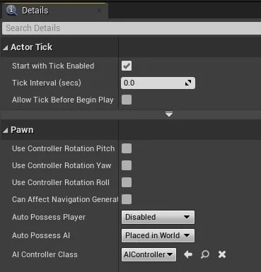

> Figura: Blueprint - Use Controller Rotation Pitch/Yaw.

- `SpringArm` - Sustenta a câmera e o responsável pela movimentação;

Quando verdadeiro `Use Pawn control Rotation` e somente o braço com a câmera são movimentados.      

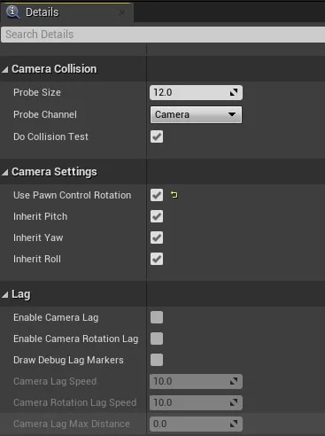

> Figura: Blueprint - Use Paw Controller Rotation.

<a name="7.3.2"></a>
### 7.3.2 Utilizando Enumeration para registro de poses/estados do personagem.    
Podemos utilizar uma variável Enumeration para registrar o estado do objeto.

**Variável Enumeration.**

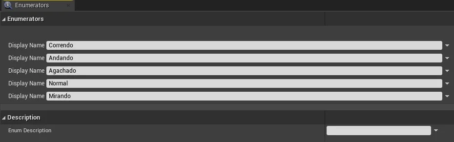

> Figura: Blueprint - Enumeration e Estados do jogador.


**Atualizando a variável.**

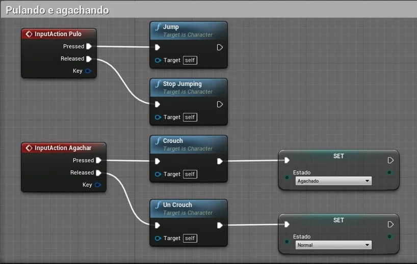

> Figura: Blueprint - Atualizando o estado do jogador utilizando Enumeration.

<a name="7.3.3"></a>
### 7.3.3 Exemplo de movimentação da Plataforma
Neste passo iremos implementar a Plataforma de Poder *PowerUp* para exemplificar a movimentação de objetos. Ao colidir com a plataforma a velocidade e o impulso do personagem **HP_Hero** aumentam.   
A plataforma deverá se movimentar utilizando marcações (**TargetPoint**) para facilitar a level design.
Serão implementados objetos para disparar (Plataforma Trigger) a movimentação das plataformas.

**Estrutura do objeto Plataforma.**

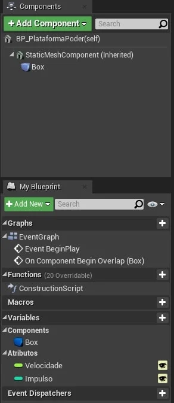  

> Figura: Blueprint - Exemplo de componentes da estutura da plataforma.

- `StaticMeshActor` - Derivado da classe Actor;

- `Box` - Do tipo `Box Collision`;

- **Velocidade/Impulso** - Variáveis públicas para multiplicar as propriedades do personagem.

**Aumentando a  velocidade.**

Lógica para aumentar a velocidade de corrida e força de impulso do personagem do *BP_Hero* tipo **Character**.

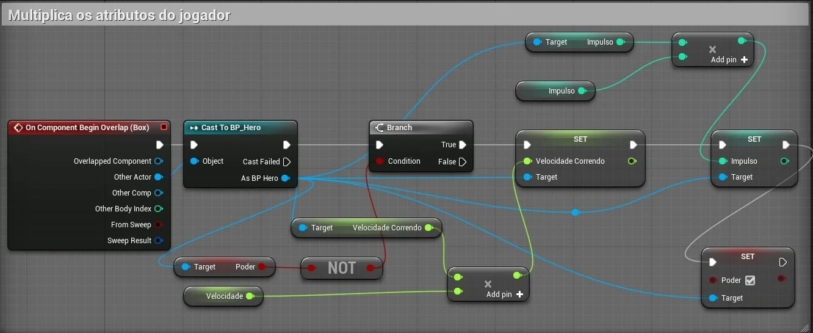

> Figura: Blueprint - Exemplo da lógica da movimentação.

- Ao colidir com a plataforma a lógica é acionada.

**Movimentação da plataforma.**

A movimentação tem que ser interpolada, quer dizer que as coordenadas tem que ser atualizadas a cada passo.  
Exemplos de coordenadas:  

|       | X     |Y      |Z  |
|:-:    |:-:    |:-:    |:-:|
|Início |1      | 1     | 1 |
|       | 1     | **2** | 1 |
|       | 1     | **3** | 1 |
|       | 1     | **4** | 1 |
|Fim    | 1     | 5     | 1 |  

- Destino : 1,5.1
- Origem : 1,1,1

**Lógica usando Level Blueprint.**

Utilizando o `Level Blueprint` vamos implementar a lógica de movimentação usando `TimeLine`.


> Figura: Blueprint - Exemplo utilizanod Timeline em um Level Blueprint.

- Determinar o destino da movimentação;

- Implementar a lógica de movimentação usando `timeline`;

- Declarar a variável *Velocidade* para controle da velocidade de movimentação;  

- `Learp` - Interpola linearmente entre A e B com base em Alpha (100% de A quando Alpha = 0 e 100% de B quando Alpha = 1)

**Implementação do controle de tempo.**

Devemos definir uma curva de tempo para a variável **Alpha** para utilizar na interpolação de A com B (**Learp**)

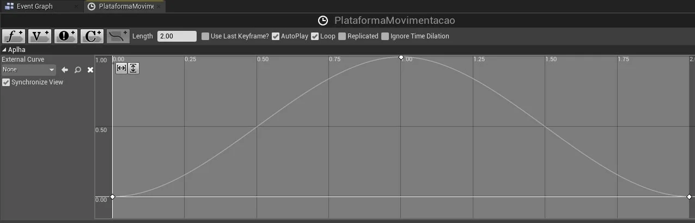

> Figura: Blueprint - TimeLine Curve para atualizar as coordenadas de movimentação.

**Utilizando o evento Tick e TimeLine.**

Com a finalidade de exemplificar podemos utilizar o evento **Tick** para alterar a velocidade da plataforma.


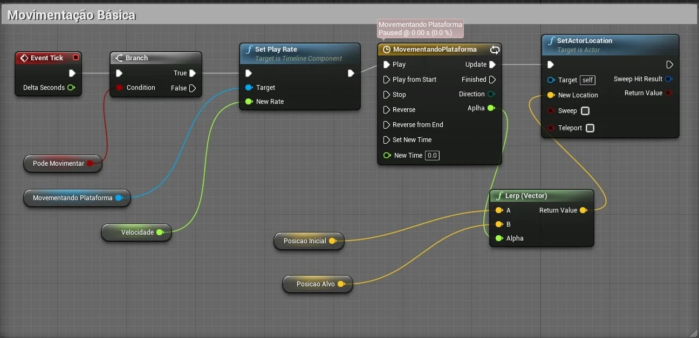

> Figura: Blueprint - Passando como parâmetro a velocidade e alterando o movimento.

Pode ser construída outra plataforma para acionar o evento, Plataforma de gatilho `Trigger Plataform`.

<a name="7.3.4"></a>
## 7.3.4 Usando o evento Tick - Blueprint
Agora vamos usar o evento **Tick** para interpolar as coordenadas de origem e destino.

**Variáveis.**

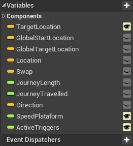

> Figura: Blueprint - Exemplo propriedades do objeto plataforma.

- `TargetLocation` - Coordenadas do destino com `Widget`  ativo;

- `GlobalStartLocation` - Coordenadas globais iniciais do ator;

- `Location/Swap` - Variáveis auxiliares;

- `GlobalTargetLocation` - Coordenadas globais iniciais do destino;

- `Direction` - Vetor auxiliar que determina a direção do objeto.

**Inicializando variáveis.**

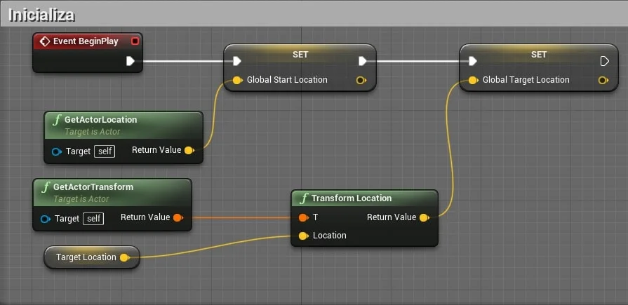

> Figura: Blueprint - Inicializando variáveis do objeto plataforma.

**Evento Tick.**

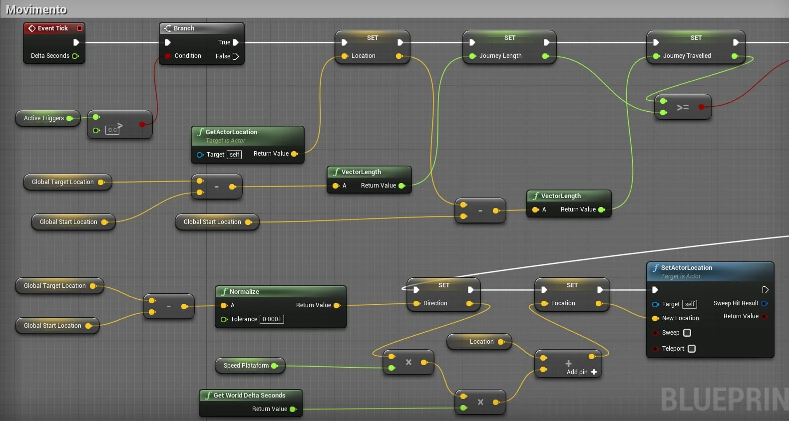

> Figura: Blueprint - Lógica de movimentação usando Tick.

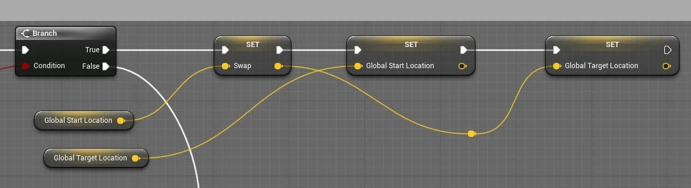

> Figura: Blueprint - Lógica de movimentação usando Tick - continuação.

<a name="7.3.5"></a>
## 7.3.5 Usando o evento Tick - C++

**Inicializando variáveis.**

```cpp
void APlataforma::BeginPlay()
{
	Super::BeginPlay();
	GlobalStartLocation = GetActorLocation();
	GlobalTargetLocation = GetTransform().TransformPosition(TargetLocation);
}
```

**Evento Tick.**

```cpp
void APlataforma::Tick(float DeltaTime)
{
	{
		Super::Tick(DeltaTime);

		if (ActiveTriggers > 0)
		{
			FVector Location = GetActorLocation();

			float JourneyLength = (GlobalTargetLocation - GlobalStartLocation).Size();
			float JourneyTravelled = (Location - GlobalStartLocation).Size();

			if (JourneyTravelled >= JourneyLength)
			{
				FVector Swap = GlobalStartLocation;
				GlobalStartLocation = GlobalTargetLocation;
				GlobalTargetLocation = Swap;
			}

			FVector Direction = (GlobalTargetLocation - GlobalStartLocation).GetSafeNormal();
			Location += DeltaTime * SpeedPlataform * Direction;
			SetActorLocation(Location);
		}
	}
}
```
