Neste capítulo serão descritas as estruturas de armazenamento em memória, variáveis, e a sua manipulação.

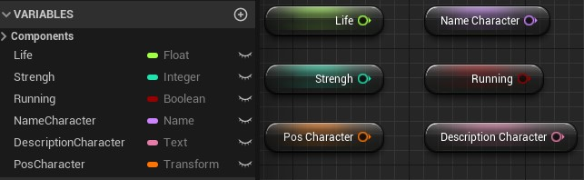


## Índice
1. **[O que são variáveis?](#1)**  
1. **[Variáveis no Unreal Engine](#1)**  
    1. [Tipos de variáveis](#2)  
    1. [Declarando variáveis](#3)  
1. **[Métodos Get e Set](#4)**  
1. **[Tratamento e armazenamento de texto no Unreal Engine](#5)**  
    1. [Concatenando textos usando a função Append](#5.1)  
    1. [Procurando texto dentro de uma string](#5.2)  
1. [Variáveis do tipo numéricas Integer e Float](#6)  
1. [Armazenando valores lógicos com Boolean](#7)
1. [Controle de acesso a variáveis](#8)
    1. [Variáveis Privadas](#8.2)  
    1. [Variáveis Públicas](#8.2)  


***

<a name="1"></a>
## 1. O que são variáveis?
Variáveis são estruturas que são utilizadas para armazenar um valor de um determinado tipo na memória do computador.

Estrutura de memória.

|Variável       |Tipo     | Valor       |
|:-             |:-:      |:-:          |
|iSoma          |Integer  |0            |
|fValor         |Float    |6.5          |
|tName          |String   |"Gandalf"    |
|bRunnig        |Boolean  |false        |


Abaixo um exemplo em C++:
```cpp
// Variável do tipo inteiro
int iSoma = 0;

// Variável do tipo ponto flutuante
float fValor = 6.5;
```

**[⬆ Volta para o início](#índice)**

<a name="2"></a>
## 2. Variáveis no Unreal Engine
Variáveis no Unreal Engine são propriedades que contêm um valor ou fazem referência a um objeto ou ator no mundo. Essas propriedades podem ser acessíveis internamente ao **Blueprint** que as contém, ou podem ser tornadas acessíveis externamente para que seus valores possam ser modificados por designers que trabalham com instâncias do **Blueprint** colocadas em um nível.

<a name="2.1"></a>
### 2.1 Tipos de Variáveis
Para armazenar qualquer informação na memória devemos definir um tipo de dados primitivo ou mesmo uma estrutura de dados, a seguir alguns tipos de dados:

1.  `Boolean` - Armazena valores falso ou verdadeiro (true e false).

    ```cpp
  bool VariavelBoolean;

  VariavelBoolean = true;
  ```

1. `Integer` - Valores inteiros entre −2.147.483.648 e 2.147.483.647

    ```cpp
int VariavelInt;
VariavelInt = 1;
  ```
1. `Float` - Valores com casas decimais tal como 0,0553, 101,2887 e -78,322 .

    ```cpp
float VariavelFloat;
VariavelFloat = 2.4;
    ```

1. `String`- Grupo de caracteres alfanuméricos.

    ```cpp
FString VariavelString ;
VariavelString = "Alo mundo!!";
    ```

<a name="2.2"></a>
### 2.2 Declarando variáveis   
Declarando variáveis informamos ao computador que estamos reservando um espaço de memória temporário.  

1. Variáveis no Editor de Blueprint.

    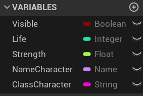

    *Figura: Blueprint Variables.*

1. As variáveis tem tipos e propriedades que determinam o sua utilização.  

    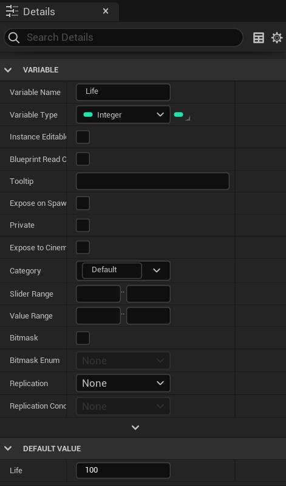

    *Figura: Details ou properiedades das variáveis.*

> Observe que a propriedade `Category` agrupa as variáveis por uma categoria.

**[⬆ Volta para o início](#índice)**

<a name="4"></a>
## 4. Métodos Get e Set
Para acessar o conteúdo das variáveis utilizamos os métodos `Get` e `Set`, onde:

- `Get`: Obtém o valor de uma variável.
- `Set`: Atualiza o valor da variável.

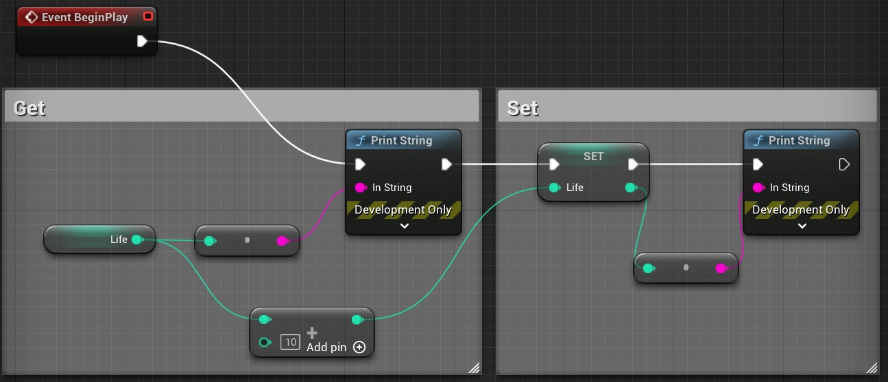

*Figura: Métodos Get e Set.*

- `BeginPlay` - Ao iniciar o jogo a lista de comandos deve ser acionado.
- `Print String` - Escreve um texto na cena do jogo.
- `Add +` - Variáveis numéricas podem ser manipuladas com operadores matemáticos.
- `Converts` - Converte tipos de variáveis, neste caso converte um valor do tipo `integer` em um do tipo `String`.

**[⬆ Volta para o início](#índice)**

<a name="5"></a>
## 5. Tratamento e armazenamento de texto no Unreal Engine
No Unreal Engine são definidos alguns tipos de dados para manipulação e armazenamento de caracteres alfanuméricos, entre elas estão os tipos de variáveis a seguir.

| Variável          |Tamanho    | Considerações               |
|:-:                |-          |-                            |
| `Text`            | 40 Bytes  | Podemos adicionar opções avançadas como exemplo `String Table`, ideal para textos longos que podem variar conforme a lingua definida pelo jogador.  |
| `String`          | 16 Bytes  | Armazenamento e consumo de memória mediano |
| `Name`            | 8 Bytes   |  Cadeias de caracteres  curtas que ocupam pouca memória.|

Podemos realizar as seguintes operações em `strings`:

- Atribuir o valor de uma `string` para outra;
- Acessar caracteres individualmente;
- Adicionar uma `string` no final de outra;
- Concatenar `strings`;
- Procurar uma determinada letra ou Substring dentro da `string`.

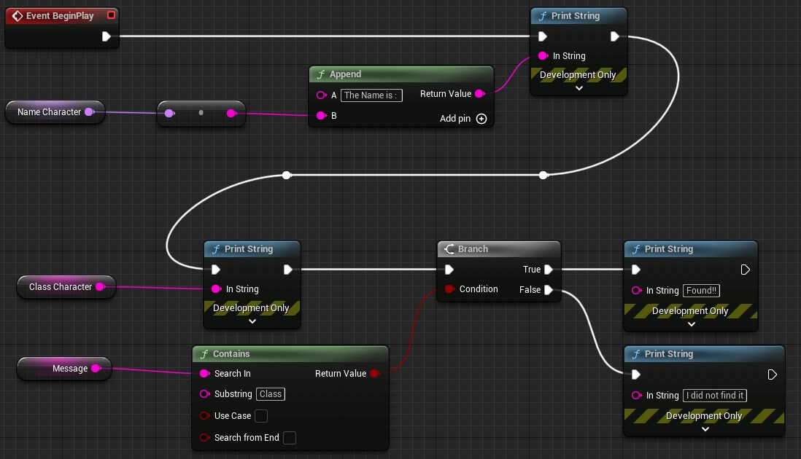

*Figura: String functions.*

<a name="5.1"></a>
### 5.1 Concatenando textos usando a função Append
A função `Append` concatena duas ou mais `strings`, passamos como parâmetros os textos que gostaríamos de concatenar e tendo como resultado um novo texto contendo os dois textos.

**C++**
```cpp

FString sTexto = "Alo mundo...";
sTexto.append("Cruel");

// Resultado: Alo mundo...Cruel
```

<a name="5.2"></a>
### 5.2 Procurando texto dentro de uma string
A função `Contains` procura uma sequencia de caracteres dentro de uma `string`, passamos os seguintes parâmetros para a função.

**Blueprint**
- `Search In` - Texto passado como parâmetro.
- `Substring` - Texto que deve ser localizado.
- `Use Case` - Diferencia maiúsculas e minúsculas.
 `Search from end` - Inicia a busca pelo fim do texto.

**C++**
```cpp

FString sTexto = "Procurando o texto escondido.";

if (sTexto.Contains("texto"))
{
  return true;
}
else
  return false;

// Resultado: Alo mundo...Cruel
```

**[⬆ Volta para o início](#índice)**

<a name="6"></a>
## 6. Variáveis do tipo numéricas Integer e Float
Valores numéricos utilizam operadores matemáticos para a sua manutenção, como veremos a seguir.  

**Blueprint**

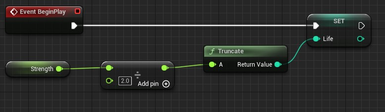

*Figura: Utilizando Divisão.*

**C++**
```cpp
void AMyCharacterClass::BeginPlay()
{
    Super::BeginPlay();
    Float fStrength = 10;
    int32 iLife = 0;

    iLife = int(fStrength / 2);
}
```

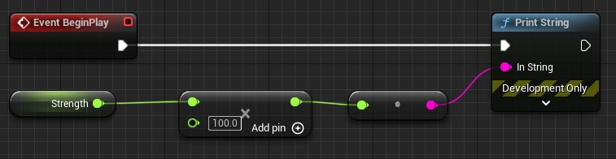

*Figura: Multiplicação valores.*

- (+) - soma;
- (*) - Multiplicação;
- (/) - Divisão.

**[⬆ Volta para o início](#índice)**

<a name="7"></a>
## 7. Armazenando valores lógicos com Boolean
Armazena dois valores : falso `false` ou verdadeiro `true`.

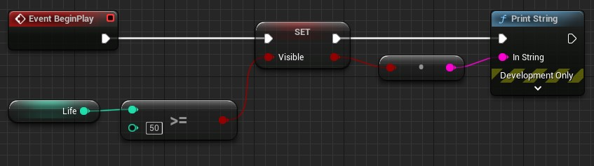

*Figura: Variável Boolean.*

No exemplo acima se o valor de `life` for maior que 50 então o valor é atualizado para `true`.

**[⬆ Volta para o início](#índice)**

<a name="8"></a>
## 8. Controle de acesso a variáveis
Como especificar quais variáveis de um objeto um usuário pode acessar e quais estão fora dos limites? - usando os especificadores de controle de acesso público e privado.

<a name="8.1"></a>
### 8.1 Variáveis Privadas
Com a opção Privada marcada em uma variável, isso evita que a variável seja modificada de **Blueprints** externos.  

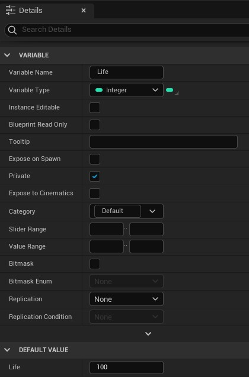

*Figura: Private details.*

<a name="8.1"></a>
### 8.1 Variáveis Públicas
Para permitir que uma variável seja modificada de fora de seu  **Blueprint**, torne-a pública.  

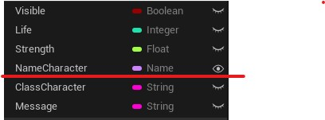

*Figura: Public.*

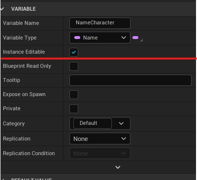

*Figura: Public details.*

<a name="9"></a>
## 9. Atividades
<a name="9.1"></a>
### 9.1 - Crie um projeto que implemente as variáveis dos tipos descritos abaixo.
- Nome do personagem;
- Vida do personagem;
- Força do personagem;
#### Regras
1. Aumente a vida e a força do personagem;
2. Altere o nome do personagem e escreva na cena.
#### Desafio      
1. Implemente uma lógica para calcular o maior valor entre três números.

  Exemplo:
```bash
x = 3;
y = 5;
z = 2;
O maior valor é Y = 5;
```


**[⬆ Volta para o início](#índice)**


***

## Referências
- [Blueprint Variables](https://docs.unrealengine.com/en-US/Engine/Blueprints/UserGuide/Variables/index.html)
- [Coding Standard](https://docs.unrealengine.com/en-US/Programming/Development/CodingStandard/index.html)
- [Properties](https://docs.unrealengine.com/en-US/Programming/UnrealArchitecture/Reference/Properties/index.html)
- [String](https://docs.unrealengine.com/en-US/BlueprintAPI/Utilities/String/index.html)
- [Srting Tables](https://docs.unrealengine.com/en-US/Gameplay/Localization/StringTables/index.html)
- [Integer](https://docs.unrealengine.com/en-US/BlueprintAPI/Math/Integer/index.html)
- [Float](https://docs.unrealengine.com/en-US/BlueprintAPI/Math/Float/index.html)
