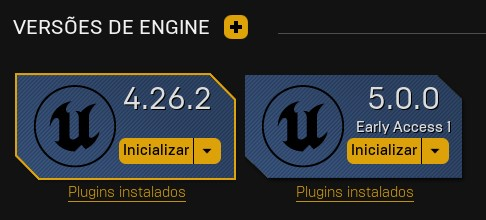
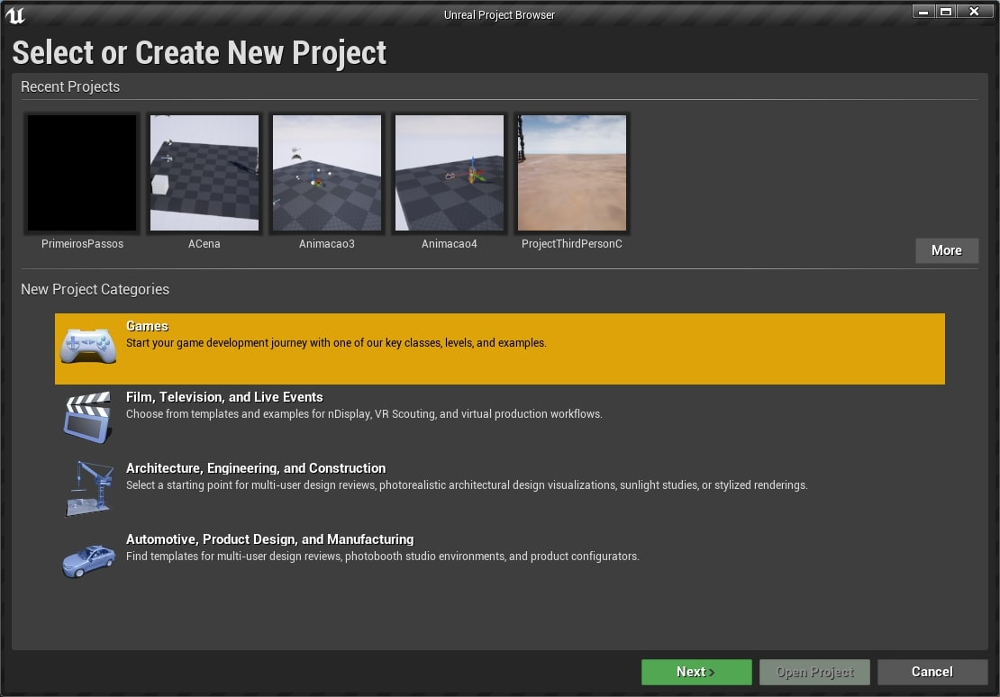
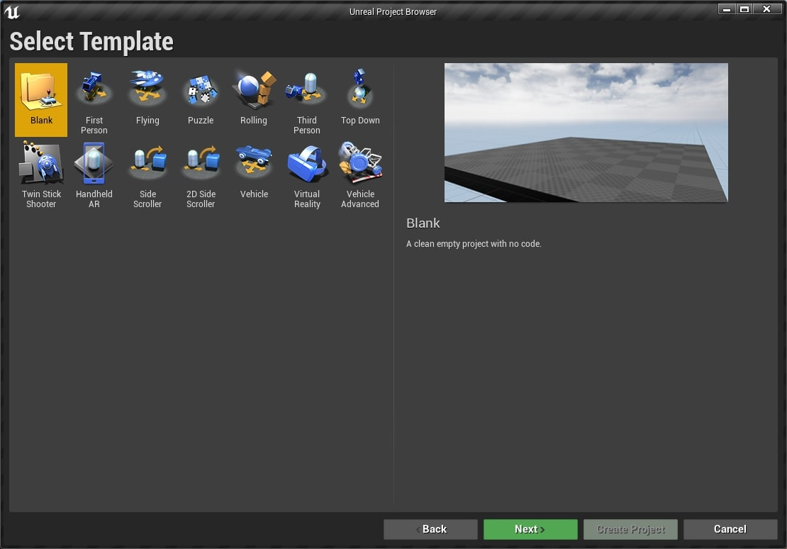
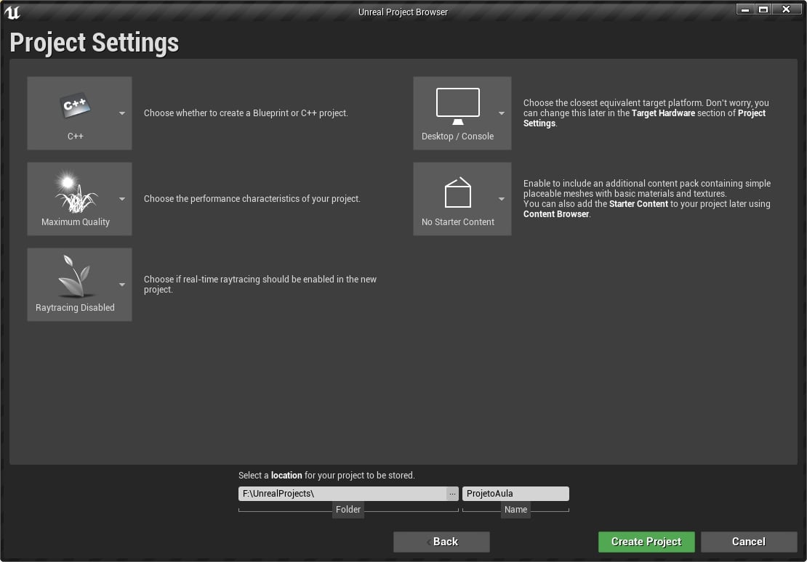
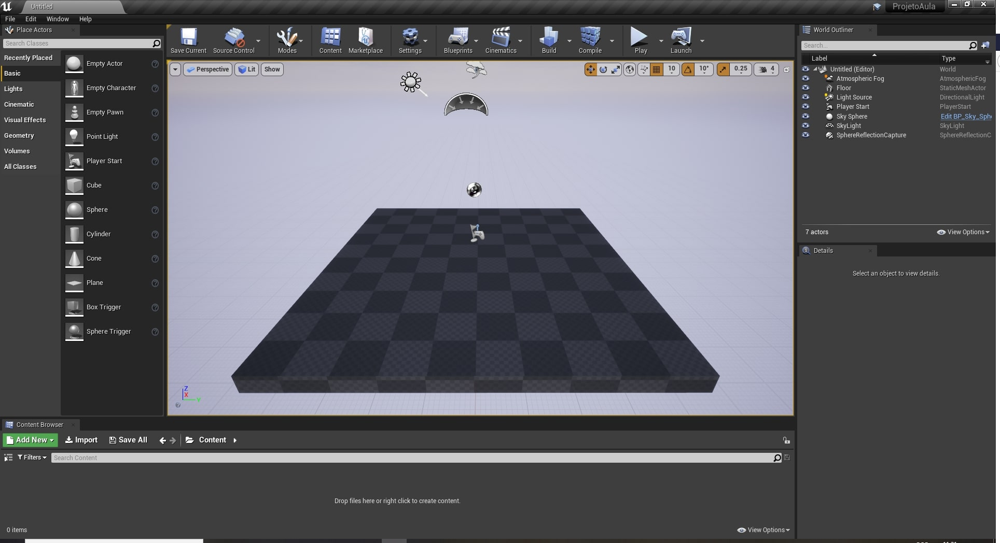
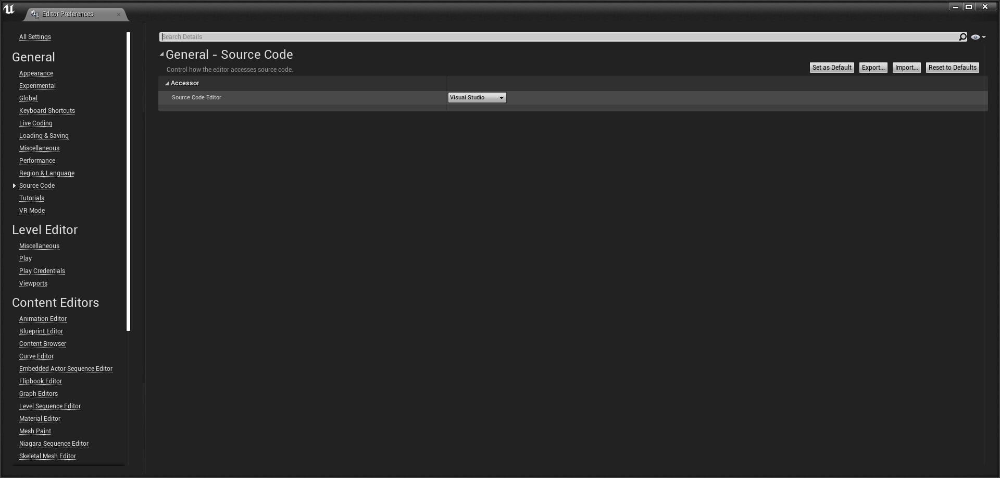

[CafeGeek](http://CafeGeek.eti.br)  / [Desenvolvimento de jogos utilizando Unreal Engine](http://cafeGeek.eti.br/unreal_engine/index.html)
# Como instalar o Unreal Engine?
Neste capítulo vamos instalar o **Unreal Engine** e o gerenciador de versões para logo em seguida criar um projeto apresentando a organização de suas pastas.

## Índice
1. [Instalando o Unreal e o Visual Studio](#1)
    1. [Siga o passos recomendados pela Epic Games](#1.1)
    1. [Instalando os pacotes e o Visual Studio para programação com C++](#1.2)    
1. [Criando o projeto **ProjetoAula**](#2)
1. [Verificando as pastas criadas](#3)
    1. [Pastas temporárias que podem ser removidas](#3.1)
1. [Compilando o projeto usando o Windows Explorer](#4)    
1. [Configurando o editor de código](#5)

<a name="1"></a>
## 1. Instalando o Unreal e o Visual Studio
Para instalar o **Unreal Engine** devemos instalar o **Epic Games Laucnher**, responsável por:
  - Instalação e atualização de jogos;
  - Instalação e atualização das versões do **Unreal Engine**;
  - Navegação da loja de produtos;

     
*Figura: Gerenciamento de versões*

> O **Unreal Enegine** é um [Framework](https://pt.wikipedia.org/wiki/Framework) de desenvolvimento que incorpora vários editores e componentes para agilizar a construção de jogos.       

<a name="1.1"></a>
### 1.1 Siga o passos recomendados pela Epic Games
Siga o guia de instalação da **Epic Games** pois é bem fácil. Durante a instalação é necessário baixar os pacotes de desenvolvimento em C++.

[Instalando o Uneal Engine](https://docs.unrealengine.com/en-US/GettingStarted/Installation/index.html).
> Verifique a versão de instalação ou disponibilidade da documentação

<a name="1.2"></a>
### 1.2 Instalando os pacotes e o Visual Studio para programação com C++
1. [Visual Studio](https://visualstudio.microsoft.com/pt-br/?rr=https%3A%2F%2Fwww.google.com%2F).
1. [Unreal e Visual Studio](https://docs.unrealengine.com/en-US/Programming/Development/VisualStudioSetup/index.html).
1. Selecione os pacotes :
  - Desenvolvimento de jogos com C++.
  - Desenvolvimento para Desktop com C++   
  > **Por que instalar este pacote?**    
  Porque muitas vezes foi necessário testar uma funcionalidade ou mesmo testar um conceito da linguagem e ter o compilador disponível foi uma mão na roda.

<a name="2"></a>
## 2. Criando o projeto ProjetoAula
Neste passo vamos criar um projeto utilizando **C++** como linguagem de desenvolvimento pois ajuda para compreender a organização e construção de pastas e arquivos do *Unreal Engine**.  

1. Selecionando o tipo de projeto.    
    
  *Figura: Select or create New Project, Games*    
1. Escolha o *template* **blank** para o projeto.  *Templates* são modelos com elementos disponíveis para o tipo de jogo escolhido.
        
  *Figura: Select Template blank*
1. Em configuração de projeto escolha **C++** e *No Starter Content*, este opção não vai instalar o pacote padrão de *assets* da **Epic Games** pois agora não é necessário.    
Logo em seguida escolha uma pasta onde o projeto deverá ser instalado em **Select a Location for project to be stored**.       
  
  *Figura: Unreal engine project Settings*
1. Se deu certo a tela inicial deve aparecer.  
  
  *Figura: Unreal Engine tela inicial*

<a name="3"></a>
## 3. Verificando as pastas criadas
Após cria o projeto vamos verificar como estão as pastas criadas pela *engine*, utilizando o *explorer* do Windows, navegue até a pasta do projeto para verificar os arquivos criados.

```bash
|-- .vs
|-- Binaries
|-- Config
|-- Content
|-- Intermediate
|-- Saved
|-- Source
|-- ProjetoAula.sln
|-- ProjetoAula.uproject
```
1. A pasta *Source* contém arquivos com código
fonte em **C++** e o arquivo com extensão *uproject* é o principal arquivo do projeto.    
1. É recomendado que os arquivos e pastas devam ter um padrão de nomenclatura para melhor organização do projeto.
  Abaixo duas boas recomendações de organização, discutiremos mais nos próximos capítulos.    
  - [Estrutura do diretório](https://docs.unrealengine.com/en-US/Engine/Basics/DirectoryStructure/index.html).
  - [UE4 Style Guide](https://github.com/Allar/ue4-style-guide/blob/master/README.md#unreal-engine-4-linter-plugin)

<a name="3.1"></a>
### 3.1 Pastas temporárias que podem ser removidas
As pastas abaixo podem ser removidas pois podemos construir a qualquer momento quando compilar o projeto.
```bash
|-- Binaries
|-- Build
|-- Intermediate
|-- Saved
```
<a name="4"></a>
## 4 Compilando o projeto usando o Windows Explorer
Para recompilar o projeto e recriar os arquivos siga os seguintes passos utilizando o *explorer* no Windows:
1. Apague as pastas *Binaries, Build, Intermediate* e *Saved*.
1. Click com botão direito do mouse no arquivo **ProjetoAula.uproject**.
1. Escolha a opção **Generate Visual Studio project files**.  
   
  *Figura: Recriando os arquivos do projeto, Generate Visual Studio Project files*
1. Aguarde o termino da operação e abra o projeto.

<a name="5"></a>
## 5. Configurando o editor de código
Você tem que escolher qual editor de código **C++** utilizar usando :
**Menu->Editor Preferences->General** e **Source Code** e escolha **Visualstudio**.   
     
  *Figura: General - Source Code, Definindo o editor de código*
>**Qual editor eu escolho, Visual Code ou Visual Studio?**
Os dois são ótimos editores de código mas o Visual Code tem uma apresentação mais enxuta e quando se trata de utilizar ele para outras lingagens, como por exemplo Pyhton, ou mesmo editar um arquivo de formato Markdown é uma boa escolha.

***
## Referências
- [Estrutura do diretório](https://docs.unrealengine.com/en-US/Engine/Basics/DirectoryStructure/index.html)  
- [UE4 Style Guide](https://github.com/Allar/ue4-style-guide/blob/master/README.md#unreal-engine-4-linter-plugin)
- [Setting Up Visual Studio for Unreal Engine](https://docs.unrealengine.com/en-US/Programming/Development/VisualStudioSetup/index.html)
