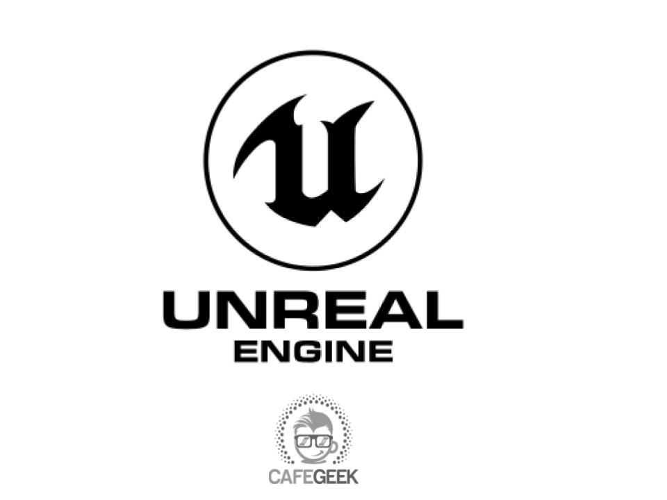

[CafeGeek](http://CafeGeek.eti.br)

## Conteúdo do curso
1. [Introdução](unreal_engine_introducao_desenvolvimento_jogos.html)
1. Projeto e instalação
    1. [Como instalar o Unreal Engine?](como_instalar_o_unreal_engine.html)
    1. [Organizando pastas e logo do projeto](organizando_pastas_e_logo.html)
    1. [Controle de versão com GitHub](controle_de_versao_github.html)
    1. [Interface e Editores](interface.html)  
1. Blueprints e estruturas básicas
    1. [Entendo a lógica de programação visual com Blueprint](entendo_blueprint.html)
    1. [Trabalhando com variáveis](trabalhando_com_variaveis.html)  
    1. [Estruturas de controle de fluxo](estruturas_de_controle_de_fluxo.html)
    1. [Manipulando Arrays](manipulando_array.html)  
    1. [Enums](enum.html)    
1. Atores, movimentação, tempo e espaço
    1. [Actors - Atores](actor_atores.html)
    1. [Estruturando a lógica utilizando Eventos, funções e macros](estruturando_logica_utilizando_eventos_funcoes_macros.html)  
    1. [Trabalhando com a lógica de movimentação do personagem](trabalhando_com_logica_movimentacao_de_personagem.html)    
    1. [Comunicação entre Blueprints](comunicacao_entre_blueprint.html)    
    1. [Delta time e sistema de coordenadas](deltatime_sistema_coordenadas.html)  
1. Estruturas de dados
    1. [Structure - Variáveis estruturadas](structure_variaveis_estruturadas.html)  
    1. [Data tables - Tabelas de dados](data_tables.html)
    1. [Game Instance, Game State e Game Mode](gameinstance_state_mode.html)
1. Interface com usuário
    1. [HUD - Interface com o jogador](hud_interface.html)
1. Ambiente
    1. [Trabalhando com Materiais](trabalhando_com_materiais.html)
    1. [Ilumincação](iluminacao.html)
    1. [Landscape](landscape.html)  
1. Animação, multiplayer e inteligência artificial
    1. [Animação](animacao.html)
    1. [Multiplayer](multiplayer.html)
    1. [Convertendo para c++](convertendo_blueprint_para_c++.html)
    1. [Inteligência Artificial](inteligenciaartificial.html)
1. Efeitos especiais
    1. [Sequencer](sequencer.html)
    1. [Niagara](niagara.html)
