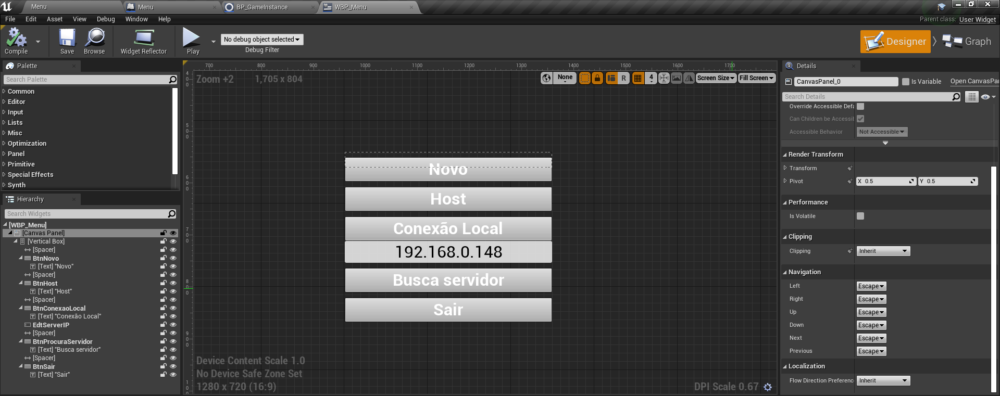

[CafeGeek](http://CafeGeek.eti.br)  / [Desenvolvimento de jogos utilizando Unreal Engine](http://cafeGeek.eti.br/unreal_engine/index.html)

# Multiplayer

Neste capítulo vamos implementar e organização elementos para conexão, replicação e
inicialização de um jogo multiplayer.

Vamos implementar os seguintes elementos :

> 1. [Criando sessões](#1)
> 1. [Conectando usando IP](#2)
> 1. [Buscando sessões ativas](#3)
> 1. [Procurando outros servidores](#4)
> 1. [Instalar o SteamSDK](#5)
> 1. [VPN para compartilhamento de conexões](#6)
> 1. [Replicação de dados](#7)

<a name="ind"></a>
## Índice

> 1. [Tipos de Conexão](#1)
> 1. [Configurando o projeto](#2)
> 1. [Menu](#3)
> 1. [Executando o projeto](#4)

<a name="1"></a>
## 1. Tipos de Conexão
- A conexão somente é possível com versões do mesmo programa.
- Cliente e Servidor: Programa cliente se conecta através de uma rede a um programa servidor;
  - Servidor pode ficar somente no atendimento ou pode realizar tarefas
  - Diagrama   
        
  - Ponto a Ponto: Programa cliente se conecta com outro computador ouvindo a rede
    - Os computadores ficam operantes;
    - Diagrama  
    

1. Implementação no jogo
- Servidor (Host) - Jogo em modo escuta **listen**
- Cliente - Jogo tem que conectar em um outro através de um endereço de rede
- Busca servidores
- Exemplo:  
Servidor
  ```sh
  C:\Program Files\UE_4.17\Engine\Binaries\Win64\UE4Editor.exe
  C:\PATH_TO_MY_PROJECT.uproject /Game/ThirdPersonCPP/Maps/ThirdPersonExampleMap -server -log -port=8003
  ```
cliente
  ```sh
  C:\Program Files\UE_4.17\Engine\Binaries\Win64\UE4Editor.exe
C:\PATH_TO_MY_PROJECT.uproject 192.168.1.90:8003 -game -log
  ```
## 2. Executando o projeto
1. Na comando **Play** escolha as seguintes opções:
  - **Number of Players** : Escolha a quantidade de conexões que o projeto recebera.
  - Net Mode

  

<a name="2"></a>
## 2.Configurando o projeto
- Implementação das estruturas de controle do game   

- Criando o GameInstance  

- Implementando o evento **OpenMenu**  

- Configurando o projeto com GameInstance  


<a name="3"></a>
## 3. Menu
- Implementando os mapas  

- Implementando a lógica de chamada do menu no level **Menu** utilizando o **Open Level Blueprints**  
  
- Widget WBP_Menu  


- Implementar os seguintes elementos no diagrama  


- Implementar os eventos para instanciar uma conexão   


- Conectar ao servidor utilizando IP  


<a name="4"></a>
## 4. Executando o jogo
- Number of Players: Quantidade de conexões
- Net Mode:
>**Play Offline**  
Executa o jogo em modo offline.  
>**Play As Listen server**  
Executa o jogo (tela principal) em modo servidor.  
>**Play As Client**  
Executa o jogo (tela principal) em modo Cliente, iniciando a servidor em outra janela.


- Adicionar dois **PlayerStart**  


<a name="4"></a>
## 5. Replicação

### 5.1 Replicação de eventos
Para utilizar a replicação de eventos é necessário criar eventos customizados **Add custom event**.
>**Servidor**   
>Executado apenas no servidor que hospeda o jogo.  
>
>**Cliente**  
>Executado apenas no cliente que possui o ator ao qual a função pertence. Caso o Ator não possua conexão própria, esta lógica não será executada.   
>
>**NetMulticast**  
 Executado em todos os clientes que estão conectados ao servidor, bem como no próprio servidor.

### 5.2 Objetos não Replicados
- HUD
- UMG Widgets

> "Replicar Movimento" funciona apenas para um componente raiz. Para este recurso, StaticMeshComponent deve ser escolhido como "root".  
>
>*[replication for moving actor](https://answers.unrealengine.com/questions/836572/replication-for-moving-actor.html?sort=oldest
)*

### 5.3 Replicação de variáveis

Usaremos as variáveis **Vida**, **Nome** e **VidaMax** para exemplificar.
- Vida
- Nome
- VidaMax

***

## 6. Crias as plataformas
- Static mesh lógica de movimentação

## 7. Implementando o objeto de para ser arremessado
- Implementando um Blueprints Static Mesh Actor e configurando a replicação do objeto.  

  

- O componente atachado também deverá ser replicado.  

  

## 8. Implementando a manipulação do objeto pelo personagem
- Eventos de entrada de dados (INPUT)

  

- Evento **AcaoDeSegurar**

  

- Evento **AcaoDeSegurar** continuação

  

- Agarrar objeto
Esta evento prente o objeto ao personagem
  

- Segurando
Este evento utiliza o event tick para alterar a posição do objeto preso ao personagem.

  

- Soltando objeto  
  

- Ação de arremessar o objeto  
  

- Adicionando o objeto simulando um arremesso  
  


## 7. Replicação de objetos em um ambiente multiplayer  


***
## Referências
- [Getting Started with Unreal Multiplayer in C++](https://www.unrealengine.com/en-US/tech-blog/getting-started-with-unreal-multiplayer-in-cpp?sessionInvalidated=true)   
- [Multiplayer Prorgamming Quick Start](https://docs.unrealengine.com/en-US/Gameplay/Networking/QuickStart/index.html)   
- [Networking Guide](http://www.zachmetcalfgames.com/wp-content/uploads/2014/12/zmg_Unreal_Networking_Guide.pdf)   
- [Multiplayer Damage and Health System in Unreal Engine 4](https://couchlearn.com/multiplayer-damage-and-health-system-in-unreal-engine-4/)  

- [Replication](https://docs.unrealengine.com/en-US/Gameplay/HowTo/Networking/ReplicateFunction/Blueprints/index.html)

- [Networking Overview](https://docs.unrealengine.com/en-US/InteractiveExperiences/Networking/Overview/index.html)
