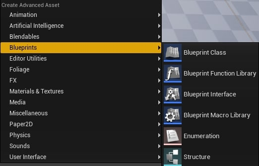
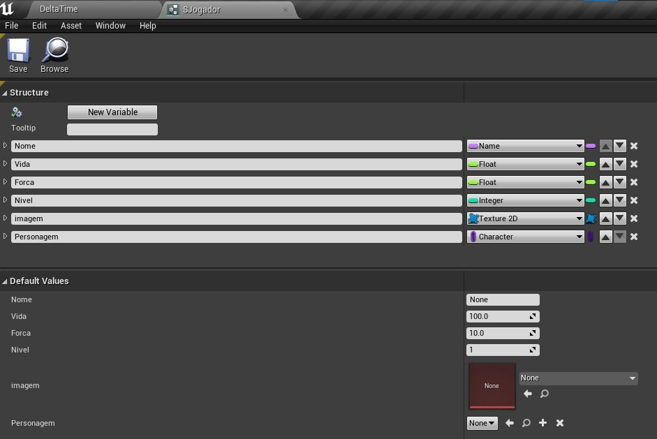
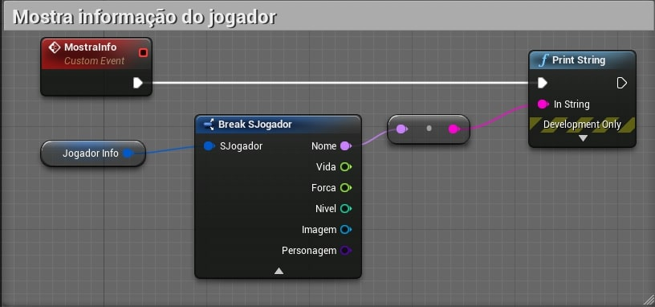
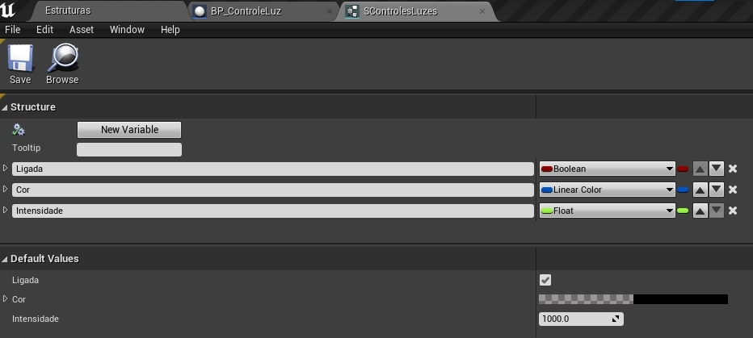
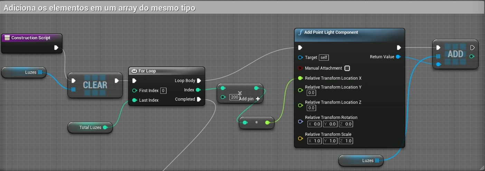
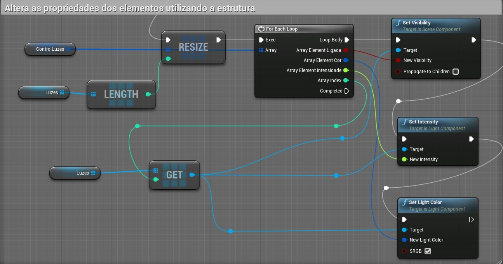

[CafeGeek](http://CafeGeek.eti.br)  / [Desenvolvimento de jogos utilizando Unreal Engine](http://cafeGeek.eti.br/unreal_engine/index.html)

# Structure - Variáveis estruturadas
**Structure**, é um tipo de dados definido pelo usuário disponível no **Unreal Engine** em **C++** e **Blueprint**, neste capitulo vamos explorar estes objetos.

## Índice
1. [O que são variáveis do tipo Structure?](#1)
    1. [Structure e Class](#1.1)
1. [Criando variáveis do tipo Structure com Blueprint](#2)
    1. [Menu Blueprints->Structure](#2.1)
    1. [Definindo variáveis dentro da estrutura](#2.2)
1. [Apresentado variáveis](#3)    
1. [Exemplo do uso de variáveis Structure](#4)    
    1. [Criando a objeto SControleLuzes](#4.1)
    1. [Lógica para construir os elementos na cena](#4.2)

<a name="1"></a>
## 1. O que são variáveis do tipo Structure?
**Structure**, são estruturas de dados também conhecidas como **registros**, permitem que um usuário combine itens de dados de (possivelmente) diferentes tipos de dados sob um único nome. Em outras palavras, é uma variável que contém outros variáveis de diferentes tipos.  
Podem ser utilizadas para definir propriedades de um elemento do jogo como por exemplo os personagens.

<a name="1.1"></a>
### 1.1 Structure e Class
Em **C++**, uma estrutura é realmente a mesma coisa que uma **Class**, exceto por algumas diferenças sintáticas.  
Por exemplo, **Structs** em **C++** padronizam suas variáveis de membro como públicas por padrão, enquanto as classes têm variáveis privadas por padrão.

**C++ Struct**
```cpp
struct Character {
    int velocidade;
    int forca;
    bool correndo;
};
```

**C++ Class**
```cpp
class Character {
    int Velocidade;
    int Forca;
    bool Correndo;
};
```

**C++ Struct Unreal**
```cpp
USTRUCT([Specifier, Specifier, ...])
struct FStructName
{
    GENERATED_BODY()

    int32 Velocidade;
    int32 Forca;

    UPROPERTY()
    bool Correndo;
};
```

**C++ Class Unreal**
```cpp
UCLASS()
class YOURMODULE_API APlayerCharacter: public ACharacter
{
  GENERATED_BODY()
public:
  UFUNCTION(BlueprintCallable, Category="Player")
  bool EstaCorrendo();

private:
        bool Correndo = false;
        int32 Velocidade=100;
        int32 Forca = 100;
};
```
<a name="2"></a>
## 2. Criando variáveis do tipo Structure com Blueprint
Para este exemplo vamos criar o objeto *SJogador* do tipo **Structure**.

<a name="2.1"></a>
### 2.1 Menu Blueprints->Structure


<a name="2.2"></a>
### 2.2 Definindo variáveis dentro da estrutura

1. Nome do tipo **Name** - Armazena o nome do jogador
1. Vida do tipo **Float** - Total de vida do jogador.
1. Forca do tipo **Float** - Total de força do jogador.
1. Nivel do tipo **Integer** - O Nível que o jogador se encontra.
1. Imagem do tipo **Texture2D/References** - Armazena imagem 2d que representa o jogador.
1. Personagem do tipo **Character/Class** - Armazena a classe de objeto do personagem do jogador.

<a name="3"></a>
## 3. Apresentado variáveis  
Para acessar as variáveis que estão dentro da objeto do tipo **Structure** vamos utilizar **Break Structure**.  


<a name="4"></a>
## 4. Exemplo do uso de variáveis Structure
Para exemplificar a utilização de variáveis Structure vamos implementar um level onde os elementos serão construídos dinamicamente, para tal vamos utilizar uma *Array* de objetos do tipo **Point Light Component** para que possam ser adicionados na cena no momento de construção do objeto.

<a name="4.1"></a>
### 4.1 Criando o objeto *SControleLuzes*
  

<a name="4.2"></a>
### 4.2 Lógica para construir os elementos na cena
1. Crie um *level* utilizando o modelo *default*.
1. Implemente um **Blueprint Actor** com o nome **BP_ControleLuzes**.
1. Adicionar as variáveis :
    1. **Luzes** - *Array* de tipo **Point Light Component**
    1. **ControLuzes** - *Array* de tipo **SControleLuzes**
    1. **Total_luzes** : Integer.
1. Na construção do objeto (*Construction Script*) adicionamos elementos *Point light component* na cena e logo em seguida no array *Luzes*.  
  
1. Ao terminar o primeiro *loop* reconstruímos o *array* de controle *ControLuzes* e o percorremos em conjunto com o array *luzes* para configurar as propriedades dos elementos.  
  
1. Adicione o elemento **BP_ControleLuzes** na cena para visualizar as luzes sendo construídas.

***
## Referências
- [Struct Variables in Blueprints](https://docs.unrealengine.com/en-US/ProgrammingAndScripting/Blueprints/UserGuide/Variables/Structs/index.html)
- [How to use Structs in Unreal Engine 4](https://couchlearn.com/how-to-use-structs-in-unreal-engine-4/)
- [Using structs in Blueprints ](https://romeroblueprints.blogspot.com/2015/08/using-structs-in-blueprints.html)
- [Unreal Engine 4 em Português - Estrutura - Olha Que Fácil #47](https://www.youtube.com/watch?v=IWAhdY6Vlzo)
