[CafeGeek](http://CafeGeek.eti.br)  / [Desenvolvimento de jogos utilizando Unreal Engine 4](http://cafeGeek.eti.br/unreal_engine/index.html)
# Trabalhando com a lógica de movimentação do personagem
Neste capítulo vamos implementar apresentar a lógica de movimentação de atores com **Blueprint** e aplicar em um jogo de plataforma.

## Índice
1. [Como o Unreal Engine vincula as ações a lógica de eventos?](#1)
      1. [Actions Mappings](#11)
      1. [Axis Mappings](#12)
      1. [Mapeamento Input do projeto](#13)
1. [Movimentação de peão Pawn](#2)
     1. [Componentes](#21)
     1. [Habilitando a entrada de comandos](#22)
     1. [Implementando movimentação com teclado](#23)
     1. [Captura de coordenadas](#24)
     1. [Movimentação utilizando mouse](#25)
     1. [Controle de movimentação do ator (Classe)](#26)
1. [Enumeration para registro de poses/estados do personagem](#3)
     1. [Variável Enumeration](#31)
     1. [Atualizando a variável](#32)
1. [Plataforma](#4)
     1. [Estrutura do objeto](#41)
     1. [Aumentando a velocidade](#42)
     1. [Movimentação da plataforma](#43)
     1. [Lógica usando Level Blueprint](#44)
     1. [Implementação do controle de tempo](#45)
     1. [Utilizando o evento Tick e TimeLine](#46)
1. [Usando o evento Tick - Blueprint](#5)
     1. [Variáveis](#51)
     1. [Inicializando variáveis](#52)
     1. [ Evento Tick](#53)
 1. [Usando o evento Tick - C++](#6)
     1. [Inicializando variáveis](#61)
     1. [Evento Tick](#62)
1. [Movimentação de um personagem Character](#7)     

<a name="1"></a>
## 1. Como o Unreal Engine vincula as ações a lógica de eventos?
**Unreal Engine** utiliza Input Actions e Mappings para vincular ações e mapeamento de chaves e eixos de entrada.
- Facilita o mapeamento de várias chaves para o mesmo comportamento.
- Possibilita o remapeamento de chaves.

<a name="11"></a>
### 1.1 Actions Mappings
Vincula um evento a uma entrada de dados (teclado, mouse, Gamepad, etc).  
Mapeamento de um evento a um botão:
- Valores 0 e 1  
Exemplo:
  1. Tecla Espaço = Pulo
  1. Tecla Enter = Disparo
  1. Tecla C  = Agachar

**C++**
```cpp
InputComponent->BindAction("Pulo", IE_Released, this, &ASampleCharacter::OnEndPulo);
```
<a name="12"></a>
### 1.2 Axis Mappings
Mapeamento de Movimentação nos eixos.  
Mapeamento um evento a um botão ou a um eixo de controle.  
É atualizado constantemente.  
Escala de valores.  
Exemplo:
  1. Tecla W = MoverDireita
  1. Tecla D = MoverEsquerda
**C++**
```cpp
InputComponent->BindAxis("MoveParaFrente", this, &ASampleCharacter::MoveForward);
```

<a name="13"></a>
### 1.3 Mapeamento Input do projeto
No exemplo abaixo associamos a ação Pulo com o tecla **Space Bar** e **GamePad FaceButtonBotton**. Ao definir uma ação em **Bindings** a *game engine* cria um evento do mesmo nome.    
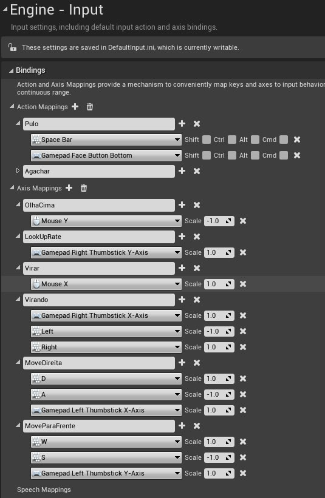    

- Utilizamos o Menu->Project->Input.

<a name="2"></a>
## 2. Movimentação de peão *Pawn*
Para exemplificar a implementação utilizaremos uma classe do tipo **Pawn**

<a name="21"></a>
### 2.1 Componentes
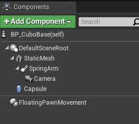
- **Capsule**- Implementa uma capsula com colisão simples que pode determinar a movimentação do jogador.
- **FloatingPawnMovement** - Habilita lógica de movimentação do peão.

<a name="22"></a>
### 2.2 Habilitando a entrada de comandos   
É necessário habilitar a entrada de comandos para a classe **Pawn**.  
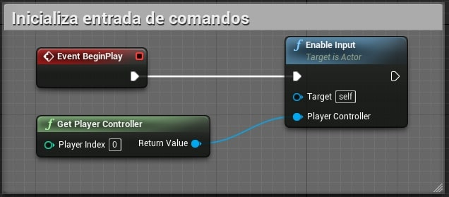
- **PlayerController** - Implementa funcionalidade para pegar os dados de entrada do jogador e traduzi-los em ações, como movimento, uso de itens, armas de fogo, etc.

<a name="23"></a>
### 2.3 Implementando movimentação com teclado
Devemos executar a chamada dos eventos criados no mapeamento e associados a *inputs*
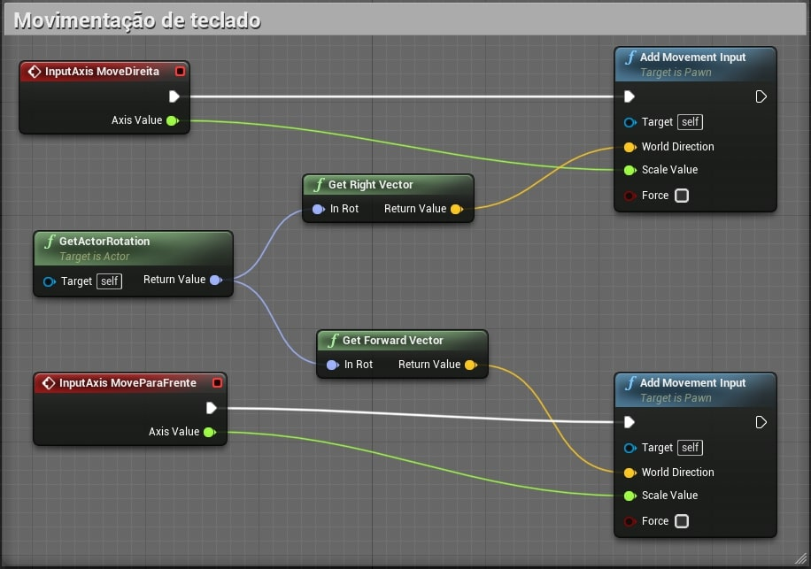
- **GetActorRotation** - Retorna a rotação do **RootComponent** (Componente raiz que determina a posição do objeto)deste Ator.
- **Get Right Vector** - Obtenha o vetor correto (Y)  desse componente, no espaço do mundo.
- **Get Forward Vector** - Obtenha o vetor de direção da unidade para frente (X) deste componente, no espaço do mundo.
- **Add Movement Input** - Adiciona entrada de movimento ao longo do vetor de direção do mundo dado (geralmente normalizado) escalado por 'ScaleValue'. Se ScaleValue <0, o movimento será na direção oposta. As classes base de peão não aplicam movimento automaticamente, cabe ao usuário fazer isso em um evento Tick. Subclasses como **Character** e **DefaultPawn** manipulam automaticamente essa entrada e se movem.
- **Scale Value** - Escala para aplicar à entrada. Isso pode ser usado para entrada analógica, ou seja, um valor de 0,5 aplica-se à metade do valor normal, enquanto -1,0 inverteria a direção.

<a name="24"></a>
### 2.4 Captura de coordenadas
Captura as coordenadas do ator para que possamos utilizar os métodos de movimentação **Virar** e **OlhaCima**  
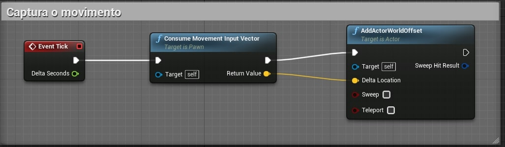

<a name="25"></a>
### 2.5 Movimentação utilizando mouse
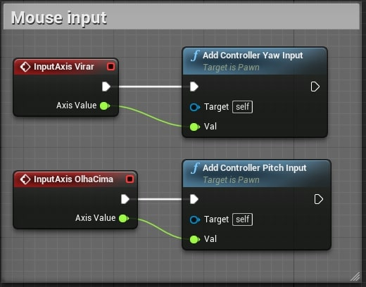

- **Yaw e Pitch** - Representam respectivamente as coordenadas:  
      X = Roll
      Y = Pitch
      Z = Yaw

<a name="26"></a>
###  2.6 Controle de movimentação do ator (Classe)
Caso as opções *Use controller rotation pitch/Yaw* estiverem ativas (**true**) a cápsula do ator irá sem movimentar no seu próprio eixo.     
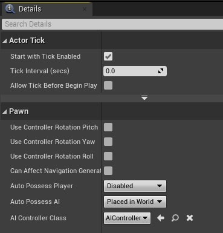
- **SpringArm** - Sustenta a câmera e o responsável pela movimentação.
- Quando verdadeiro *Use Pawn control Rotation* e somente o braço com a câmera são movimentados.      

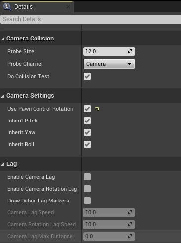

<a name="3"></a>
## 3. **Enumeration** para registro de poses/estados do personagem.    
Podemos utilizar uma variável Enumeration para registrar o estado do objeto.

<a name="31"></a>
### 3.1 Variável Enumeration
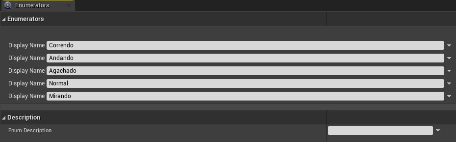

<a name="32"></a>
### 3.2 Atualizando a variável
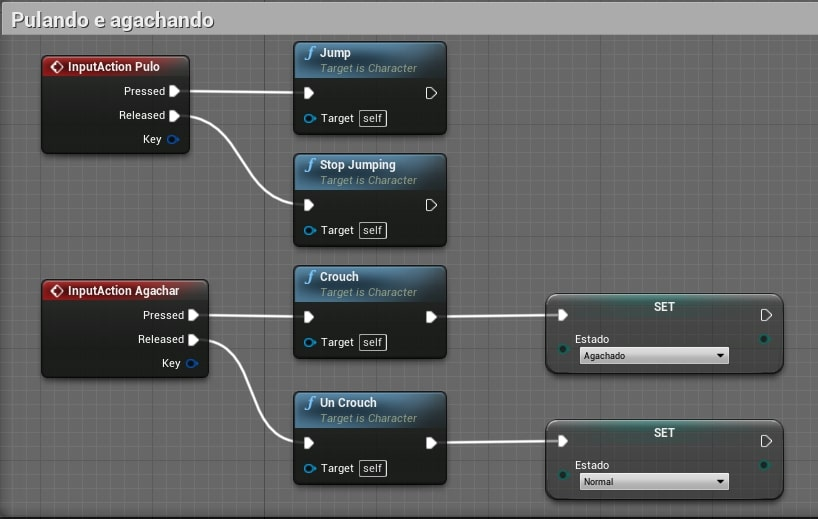

<a name="4"></a>
## 4. Plataforma
Neste passo iremos implementar a Plataforma de Poder *PowerUp* para exemplificar a movimentação de objetos. Ao colidir com a plataforma a velocidade e o impulso do personagem **HP_Hero** aumentam.   
A plataforma deverá se movimentar utilizando marcações (**TargetPoint**) para facilitar a level design.
Serão implementados objetos para disparar (Plataforma Trigger) a movimentação das plataformas.

<a name="41"></a>
### 4.1 Estrutura do objeto Plataforma
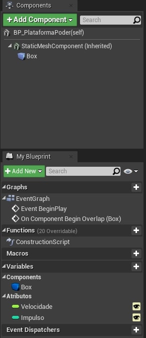  
- **StaticMeshActor** - Derivado da classe Actor.
- **Box** - Do tipo **Box Collision**.
- **Velocidade/Impulso** - Variáveis públicas para multiplicar as propriedades do personagem.

<a name="42"></a>
### 4.2 Aumentando a  velocidade
Lógica para aumentar a velocidade de corrida e força de impulso do personagem do *BP_Hero* tipo **Character**.
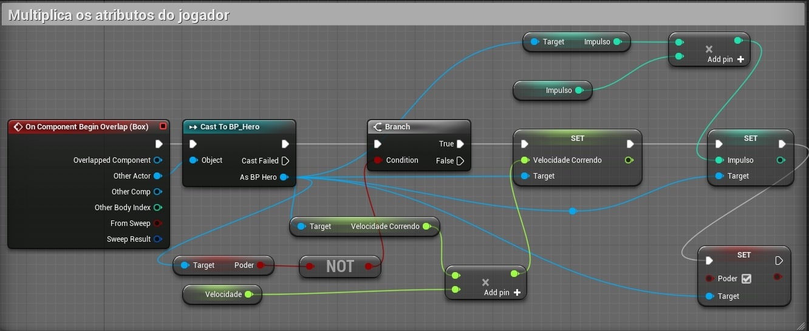
- Ao colidir com a plataforma a lógica é acionada.

<a name="43"></a>
### 4.3 Movimentação da plataforma
A movimentação tem que ser interpolada, quer dizer que as coordenadas tem que ser atualizadas a cada passo.  
Exemplos de coordenadas:  

|| X |Y  |Z  |
|:-:|:-:|:-:|:-:|
|Início|1  | 1 | 1 |
|| 1 | **2** | 1 |
|| 1 | **3** | 1 |
|| 1 | **4** | 1|
|Fim| 1 | 5  | 1 |  

- Destino : 1,5.1
- Origem : 1,1,1

<a name="44"></a>
### 4.4 Lógica usando Level Blueprint
Utilizando o **Level Blueprint** vamos implementar a lógica de movimentação usando **TimeLine**.
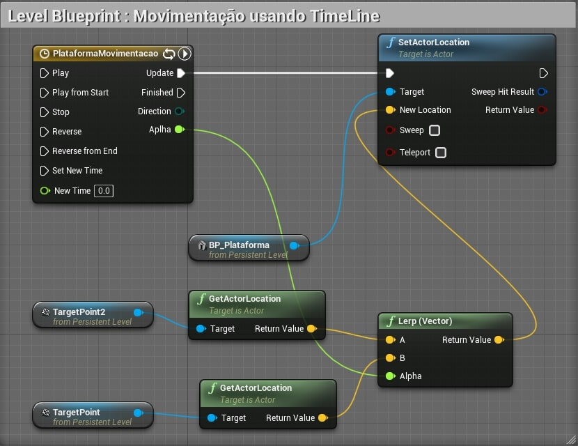
- Determinar o destino da movimentação.
- Implementar a lógica de movimentação usando *timeline*.
- Declarar a variável *Velocidade* para controle da velocidade de movimentação.  
- **Learp** - Interpola linearmente entre A e B com base em Alpha (100% de A quando Alpha = 0 e 100% de B quando Alpha = 1)

<a name="45"></a>
### 4.5 Implementação do controle de tempo
Devemos definir uma curva de tempo para a variável **Alpha** para utilizar na interpolação de A com B (**Learp**)
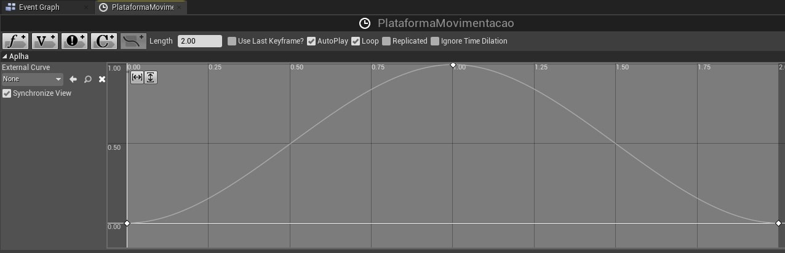

<a name="46"></a>
### 4.6 Utilizando o evento Tick e TimeLine
Com a finalidade de exemplificar podemos utilizar o evento **Tick** para alterar a velocidade da plataforma.


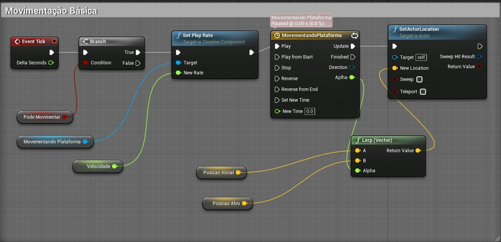

Pode ser construída outra plataforma para acionar o evento, Plataforma de gatilho *Trigger Plataform*.

<a name="5"></a>
## 5. Usando o evento Tick - Blueprint
Agora vamos usar o evento **Tick** para interpolar as coordenadas de origem e destino.
<a name="51"></a>
### 5.1 Variáveis
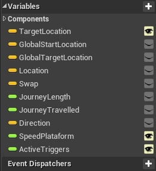
- **TargetLocation** - Coordenadas do destino com Widget ativo.
- **GlobalStartLocation** - Coordenadas globais iniciais do ator.
- **GlobalTargetLocation** - Coordenadas globais iniciais do destino.
- **Location/Swap** - Variáveis auxiliares.
- **Direction** - Vetor auxiliar que determina a direção do objeto.

<a name="52"></a>
### 5.2 Inicializando variáveis
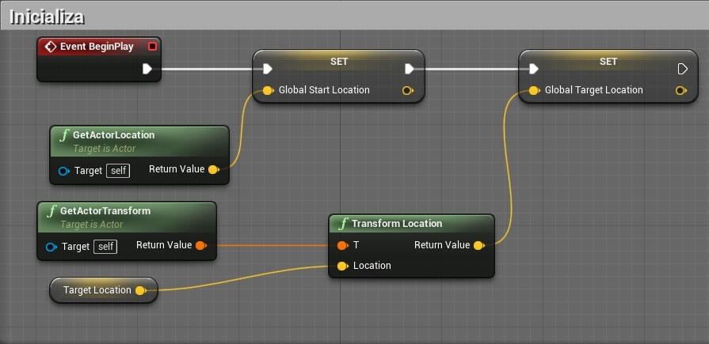

<a name="53"></a>
### 5.3 Evento Tick
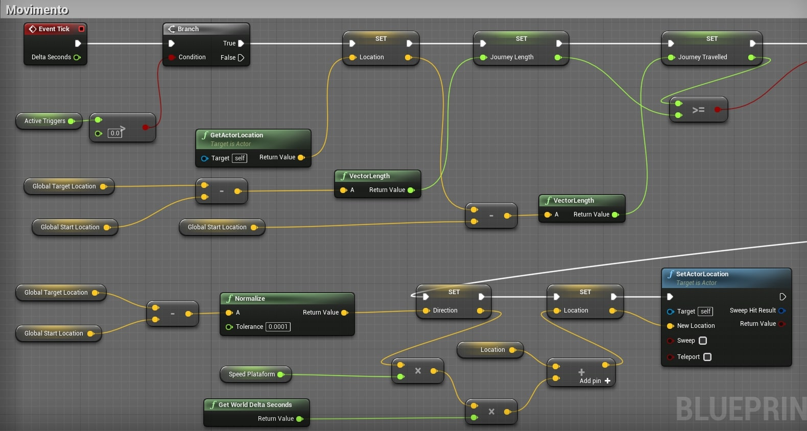

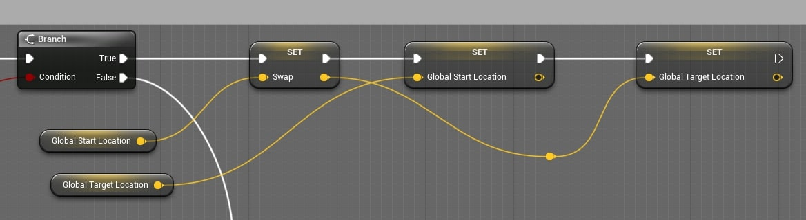

<a name="6"></a>
## 6. Usando o evento Tick - C++

<a name="61"></a>
### 6.1 Inicializando variáveis
```cpp
void APlataforma::BeginPlay()
{
	Super::BeginPlay();
	GlobalStartLocation = GetActorLocation();
	GlobalTargetLocation = GetTransform().TransformPosition(TargetLocation);
}
```

<a name="62"></a>
## 6.2 Evento Tick
```cpp
void APlataforma::Tick(float DeltaTime)
{
	{
		Super::Tick(DeltaTime);

		if (ActiveTriggers > 0)
		{
			FVector Location = GetActorLocation();

			float JourneyLength = (GlobalTargetLocation - GlobalStartLocation).Size();
			float JourneyTravelled = (Location - GlobalStartLocation).Size();

			if (JourneyTravelled >= JourneyLength)
			{
				FVector Swap = GlobalStartLocation;
				GlobalStartLocation = GlobalTargetLocation;
				GlobalTargetLocation = Swap;
			}

			FVector Direction = (GlobalTargetLocation - GlobalStartLocation).GetSafeNormal();
			Location += DeltaTime * SpeedPlataform * Direction;
			SetActorLocation(Location);
		}
	}
}
```

***
## Referências
- [PlayerInput](https://docs.unrealengine.com/en-US/Programming/Tutorials/PlayerInput/index.html)
- [Enabled Input](https://docs.unrealengine.com/en-US/Gameplay/HowTo/ActorInput/Blueprints/index.html)  
- [Mapeando de comandos](https://docs.unrealengine.com/en-US/Gameplay/Input/index.html)  
- [CharacterMovement](https://docs.unrealengine.com/en-US/Gameplay/HowTo/CharacterMovement/Blueprints/index.html)  
- [Create a Free camera pawn with custom inputs](https://isaratech.com/ue4-create-a-free-camera-pawn-with-custom-inputs/)
- [Setting Up Character Movement](https://docs.unrealengine.com/en-US/InteractiveExperiences/HowTo/CharacterMovement/index.html)
- [Grabbing Objects](https://www.youtube.com/watch?v=HnR1Gf5gXcY)
