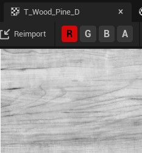

[CafeGeek](http://CafeGeek.eti.br)  / [Desenvolvimento de jogos utilizando Unreal Engine](http://cafeGeek.eti.br/unreal_engine/index.html)

# Trabalhando com Materiais

## Índice
1. [O que é um material?](#1)
1. [Materiais de base física - PBR](#2)
1. [Estrutura do Material no Unreal Engine](#3)
    1. [Editor de materiais](#3.1)
    1. [ Atributos importantes](#3.2)
    1. [Editor e nó principal](#3.3)
1. [Valores que determinam a física](#4)
1. [Texture samples](#5)
1. [Material expressions](#6)
    1. [ Conectando material Expressions](#6.1)
    1. [Combinando material Expressions](#6.2)
    1. [ Exemplo do nó Lerp](#6.3)
1. [Texturas](#7)
    1. [Roughness - rugosidade](#7.1)
    1. [Normal - Coordenadas normals](#7.2)
    1. [Texture samples](#7.3)
    1. [Metallic - Metálica](#7.4)
1. [Aplicando o material no objeto](#8)
1. [Material Inputs](#9)
    1. [Inputs](#9.1)
1. [Material propriedades](#10)
1. [Material Instance](#11)
    1. [Preparando o Material](#11.1)
    1. [Criando material instance](#11.2)
1. [Editor de material Instance](#11)
1. [Materiais e Blueprint](#12)
1. [Parameter Global](#13)
1. [Material Function](#14)

<a name="1"></a>
## 1. O que é um material?
Podemos definir como uma coleção de imagens e instruções computacionais que são adicionadas a superfícies poligonais.


No exemplo acima podemos verificar uma esfera com diferentes tipos de materiais adicionados na sua superfície, onde cada um interage de forma diferente a iluminação.
Podemos definir o material como uma pintura que é aplicada em superfícies.
Contudo materiais não são somente cores mas representação de imperfeições da superfície a qual foram aplicadas, como por exemplo, rasuras, aspereza e transparência.
Atualmente os materiais são baseados em simulações físicas do mundo.

<a name="2"></a>
## 2 Materiais de base física - PBR
PBR *Physically Based Rendering* significa que o material descreve as propriedades visuais de uma superfície de uma maneira realmente plausível, de modo que os resultados realistas sejam possíveis em todas as condições de iluminação. A maioria dos mecanismos de jogo e ferramentas de criação de conteúdo modernos dão suporte aos materiais do PBR porque eles são considerados a melhor aproximação de cenários do mundo real para renderização em tempo real.

<a name="3"></a>
## 3. Estrutura do Material no Unreal Engine
A primeira e mais importante coisa a saber sobre os Materiais é que eles não são construídos por meio de código, mas por meio de uma rede de nós de script visual (chamados de Expressões de Material) dentro do Editor de Material. Cada nó contém um fragmento de código HLSL, designado para executar uma tarefa específica. Isso significa que, conforme você constrói um Material, está criando código HLSL por meio de scripts visuais.

<a name="3.1"></a>
## 3.1 Editor de materiais
Vamos criar um material para que possamos exemplificar.
1. Menu de contexto para criar um material.     
       
  *Figura: Contex Menu Material*
1. Salve o material como *M_Base*

<a name="3.2"></a>
## 3.2 Atributos importantes
Abaixo citamos os mais importantes atributos dos materiais.
- **Base Color** - Matriz de cores RGBA;
- **Metallic** -  Metálica, valores entre 0 e 1.
- **Roughness** - Rugosidade, valores entre 0.1 e 0.9.
- **Emissive**  - Emissiva, Valores entre 0 e 1.
- **Normals** - Normal, mapeamento de texturas usada para iluminação de saliências e amassados.

<a name="3.3"></a>
## 3.3 Editor e nó principal ou Node Result
O nó Material Principal é responsável por exibir os resultados de todos os nós da Expressão de Material que são inseridos nele nas várias entradas. Cada entrada no nó Material Principal tem um efeito exclusivo sobre a aparência e o desempenho do Material.

O nó principal e suas propriedades.     

       
  *Figura: Nó principal ou Node Result.*

- **Material Domain** - Esta configuração permite designar como este material será usado. Certos usos de materiais (como decalques) requerem instruções adicionais para o mecanismo de renderização considerar. Por isso, é importante designar o Material como sendo usado para esses casos. O domínio do material inclui as seguintes opções:

  - **Surface** - Esta configuração define o Material como algo que será usado na superfície de um objeto; pense em metal, plástico, pele ou qualquer superfície física. Como tal, esta é a configuração que você usará na maioria das vezes.
  - **Deferred Decal** -  Ao fazer um [Material de Decalque ou Decal Material](https://docs.unrealengine.com/4.26/en-US/Basics/Actors/DecalActor/), você usará esta configuração.
  - **Light Function** - Usado ao criar um material para uso com uma função de luz.
  - **Volume** - Usado ao descrever os atributos do material como um volume 3D.
  - **Post-process** - Usado se o material for usado como um [Material de pós-processamento](https://docs.unrealengine.com/4.26/en-US/RenderingAndGraphics/PostProcessEffects/PostProcessMaterials/).
  - **User Interface** - Usado quando este material é usado para interfaces de usuário UMG ou Slate.

  - **Virtual Texture** - Usado ao fazer uma textura virtual em tempo de execução.

- **Blend Mode** - Os modos de mesclagem descrevem como a saída do material atual se mesclará com o que já está sendo desenhado no fundo. Em termos mais técnicos, ele permite que você controle como o mecanismo combinará este Material (cor de origem) com o que já está no buffer de quadros (cor de destino) quando renderizado. Os modos de mistura disponíveis são:
  - **BLEND_Opaque** - Cor final = cor de origem. Isso significa que o material será desenhado na parte superior do fundo. Este modo de mesclagem é compatível com iluminação.
  - **BLEND_Masked** -  Cor final = cor de origem se OpacityMask > OpacityMaskClipValue, caso contrário, o pixel é descartado. Este modo de mesclagem é compatível com iluminação.
  - **BLEND_Translucent** - Cor final = opacidade da cor de origem + cor de destino (1 - opacidade). Este modo de mistura NÃO é compatível com  iluminação dinâmica.
  - **BLEND_Additive** - Cor final = cor de origem + cor de destino. Este modo de mistura NÃO é compatível com iluminação dinâmica.
  - **BLEND_Modulate** - Cor final = cor de origem x cor de destino. Este modo de mistura NÃO é compatível com iluminação dinâmica ou neblina, a menos que seja um material de decalque.

<a name="4"></a>
## 4. Valores que determinam a física
- Constant 1 ou valor escalar- Valor único.     
           
  *Figura: Constant 1 -  1 + RMB*
- Constant 2 - Vetor de dois valores.      
       
  *Figura: Constant 2 - 2 + RMB*
- Constant 3 - Vetor de três valores.     
       
  *Figura: Constant 3 - 3 + RMB*

<a name="5"></a>
## 5. Texture samples
Texturas são imagens que são usadas em materiais e são representadas pelo nó abaixo.        
       
*Figura: Material texture - T + RMB*

### Texturas
- Tamanhos :
  1x1, 2x2, 4x4, 1024x1024 e 8192x8192
  - As texturas serão importadas em qualquer tamanho, mas não serão mipmaps.
- Formatos
- Importando
- Compressão

<a name="6"></a>
## 6. Material expressions
Os nós de Expressão de Material contêm pequenos fragmentos de código HLSL que realizam tarefas muito específicas dentro de um Material. Os materiais são construídos usando combinações de nós de Expressão de Material que são combinados para realizar certas tarefas.

<a name="6.1"></a>
### 6.1 Conectando material Expressions
Abaixo um exemplo de conexão.       
       
  *Figura: Material connection*

- Botão direito do mouse em qualquer área de trabalho (RMB) abre a lista de nós disponíveis.
- É possível fazer a busca de nós na aba **Palette** e arrastar com o mouse na área de trabalho.

<a name="6.2"></a>
### 6.2 Combinando material Expressions
A área de trabalho é um modelo de programação visual que permite combinar variáveis e funções para construir a estrutura final. Cada nó apresenta uma saída para o próximo nó.    

**Lógica**
```c++
M_Base =  ( TexturaSample( panner(TexCoord(),0.1,0) ) * Vetor3(0.0664,0.0366,0.401));
```
> **Atenção**
devemos considerar o tipo de valor de retorno do nó no momento da conexão para evitar erros de tipos conflitantes, por exemplo float3 * float2.

**Exemplo 1**

     
*Figura: Objeto com mistura de texturas*

     
  *Figura: Lógica da combinação de texturas*

- Base Color 1
  - Cada pixel do canal R da textura é multiplicado pela cor.     

      
  *Figura: Channel R Texture Wood Pine*
  - O valor 1 = branco e 0 = preto.

- Base Color 2
  - **Lerp** recebe o resultado da multiplicação e dos canais RGB da textura para do passo anterior. No parâmetro  Alpha é informado o canal G textura.
  - **Multiply** multiplica o canal R da textura com o resultado do Lerp.


**Gráfico de nós**
     
  *Figura: Material Expression connection*

- **Panner** - Produz coordenadas de textura UV que podem ser usadas para criar texturas panorâmicas ou móveis.
- **Multiply** - Pega duas entradas, multiplica-as juntas e produz o resultado. Quando você passa valores de cor como entrada, os resultados são semelhantes aos resultados do modo de mesclagem de camada Multiply no Photoshop.   
Se você passar valores com vários canais, cada canal será multiplicado separadamente. Por exemplo, se você passar valores de cor RGB para cada entrada, o canal R da primeira entrada é multiplicado pelo canal R da segunda entrada e o resultado é armazenado no canal R da saída; o canal G da primeira entrada é multiplicado pelo canal G da segunda entrada e o resultado é armazenado no canal G da saída e assim por diante.      
Ambas as entradas devem ter o mesmo número de valores, a menos que um dos valores seja um único valor flutuante. Nesse caso, cada canal da entrada multicanal é multiplicado pelo valor flutuante único e armazenado em um canal separado do valor de saída.
- **TexCoord** - Gera coordenadas de textura UV na forma de um valor vetorial de dois canais, permitindo que os materiais usem diferentes canais UV, especifiquem ladrilhos e, de outra forma, operem nos UVs de uma malha.

<a name="6.3"></a>
### 6.3 Exemplo do nó Lerp
Interpola Linearmente entre A e B com base em Alfa (100% de A quando Alfa = 0 e 100% de B quando Alfa = 1)
     
  *Figura: Material Lerp*

<a name="7"></a>
## 7. Texturas
     
  *Figura: Material base texture*

<a name="7.1"></a>
### 7.1 Roughness - rugosidade
   
  *Figura: Texture Roughness - Esses mapas são em tons de cinza, com o branco sendo a aspereza máxima e o preto sendo uma superfície lisa e brilhante.*

**Roughness** (Aspereza e também chamada de brilho ou dispersão da micro-superfície) é um mapa semi-autoexplicativo. Eles definem como a luz é espalhada pela superfície do seu modelo.     
Isso começa com um valor de zero, onde seu modelo não dispersará a luz, tornando os reflexos e a iluminação muito mais nítidos e brilhantes em seu material.    
Por outro lado, se você aumentar a rugosidade ao máximo, a luz se espalhará mais pelo material. Isso faz com que a iluminação e os reflexos se espalhem pelo modelo, mas pareçam muito mais escuros.      

<a name="7.2"></a>
### 7.2 Normal - Coordenadas normals
     
  *Figura: Texture Normal*

Usado para simular a maneira como a luz interage com a superfície do material para simular saliências e amassados menores.    
É importante observar que um mapa normal não mudará sua geometria base (consulte os mapas de altura posteriormente neste artigo).   
A cor base de um mapa normal é roxo claro, esta é a “parte inferior” do mapa normal que representa a superfície de sua malha poligonal. A partir daí, os valores RGB são usados para produzir rachaduras, saliências ou poros em seu modelo. Os valores R, G e B são iguais às coordenadas X, Y e Z em sua malha base.

<a name="7.3"></a>
### 7.3 Metallic - Metálica
     
*Figura: Texture Metallic*

É usado para definir se o seu material (ou parte dele) é metal puro.      
Os mapas de metal também são em tons de cinza, mas a prática recomendada é usar apenas os valores de branco e preto e fazer as variações entre o uso de seus mapas de rugosidade.     
Preto no mapa de *metalidade* significa que parte do mapa usará o mapa de albedo como a cor difusa (a cor que a textura mostra quando é atingida pela luz).   
Em vez disso, o branco usará a cor albedo para definir a cor e o brilho de seus reflexos e definirá a cor difusa dos materiais como preto. A cor difusa não é mais necessária neste caso porque todas as cores e detalhes daquela parte do material agora virão dos reflexos, tornando-o preto.

<a name="8"></a>
## 8. Aplicando o material no objeto
   
  *Figura: Applying Material*

<a name="9"></a>
## 9. Material Inputs
Nem todas as entradas serão úteis para cada tipo de material que você criar. Por exemplo, ao desenvolver uma Função de Luz - um Material que é aplicado a uma luz - você só pode usar a entrada Cor Emissiva no material e nada mais, visto que outras entradas, como Metálico ou Aspereza, não seriam aplicáveis. Por isso, é importante saber que tipo de material você está criando antes de começar a se preocupar muito com as entradas. As três propriedades de controle primárias são:

- **Blend Mode** - controla como o seu material se mesclará com os pixels por trás dele.
- **Shading Model** - define como a luz é calculada para a superfície do material.
- **Material Domain** - controla como o material deve ser usado, por exemplo, se ele deve fazer parte de uma superfície, uma função leve ou um material pós-processamento.

       
  *Figura: Material Type input*

<a name="9.1"></a>
### 9.1 Inputs
- **Base Color** - A Cor Base define a cor geral do Material, obtendo um valor Vector3 (RGB) em que cada canal é automaticamente fixado entre 0 e 1.
- **Normal maps** - A entrada Normal leva em um mapa normal, que é usado para fornecer detalhes físicos significativos para a superfície, perturbando o "normal", ou direção de frente, de cada pixel individual.
- **Emissive** - Dá aos artistas uma maneira muito barata e eficaz de dar a ilusão de que um Material está lançando luz quando na verdade não está. Os materiais emissivos fazem isso permitindo que o artista empurre os valores da entrada emissiva acima de 1,0, o que empurrará o material para a faixa HDR, emitindo um efeito Bloom que você pode ver ao olhar para uma fonte de luz muito brilhante.   

     
  *Figura: Material Emissive*

- **World position Offset** - Permite que os vértices de uma malha sejam manipulados no espaço do mundo pelo Material. Isso é útil para fazer objetos se moverem, mudarem de forma, girarem e uma variedade de outros efeitos. Isso é útil para coisas como animação ambiente.

     
  *Figura: Material World Position Offset*

Os valores do nó Constant Vector 3, representam as coordenadas de posição do mundo (x,y,z) respectivamente.

  Exemplo:    

     
  *Figura: Material World Position offset*

<a name="10"></a>
## 10. Material propriedades
- **Unlit Shading Model** - Produz apenas Emissivo para cores, tornando-o perfeito para efeitos especiais como fogo ou iluminação de objetos. Observe que, neste exemplo, o Material não está projetando luz na cena. Em vez disso, seu alto valor Emissivo resulta em um efeito de brilho, que também é captado pela Máscara de Sujeira aplicada à câmera. Parece iluminar, mas nenhuma luz ou sombra será projetada por este objeto.

       
  *Figura: Material Properties Unlit Shading Model*

  
  *Figura: Material Properties blend Mode Unlit*

- **Masked Blend Mode** - É usado para objetos nos quais você precisa controlar seletivamente a visibilidade de forma binária (liga / desliga). Por exemplo, considere um material que simula uma cerca de arame ou grade. Você terá algumas áreas que parecem sólidas, enquanto outras são invisíveis. Esses materiais são perfeitos para o modo de mesclagem mascarada.     
       
  *Figura: Material Properties blend mode masked*

     
  *Figura: Material Properties blend mode masked result*

- **Translucent Blend Mode** - É usado para objetos que requerem alguma forma de transparência.
    
  *Figura: Material Properties blend mode Translucent*

Resultado

       
    *Figura: Material Properties blend mode Translucent*

<a name="11"></a>
## 11. Material Instance
A *Mateial Instance* ou Instanciação de Material é uma maneira de criar um Material pai, que pode então ser usado como base para fazer uma ampla variedade de Materiais filhos de aparência diferente. Para obter essa flexibilidade, o *Material Instancing* usa um conceito chamado herança: as propriedades do pai são fornecidas aos seus filhos. Aqui está um exemplo de herança de material em ação.

<a name="11.1"></a>
### 11.1 Preparando o Material
1. Criamos uma copia de M_Base com o nome M_Base_parametros.
1. Convertemos os nós em parâmetros para que possam ser manipulados posteriormente pelo material instance.    
       
  *Figura: Material convert to Parameter*
1. Definimos os seguintes atributos nos parâmetros:
  - **Parameter name** - Escolha um nome para o parâmetro que representa o input do material.
  - **Group** - Usado para agrupar os parâmetros por um determinado valor ou tema.
    Sugestão de grupos:
      - Texture Parameter Values.
        - Diffuse,NormalMap, Rough Texture
      - Scalar Parameter Values.
        - Metallic, Roughness
      - Vector Parameter Values.
        - Color (R,G,B,A), UVTiling(R,G,B,A)

<a name="11.2"></a>
### 11.2 Criando material instance
Selecione o material M_Base ou outro material e com o botão direito acione o menu de contexto e escolha **Create Material Instance**.     

   
  *Figura: Create material instance*

<a name="12"></a>
### 12 Editor de material Instance
     
  *Figura: Material instance editor*

- **Details** - Propriedades
- **Basico** - Grupo definido nos parâmetros dentro do material pai.
- **Color, Metallic, Roughness, Specular** - Parâmetros criados dentro do material pai. Podem ser alterados e até salvos.
- **Parent** - Material pai.

### 11.4 Parâmetros

<a name="13"></a>
## 13. Materiais e Blueprint
Podemos manipular os objetos do tipo material com blueprint.

1. Lógica para criar o material e a textura: Create material instance->Set Texture Parameter Value
   
  *Figura: Blueprint create material instance set*

1. No Level Blueprint implemente a lógica para chamar o Evento **MudaCorEvento**.

     
  *Figura: Material Open Level blueprint call event*

<a name="14"></a>
## 14. Parameter Global
Podemos definir parâmetros globais para que os materiais possam referenciar parâmetros escalares e vetoriais.
> É uma ferramenta poderosa que os artistas podem usar para obter dados globais em muitos materiais de uma só vez. Ele também pode ser usado para gerar efeitos por nível, como quantidade de neve, quantidade de destruição, umidade, etc., que, de outra forma, exigiria a configuração de valores de parâmetros individuais em muitas instâncias de materiais diferentes em seu nível.

- Material Parameter->GetCollectionParameter


<a name="15"></a>
## 15. Material Function
**Mateial Functions** ou Funções de material são pequenos fragmentos de códigos gráficos de material que podem ser salvos em pacotes e reutilizados em vários materiais, em outras palavras são funções de programação. Seu objetivo é agilizar o processo de criação de material, dando acesso instantâneo a redes comumente usadas de nós materiais.    
São compostas basicamente por entradas de parâmetros e saída de dados.

Input Parameter -> Output Result

<a name="16"></a>
## 16 ATIVIDADES
<a name="16.1"></a>
### 16.1 -
#### Regras
1. -
1. -

#### Desafio      
1. -

***

## Referências
- [Shaders: o que são e para que servem?](https://www.tecmundo.com.br/voxel/especiais/182970-shaders-o-que-sao-e-para-que-servem-.htm)
- [Physically Based Materials](https://docs.unrealengine.com/en-US/RenderingAndGraphics/Materials/PhysicallyBased/index.html)
- [Texture Import Guide](https://docs.unrealengine.com/en-US/RenderingAndGraphics/Textures/Importing/index.html)
- [Material Expression Reference](https://docs.unrealengine.com/en-US/RenderingAndGraphics/Materials/ExpressionReference/index.html)
- [Coordinates Expressions](https://docs.unrealengine.com/en-US/RenderingAndGraphics/Materials/ExpressionReference/Coordinates/index.html)
- [Math Expressions](https://docs.unrealengine.com/en-US/RenderingAndGraphics/Materials/ExpressionReference/Math/index.html#power)
- [1.10 - World Position Offset](https://docs.unrealengine.com/en-US/Resources/ContentExamples/MaterialNodes/1_10/index.html)
- [1.9 - Normal](https://docs.unrealengine.com/en-US/Resources/ContentExamples/MaterialNodes/1_9/index.html)
- [Material Blend Modes](https://docs.unrealengine.com/en-US/RenderingAndGraphics/Materials/MaterialProperties/BlendModes/index.html)
- [Creating and Using Material Instances](https://docs.unrealengine.com/en-US/RenderingAndGraphics/Materials/HowTo/Instancing/index.html)
- [Material Parameter Collections](https://docs.unrealengine.com/en-US/RenderingAndGraphics/Materials/ParameterCollections/index.html)
- [Material Parameter Collections](https://www.unrealengine.com/en-US/blog/material-parameter-collections)
- [Texture maps](https://conceptartempire.com/texture-maps/)
