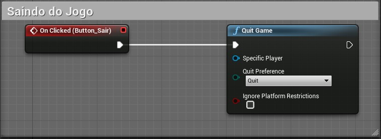
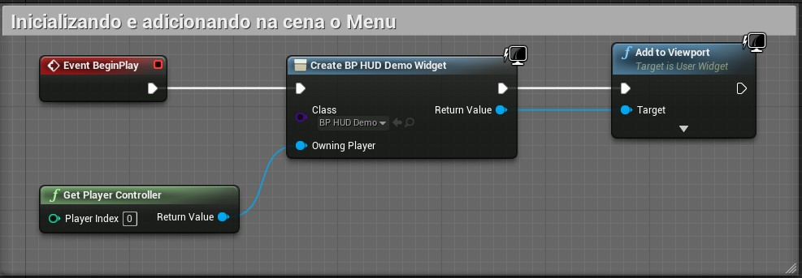
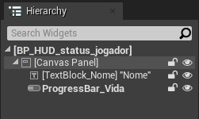
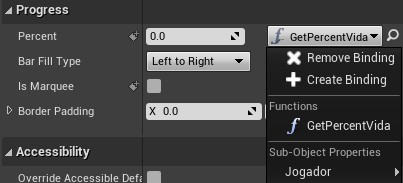
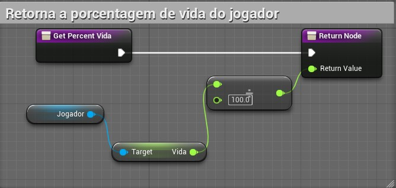
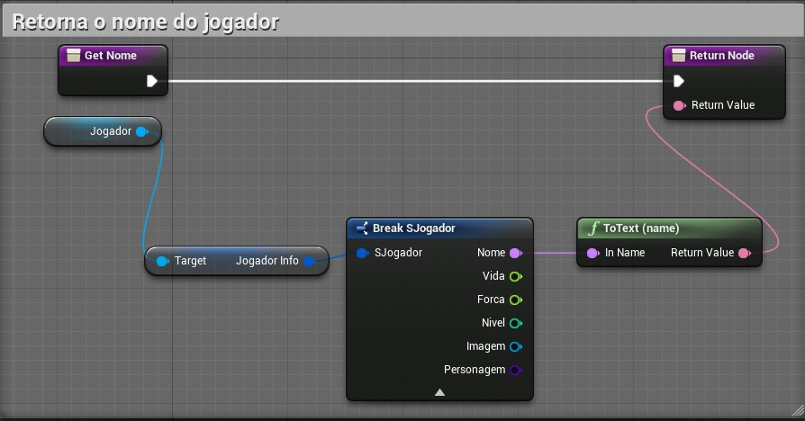
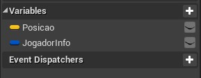

[CafeGeek](http://CafeGeek.eti.br)  / [Desenvolvimento de jogos utilizando Unreal Engine](http://cafeGeek.eti.br/unreal_engine/index.html)

# HUD - Lógica de programação.
Neste capitulo vamos apresentar a lógica de programação os objetos do HUD.

## Índice
1. [Lógica de programação do Widget - Graph](#1)
    1. [Event Construct para inicializar variáveis utilizadas no Widget](#1.1)
    1. [Button e eventos](#1.2)
    1. [Acionando o botão para abrir um Level](#1.3)    
    1. [Acionando o botão Sair para finalizar o jogo](#1.4)        
1. [Executando o menu](#2)
1. [Apresentando informações para o jogador](#3)
    1. [Barra de vida do jogador](#3.1)
    1. [O nome do jogador](#3.2)
1. [Organizando os objetos](#4)
    1. [Criando o objeto SaveGame para salvar dados do jogo](#4.1)    
    1. [Evento para apresentar o menu na tela](#4.2)    
    1. [Evento para abrir um Level](#4.3)    
    1. [Salvando dados](#4.4)    
    1. [Voltando ao jogo](#4.5)    
    1. [Evento para carregar dados](#4.6)        
    1. [Iniciando Game Instance no Widget](#4.7)                    
    1. [Efetuando as chamadas das funções](#4.8)
1. [Atividades](#5)
    1. [Apresentando mensagens para interagir com o personagem](#7.1)                      
    1. [Implementando o menu do jogo usando Game Instance](#7.2)                      

## 1.  Lógica de programação do Widget - Graph
A lógica de controle de ações dos botões e a inicialização está em `Graph`, onde encontramos alguns eventos já conhecidos como por exemplo `Event Construct` e `Tick`.    

### 1.1 Event Construct para inicializar variáveis utilizadas no Widget
Para que o objeto menu tenha acesso a propriedades da classe do jogador vamos inicialiazar a uma variável local utilizando `Event Construct`.
Ao iniciar o Widget definimos uma variável **Jogador** do tipo `BP_Hero` para que possamos ter acesso as propriedades nome e vida por exemplo.

*Figura: Widget Graph Event Construct*

### 1.2 Botões e eventos (Button and Events)
Os elementos do tipo `Button` tem eventos relacionados na sua estrutura, como por exemplo: `On Clicked`, `On Pressed` e outros.

### 1.3 Acionando o botão para abrir um Level
Vamos utilizar o evento `OnClick` para executar a função `Open Level` para carregar outro *level* do projeto. Deverá ser informado o nome do *Level* que queremos abrir.   

    

*Figura: Widget HUD Blueprint open Level*

### 1.4 Acionando o botão Sair para finalizar o jogo
Ao clicar no botão Sair vamos chamar a função `Quit Game` que finaliza do jogo.  
    

*Figura: Widget HUD Blueprint Quit Game*

## 2. Executando o menu
Neste passo vamos criar um *Level* vazio para executar o menu, quando o menu for chamado a tela inteira deve mudar.   
Caso o Widget seja o menu principal que deverá ser chamado no início do jogo é necessário adicionar o mesmo em [Level e inicialização](organizando_pastas_e_logo.html#2)

1. *Empty Level* Vamos criar um Level Vazio para funcionar como base do menu.    
        

    *Figura: Widget Empty Level*
1. Em `Open Level Blueprint` vamos adicionar a lógica para criar um objeto do tipo `BP_HUD_Demo` e adicionar na tela com a função `AddToViewPort`.   
  

    *Figura: Widget HUD Add ViewPort*

## 3. Apresentando informações para o Jogador
Para este passo vamos implementar os seguintes elementos para apresentar informações para o jogador, como por exemplo a vida do personagem.    

    

*Figura: Widget HUD Player Elements*

- `TextBlock` - Para apresentar o nome do jogador.
- `ProgressBar` - Para apresentar a vida do jogador.

### 3.1 Fazendo a ligação do elemento da interface com uma função
Devemos conectar os elementos da interface com funções por meio de uma propriedade `Bind`.   

      

*Figura: Widget HUD Progress Bar Bind*

### 3.2 Função do calculo de vida do jogador
Para calcular o valor da vida do jogador vamos implementar uma função, abaixo a lógica da função associada a elemento `ProgressBar`.    

    

*Figura: Widget HUD Progress Bar function*

### 3.3 Função para pegar o nome do jogador
Podemos utilizar [Variáveis estruturadas](structure_variaveis_estruturadas.html) para manipulação das propriedades do jogador.   
      

*Figura: Widget HUD name player function*

## 4. Organizando os objetos
Vamos organizar todos os objetos criados para controlar melhor a lógica de programação de cada elemento, considerando:  
- Separação da lógica de negócios e os visuais de sua IU
- Permite iteração rápida de layout e visuais
- Depuração eficaz da lógica de negócios
- Performance

### 4.1 Criando o objeto SaveGame para salvar dados do jogo
Para exemplificar algumas funções do menu como por exemplo salvar dados do jogo vamos realizar as seguintes operações.

1.  Implementar um objeto BP_SaveGameDemo do tipo `SaveGame`, para isso utilizamos o menu de contexto e escolhemos `Blueprint`.        
      

    *Figura: Class SaveGame*   
1. Adicionamos variáveis dentro do objeto para definir o que deve ser salvo, neste exemplo utilizaremos a variável `JogadorInfo` do tipo `S_jogador` que é uma
  [Variável Structure](structure_variaveis_estruturadas.html).     

      

    *Figura: SaveGame variáveis*

Nos próximos passos vamos criar o objeto *BP_GameInstanceJogo* do tipo [**GameInstance**](gameinstance_state_mode.html#5) e adicionar os eventos customizados (*Add custon event*) a seguir.

### 4.2 Evento para apresentar o menu na tela
Implementamos um evento customizado para adicionar lógica dos eventos.

    

*Figura: Widget HUD Blueprint Logic Add to ViewPort*

- `Show Mouse Cursor` - Esta variável é uma propriedade de `PlayerController`  e Configurando para *true* o ponteiro do mouse deve aparecer na tela.
- `Set Input Mode UI Only` - Esta função determina que o controle de entrada de dados será somente pelo `Widget`.

### 4.3 Evento para abrir um Level
Neste passo vamos adicionar um evento customizado ,`add custom event`, para carregar um *level* na cena.

      

*Figura: Logic Open Level*
- `Open Level` - Função para abrir um *Level* do jogo. É necessário informar o nome do *level* no parâmetro *Level Name*.
- `Set Input Mode Game Only` - Esta função determina que o controle de entrada de dados será somente pelo jogo.

### 4.4 Salvando dados
Para salvar informações vamos utilizar a função `Save Game to Slot`.

*Figura: Logic SaveGame slot*

- `Create Save Game Object` - Cria um objeto do tipo `BP_SaveGameDemo`, definido anteriormente.
- `Save Game to Slot` - Salva os dados e cria um `Slot Name` *Salvo1*.

### 4.5 Evento para carregar dados
Para carregar dados salvos utilizamos a função `Load Game from Slot` passando como parâmetro o nome do *slot*.

      

*Figura: Logic Load Game From Slot*
- `Does Save Game Exist` - Retorna verdadeiro se encontra um jogo salvo com o nome *Salvo1* informado em `Slot Name`.
- `Load Game from Slot` - Carrega as variáveis salvas em `Slot Name`, neste caso *Salvo1*.

### 4.6 Voltando ao jogo
Vamos agora remover o menu ou objeto `Widget` da cena utilizando a função `Remove from parent`.

    

*Figura: Remove From Parent*

- `Remove from Parent` - Remove o widget de seu `Widget` pai. Se este `Widget` foi adicionado à tela do jogador ou à janela de visualização, ele também será removido desses recipientes.

### 4.7 Iniciando Game Instance no Widget
No objeto BP_HUD_Demo vamos substituir ou adicionar a lógica dos botões, mas antes devemos inicializar a `Game Instance`.   

*Figura: Widget HUD gameinstance*

### 4.8 Efetuando as chamadas das funções
No evento click dos botões vamos adicionar os eventos construídos dentro da *Game Instance* isolando a regra de negócios (dados e lógica e manipulação).   

      

*Figura: Widget HUD with Game Instance on click*
> Repetimos esse processo para associar todos os eventos aos botões.

## 7 ATIVIDADES

### 7.1 Apresentando mensagens para interagir com o personagem
#### Regras
1. Implemente um objeto *Widget* com um texto colorido e formatado.
1. O *Widget* é acionado pressionando a tecla F quando o personagem ficar próximo.

#### Desafio      
1. Implemente um gameplay em primeira pessoa dentro de uma casa.

### 7.2 Implementando o menu do jogo usando Game Instance
#### Regras
1. Implemente o menu principal do jogo com as opções : Play e Quit.
1. Implemente o menu de Resumo do jogo com as opções : Resume, Load, Save, Home e Quit. O menu é acionado com a tecla M durante a *gameplay*. Implemente também toda a lógica das ações dos botões Load, Save e Quit.
1. Implemente uma Game Instance e adicione os seguintes objetos:
  - **Open Menu Principal** para abrir o menu principal;
  - **Open Menu Resume** para abrir o menu de pausa e resumo do jogo;

#### Desafio
1. Apresente vários elementos visuais no menu, como por exemplo: Botões e imagens de fundo personalizados.

***
## Referências
- [1.1 - HUD Example](https://docs.unrealengine.com/en-US/Resources/ContentExamples/Blueprints_HUD/1_1/index.html)
- [User Interfaces & HUDs](https://docs.unrealengine.com/en-US/InteractiveExperiences/Framework/UIAndHUD/index.html)
-[Anchors](https://docs.unrealengine.com/en-US/InteractiveExperiences/UMG/UserGuide/Anchors/index.html)
- [Quick Start](https://docs.unrealengine.com/en-US/InteractiveExperiences/UMG/QuickStart/index.html)
