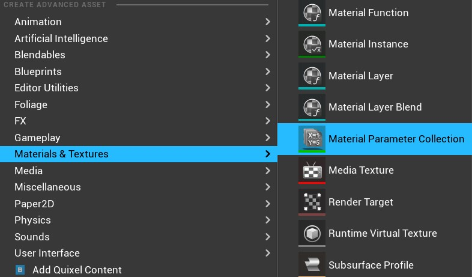
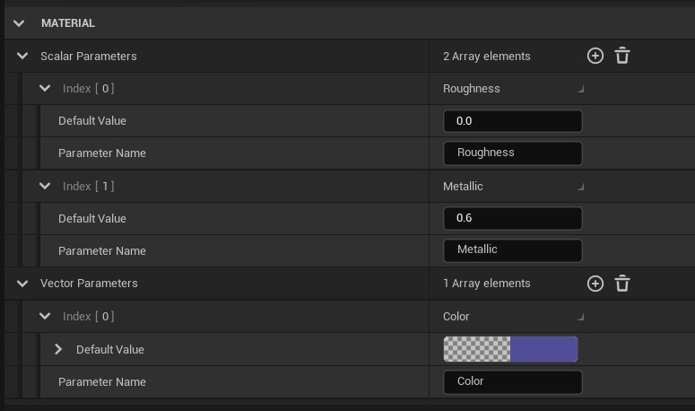
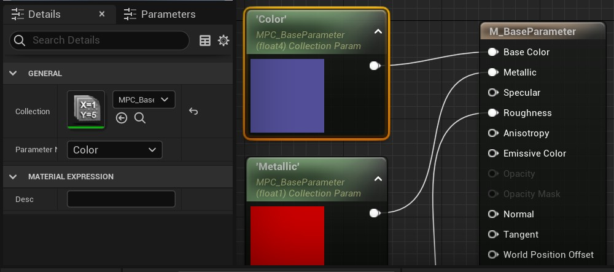
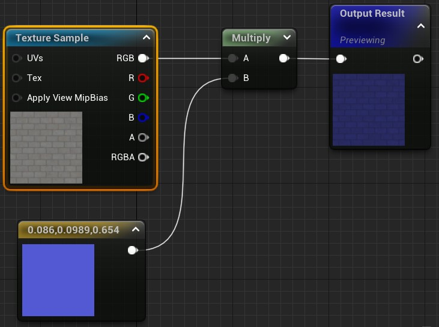
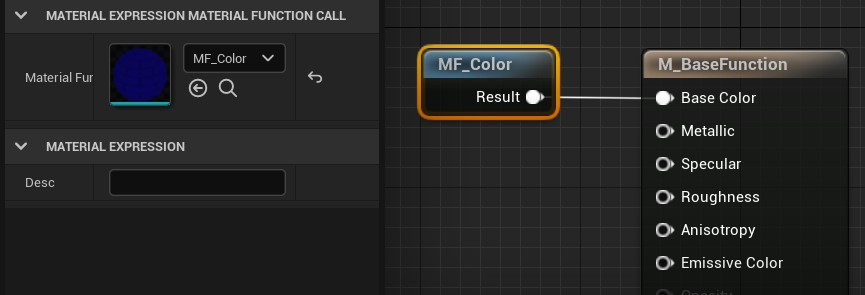
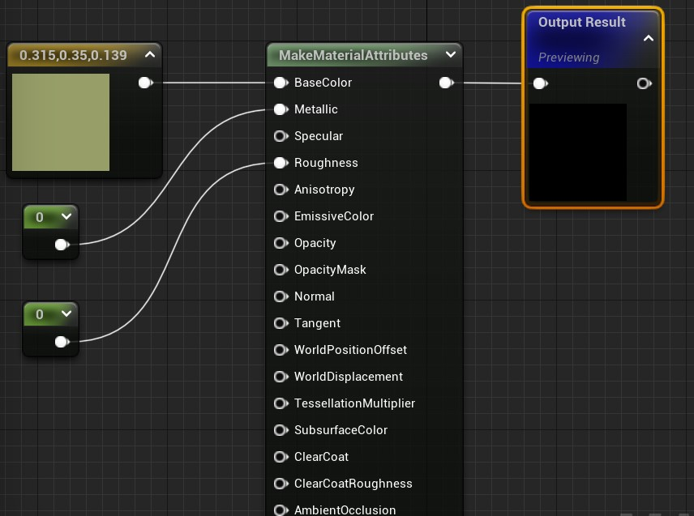
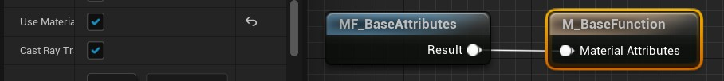
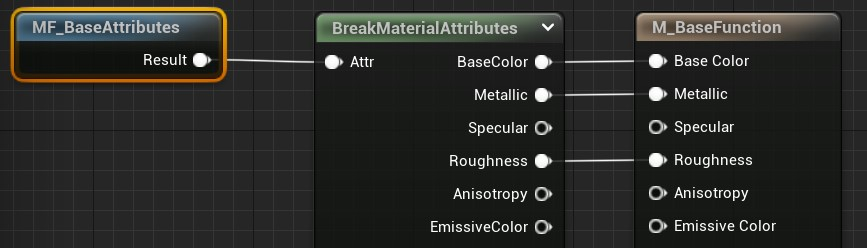

[CafeGeek](http://CafeGeek.eti.br)  / [Desenvolvimento de jogos utilizando Unreal Engine](http://cafeGeek.eti.br/unreal_engine/index.html)

# Materiais e Blueprint
Neste capítulo iremos manipular os materiais com lógica de script Blueprint e construir funções para utilizar dentro dos materiais.

## Índice
1. [Blueprint](#1)
1. [Parameter Global](#2)
1. [Material Function](#3)

## 1. Blueprint
Podemos manipular os objetos do tipo material com scripts Blueprint.

1. Utilizaremos o `Level Blueprint` para exemplificar.
1. Adicione uma referência do ator selecionado no `View Port` no `Open Level Blueprint` com a opção `Create a Reference to `.
1. Lógica para criar o material e a textura: `Create material instance > Set Texture Parameter Value`.
     

    *Figura: Blueprint create material instance set*

  >`Create Dynamic Material Instance`
  >
  >Cria um Material Instance dinâmico que pode ser modificado durante a *gameplay*.
  >
  >`Set Texture Parameter Value`
  >
  >Atualiza o valor do parâmetro informado em `Parameter Name`, é do tipo textura.
  >
  >`Set Scalar Parameter Value`
  >
  >Atualiza o valor escalar do parâmetro informado em `Parameter Name` com o valor `value`.
  >
  >`Set Vector Parameter Value`
  >
  >Atualiza o vetor do parâmetro informado em `Parameter Name` com o valor `value`.

1. No Level Blueprint implemente a lógica para chamar o Evento **MudaCorEvento**.

     

    *Figura: Material Open Level blueprint call event*

## 2. Parameter Global
Podemos definir parâmetros globais para que os materiais possam referenciar parâmetros escalares e vetoriais.
> É uma ferramenta poderosa que os artistas podem usar para obter dados globais em muitos materiais de uma só vez. Ele também pode ser usado para gerar efeitos por nível, como quantidade de neve, quantidade de destruição, umidade, etc., que, de outra forma, exigiria a configuração de valores de parâmetros individuais em muitas instâncias de materiais diferentes em seu nível.

1. Criando parâmetros globais utilizamos a opção do menu de contexto `Materials & Textures > Material Parameter Gobal`.

  

    *Figura: Parameter Collections - Unreal Engine*

1. Podemos adicionar e editar valores do tipo `Scalar` e `Vector` no objeto `Parameter Collection`.

 

    *Figura: Editor de Parameter Collection*

1. No Editor de Materiais usamos a opção `Material Parameter Collection` e selecionamos o objeto criado com os parâmetros em `Collection`.

 

    *Figura: Collection Parameter*

## 3. Material Function
**Mateial Functions** ou Funções de material são pequenos fragmentos de códigos gráficos de material que podem ser salvos em pacotes e reutilizados em vários materiais, em outras palavras são funções de programação. Seu objetivo é agilizar o processo de criação de material, dando acesso instantâneo a redes comumente usadas de nós materiais.    
São compostas basicamente por entradas de parâmetros e saída de dados.

1. Utilizamos o menu de Context `Material & Textures > Material Function`.
1. Abaixo o editor da lógica da função criada utilziando um nó  `Texture Sample` e um `Vector 3`.

  

    *Figura: Material Function*

    - Perceba que a função apresenta um nó de resultado.
    - Podemos adicionar parâmetros para a função.

1. Chamamos a função dentro do editor de materiais usando a função `MaterialFunctionCall`.

  

  *Figura: Material Function Call*

1. Podemos juntar vários atributos utilizando `MakeMaterialAttribute` possibilitando construir camadas ou `Layers` e utilizar no retorno da função.

  

    *Figura: MakeMaterialAttribute*
1. Ao usar a nó é necessário configurar o nó resultado do material principal com `Use Material Attribute` para `True`.

  

    *Figura: Nó resultado com Use Material Attribute true*
1. `BreakMaterialAttribute` é o inverso de `MakeMaterialAttribute` possibilitando a separação dos atributos recebidos por uma função.

  

    *Figura: BreakMaterialAttribute*

## 16 ATIVIDADES

### 16.1 -
#### Regras
1. -
1. -

#### Desafio      
1. -

***

## Referências
- [Material Parameter Collections](https://www.unrealengine.com/en-US/blog/material-parameter-collections)
- [Creating Material Functions](https://docs.unrealengine.com/4.26/en-US/RenderingAndGraphics/Materials/HowTo/Making_Functions/)
