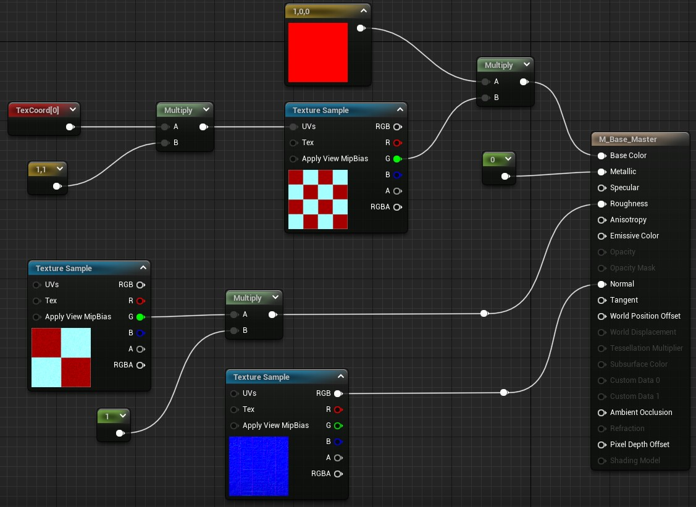
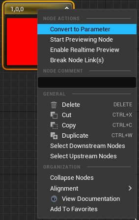
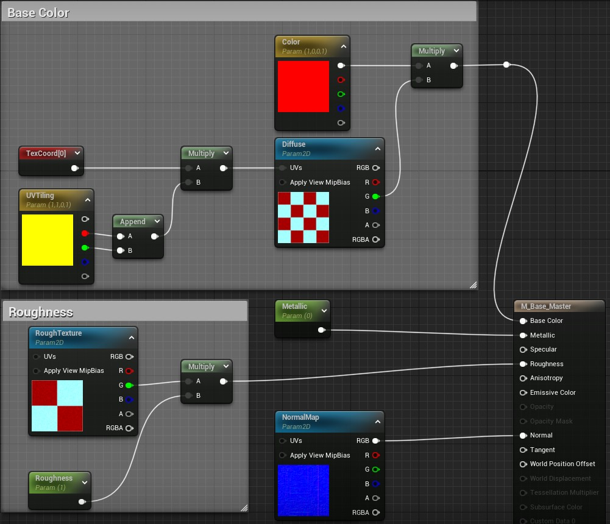
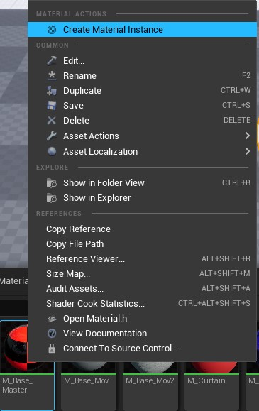
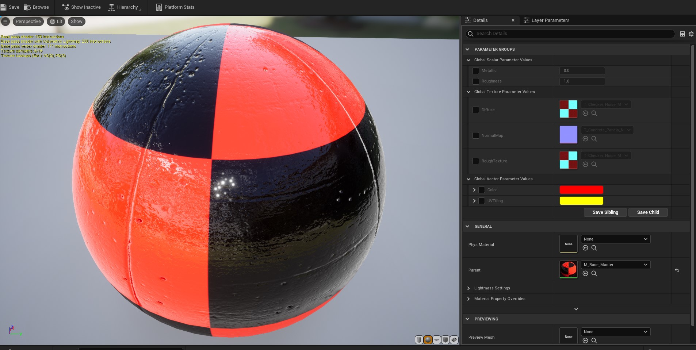
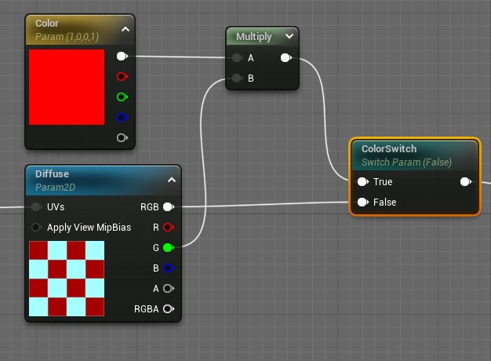
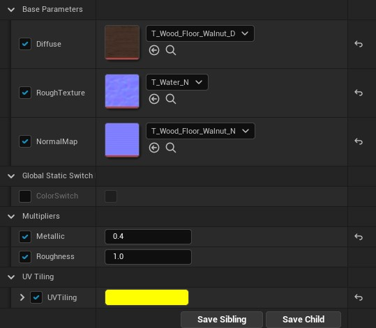
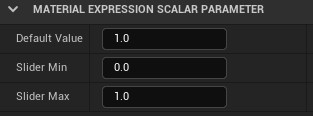

[CafeGeek](http://CafeGeek.eti.br)  / [Desenvolvimento de jogos utilizando Unreal Engine](http://cafeGeek.eti.br/unreal_engine/index.html)

# Material Instance
Neste capitulo vamos apresentar o objeto *Material Instance* que flexibiliza a implementação de materiais no Unreal Engine.

## Índice
1. [O que é Material Instance?](#1)
    1. [Convertendo nós em parâmetros](#1.1)
    1. [Criando Material Instance](#1.2)
1. [Editor de material Instance](#2)
1. [Switch Parameter](#3)
1. [Organizando parâmetros e definindo valor máximo e mínimo](#4)
1. [Atividades](#5)
    1. [Uma base para vários materiais ](#5.1)

## 1. O que é Material Instance?
A *Mateial Instance* ou Instanciação de Material é uma maneira de criar um Material pai, que pode então ser usado como base para fazer uma ampla variedade de Materiais filhos de aparência diferente. Para obter essa flexibilidade, o *Material Instancing* usa um conceito chamado herança: as propriedades do pai são fornecidas aos seus filhos. Aqui está um exemplo de herança de material em ação.

### 1.1 Convertendo nós em parâmetros
Convertemos os nós em parâmetros para que possam ser manipulados posteriormente pelo *Material Instance*.    

Para que possamos exemplificar segue abaixo os passos.

1. Vamos criar o material base com o nome *M_Base_Master*.        
       
  *Figura: Material Base Master*
1. Agora vamos converter os nós em parâmetros.           
       
  *Figura: Material Convert to Parameter*       
       
  *Figura: Resultado do material com parâmetros*
1. Definimos os seguintes atributos nos parâmetros:
  - **Parameter name** - Escolha um nome para o parâmetro que representa o input do material.
  - **Group** - Usado para agrupar os parâmetros por um determinado valor ou tema.        
  Sugestão de grupos:
      - Texture Parameter Values: Diffuse,NormalMap, Rough Texture
      - Scalar Parameter Values : Metallic, Roughness
      - Vector Parameter Values : Color (R,G,B,A), UVTiling(R,G,B,A)

### 1.2 Criando Material Instance
Selecione o material *M_Base_Master* ou outro material e com o botão direito acione o menu de contexto e escolha **Create Material Instance**.     

   
  *Figura: Create material instance*

## 2. Editor de material Instance
  

*Figura: Material instance editor*

- **Details** - Propriedades e acesso aos parâmetros.
- **Parameter Groups** - Grupo definido nos parâmetros dentro do material pai.      
  Os parâmetros estão agrupados por tipo de valor Texture, Scalar e Vector.
- **Parent** - Material pai.

## 3. Switch Parameter
*StaticSwitchParameter* recebe duas entradas e gera a primeira, se o valor do parâmetro for verdadeiro, e a segunda, caso contrário.

No exemplo abaixo se o parâmetro for verdadeiro a multiplicação com a cor pode ser realizada caso contrário o textura não é multiplicada.

*Figura: Swith Parameter*

## 4. Organizando parâmetros e definindo valor máximo e mínimo
Podemos organizar os parâmetros agrupando com a opção *Group* do nó e com *Sort Priority* ordenamos a visualização.

### 4.1 Group
No exemplo abaixo criamos os grupos: Base Parameters, Multipliers e UV Tiling.

     

*Figura: Parameter Group*

### 4.1 Valor Mínimo e Máximo
Podemos limitar os valores mínimo e máximo que podem ser passados como parâmetro utilizando a opção *Slider*.

*Figura: Slider Min e Slider Max*

## 5. ATIVIDADES

### 5.1 Uma base para vários materiais
#### Regras
1. Implemente um material base e 3 instancias de materiais (Material Instance).
1. Defina texturas e cores diferentes para cada instância.

#### Desafio      
1. Implemente um parâmetro para aumentar ou diminuir a mistura de várias texturas a fim de simular por exemplo pisos com pouca ou muita grama.

***

## Referências
- [Creating and Using Material Instances](https://docs.unrealengine.com/en-US/RenderingAndGraphics/Materials/HowTo/Instancing/index.html)
- [Material Parameter Collections](https://www.unrealengine.com/en-US/blog/material-parameter-collections)
