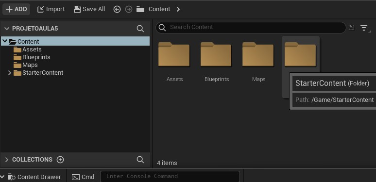
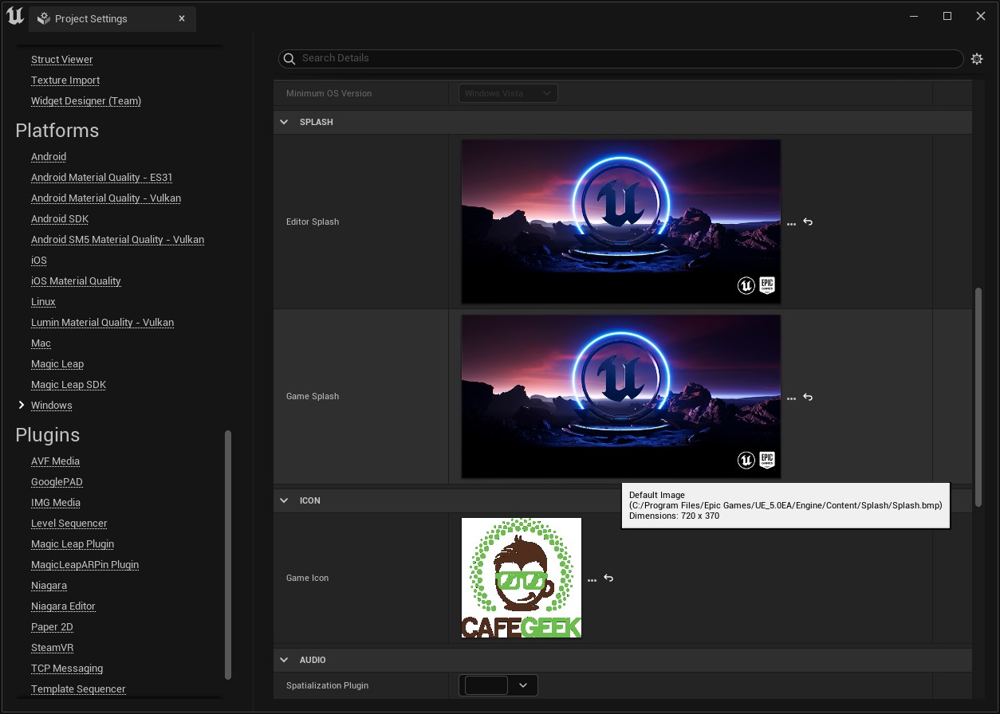

[CafeGeek](http://CafeGeek.eti.br)  / [Desenvolvimento de jogos utilizando Unreal Engine](http://cafeGeek.eti.br/unreal_engine/index.html)

# Organizando pastas e logo do projeto  
Neste capitulo vamos organizar o projeto *ProjetoAula* e adicionar um logo para o projeto.

## Índice
1. [Como criar pastas de trabalho?](#1)
1. [Adicionando um Level na inicialização do projeto](#2)
1. [Pastas de trabalho e nomenclatura](#3)
1. [Configurando as imagens do projeto](#4)
1. [Atividades](#5)
    1. [Configure as pastas de seu projeto](#5.1)

<a name="1"></a>
## 1. Como criar pastas de trabalho?
Em `Content Drawer` utilizando botão direito do mouse clique em `New Folder` e crie as seguintes pastas:   

			

*Figura: Content Drawer*

<a name="2"></a>
## 2. Adicionando um *Level* na inicialização do projeto
Para que um *level* ou mapa seja carregado ao iniciar o projeto siga os seguintes passos:  

1. Salve o *level* atual na pasta Maps **File > Save Current Level As** com o nome `LevelTest`.
1. Para configurar a inicialização do projeto utilizando o **LevelTest** utilize o menu **Edit > Project Settings** e depois `Maps & Modes`.   
				

	*Figura: Project - Maps & Modes*

- `Edit Startup Level` Seleciona o *Level* que deverá ser carregado no início do jogo, neste caso é `LevelTest`.
- `Game default Map` : Seleciona o *Level* que é mais usado com frequência.

## 3. Pastas de nomenclatura
Para um maior gerenciamento podem ser definidas pastas com nomenclaturas adequadas ao projeto, abaixo vamos relacionar algumas sugestões.

1. Sugestão 1
```bash
|-- Content
		|-- Blueprints
		|		|-- Core
		|		|-- Characters
		|		|-- Elements
		|-- Assets
		|		|-- Images
		|		|-- StructureMesh
		|		|-- Materials
		|-- Maps
		|		|-- Level1
		|-- UI
		|-- Animations
```

1. Sugestão 2
```bash
|-- Content
		|-- ProjetoAula
			|-- Art
			|	|-- Industrial
			|	|	|-- Ambient
			|	|	|-- Machinery
			|	|	|-- Pipes
			|	|-- Nature
			|	|	|-- Ambient
			|	|	|	|-- Foliage
			|	|	|	|-- Rocks
			|	|	|	|-- Trees
			|	|-- Office
			|-- Characters
			|  |-- Bob
			|  |-- Common
			|  |  |-- Animations
			|  |  |-- Audio
			|  |-- Jack
			|  |-- Steve
			|  |-- Zoe						
			|-- Core
			|	|-- Characters
			|	|-- Engine
			|	|-- GameModes
			|	|-- Interactables
			|	|-- Pickups
			|	|-- Weapons
			|-- Maps
			|	|-- Level1
			|	|-- Level2
```

Separar a pasta do projeto de outras pastas pode facilitar:
1. Versionamento - pastas com diferentes versões.
1. Isolar pacotes de testes e *Marketplace*.
1. DLC ou subprojetos - podemos administrar separadamente projetos relacionados.
1. Biblioteca de Materiais - podemos migrar pasta de materiais e compartilhar materiais sem muitos problemas definindo um pasta de nível superior.

Exemplo:
```bash
|-- Content
	|-- ProjetoAula
	|-- ProjetoAulaTestes
	|-- ProjetoAulaArquitetura
	|-- StarterContent
	|-- FPS_Assault_Pack
	|-- MaterialLibrary
	|	|-- M_Master
```		

<a name="4"></a>
## 4. Configurando as imagens  do projeto
Para alterar as imagens de apresentação do projeto, seja ícone ou tela de apresentação (*splash*) utilizamos o menu `Project Settings` opção **Plataforms > Windows** e altere a imagens.

		

*Figura: Project icon*

> Certifique-se de produzir o ícone como um arquivo .ico (que não é PNG, mas pode ser convertido usando ferramentas online, por exemplo) e 256x256.

<a name="5"></a>
## 5. Atividades
<a name="5.1"></a>
### 5.1 - Configure as pastas de seu projeto.
#### Regras
1. Configure as pastas de seu projeto escolhendo uma das sugestões e justifique a sua escolha.

#### Desafio      
1. Adicione o pacote *StarterContent*.

***
## Referências
- [Directory Structure](https://docs.unrealengine.com/en-US/Engine/Basics/DirectoryStructure/index.html)  
- [Editor Preferences](https://docs.unrealengine.com/en-US/Engine/UI/index.html)  
- [Style Guide](https://github.com/Allar/ue4-style-guide/blob/master/README.md)  
- [Controles de navegação](https://docs.unrealengine.com/en-US/Engine/UI/LevelEditor/Viewports/ViewportControls/index.html)
- [How to change the icon of your game?](https://answers.unrealengine.com/questions/397901/how-to-change-the-icon-of-your-game.html)
