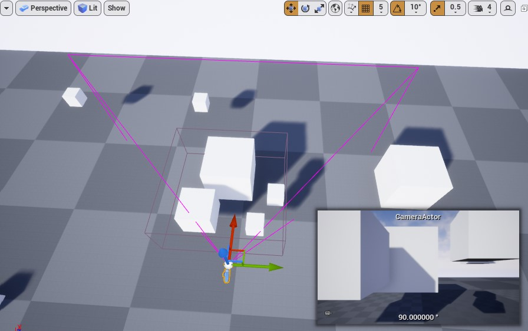
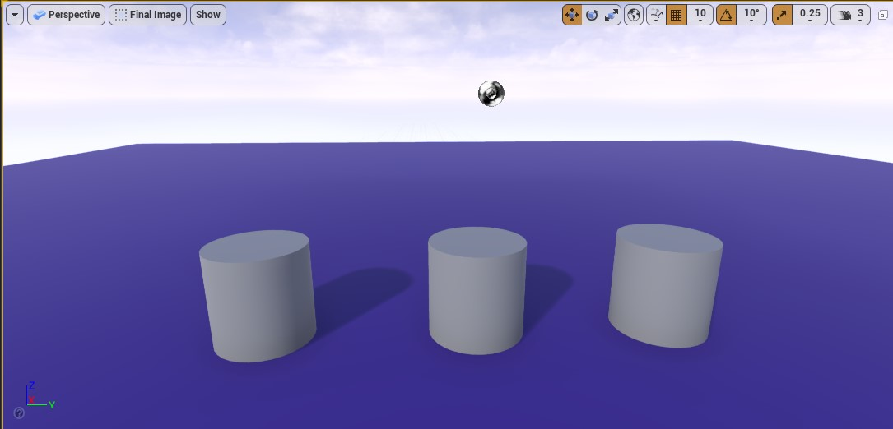

[CafeGeek](http://cafegeek.eti.br)  / [Computação Gráfica com Unreal Engine e Autodesk Maya](http:cafegeek.eti.br/ue4_computacao_grafica/index.html)

# Processamento de imagens
Neste capitulo vamos analisar como é realizado o processamento de imagens pela CPU e GPU pelo Unreal Engine.

## Índice
1. [O processo de renderização no Unreal Engine](#1)
1. [Processamento do Frame 0 - Time 0 - CPU](#2)
1. [Processamento do Frame 1 - Time 33ms - Preparar a Thread](#3)
    1. [Distance Culling ou corte de distância](#3.1)
        1. [Atores na cena](#3.1.1)
        1. [Cull Distance Volume](#3.1.2)
    1. [Frustim Culling](#3.2)
    1. [Precomputed Visibility](#3.3)
    1. [Occlusion Culling](#3.4)         
    1. [3.5 Occlusion Culling é um processo pesado a partir de 10.000 objetos na cena](#3.5)   
1. [ Processamento do Frame 2 - Time 66ms - GPU](#4)  
    1. [Drawcalls](#4.1)
    1. [O comando Stat RHI](#4.2)
    1. [O comando Stat unit e Stat FPS](#4.3)
    1. [Considerações](#4.4)

<a name="1"></a>
## 1. O processo de renderização no Unreal Engine
Para exemplificar o processo de renderização vamos apresentar os seguintes passos conforme as *thread* são executas:

|  Threads|  | |  ||
|:-|-|-|-||
| **CPU** | <span style="color:blue">Frame A</span> |  <span style="color:red">Frame B</span>  | <span style="color:green">Frame C </span>| <span style="color:brown">Frame D</span>|
| **DRAW CPU** |  | <span style="color:blue">Frame A</span> |  <span style="color:red">Frame B</span>  | <span style="color:green">Frame C </span>|
| **GPU** |  |  | <span style="color:blue">Frame A</span> | <span style="color:red"> Frame B</span>|
| **Time** | **0** | **33** | **66** | |

Acompanhe a ordem de execução de cada Frame.
1. O <span style="color:blue">Frame A</span> é instanciado na CPU.
1. Logo em seguida o <span style="color:blue">Frame A</span> é passado para um momento onde a CPU e a GPU compartilham alguns elementos de construção. Enquanto isso ocorre a CPU carrega o <span style="color:red">Frame B</span>.
1. Após passar pelo passo de compartilhamento o <span style="color:blue">Frame A</span> então é colocado inteiramente na GPU.
1. A operação se repete para todos os Frames.
1. Perceba que a cada passo que se completa são liberados recursos de CPU e GPU para serem usados com outros frames.

A seguir vamos abordar cada passo.

<a name="2"></a>
## 2. Processamento do Frame 0 - Time 0 - CPU
Neste passo é realizado o calculo é realizado na CPU de toda a lógica e as transformações:
> Qualquer coisa relativa a mudança e posição dos objetos.

1. **Animações** - Calcula quando as Animações iniciam e terminam.
1. **Posição de modelos e objetos** - Necessário para calcular a posição e sua influência.
1. **Física** - Calculo para determinar onde os objetos vão.
1. **Inteligência Artificial** - Por exemplo, em um veículo controlado por IA é necessário determinar, como ele se movimenta,  como o estado e onde o carro estará realmente.
1. **Cria e destrói, esconde e apresenta** - Necessário para determinar onde os objetos aparecem no mundo.

**Resultado:** o Unreal Engine conhece todas as transformações e todos os objetos.

<a name="3"></a>
## 3. Processamento do Frame 1 - Time 33ms - Preparar a Thread
Antes de podermos usar as transformações para renderizar a imagem, precisamos saber o que incluir na renderização, isso é executado principalmente na CPU, mas algumas partes são manipuladas pela GPU, para tal finalidade é realizada a tarefa de :        
- Processo de oclusão - Construção de lista de todos os objetos e modelos visíveis, sendo que o processamento é realizado por objeto e não por polígono.
- Preparação da Thread - Uma Thread da GPU é alocada.

A seguir as 4 Etapas em ordem de execução desse processo.

1. **Distance Culling** - Remove quaisquer objetos além de X da câmera.
1. **Frustim Culling** - Verifica o que está na frente da câmera.
1. **Precomputed Visibility** - (Visibilidade pré-computada) Divide a cena em uma grade, cada célula da grade lembra o que está visível naquele local
1. **Occlusion Culling** - Verifica com precisão o estado de visibilidade em cada modelo.   

<a name="3.1"></a>
### 3.1 Distance Culling ou corte de distância
Este método de seleção é ideal para grandes níveis externos, onde você teria edifícios ou estruturas de algum tipo com interiores detalhados, onde você gostaria de selecionar aqueles objetos que são pequenos demais para considerar importantes a distâncias distantes.

<a name="3.1.1"></a>
#### 3.1.1 Atores na cena
Atores selecionados em um Nível ou Blueprint contêm configurações de distância acessadas por meio de seu painel Detalhes. Eles permitem que distâncias por instância sejam definidas ou se o Ator é selecionado usando um **Cull Distance Volume**.   

      
  *Figura: A seleção de distância do objeto.*
- **Min Draw Distance** - Define a distância mínima de desenho na qual o objeto será renderizado na cena. Isso é medido em unidades de espaço mundial (centímetros) do centro da esfera delimitadora do objeto até a posição da câmera.
- **Desired Max Draw Distance** - Define a distância máxima de projeção para o *Level Designer*. A distância máxima "real" é a distância mínima de tração (desconsiderando 0).

**Exemplo**   
O objeto vai ser rendirizado quando a câmera se aproximar a uma distância **MENOR** que 1000 centímetros.
```c++
Min Draw Distance = 0
Desired Max Draw Distance = 1000
```

<a name="3.1.2"></a>
#### 3.1.2 Cull Distance Volume

**Cull Distance Volumes** permitem que você especifique uma variedade de tamanhos e distâncias de seleção para que os Atores não devam mais ser desenhados.

1. Adicione o volume **Cull Distance Volume** localizado em **Place Actors/Volumes**.
1. Altere as dimensões do objeto para definir a área de corte.

     
  *Figura: CullDistanceVolume Size*
1. Configure a matriz de distância e tamanho,(**Cull Distances**) para o corte.

      
  *Figura: CullDistanceVolume Cull Distance Array*
- **Cull Distances** - Uma lista de conjuntos de pares de Tamanho e Distância de Seleção usada para definir a distância de desenho de objetos com base em seu tamanho dentro de um **Cull Distance Volumes**. O código calculará o diâmetro da esfera da caixa delimitadora de um objeto e procurará o melhor ajuste nesta matriz para determinar qual distância de separação deve ser atribuída a um objeto.
    - **Size** - O tamanho a ser associado à distância de eliminação.
    - **Cull Distance** - A distância a ser associada ao tamanho dos limites de um ator.

**Exemplo**   
```c++
// 0 - Os objetos de tamanho 300 centímetros não sofreram corte.
  Size = 300
  Cull Distance = 0
// 1 - Objetos de tamanho 200 centímetros serão cortados a partir de 1200 centímetros de distância.
  Size = 200
  Cull Distance = 1200
// 2 - Objetos de tamanho 100 centímetros serão cortados a partir de 1500 centímetros de distância.
  Size = 100
  Cull Distance = 1500  
```

<a name="3.2"></a>  
### 3.2 Frustum Culling ou corte de câmera
A seleção de **View Frustum** usa a área visível da tela do campo de visão (FOV) da câmera para selecionar objetos fora deste espaço.
O tronco da visão é uma forma piramidal que inclui um plano de recorte próximo e distante que define o mais próximo e o mais distante que qualquer objeto deve ser visível dentro deste espaço. Todos os outros objetos são removidos para economizar tempo de processamento.

    
  *Figura: View Frustum*

1. O plano de recorte próximo é o ponto mais próximo da câmera em que os objetos ficarão visíveis.
1. A **Camera Frustum** é a representação em formato piramidal da área de visualização visível entre os planos de clipe próximo e distante.
1. O plano de recorte distante é o ponto mais distante da câmera em que os objetos serão visíveis.

Os objetos fora do campo de visão da câmera (o tronco de visão) não são visíveis e podem ser selecionados (objetos delineados em vermelho).   

  *Figura: View Frustum Culled*

Objetos selecionados fora do tronco de visão da câmera não são mais renderizados, deixando apenas um punhado de objetos dentro desta visão que são obstruídos por outro objeto que precisam ser verificados para visibilidade. Portanto, durante essa passagem, uma consulta será enviada à GPU para testar o estado de visibilidade de cada um desses objetos. Aqueles que são ocluídos por outro são retirados da vista (objetos delineados em azul).   

    
  *Figura: Occlued Objects Remover*

Todos os objetos que estão fora do tronco da vista ou que estão ocluídos são agora eliminados da vista. A vista final da cena agora corresponde aos objetos que sabemos serem visíveis na cena a partir da posição da câmera.
    
  *Figura: View Occlued Scene View*

Configurando o Unreal Engine para visualizar o corte de câmera.
- Show->Advanced->Camera frustum      

       
  *Figura: Camera Frustum*

<a name="3.3"></a>    
### 3.3 Precomputed Visibility - Visibilidade pré-computada
Armazenam o estado de visibilidade de atores não móveis em células colocadas acima de superfícies de projeção de sombras. Este método de seleção gera dados de visibilidade *offline* (durante uma construção de iluminação) e funciona melhor para níveis de tamanho pequeno a médio.

A **Precomputed Visibility** é ideal para hardware inferior e dispositivos móveis. Para tais hardwares e dispositivos, ao considerar os custos de desempenho, você obterá o máximo negociando custos de Thread de renderização que são mais caros por aqueles com memória de tempo de execução, onde há mais flexibilidade em relação ao desempenho.

> Divide a cena em um grid, onde cada célula do grid registra o que é visível naquele local. O tamanho das células é configurado .ini do projeto.

1. Configurar **World Settings** o atributo **Precomputed Visibility Volume** para verdadeiro.      
        
  *Figura: World Settings->Precompute Visibility*

1. Adicione na cena o volume **Precomputed Visibility Volume** que está em **Place Actors->Volumes**.
1. Defina o tamanho do Volume para abranger a área analisada.
1. Para visualizar o Grid de células na cena.Show -> Visualize -> Precomputed Visibility Cells.     
     
  *Figura: Precomputed Visibility Cells, em azul as células*
  > Se você já construiu a iluminação (**Bluid->Lighting**), pode usar o menu suspenso Construir na barra de ferramentas principal(**Show**) e selecionar **Precompute Static Visibility** para gerar células de visibilidade sem reconstruir a iluminação todas as vezes.

1. A câmera ao entrar na célula pergunta:    
  "O que pode ser ocluído?"   
  "O que pode ser renderizando e o que eu não devo renderizar?"     
  "Neste local, lembramos que esses objetos eram visíveis e estes outros não eram"

<a name="3.4"></a>
### 3.4 Occlusion Culling
O sistema de oclusão dinâmica em UE4 vem com vários métodos de abate para escolher. Cada um desses métodos rastreia os estados de visibilidade dos Atores em um nível dentro do tronco de visão da câmera (ou campo de visão) que são obstruídos por outro Ator. As consultas são emitidas para a GPU ou CPU para verificar o estado de visibilidade de cada ator. Uma heurística é usada para reduzir o número de verificações de visibilidade necessárias, por sua vez, aumentando a eficácia geral de seleção e o desempenho.
1. A seleção de oclusão verifica com precisão o estado de visibilidade em cada modelo.

1. Use o comando do console **freezerendering** que força a renderização para congelar ou retomar. Permite a visualização da cena conforme foi renderizada a partir do ponto em que o comando foi inserido.
```bash
    freezerendering
```
1. Comando do console **Stat initviews** exibe informações sobre quanto tempo levou a seleção de visibilidade e quão eficaz foi. A contagem de seções visíveis é a estatística mais importante com relação ao desempenho do thread de renderização e é dominada por **Visible Static Mesh Elements** em **stat initviews**.
```bash
    Stat initviews
```
**Exemplo**
1. Marque a posição da camera com o comando **Ctrl+1**.     
  
  *Figura: Freezerendering before*
1. Com comando **Stat initviews** apresente as estatistas.    
  
  *Figura: Stat initviews*
1. Alterne para a visualização e controle de câmera.    
     
  *Figura: Stat initviews*
1. Perceba que a média de objetos cortados na cena aumentou (**Frustum Culled Primitives**) e os objetos visíveis diminuiu (**Visible static mesh elements**).    
  
  *Figura: Stat initviews complete scene camera*
1. Com o comando **freezerendering** congele a renderização.
1. Ejete a câmera para poder navegar pela cena e aperte a tecla **1**, que foi utilizada para marcar a posição da câmera antes.   
       
  *Figura: Stat initviews after*  
1. Como resultado temos dois objetos sendo renderizados, pois se um pixel de um objeto estiver presente na cena, o caso do objeto mais longe da câmera, todo o objeto é renderizado.
> Se os objetos grandes fossem divididos em vários pedaços isso poderia diminuir o processo de renderização pois não teríamos que renderizar objetos gigantes que não aparecem totalmente na cena, mas sobrecarregaria a verificação de cada objeto visível na cena, então devemos balancear entre os dois métodos.

<a name="3.5"></a>
### 3.5 Occlusion Culling é um processo pesado a partir de 10.000 objetos na cena.
Abaixo um exemplo em uma cena com 10.000 objetos
1. Distance Culling remove 3.000 restando 7.000.
1. Frustum Culling remove e renderiza 4.000.
1. Precomputed Visibility remove 1.000.
1. Occlusion Culling remove 1.000.  

A necessidade do sistema executar os passos acima e efetuar vários cálculos para cada um pode tornar o processo pesado.

**Performance**
- Configure distance Culling.
- Mais de 10-15k objetos pode ter impacto.
- Maior parte na CPU mas tem algum impacto na GPU.
- Grandes ambientes não ocluem bem,
- A mesma coisa para as partículas.
- Modelos grandes raramente irão ocluir e, assim, aumentar GPU.
- Mas combinar modelos com modelos grandes irá diminuir o custo da CPU.

**Resultado**
- (Cubo) Modelos A  Visível.
- (Cubo) Modelos B Visível.
- (Esfera) Modelos C Não Visível.
- (Cilindro) Modelos D Visível.
- (Cubo) Modelos E Não Visível.

A,B,D são processados na GPU.

<a name="4"></a>
## 4. Processamento do Frame 2 - Time 66ms - GPU
A GPU agora tem uma lista de modelos e transformações, mas se apenas renderizássemos esta informação iria causar uma grande quantidade de renderização de pixels redundantes, portanto, precisamos descobrir quais modelos serão exibidos com antecedência.


*Figura. 3 Objetos na cena.*

- Considerando a renderização de cada pixel na cena na imagem acima não poderia renderizar os pixels que estão detrás dos cilindros e os que estão ocultos por outros objetos.

- Menu Project Settings->Rendering->Early Z-Pass

<a name="4.1"></a>
### 4.1 Drawcalls
A GPU agora começa a renderizar, sendo feito objeto por objeto (DrawCall).      
Um grupo de poligonos compartilha as mesmas propriedades em um Drawcall, abaixo um exemplo de como é feita a renderização.


*Figura: A imagem acima renderiza 5 vezes*
1. Chão.
1. Objetos 1, 2 e 3.
1. Céu.


*Figura: A imagem acima renderiza 6 vezes*
1. Chão.
1. Objetos 1, 2 e parte do objeto 3.
1. Parte do Objeto 3.
1. Céu.


*Figura: Gemeotry Hendering Drawcall*

Acima o passo a passo, a ordem de renderização depende da importância dos objetos na cena.
O chão é renderizado primeiro e depois os cilindos, isto se deve porque a cena é classificada por tipo de material, isso é mais rápido do contrário, pois tem que fazer uma mudança de estado de renderização no hardware.

> A ordem de renderização não tem impacto no processamento.

<a name="4.2"></a>
### 4.2 O comando Stat RHI
RHI significa Rendering Hardware Interface. Este comando exibe várias estatísticas exclusivas:


*Figura: Stat RHI*

- **Render target memory** -  Mostra o peso total de alvos de renderização como o GBuffer (que armazena as informações finais sobre iluminação e materiais) ou mapas de sombras. O tamanho dos buffers depende da resolução de renderização do jogo, enquanto as sombras são controladas pelas configurações de qualidade das sombras. É útil verificar esse valor periodicamente em sistemas com várias quantidades de RAM de vídeo e, em seguida, ajustar as predefinições de qualidade do seu projeto de acordo.
- **Triangles drawn** - Este é o número final de triângulos. É após o abate de *frustum* e oclusão. Pode parecer muito grande em comparação com o *polycount* de suas malhas. É porque o número real inclui sombras (que "copiam" malhas para desenhar mapas de sombras) e mosaico. No editor, também é afetado pela seleção.
- **DrawPrimitive calls** -  As chamadas *Draw* podem ser um sério gargalo nos programas DirectX 11 e OpenGL4. São os comandos emitidos pela CPU para a GPU e, infelizmente, devem ser traduzidos pelo driver. Esta linha em **stat RHI** mostra a quantidade de chamadas de *draw* emitidas no quadro atual (excluindo apenas a IU do Slate - Interface do Editor). Este é o valor total, portanto, além da geometria (normalmente o maior número), também inclui decalques, sombras, volumes de iluminação translúcida, pós-processamento e muito mais.

**Comando do console**
```bash
stat RHI
```

<a name="4.3"></a>
### 4.3 O comando Stat unit e Stat FPS
**Stat fps** nos mostra o número final de *fps* e o tempo que levou para renderizar o último quadro. É o tempo total. Mas ainda não sabemos se o custo foi causado pela CPU ou pela GPU. Como explicado antes, um tem que esperar o outro. A renderização rápida na placa de vídeo não ajudará, se a CPU precisar de mais tempo para terminar o trabalho de jogabilidade, desenho (gerenciando a GPU) ou física.

     
  *Figura: Stat Unit*

Podemos obter informações mais específicas usando o comando stat unit. A hora do último quadro é mostrada com 4 números.
- **Frame** - é igual ao FPS, o custo final.
- **Game** - é o trabalho da CPU no código do jogo.
- **Draw** -  é o trabalho da CPU na preparação de dados para a placa gráfica.
- **GPU** - é o tempo bruto necessário para renderizar um quadro na placa de vídeo.

**Comandos do console**
```bash
stat fps
stat unit
```

<a name="4.4"></a>
### 4.4 Considerações
- 2000 - 3.000 é razoável.
- Mais de 5.000 esta ficando alto.
- Mais de 10.000 é provavelmente um problema.
- Em dispositivos moveis esse valor é muito menor.
- Para verificar experimente executar o comando **stat RHI** e alterar o **View Mode** de **Lit** para **Unlit** e verifique os valores **Triângulos desenhados**.
- **DrawCalls** tem um impacto grande na performance.
- **DrawCalls** tem um mais impacto que a quantidade de polígonos em muitos cenários, exemplo:
  Se temos um polígono com 32 triângulos e 34 tipos de materiais diferentes aplicados na sua superfície, terá mais impacto no FPS do que um polígono de 10.000 triângulos e 1 material.
  Cada triângulo com uma superfície diferentes é renderizado por vez.

***
## Referências
- [An In-Depth Look at Real-Time Rendering](https://www.unrealengine.com/en-US/onlinelearning-courses/an-in-depth-look-at-real-time-rendering)
- [Visibility and Occlusion Culling](https://docs.unrealengine.com/en-US/RenderingAndGraphics/VisibilityCulling/index.html)
- [Visibilty Culling Reference](https://docs.unrealengine.com/en-US/RenderingAndGraphics/VisibilityCulling/VisibilityCullingReference/index.html)
- [Cull Distance Volume](https://docs.unrealengine.com/en-US/RenderingAndGraphics/VisibilityCulling/CullDistanceVolume/index.html)
- [WTF Is? Volume - Cull Distance in Unreal Engine 4](https://www.youtube.com/watch?v=g0ML7oJll3w)
- [Process Explorer](https://docs.microsoft.com/en-us/sysinternals/downloads/process-explorer)
- [Unreal’s Rendering Passes](https://unrealartoptimization.github.io/book/profiling/passes/)
- [Measuring Performance](https://unrealartoptimization.github.io/book/process/measuring-performance/)
- [Understanding Culling Methods | Live Training | Inside Unreal](https://youtu.be/6WtE3CoFMXU)
- [how unreal renders a frame](https://interplayoflight.wordpress.com/2017/10/25/how-unreal-renders-a-frame/)
